Deaths on eight-thousander mountains
================
Ina Bornkessel-Schlesewsky
11/01/2022

## Location of the 8000ers


## Read data from web, clean and combine

Specify URLs and mountain names

``` r
wiki_8000er_deaths <- "List of deaths on eight-thousanders"
wiki_800er <- "Eight-thousander"
wiki_everest <- "List of people who died climbing Mount Everest"

# eightthousander_names <- c("Everest", "K2", "Kangchenjunga", "Lhotse",
#                      "Makalu", "Cho Oyu", "Dhaulagiri I", "Manaslu",
#                      "Nanga Parbat", "Annapurna I", "Gasherbrum I",
#                      "Broad Peak", "Gasherbrum II", "Shishapangma")
# 
```

Define function for extracting tables from Wikipedia page of interest
and function for converting an html table to a data frame.

``` r
get_wiki_tables <- function(title){
    wiki_api <- "https://en.wikipedia.org/w/api.php"

    params <- list(action = "parse", 
                   page = title, 
                   format = "xml")
  
    webdata <- GET(url = wiki_api, query = params)
    webdata_xml <- content(webdata)
  
    page_html <- read_html(xml_text(webdata_xml))
    table_elements <- html_nodes(x = page_html, css =".wikitable")

    table_elements
}

convert_table <- function(wikitable){
  html_table(wikitable) %>% 
    clean_names()
}
```

Create data frame of deaths on all 8000ers apart from Everest

``` r
# get mountain names from Wikipedia page on 8000ers
eightthousanders <- get_wiki_tables(wiki_800er)

eightthou_summary <- html_table(eightthousanders[1])[[1]] %>% 
  clean_names()

colnames(eightthou_summary) <- eightthou_summary %>% 
    slice(1) %>% 
    unlist(use.names = FALSE)

eightthou_summary_cleaned <-  eightthou_summary %>% 
  janitor::clean_names() %>% 
  slice(-1) %>% 
  # add info re mountain range
  mutate(range = case_when(str_detect(country,"Pakistan") ~ "Karakoram",
                           TRUE ~ "Himalayas")) %>% 
  # fix height info
  mutate(height = as.integer(
    str_remove(
      str_extract(height_24,"8,[:digit:]{3}"),
      ",")))

eightthou_names <- eightthou_summary_cleaned %>% 
  select(name) %>% 
  pull()

# get all tables from deaths on 8000ers Wikipedia page
mountains2_14 <- get_wiki_tables(wiki_8000er_deaths)

# convert html to df; creates a list of dfs
mountains2_14_dfs <- mountains2_14 %>% 
  map(convert_table)

# specify names using the list of mountains from other Wikipedia page
names(mountains2_14_dfs) <- eightthou_names[2:14]

# add mountain names prior to joining dfs
# not elegant but can't figure out how else to do this at the moment
for (i in seq(1,length(mountains2_14_dfs))){
  mountains2_14_dfs[i][[1]] <- mutate(mountains2_14_dfs[i][[1]], 
         mountain = names(mountains2_14_dfs[i]))
}

# reduce list to a single df
deaths_no_everest <- mountains2_14_dfs %>% 
  reduce(bind_rows) %>% 
  select(-x,-references)
```

Add data from Everest

``` r
everest_deaths <- get_wiki_tables(wiki_everest)[1][[1]] %>% 
  convert_table() %>% 
  mutate(mountain = "Everest") %>% 
  select(date, name, nationality, cause_of_death, mountain)

all_8000er_deaths <- bind_rows(everest_deaths,
                               deaths_no_everest)

# save to disk just in case
# saveRDS(all_8000er_deaths, file = "all_8000er_deaths.rds")
```

## Initial overview

Raw count of deaths on all 14 8000ers.

``` r
all_8000er_deaths %>% 
  count(mountain) %>% 
  mutate(mountain = fct_reorder(mountain,n)) %>% 
  ggplot(aes(x = n, y = mountain)) +
  geom_col(fill = "lightseagreen") +
  labs(
    x = "Number of deaths",
    y = "",
    title = "Deaths on 8000ers"
  ) +
  theme_light()
```

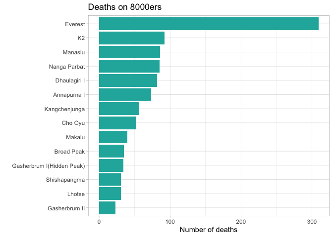<!-- -->

However, this is potentially misleading, as it doesn’t take into account
how many people climb each of these mountains. Full (and up-to-date)
stats on the number of ascents aren’t that easy to find (at least in a
way that is automatically accessible), but we can approximate the
relative proportions using data from the “Eight-thousander” Wikipedia
page (from which we also sourced the mountain names). This page lists
the total number of ascents between 1950 and 2012 for each mountain; we
make the assumption here that the relative proportion has remained
similar since 2012.

``` r
eightthou_ascents <- eightthou_summary_cleaned %>% 
  select(name, height, total_ascents_c, range) %>% 
  mutate(total_ascents_c = as.integer(total_ascents_c),
    prop_ascents = total_ascents_c / sum(total_ascents_c))
```

The proportions are interesting in and of themselves

``` r
eightthou_ascents %>% 
  mutate(name = fct_reorder(name,prop_ascents)) %>% 
  ggplot(aes(x = prop_ascents, y = name, fill = range)) +
  geom_col() +
  scale_fill_brewer(palette = "Dark2") +
  labs(
    x = "Proportion of ascents (1950-2012)",
    y = "",
    title = "Which 8000ers are climbed the most?",
    fill = "Range"
  ) +
  theme_light()
```

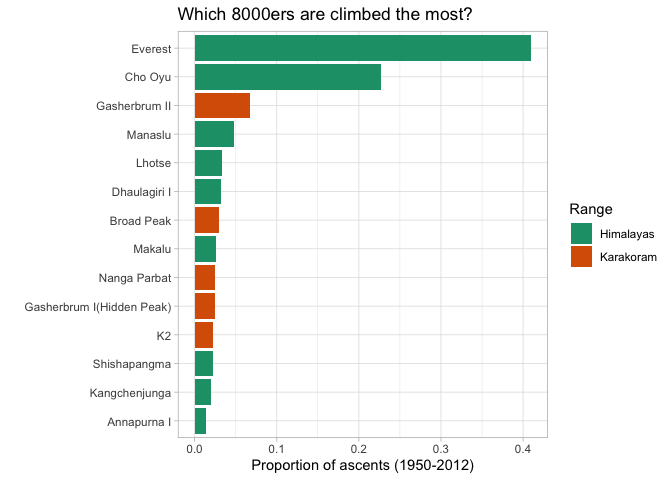<!-- -->

Compare this to the height of each mountain

``` r
eightthou_ascents %>% 
  mutate(name = fct_reorder(name,height)) %>% 
  ggplot(aes(x = height, y = name, colour = range, size = prop_ascents)) +
  geom_point() +
  scale_colour_brewer(palette = "Dark2") +
    labs(
    x = "Height (m)",
    y = "",
    title = "Higher ≠ more ascents",
    subtitle = "(except for Everest)",
    colour = "Range"
  ) +
  guides(size = "none") +
  theme_light()
```

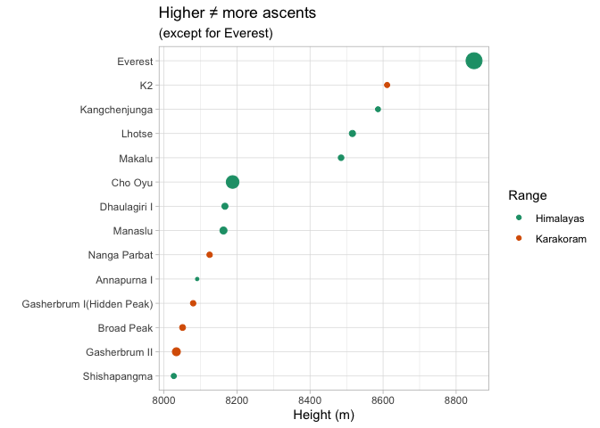<!-- -->

Now use the info about ascents to contextualise the number of deaths on
each mountain.

``` r
all_8000er_deaths %>% 
  count(mountain) %>% 
  mutate(prop_deaths = n / sum(n)) %>% 
  inner_join(eightthou_ascents, by = c("mountain" = "name")) %>% 
  mutate(deaths_weighted = prop_deaths / prop_ascents,
         mountain = fct_reorder(mountain,deaths_weighted)) %>% 
  ggplot(aes(x = deaths_weighted, y = mountain, colour = range)) +
  geom_point(size = 2) +
  geom_segment(aes(xend = 1, yend = mountain)) +
  geom_vline(xintercept = 1, linetype = 2) +
  scale_colour_brewer(palette = "Dark2") +
   labs(
    x = "Ratio of deaths to ascents",
    y = "",
    title = "Which 8000ers are deadliest?",
    colour = "Range"
  ) +
  theme_light()
```

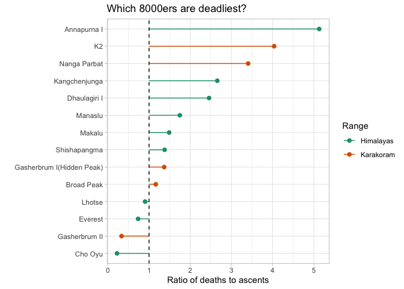<!-- -->

## Leading causes of death on 8000ers

``` r
unigrams <- all_8000er_deaths %>% 
  mutate(index = row_number()) %>% 
  unnest_tokens(output = cause_unigrams, input = cause_of_death) %>% 
  anti_join(stop_words, by = c("cause_unigrams"="word"))

causes <- unigrams %>% 
  count(cause_unigrams, sort = TRUE) 


causes %>% 
   datatable(caption = "Cause of death (unigrams)",
             colnames = c("Unigram","Count"))
```

    ## PhantomJS not found. You can install it with webshot::install_phantomjs(). If it is installed, please make sure the phantomjs executable can be found via the PATH variable.

<div id="htmlwidget-696fc09cf4ae87ac2462" style="width:100%;height:auto;" class="datatables html-widget"></div>
<script type="application/json" data-for="htmlwidget-696fc09cf4ae87ac2462">{"x":{"filter":"none","vertical":false,"caption":"<caption>Cause of death (unigrams)<\/caption>","data":[["1","2","3","4","5","6","7","8","9","10","11","12","13","14","15","16","17","18","19","20","21","22","23","24","25","26","27","28","29","30","31","32","33","34","35","36","37","38","39","40","41","42","43","44","45","46","47","48","49","50","51","52","53","54","55","56","57","58","59","60","61","62","63","64","65","66","67","68","69","70","71","72","73","74","75","76","77","78","79","80","81","82","83","84","85","86","87","88","89","90","91","92","93","94","95","96","97","98","99","100","101","102","103","104","105","106","107","108","109","110","111","112","113","114","115","116","117","118","119","120","121","122","123","124","125","126","127","128","129","130","131","132","133","134","135","136","137","138","139","140","141","142","143","144","145","146","147","148","149","150","151","152","153","154","155","156","157","158","159","160","161","162","163","164","165","166","167","168","169","170","171","172","173","174","175","176","177","178","179","180","181","182","183","184","185","186","187","188","189","190","191","192","193","194","195","196","197","198","199","200","201"],["avalanche","fall","altitude","sickness","disappeared","exhaustion","exposure","unknown","camp","disappearance","base","crevasse","descent","death","illness","everest","killed","2015","accidental","mount","april","earthquake","nepal","2014","storm","serac","climb","heart","diamir","due","taliban","attack","edema","lhotse","shar","cerebral","died","found","pulmonary","a.k.a","cold","hace","hypothermia","kang","kangchenjunga","stroke","suspected","west","yalung","body","cardiac","summit","4","crushed","falling","fourth","ice","lost","oedema","pneumonia","reaching","75","76","fell","hit","injuries","jozef","oxygen","rejoining","solo","south","summited","1","2021","arrest","bad","drowned","failure","frostbite","frozen","hape","hospital","july","lack","possibly","remains","rock","weather","1998","accident","avalanches","blindness","bottle","conditions","dehydration","event","freezing","hemorrhage","lightning","neck","rockfall","rope","seracs","snow","stream","suffocation","100m","150m","1935","1996","1999","2000","200m","23","27","3","apoplexy","apr","arrhythmia","attempt","axe","bc","blackwater","blizzard","block","blood","brain","breaking","broken","caused","clots","collapsed","coma","complications","cough","craig","crash","cva","date","dead","embolism","exacerbated","exact","existing","fever","glacial","glacier","helicopter","hemorrhages","ii","iii","injury","insufficiency","internal","kathmandu","lapsed","leg","legs","missing","mountain","nearby","north","nottle","organ","pain","peak","persistent","pre","presumed","previously","related","reported","reportedly","rescue","retinal","return","searching","severe","signs","skis","slab","slipped","snowboard","snowboarding","starvation","step","stone","stonefall","strike","successfully","succumbed","suffered","summiting","summitting","suspended","sustained","tent","thrombosis","trekking","upper","windslab"],[321,267,67,66,57,53,47,45,43,40,35,29,29,25,23,22,20,19,19,18,17,17,17,16,15,14,12,12,11,11,11,10,10,10,10,9,9,9,8,7,7,7,7,7,7,7,7,7,7,6,6,6,5,5,5,5,5,5,5,5,5,4,4,4,4,4,4,4,4,4,4,4,3,3,3,3,3,3,3,3,3,3,3,3,3,3,3,3,2,2,2,2,2,2,2,2,2,2,2,2,2,2,2,2,2,2,1,1,1,1,1,1,1,1,1,1,1,1,1,1,1,1,1,1,1,1,1,1,1,1,1,1,1,1,1,1,1,1,1,1,1,1,1,1,1,1,1,1,1,1,1,1,1,1,1,1,1,1,1,1,1,1,1,1,1,1,1,1,1,1,1,1,1,1,1,1,1,1,1,1,1,1,1,1,1,1,1,1,1,1,1,1,1,1,1,1,1,1,1,1,1]],"container":"<table class=\"display\">\n  <thead>\n    <tr>\n      <th> <\/th>\n      <th>Unigram<\/th>\n      <th>Count<\/th>\n    <\/tr>\n  <\/thead>\n<\/table>","options":{"columnDefs":[{"className":"dt-right","targets":2},{"orderable":false,"targets":0}],"order":[],"autoWidth":false,"orderClasses":false}},"evals":[],"jsHooks":[]}</script>

``` r
wordcloud(words = causes$cause_unigrams, freq = causes$n,
          colors = brewer.pal(8,"Dark2"))
```

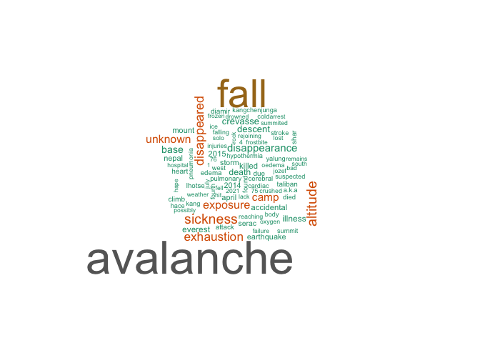<!-- -->

Do these differ per mountain?

``` r
cause_per_mountain <- unigrams %>% 
  count(cause_unigrams, mountain) %>% 
  group_by(mountain) %>% 
  ungroup()

# function to create a wordcloud for individual mountains
mountain_cloud <- function(mname){
  m <- cause_per_mountain %>% 
    filter(mountain == mname)
  
  wordcloud(words = m$cause_unigrams, freq = m$n,
          colors = brewer.pal(8,"Dark2"))
}
```

### The three deadliest peaks: Annapurna I, K2, Nanga Parbat

``` r
mountain_cloud("Annapurna I")
```

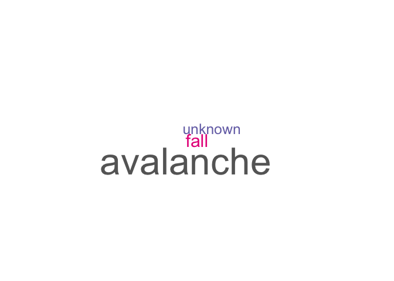<!-- -->

``` r
mountain_cloud("K2")
```

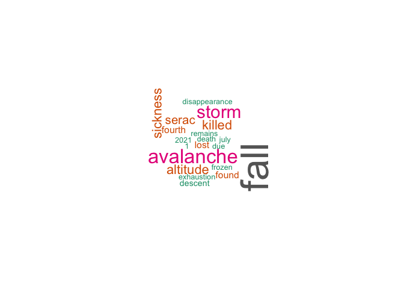<!-- -->

``` r
mountain_cloud("Nanga Parbat")
```

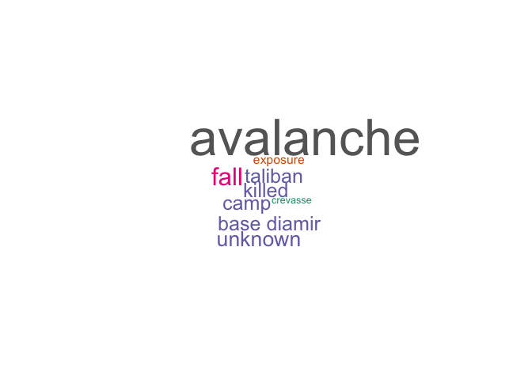<!-- -->

The reference to “Taliban” in the word cloud for Nanga Parbat reflects
the 2013 Nanga Parbat massacre, in which 11 people (10 climbers and a
local guide) were killed at base camp by Taliban attackers. The attack
was retaliation for a US drone strike that killed a Taliban commander.

``` r
all_8000er_deaths %>% 
  filter(str_detect(cause_of_death,"[Tt]aliban"))
```

    ## # A tibble: 11 × 5
    ##    date         name                nationality     cause_of_death      mountain
    ##    <chr>        <chr>               <chr>           <chr>               <chr>   
    ##  1 22 June 2013 Igor Svergun        Ukraine         Killed by Taliban … Nanga P…
    ##  2 22 June 2013 Badawi Kashaev      Ukraine         Killed by Taliban … Nanga P…
    ##  3 22 June 2013 Dmitry Konyaev      Ukraine         Killed by Taliban … Nanga P…
    ##  4 22 June 2013 Rao Jianfeng        China           Killed by Taliban … Nanga P…
    ##  5 22 June 2013 Yang Chunfeng       China           Killed by Taliban … Nanga P…
    ##  6 22 June 2013 Honglu Chen         China (USA/Chi… Killed by Taliban … Nanga P…
    ##  7 22 June 2013 Sona Sherpa         Nepal           Killed by Taliban … Nanga P…
    ##  8 22 June 2013 Ernestas Markšaitis Lithuania       Killed by Taliban … Nanga P…
    ##  9 22 June 2013 Ali Hussain         Pakistan        Killed by Taliban … Nanga P…
    ## 10 22 June 2013 Anton Dobes         Slovakia        Killed by Taliban … Nanga P…
    ## 11 22 June 2013 Peter Sperka        Slovakia        Killed by Taliban … Nanga P…

### The three least-deadly peaks: Cho Oyu, Gasherbrum II, Everest

``` r
mountain_cloud("Cho Oyu")
```

<!-- -->

``` r
mountain_cloud("Gasherbrum II")
```

<!-- -->

``` r
mountain_cloud("Everest")
```

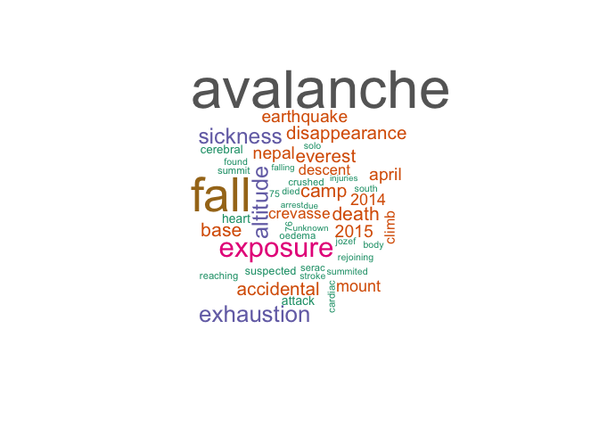<!-- -->

## Deadliest years

``` r
deaths_per_year <- all_8000er_deaths %>% 
  mutate(year = as.integer(str_extract(date,"[:digit:]{4}"))) %>% 
  count(mountain, year, sort = TRUE)


p <- deaths_per_year %>% 
  filter(year >= 2000) %>% 
  ggplot(aes(x = year, y = n, colour = mountain)) +
  geom_point() +
  geom_line() +
  gghighlight(mountain %in% c("Everest","K2", "Manaslu", "Nanga Parbat")) +
  scale_colour_brewer(palette = "Dark2") +
  theme_light() +
  labs(
    title = "Deadliest years since 2000",
    x = "Year",
    y = "Number of deaths"
  )
```

    ## Warning: Tried to calculate with group_by(), but the calculation failed.
    ## Falling back to ungrouped filter operation...

    ## Warning: Tried to calculate with group_by(), but the calculation failed.
    ## Falling back to ungrouped filter operation...

    ## label_key: mountain

``` r
ggplotly(p)
```

    ## Warning in geom2trace.default(dots[[1L]][[4L]], dots[[2L]][[1L]], dots[[3L]][[1L]]): geom_GeomLabelRepel() has yet to be implemented in plotly.
    ##   If you'd like to see this geom implemented,
    ##   Please open an issue with your example code at
    ##   https://github.com/ropensci/plotly/issues

    ## Warning in geom2trace.default(dots[[1L]][[4L]], dots[[2L]][[1L]], dots[[3L]][[1L]]): geom_GeomLabelRepel() has yet to be implemented in plotly.
    ##   If you'd like to see this geom implemented,
    ##   Please open an issue with your example code at
    ##   https://github.com/ropensci/plotly/issues

    ## Warning in geom2trace.default(dots[[1L]][[4L]], dots[[2L]][[1L]], dots[[3L]][[1L]]): geom_GeomLabelRepel() has yet to be implemented in plotly.
    ##   If you'd like to see this geom implemented,
    ##   Please open an issue with your example code at
    ##   https://github.com/ropensci/plotly/issues

    ## Warning in geom2trace.default(dots[[1L]][[4L]], dots[[2L]][[1L]], dots[[3L]][[1L]]): geom_GeomLabelRepel() has yet to be implemented in plotly.
    ##   If you'd like to see this geom implemented,
    ##   Please open an issue with your example code at
    ##   https://github.com/ropensci/plotly/issues

<div id="htmlwidget-f92594534057eef14fcc" style="width:672px;height:480px;" class="plotly html-widget"></div>
<script type="application/json" data-for="htmlwidget-f92594534057eef14fcc">{"x":{"data":[{"x":[2015,2014,2012,2019,2013,2006,2008,2012,2013,2010,2004,2007,2016,2004,2013,2000,2005,2021,2014,2001,2011,2017,2018,2013,2013,2001,2003,2009,2021,2003,2006,2019,2011,2011,2012,2003,2011,2007,2013,2002,2010,2012,2007,2014,2019,2009,2010,2016,2004,2015,2012,2002,2008,2009,2010,2000,2008,2009,2016,2018,2000,2002,2007,2010,2013,2018,2003,2012,2015,2004,2008,2016,2008,2018,2006,2008,2009,2017,2019,2005,2014,2005,2006,2007,2008,2009,2010,2019,2006,2008,2009,2011,2015,2021,2001,2004,2005,2006,2018,2019,2017,2008,2001,2004,2005,2007,2008,2000,2001,2009,2011,2015,2001,2003,2009,2012,2014,2000,2002,2007,2000,2006,2007,2009,2010,2013,2014,2016,2018,2019,2000,2001,2002,2005,2006,2009,2010,2011,2013,2014,2018,2001,2006,2014,2015,2016,2017,2019,2021,2004,2018,2006,2007,2009,2013,2018],"y":[17,16,13,12,12,11,11,10,9,7,7,7,7,7,6,6,6,6,5,5,5,5,5,5,5,4,4,4,4,4,4,4,4,3,3,3,3,3,3,3,3,3,3,3,3,3,3,3,2,2,2,2,2,2,2,2,2,2,2,2,2,2,2,2,2,2,2,2,2,2,2,2,2,2,2,2,2,2,2,2,2,1,1,1,1,1,1,1,1,1,1,1,1,1,1,1,1,1,1,1,1,1,1,1,1,1,1,1,1,1,1,1,1,1,1,1,1,1,1,1,1,1,1,1,1,1,1,1,1,1,1,1,1,1,1,1,1,1,1,1,1,1,1,1,1,1,1,1,1,1,1,1,1,1,1,1],"text":["highlight..........1: 2015<br />highlight..........2: 17<br />highlight..........3: #BEBEBEB2<br />highlight..........group: 5","highlight..........1: 2014<br />highlight..........2: 16<br />highlight..........3: #BEBEBEB2<br />highlight..........group: 5","highlight..........1: 2012<br />highlight..........2: 13<br />highlight..........3: #BEBEBEB2<br />highlight..........group: 12","highlight..........1: 2019<br />highlight..........2: 12<br />highlight..........3: #BEBEBEB2<br />highlight..........group: 5","highlight..........1: 2013<br />highlight..........2: 12<br />highlight..........3: #BEBEBEB2<br />highlight..........group: 13","highlight..........1: 2006<br />highlight..........2: 11<br />highlight..........3: #BEBEBEB2<br />highlight..........group: 5","highlight..........1: 2008<br />highlight..........2: 11<br />highlight..........3: #BEBEBEB2<br />highlight..........group: 8","highlight..........1: 2012<br />highlight..........2: 10<br />highlight..........3: #BEBEBEB2<br />highlight..........group: 5","highlight..........1: 2013<br />highlight..........2:  9<br />highlight..........3: #BEBEBEB2<br />highlight..........group: 5","highlight..........1: 2010<br />highlight..........2:  7<br />highlight..........3: #BEBEBEB2<br />highlight..........group: 4","highlight..........1: 2004<br />highlight..........2:  7<br />highlight..........3: #BEBEBEB2<br />highlight..........group: 5","highlight..........1: 2007<br />highlight..........2:  7<br />highlight..........3: #BEBEBEB2<br />highlight..........group: 5","highlight..........1: 2016<br />highlight..........2:  7<br />highlight..........3: #BEBEBEB2<br />highlight..........group: 5","highlight..........1: 2004<br />highlight..........2:  7<br />highlight..........3: #BEBEBEB2<br />highlight..........group: 8","highlight..........1: 2013<br />highlight..........2:  6<br />highlight..........3: #BEBEBEB2<br />highlight..........group: 2","highlight..........1: 2000<br />highlight..........2:  6<br />highlight..........3: #BEBEBEB2<br />highlight..........group: 3","highlight..........1: 2005<br />highlight..........2:  6<br />highlight..........3: #BEBEBEB2<br />highlight..........group: 5","highlight..........1: 2021<br />highlight..........2:  6<br />highlight..........3: #BEBEBEB2<br />highlight..........group: 8","highlight..........1: 2014<br />highlight..........2:  5<br />highlight..........3: #BEBEBEB2<br />highlight..........group: 4","highlight..........1: 2001<br />highlight..........2:  5<br />highlight..........3: #BEBEBEB2<br />highlight..........group: 5","highlight..........1: 2011<br />highlight..........2:  5<br />highlight..........3: #BEBEBEB2<br />highlight..........group: 5","highlight..........1: 2017<br />highlight..........2:  5<br />highlight..........3: #BEBEBEB2<br />highlight..........group: 5","highlight..........1: 2018<br />highlight..........2:  5<br />highlight..........3: #BEBEBEB2<br />highlight..........group: 5","highlight..........1: 2013<br />highlight..........2:  5<br />highlight..........3: #BEBEBEB2<br />highlight..........group: 6","highlight..........1: 2013<br />highlight..........2:  5<br />highlight..........3: #BEBEBEB2<br />highlight..........group: 9","highlight..........1: 2001<br />highlight..........2:  4<br />highlight..........3: #BEBEBEB2<br />highlight..........group: 4","highlight..........1: 2003<br />highlight..........2:  4<br />highlight..........3: #BEBEBEB2<br />highlight..........group: 5","highlight..........1: 2009<br />highlight..........2:  4<br />highlight..........3: #BEBEBEB2<br />highlight..........group: 5","highlight..........1: 2021<br />highlight..........2:  4<br />highlight..........3: #BEBEBEB2<br />highlight..........group: 5","highlight..........1: 2003<br />highlight..........2:  4<br />highlight..........3: #BEBEBEB2<br />highlight..........group: 6","highlight..........1: 2006<br />highlight..........2:  4<br />highlight..........3: #BEBEBEB2<br />highlight..........group: 8","highlight..........1: 2019<br />highlight..........2:  4<br />highlight..........3: #BEBEBEB2<br />highlight..........group: 11","highlight..........1: 2011<br />highlight..........2:  4<br />highlight..........3: #BEBEBEB2<br />highlight..........group: 12","highlight..........1: 2011<br />highlight..........2:  3<br />highlight..........3: #BEBEBEB2<br />highlight..........group: 1","highlight..........1: 2012<br />highlight..........2:  3<br />highlight..........3: #BEBEBEB2<br />highlight..........group: 1","highlight..........1: 2003<br />highlight..........2:  3<br />highlight..........3: #BEBEBEB2<br />highlight..........group: 3","highlight..........1: 2011<br />highlight..........2:  3<br />highlight..........3: #BEBEBEB2<br />highlight..........group: 3","highlight..........1: 2007<br />highlight..........2:  3<br />highlight..........3: #BEBEBEB2<br />highlight..........group: 4","highlight..........1: 2013<br />highlight..........2:  3<br />highlight..........3: #BEBEBEB2<br />highlight..........group: 4","highlight..........1: 2002<br />highlight..........2:  3<br />highlight..........3: #BEBEBEB2<br />highlight..........group: 5","highlight..........1: 2010<br />highlight..........2:  3<br />highlight..........3: #BEBEBEB2<br />highlight..........group: 5","highlight..........1: 2012<br />highlight..........2:  3<br />highlight..........3: #BEBEBEB2<br />highlight..........group: 6","highlight..........1: 2007<br />highlight..........2:  3<br />highlight..........3: #BEBEBEB2<br />highlight..........group: 7","highlight..........1: 2014<br />highlight..........2:  3<br />highlight..........3: #BEBEBEB2<br />highlight..........group: 9","highlight..........1: 2019<br />highlight..........2:  3<br />highlight..........3: #BEBEBEB2<br />highlight..........group: 9","highlight..........1: 2009<br />highlight..........2:  3<br />highlight..........3: #BEBEBEB2<br />highlight..........group: 12","highlight..........1: 2010<br />highlight..........2:  3<br />highlight..........3: #BEBEBEB2<br />highlight..........group: 12","highlight..........1: 2016<br />highlight..........2:  3<br />highlight..........3: #BEBEBEB2<br />highlight..........group: 14","highlight..........1: 2004<br />highlight..........2:  2<br />highlight..........3: #BEBEBEB2<br />highlight..........group: 1","highlight..........1: 2015<br />highlight..........2:  2<br />highlight..........3: #BEBEBEB2<br />highlight..........group: 1","highlight..........1: 2012<br />highlight..........2:  2<br />highlight..........3: #BEBEBEB2<br />highlight..........group: 2","highlight..........1: 2002<br />highlight..........2:  2<br />highlight..........3: #BEBEBEB2<br />highlight..........group: 3","highlight..........1: 2008<br />highlight..........2:  2<br />highlight..........3: #BEBEBEB2<br />highlight..........group: 3","highlight..........1: 2009<br />highlight..........2:  2<br />highlight..........3: #BEBEBEB2<br />highlight..........group: 3","highlight..........1: 2010<br />highlight..........2:  2<br />highlight..........3: #BEBEBEB2<br />highlight..........group: 3","highlight..........1: 2000<br />highlight..........2:  2<br />highlight..........3: #BEBEBEB2<br />highlight..........group: 4","highlight..........1: 2008<br />highlight..........2:  2<br />highlight..........3: #BEBEBEB2<br />highlight..........group: 4","highlight..........1: 2009<br />highlight..........2:  2<br />highlight..........3: #BEBEBEB2<br />highlight..........group: 4","highlight..........1: 2016<br />highlight..........2:  2<br />highlight..........3: #BEBEBEB2<br />highlight..........group: 4","highlight..........1: 2018<br />highlight..........2:  2<br />highlight..........3: #BEBEBEB2<br />highlight..........group: 4","highlight..........1: 2000<br />highlight..........2:  2<br />highlight..........3: #BEBEBEB2<br />highlight..........group: 5","highlight..........1: 2002<br />highlight..........2:  2<br />highlight..........3: #BEBEBEB2<br />highlight..........group: 8","highlight..........1: 2007<br />highlight..........2:  2<br />highlight..........3: #BEBEBEB2<br />highlight..........group: 8","highlight..........1: 2010<br />highlight..........2:  2<br />highlight..........3: #BEBEBEB2<br />highlight..........group: 8","highlight..........1: 2013<br />highlight..........2:  2<br />highlight..........3: #BEBEBEB2<br />highlight..........group: 8","highlight..........1: 2018<br />highlight..........2:  2<br />highlight..........3: #BEBEBEB2<br />highlight..........group: 8","highlight..........1: 2003<br />highlight..........2:  2<br />highlight..........3: #BEBEBEB2<br />highlight..........group: 10","highlight..........1: 2012<br />highlight..........2:  2<br />highlight..........3: #BEBEBEB2<br />highlight..........group: 10","highlight..........1: 2015<br />highlight..........2:  2<br />highlight..........3: #BEBEBEB2<br />highlight..........group: 10","highlight..........1: 2004<br />highlight..........2:  2<br />highlight..........3: #BEBEBEB2<br />highlight..........group: 11","highlight..........1: 2008<br />highlight..........2:  2<br />highlight..........3: #BEBEBEB2<br />highlight..........group: 11","highlight..........1: 2016<br />highlight..........2:  2<br />highlight..........3: #BEBEBEB2<br />highlight..........group: 11","highlight..........1: 2008<br />highlight..........2:  2<br />highlight..........3: #BEBEBEB2<br />highlight..........group: 12","highlight..........1: 2018<br />highlight..........2:  2<br />highlight..........3: #BEBEBEB2<br />highlight..........group: 12","highlight..........1: 2006<br />highlight..........2:  2<br />highlight..........3: #BEBEBEB2<br />highlight..........group: 13","highlight..........1: 2008<br />highlight..........2:  2<br />highlight..........3: #BEBEBEB2<br />highlight..........group: 13","highlight..........1: 2009<br />highlight..........2:  2<br />highlight..........3: #BEBEBEB2<br />highlight..........group: 13","highlight..........1: 2017<br />highlight..........2:  2<br />highlight..........3: #BEBEBEB2<br />highlight..........group: 13","highlight..........1: 2019<br />highlight..........2:  2<br />highlight..........3: #BEBEBEB2<br />highlight..........group: 13","highlight..........1: 2005<br />highlight..........2:  2<br />highlight..........3: #BEBEBEB2<br />highlight..........group: 14","highlight..........1: 2014<br />highlight..........2:  2<br />highlight..........3: #BEBEBEB2<br />highlight..........group: 14","highlight..........1: 2005<br />highlight..........2:  1<br />highlight..........3: #BEBEBEB2<br />highlight..........group: 1","highlight..........1: 2006<br />highlight..........2:  1<br />highlight..........3: #BEBEBEB2<br />highlight..........group: 1","highlight..........1: 2007<br />highlight..........2:  1<br />highlight..........3: #BEBEBEB2<br />highlight..........group: 1","highlight..........1: 2008<br />highlight..........2:  1<br />highlight..........3: #BEBEBEB2<br />highlight..........group: 1","highlight..........1: 2009<br />highlight..........2:  1<br />highlight..........3: #BEBEBEB2<br />highlight..........group: 1","highlight..........1: 2010<br />highlight..........2:  1<br />highlight..........3: #BEBEBEB2<br />highlight..........group: 1","highlight..........1: 2019<br />highlight..........2:  1<br />highlight..........3: #BEBEBEB2<br />highlight..........group: 1","highlight..........1: 2006<br />highlight..........2:  1<br />highlight..........3: #BEBEBEB2<br />highlight..........group: 2","highlight..........1: 2008<br />highlight..........2:  1<br />highlight..........3: #BEBEBEB2<br />highlight..........group: 2","highlight..........1: 2009<br />highlight..........2:  1<br />highlight..........3: #BEBEBEB2<br />highlight..........group: 2","highlight..........1: 2011<br />highlight..........2:  1<br />highlight..........3: #BEBEBEB2<br />highlight..........group: 2","highlight..........1: 2015<br />highlight..........2:  1<br />highlight..........3: #BEBEBEB2<br />highlight..........group: 2","highlight..........1: 2021<br />highlight..........2:  1<br />highlight..........3: #BEBEBEB2<br />highlight..........group: 2","highlight..........1: 2001<br />highlight..........2:  1<br />highlight..........3: #BEBEBEB2<br />highlight..........group: 3","highlight..........1: 2004<br />highlight..........2:  1<br />highlight..........3: #BEBEBEB2<br />highlight..........group: 3","highlight..........1: 2005<br />highlight..........2:  1<br />highlight..........3: #BEBEBEB2<br />highlight..........group: 3","highlight..........1: 2006<br />highlight..........2:  1<br />highlight..........3: #BEBEBEB2<br />highlight..........group: 3","highlight..........1: 2018<br />highlight..........2:  1<br />highlight..........3: #BEBEBEB2<br />highlight..........group: 3","highlight..........1: 2019<br />highlight..........2:  1<br />highlight..........3: #BEBEBEB2<br />highlight..........group: 3","highlight..........1: 2017<br />highlight..........2:  1<br />highlight..........3: #BEBEBEB2<br />highlight..........group: 4","highlight..........1: 2008<br />highlight..........2:  1<br />highlight..........3: #BEBEBEB2<br />highlight..........group: 5","highlight..........1: 2001<br />highlight..........2:  1<br />highlight..........3: #BEBEBEB2<br />highlight..........group: 6","highlight..........1: 2004<br />highlight..........2:  1<br />highlight..........3: #BEBEBEB2<br />highlight..........group: 6","highlight..........1: 2005<br />highlight..........2:  1<br />highlight..........3: #BEBEBEB2<br />highlight..........group: 6","highlight..........1: 2007<br />highlight..........2:  1<br />highlight..........3: #BEBEBEB2<br />highlight..........group: 6","highlight..........1: 2008<br />highlight..........2:  1<br />highlight..........3: #BEBEBEB2<br />highlight..........group: 6","highlight..........1: 2000<br />highlight..........2:  1<br />highlight..........3: #BEBEBEB2<br />highlight..........group: 7","highlight..........1: 2001<br />highlight..........2:  1<br />highlight..........3: #BEBEBEB2<br />highlight..........group: 7","highlight..........1: 2009<br />highlight..........2:  1<br />highlight..........3: #BEBEBEB2<br />highlight..........group: 7","highlight..........1: 2011<br />highlight..........2:  1<br />highlight..........3: #BEBEBEB2<br />highlight..........group: 7","highlight..........1: 2015<br />highlight..........2:  1<br />highlight..........3: #BEBEBEB2<br />highlight..........group: 7","highlight..........1: 2001<br />highlight..........2:  1<br />highlight..........3: #BEBEBEB2<br />highlight..........group: 8","highlight..........1: 2003<br />highlight..........2:  1<br />highlight..........3: #BEBEBEB2<br />highlight..........group: 8","highlight..........1: 2009<br />highlight..........2:  1<br />highlight..........3: #BEBEBEB2<br />highlight..........group: 8","highlight..........1: 2012<br />highlight..........2:  1<br />highlight..........3: #BEBEBEB2<br />highlight..........group: 8","highlight..........1: 2014<br />highlight..........2:  1<br />highlight..........3: #BEBEBEB2<br />highlight..........group: 8","highlight..........1: 2000<br />highlight..........2:  1<br />highlight..........3: #BEBEBEB2<br />highlight..........group: 9","highlight..........1: 2002<br />highlight..........2:  1<br />highlight..........3: #BEBEBEB2<br />highlight..........group: 9","highlight..........1: 2007<br />highlight..........2:  1<br />highlight..........3: #BEBEBEB2<br />highlight..........group: 9","highlight..........1: 2000<br />highlight..........2:  1<br />highlight..........3: #BEBEBEB2<br />highlight..........group: 10","highlight..........1: 2006<br />highlight..........2:  1<br />highlight..........3: #BEBEBEB2<br />highlight..........group: 10","highlight..........1: 2007<br />highlight..........2:  1<br />highlight..........3: #BEBEBEB2<br />highlight..........group: 10","highlight..........1: 2009<br />highlight..........2:  1<br />highlight..........3: #BEBEBEB2<br />highlight..........group: 10","highlight..........1: 2010<br />highlight..........2:  1<br />highlight..........3: #BEBEBEB2<br />highlight..........group: 10","highlight..........1: 2013<br />highlight..........2:  1<br />highlight..........3: #BEBEBEB2<br />highlight..........group: 10","highlight..........1: 2014<br />highlight..........2:  1<br />highlight..........3: #BEBEBEB2<br />highlight..........group: 10","highlight..........1: 2016<br />highlight..........2:  1<br />highlight..........3: #BEBEBEB2<br />highlight..........group: 10","highlight..........1: 2018<br />highlight..........2:  1<br />highlight..........3: #BEBEBEB2<br />highlight..........group: 10","highlight..........1: 2019<br />highlight..........2:  1<br />highlight..........3: #BEBEBEB2<br />highlight..........group: 10","highlight..........1: 2000<br />highlight..........2:  1<br />highlight..........3: #BEBEBEB2<br />highlight..........group: 11","highlight..........1: 2001<br />highlight..........2:  1<br />highlight..........3: #BEBEBEB2<br />highlight..........group: 11","highlight..........1: 2002<br />highlight..........2:  1<br />highlight..........3: #BEBEBEB2<br />highlight..........group: 11","highlight..........1: 2005<br />highlight..........2:  1<br />highlight..........3: #BEBEBEB2<br />highlight..........group: 11","highlight..........1: 2006<br />highlight..........2:  1<br />highlight..........3: #BEBEBEB2<br />highlight..........group: 11","highlight..........1: 2009<br />highlight..........2:  1<br />highlight..........3: #BEBEBEB2<br />highlight..........group: 11","highlight..........1: 2010<br />highlight..........2:  1<br />highlight..........3: #BEBEBEB2<br />highlight..........group: 11","highlight..........1: 2011<br />highlight..........2:  1<br />highlight..........3: #BEBEBEB2<br />highlight..........group: 11","highlight..........1: 2013<br />highlight..........2:  1<br />highlight..........3: #BEBEBEB2<br />highlight..........group: 11","highlight..........1: 2014<br />highlight..........2:  1<br />highlight..........3: #BEBEBEB2<br />highlight..........group: 11","highlight..........1: 2018<br />highlight..........2:  1<br />highlight..........3: #BEBEBEB2<br />highlight..........group: 11","highlight..........1: 2001<br />highlight..........2:  1<br />highlight..........3: #BEBEBEB2<br />highlight..........group: 12","highlight..........1: 2006<br />highlight..........2:  1<br />highlight..........3: #BEBEBEB2<br />highlight..........group: 12","highlight..........1: 2014<br />highlight..........2:  1<br />highlight..........3: #BEBEBEB2<br />highlight..........group: 12","highlight..........1: 2015<br />highlight..........2:  1<br />highlight..........3: #BEBEBEB2<br />highlight..........group: 12","highlight..........1: 2016<br />highlight..........2:  1<br />highlight..........3: #BEBEBEB2<br />highlight..........group: 12","highlight..........1: 2017<br />highlight..........2:  1<br />highlight..........3: #BEBEBEB2<br />highlight..........group: 12","highlight..........1: 2019<br />highlight..........2:  1<br />highlight..........3: #BEBEBEB2<br />highlight..........group: 12","highlight..........1: 2021<br />highlight..........2:  1<br />highlight..........3: #BEBEBEB2<br />highlight..........group: 12","highlight..........1: 2004<br />highlight..........2:  1<br />highlight..........3: #BEBEBEB2<br />highlight..........group: 13","highlight..........1: 2018<br />highlight..........2:  1<br />highlight..........3: #BEBEBEB2<br />highlight..........group: 13","highlight..........1: 2006<br />highlight..........2:  1<br />highlight..........3: #BEBEBEB2<br />highlight..........group: 14","highlight..........1: 2007<br />highlight..........2:  1<br />highlight..........3: #BEBEBEB2<br />highlight..........group: 14","highlight..........1: 2009<br />highlight..........2:  1<br />highlight..........3: #BEBEBEB2<br />highlight..........group: 14","highlight..........1: 2013<br />highlight..........2:  1<br />highlight..........3: #BEBEBEB2<br />highlight..........group: 14","highlight..........1: 2018<br />highlight..........2:  1<br />highlight..........3: #BEBEBEB2<br />highlight..........group: 14"],"type":"scatter","mode":"markers","marker":{"autocolorscale":false,"color":"rgba(190,190,190,0.698)","opacity":1,"size":5.66929133858268,"symbol":"circle","line":{"width":1.88976377952756,"color":"rgba(190,190,190,0.698)"}},"hoveron":"points","showlegend":false,"xaxis":"x","yaxis":"y","hoverinfo":"text","frame":null},{"x":[2004,2005,2006,2007,2008,2009,2010,2011,2012,2015,2019,null,2006,2008,2009,2011,2012,2013,2015,2021,null,2000,2001,2002,2003,2004,2005,2006,2008,2009,2010,2011,2018,2019,null,2000,2001,2007,2008,2009,2010,2013,2014,2016,2017,2018,null,2000,2001,2002,2003,2004,2005,2006,2007,2008,2009,2010,2011,2012,2013,2014,2015,2016,2017,2018,2019,2021,null,2001,2003,2004,2005,2007,2008,2012,2013,null,2000,2001,2007,2009,2011,2015,null,2001,2002,2003,2004,2006,2007,2008,2009,2010,2012,2013,2014,2018,2021,null,2000,2002,2007,2013,2014,2019,null,2000,2003,2006,2007,2009,2010,2012,2013,2014,2015,2016,2018,2019,null,2000,2001,2002,2004,2005,2006,2008,2009,2010,2011,2013,2014,2016,2018,2019,null,2001,2006,2008,2009,2010,2011,2012,2014,2015,2016,2017,2018,2019,2021,null,2004,2006,2008,2009,2013,2017,2018,2019,null,2005,2006,2007,2009,2013,2014,2016,2018],"y":[2,1,1,1,1,1,1,3,3,2,1,null,1,1,1,1,2,6,1,1,null,6,1,2,3,1,1,1,2,2,2,3,1,1,null,2,4,3,2,2,7,3,5,2,1,2,null,2,5,3,4,7,6,11,7,1,4,3,5,10,9,16,17,7,5,5,12,4,null,1,4,1,1,1,1,3,5,null,1,1,3,1,1,1,null,1,2,1,7,4,2,11,1,2,1,2,1,2,6,null,1,1,1,5,3,3,null,1,2,1,1,1,1,2,1,1,2,1,1,1,null,1,1,1,2,1,1,2,1,1,1,1,1,2,1,4,null,1,1,2,3,3,4,13,1,1,1,1,2,1,1,null,1,2,2,2,12,2,1,2,null,2,1,1,1,1,2,3,1],"text":["highlight..........1: 2004<br />highlight..........2:  2<br />highlight..........3: #BEBEBEB2<br />highlight..........group: 1","highlight..........1: 2005<br />highlight..........2:  1<br />highlight..........3: #BEBEBEB2<br />highlight..........group: 1","highlight..........1: 2006<br />highlight..........2:  1<br />highlight..........3: #BEBEBEB2<br />highlight..........group: 1","highlight..........1: 2007<br />highlight..........2:  1<br />highlight..........3: #BEBEBEB2<br />highlight..........group: 1","highlight..........1: 2008<br />highlight..........2:  1<br />highlight..........3: #BEBEBEB2<br />highlight..........group: 1","highlight..........1: 2009<br />highlight..........2:  1<br />highlight..........3: #BEBEBEB2<br />highlight..........group: 1","highlight..........1: 2010<br />highlight..........2:  1<br />highlight..........3: #BEBEBEB2<br />highlight..........group: 1","highlight..........1: 2011<br />highlight..........2:  3<br />highlight..........3: #BEBEBEB2<br />highlight..........group: 1","highlight..........1: 2012<br />highlight..........2:  3<br />highlight..........3: #BEBEBEB2<br />highlight..........group: 1","highlight..........1: 2015<br />highlight..........2:  2<br />highlight..........3: #BEBEBEB2<br />highlight..........group: 1","highlight..........1: 2019<br />highlight..........2:  1<br />highlight..........3: #BEBEBEB2<br />highlight..........group: 1",null,"highlight..........1: 2006<br />highlight..........2:  1<br />highlight..........3: #BEBEBEB2<br />highlight..........group: 2","highlight..........1: 2008<br />highlight..........2:  1<br />highlight..........3: #BEBEBEB2<br />highlight..........group: 2","highlight..........1: 2009<br />highlight..........2:  1<br />highlight..........3: #BEBEBEB2<br />highlight..........group: 2","highlight..........1: 2011<br />highlight..........2:  1<br />highlight..........3: #BEBEBEB2<br />highlight..........group: 2","highlight..........1: 2012<br />highlight..........2:  2<br />highlight..........3: #BEBEBEB2<br />highlight..........group: 2","highlight..........1: 2013<br />highlight..........2:  6<br />highlight..........3: #BEBEBEB2<br />highlight..........group: 2","highlight..........1: 2015<br />highlight..........2:  1<br />highlight..........3: #BEBEBEB2<br />highlight..........group: 2","highlight..........1: 2021<br />highlight..........2:  1<br />highlight..........3: #BEBEBEB2<br />highlight..........group: 2",null,"highlight..........1: 2000<br />highlight..........2:  6<br />highlight..........3: #BEBEBEB2<br />highlight..........group: 3","highlight..........1: 2001<br />highlight..........2:  1<br />highlight..........3: #BEBEBEB2<br />highlight..........group: 3","highlight..........1: 2002<br />highlight..........2:  2<br />highlight..........3: #BEBEBEB2<br />highlight..........group: 3","highlight..........1: 2003<br />highlight..........2:  3<br />highlight..........3: #BEBEBEB2<br />highlight..........group: 3","highlight..........1: 2004<br />highlight..........2:  1<br />highlight..........3: #BEBEBEB2<br />highlight..........group: 3","highlight..........1: 2005<br />highlight..........2:  1<br />highlight..........3: #BEBEBEB2<br />highlight..........group: 3","highlight..........1: 2006<br />highlight..........2:  1<br />highlight..........3: #BEBEBEB2<br />highlight..........group: 3","highlight..........1: 2008<br />highlight..........2:  2<br />highlight..........3: #BEBEBEB2<br />highlight..........group: 3","highlight..........1: 2009<br />highlight..........2:  2<br />highlight..........3: #BEBEBEB2<br />highlight..........group: 3","highlight..........1: 2010<br />highlight..........2:  2<br />highlight..........3: #BEBEBEB2<br />highlight..........group: 3","highlight..........1: 2011<br />highlight..........2:  3<br />highlight..........3: #BEBEBEB2<br />highlight..........group: 3","highlight..........1: 2018<br />highlight..........2:  1<br />highlight..........3: #BEBEBEB2<br />highlight..........group: 3","highlight..........1: 2019<br />highlight..........2:  1<br />highlight..........3: #BEBEBEB2<br />highlight..........group: 3",null,"highlight..........1: 2000<br />highlight..........2:  2<br />highlight..........3: #BEBEBEB2<br />highlight..........group: 4","highlight..........1: 2001<br />highlight..........2:  4<br />highlight..........3: #BEBEBEB2<br />highlight..........group: 4","highlight..........1: 2007<br />highlight..........2:  3<br />highlight..........3: #BEBEBEB2<br />highlight..........group: 4","highlight..........1: 2008<br />highlight..........2:  2<br />highlight..........3: #BEBEBEB2<br />highlight..........group: 4","highlight..........1: 2009<br />highlight..........2:  2<br />highlight..........3: #BEBEBEB2<br />highlight..........group: 4","highlight..........1: 2010<br />highlight..........2:  7<br />highlight..........3: #BEBEBEB2<br />highlight..........group: 4","highlight..........1: 2013<br />highlight..........2:  3<br />highlight..........3: #BEBEBEB2<br />highlight..........group: 4","highlight..........1: 2014<br />highlight..........2:  5<br />highlight..........3: #BEBEBEB2<br />highlight..........group: 4","highlight..........1: 2016<br />highlight..........2:  2<br />highlight..........3: #BEBEBEB2<br />highlight..........group: 4","highlight..........1: 2017<br />highlight..........2:  1<br />highlight..........3: #BEBEBEB2<br />highlight..........group: 4","highlight..........1: 2018<br />highlight..........2:  2<br />highlight..........3: #BEBEBEB2<br />highlight..........group: 4",null,"highlight..........1: 2000<br />highlight..........2:  2<br />highlight..........3: #BEBEBEB2<br />highlight..........group: 5","highlight..........1: 2001<br />highlight..........2:  5<br />highlight..........3: #BEBEBEB2<br />highlight..........group: 5","highlight..........1: 2002<br />highlight..........2:  3<br />highlight..........3: #BEBEBEB2<br />highlight..........group: 5","highlight..........1: 2003<br />highlight..........2:  4<br />highlight..........3: #BEBEBEB2<br />highlight..........group: 5","highlight..........1: 2004<br />highlight..........2:  7<br />highlight..........3: #BEBEBEB2<br />highlight..........group: 5","highlight..........1: 2005<br />highlight..........2:  6<br />highlight..........3: #BEBEBEB2<br />highlight..........group: 5","highlight..........1: 2006<br />highlight..........2: 11<br />highlight..........3: #BEBEBEB2<br />highlight..........group: 5","highlight..........1: 2007<br />highlight..........2:  7<br />highlight..........3: #BEBEBEB2<br />highlight..........group: 5","highlight..........1: 2008<br />highlight..........2:  1<br />highlight..........3: #BEBEBEB2<br />highlight..........group: 5","highlight..........1: 2009<br />highlight..........2:  4<br />highlight..........3: #BEBEBEB2<br />highlight..........group: 5","highlight..........1: 2010<br />highlight..........2:  3<br />highlight..........3: #BEBEBEB2<br />highlight..........group: 5","highlight..........1: 2011<br />highlight..........2:  5<br />highlight..........3: #BEBEBEB2<br />highlight..........group: 5","highlight..........1: 2012<br />highlight..........2: 10<br />highlight..........3: #BEBEBEB2<br />highlight..........group: 5","highlight..........1: 2013<br />highlight..........2:  9<br />highlight..........3: #BEBEBEB2<br />highlight..........group: 5","highlight..........1: 2014<br />highlight..........2: 16<br />highlight..........3: #BEBEBEB2<br />highlight..........group: 5","highlight..........1: 2015<br />highlight..........2: 17<br />highlight..........3: #BEBEBEB2<br />highlight..........group: 5","highlight..........1: 2016<br />highlight..........2:  7<br />highlight..........3: #BEBEBEB2<br />highlight..........group: 5","highlight..........1: 2017<br />highlight..........2:  5<br />highlight..........3: #BEBEBEB2<br />highlight..........group: 5","highlight..........1: 2018<br />highlight..........2:  5<br />highlight..........3: #BEBEBEB2<br />highlight..........group: 5","highlight..........1: 2019<br />highlight..........2: 12<br />highlight..........3: #BEBEBEB2<br />highlight..........group: 5","highlight..........1: 2021<br />highlight..........2:  4<br />highlight..........3: #BEBEBEB2<br />highlight..........group: 5",null,"highlight..........1: 2001<br />highlight..........2:  1<br />highlight..........3: #BEBEBEB2<br />highlight..........group: 6","highlight..........1: 2003<br />highlight..........2:  4<br />highlight..........3: #BEBEBEB2<br />highlight..........group: 6","highlight..........1: 2004<br />highlight..........2:  1<br />highlight..........3: #BEBEBEB2<br />highlight..........group: 6","highlight..........1: 2005<br />highlight..........2:  1<br />highlight..........3: #BEBEBEB2<br />highlight..........group: 6","highlight..........1: 2007<br />highlight..........2:  1<br />highlight..........3: #BEBEBEB2<br />highlight..........group: 6","highlight..........1: 2008<br />highlight..........2:  1<br />highlight..........3: #BEBEBEB2<br />highlight..........group: 6","highlight..........1: 2012<br />highlight..........2:  3<br />highlight..........3: #BEBEBEB2<br />highlight..........group: 6","highlight..........1: 2013<br />highlight..........2:  5<br />highlight..........3: #BEBEBEB2<br />highlight..........group: 6",null,"highlight..........1: 2000<br />highlight..........2:  1<br />highlight..........3: #BEBEBEB2<br />highlight..........group: 7","highlight..........1: 2001<br />highlight..........2:  1<br />highlight..........3: #BEBEBEB2<br />highlight..........group: 7","highlight..........1: 2007<br />highlight..........2:  3<br />highlight..........3: #BEBEBEB2<br />highlight..........group: 7","highlight..........1: 2009<br />highlight..........2:  1<br />highlight..........3: #BEBEBEB2<br />highlight..........group: 7","highlight..........1: 2011<br />highlight..........2:  1<br />highlight..........3: #BEBEBEB2<br />highlight..........group: 7","highlight..........1: 2015<br />highlight..........2:  1<br />highlight..........3: #BEBEBEB2<br />highlight..........group: 7",null,"highlight..........1: 2001<br />highlight..........2:  1<br />highlight..........3: #BEBEBEB2<br />highlight..........group: 8","highlight..........1: 2002<br />highlight..........2:  2<br />highlight..........3: #BEBEBEB2<br />highlight..........group: 8","highlight..........1: 2003<br />highlight..........2:  1<br />highlight..........3: #BEBEBEB2<br />highlight..........group: 8","highlight..........1: 2004<br />highlight..........2:  7<br />highlight..........3: #BEBEBEB2<br />highlight..........group: 8","highlight..........1: 2006<br />highlight..........2:  4<br />highlight..........3: #BEBEBEB2<br />highlight..........group: 8","highlight..........1: 2007<br />highlight..........2:  2<br />highlight..........3: #BEBEBEB2<br />highlight..........group: 8","highlight..........1: 2008<br />highlight..........2: 11<br />highlight..........3: #BEBEBEB2<br />highlight..........group: 8","highlight..........1: 2009<br />highlight..........2:  1<br />highlight..........3: #BEBEBEB2<br />highlight..........group: 8","highlight..........1: 2010<br />highlight..........2:  2<br />highlight..........3: #BEBEBEB2<br />highlight..........group: 8","highlight..........1: 2012<br />highlight..........2:  1<br />highlight..........3: #BEBEBEB2<br />highlight..........group: 8","highlight..........1: 2013<br />highlight..........2:  2<br />highlight..........3: #BEBEBEB2<br />highlight..........group: 8","highlight..........1: 2014<br />highlight..........2:  1<br />highlight..........3: #BEBEBEB2<br />highlight..........group: 8","highlight..........1: 2018<br />highlight..........2:  2<br />highlight..........3: #BEBEBEB2<br />highlight..........group: 8","highlight..........1: 2021<br />highlight..........2:  6<br />highlight..........3: #BEBEBEB2<br />highlight..........group: 8",null,"highlight..........1: 2000<br />highlight..........2:  1<br />highlight..........3: #BEBEBEB2<br />highlight..........group: 9","highlight..........1: 2002<br />highlight..........2:  1<br />highlight..........3: #BEBEBEB2<br />highlight..........group: 9","highlight..........1: 2007<br />highlight..........2:  1<br />highlight..........3: #BEBEBEB2<br />highlight..........group: 9","highlight..........1: 2013<br />highlight..........2:  5<br />highlight..........3: #BEBEBEB2<br />highlight..........group: 9","highlight..........1: 2014<br />highlight..........2:  3<br />highlight..........3: #BEBEBEB2<br />highlight..........group: 9","highlight..........1: 2019<br />highlight..........2:  3<br />highlight..........3: #BEBEBEB2<br />highlight..........group: 9",null,"highlight..........1: 2000<br />highlight..........2:  1<br />highlight..........3: #BEBEBEB2<br />highlight..........group: 10","highlight..........1: 2003<br />highlight..........2:  2<br />highlight..........3: #BEBEBEB2<br />highlight..........group: 10","highlight..........1: 2006<br />highlight..........2:  1<br />highlight..........3: #BEBEBEB2<br />highlight..........group: 10","highlight..........1: 2007<br />highlight..........2:  1<br />highlight..........3: #BEBEBEB2<br />highlight..........group: 10","highlight..........1: 2009<br />highlight..........2:  1<br />highlight..........3: #BEBEBEB2<br />highlight..........group: 10","highlight..........1: 2010<br />highlight..........2:  1<br />highlight..........3: #BEBEBEB2<br />highlight..........group: 10","highlight..........1: 2012<br />highlight..........2:  2<br />highlight..........3: #BEBEBEB2<br />highlight..........group: 10","highlight..........1: 2013<br />highlight..........2:  1<br />highlight..........3: #BEBEBEB2<br />highlight..........group: 10","highlight..........1: 2014<br />highlight..........2:  1<br />highlight..........3: #BEBEBEB2<br />highlight..........group: 10","highlight..........1: 2015<br />highlight..........2:  2<br />highlight..........3: #BEBEBEB2<br />highlight..........group: 10","highlight..........1: 2016<br />highlight..........2:  1<br />highlight..........3: #BEBEBEB2<br />highlight..........group: 10","highlight..........1: 2018<br />highlight..........2:  1<br />highlight..........3: #BEBEBEB2<br />highlight..........group: 10","highlight..........1: 2019<br />highlight..........2:  1<br />highlight..........3: #BEBEBEB2<br />highlight..........group: 10",null,"highlight..........1: 2000<br />highlight..........2:  1<br />highlight..........3: #BEBEBEB2<br />highlight..........group: 11","highlight..........1: 2001<br />highlight..........2:  1<br />highlight..........3: #BEBEBEB2<br />highlight..........group: 11","highlight..........1: 2002<br />highlight..........2:  1<br />highlight..........3: #BEBEBEB2<br />highlight..........group: 11","highlight..........1: 2004<br />highlight..........2:  2<br />highlight..........3: #BEBEBEB2<br />highlight..........group: 11","highlight..........1: 2005<br />highlight..........2:  1<br />highlight..........3: #BEBEBEB2<br />highlight..........group: 11","highlight..........1: 2006<br />highlight..........2:  1<br />highlight..........3: #BEBEBEB2<br />highlight..........group: 11","highlight..........1: 2008<br />highlight..........2:  2<br />highlight..........3: #BEBEBEB2<br />highlight..........group: 11","highlight..........1: 2009<br />highlight..........2:  1<br />highlight..........3: #BEBEBEB2<br />highlight..........group: 11","highlight..........1: 2010<br />highlight..........2:  1<br />highlight..........3: #BEBEBEB2<br />highlight..........group: 11","highlight..........1: 2011<br />highlight..........2:  1<br />highlight..........3: #BEBEBEB2<br />highlight..........group: 11","highlight..........1: 2013<br />highlight..........2:  1<br />highlight..........3: #BEBEBEB2<br />highlight..........group: 11","highlight..........1: 2014<br />highlight..........2:  1<br />highlight..........3: #BEBEBEB2<br />highlight..........group: 11","highlight..........1: 2016<br />highlight..........2:  2<br />highlight..........3: #BEBEBEB2<br />highlight..........group: 11","highlight..........1: 2018<br />highlight..........2:  1<br />highlight..........3: #BEBEBEB2<br />highlight..........group: 11","highlight..........1: 2019<br />highlight..........2:  4<br />highlight..........3: #BEBEBEB2<br />highlight..........group: 11",null,"highlight..........1: 2001<br />highlight..........2:  1<br />highlight..........3: #BEBEBEB2<br />highlight..........group: 12","highlight..........1: 2006<br />highlight..........2:  1<br />highlight..........3: #BEBEBEB2<br />highlight..........group: 12","highlight..........1: 2008<br />highlight..........2:  2<br />highlight..........3: #BEBEBEB2<br />highlight..........group: 12","highlight..........1: 2009<br />highlight..........2:  3<br />highlight..........3: #BEBEBEB2<br />highlight..........group: 12","highlight..........1: 2010<br />highlight..........2:  3<br />highlight..........3: #BEBEBEB2<br />highlight..........group: 12","highlight..........1: 2011<br />highlight..........2:  4<br />highlight..........3: #BEBEBEB2<br />highlight..........group: 12","highlight..........1: 2012<br />highlight..........2: 13<br />highlight..........3: #BEBEBEB2<br />highlight..........group: 12","highlight..........1: 2014<br />highlight..........2:  1<br />highlight..........3: #BEBEBEB2<br />highlight..........group: 12","highlight..........1: 2015<br />highlight..........2:  1<br />highlight..........3: #BEBEBEB2<br />highlight..........group: 12","highlight..........1: 2016<br />highlight..........2:  1<br />highlight..........3: #BEBEBEB2<br />highlight..........group: 12","highlight..........1: 2017<br />highlight..........2:  1<br />highlight..........3: #BEBEBEB2<br />highlight..........group: 12","highlight..........1: 2018<br />highlight..........2:  2<br />highlight..........3: #BEBEBEB2<br />highlight..........group: 12","highlight..........1: 2019<br />highlight..........2:  1<br />highlight..........3: #BEBEBEB2<br />highlight..........group: 12","highlight..........1: 2021<br />highlight..........2:  1<br />highlight..........3: #BEBEBEB2<br />highlight..........group: 12",null,"highlight..........1: 2004<br />highlight..........2:  1<br />highlight..........3: #BEBEBEB2<br />highlight..........group: 13","highlight..........1: 2006<br />highlight..........2:  2<br />highlight..........3: #BEBEBEB2<br />highlight..........group: 13","highlight..........1: 2008<br />highlight..........2:  2<br />highlight..........3: #BEBEBEB2<br />highlight..........group: 13","highlight..........1: 2009<br />highlight..........2:  2<br />highlight..........3: #BEBEBEB2<br />highlight..........group: 13","highlight..........1: 2013<br />highlight..........2: 12<br />highlight..........3: #BEBEBEB2<br />highlight..........group: 13","highlight..........1: 2017<br />highlight..........2:  2<br />highlight..........3: #BEBEBEB2<br />highlight..........group: 13","highlight..........1: 2018<br />highlight..........2:  1<br />highlight..........3: #BEBEBEB2<br />highlight..........group: 13","highlight..........1: 2019<br />highlight..........2:  2<br />highlight..........3: #BEBEBEB2<br />highlight..........group: 13",null,"highlight..........1: 2005<br />highlight..........2:  2<br />highlight..........3: #BEBEBEB2<br />highlight..........group: 14","highlight..........1: 2006<br />highlight..........2:  1<br />highlight..........3: #BEBEBEB2<br />highlight..........group: 14","highlight..........1: 2007<br />highlight..........2:  1<br />highlight..........3: #BEBEBEB2<br />highlight..........group: 14","highlight..........1: 2009<br />highlight..........2:  1<br />highlight..........3: #BEBEBEB2<br />highlight..........group: 14","highlight..........1: 2013<br />highlight..........2:  1<br />highlight..........3: #BEBEBEB2<br />highlight..........group: 14","highlight..........1: 2014<br />highlight..........2:  2<br />highlight..........3: #BEBEBEB2<br />highlight..........group: 14","highlight..........1: 2016<br />highlight..........2:  3<br />highlight..........3: #BEBEBEB2<br />highlight..........group: 14","highlight..........1: 2018<br />highlight..........2:  1<br />highlight..........3: #BEBEBEB2<br />highlight..........group: 14"],"type":"scatter","mode":"lines","line":{"width":1.88976377952756,"color":"rgba(190,190,190,0.6941)","dash":"solid"},"hoveron":"points","showlegend":false,"xaxis":"x","yaxis":"y","hoverinfo":"text","frame":null},{"x":[2015,2014,2019,2006,2012,2013,2004,2007,2016,2005,2001,2011,2017,2018,2003,2009,2021,2002,2010,2000,2008],"y":[17,16,12,11,10,9,7,7,7,6,5,5,5,5,4,4,4,3,3,2,1],"text":["year: 2015<br />n: 17<br />mountain: Everest","year: 2014<br />n: 16<br />mountain: Everest","year: 2019<br />n: 12<br />mountain: Everest","year: 2006<br />n: 11<br />mountain: Everest","year: 2012<br />n: 10<br />mountain: Everest","year: 2013<br />n:  9<br />mountain: Everest","year: 2004<br />n:  7<br />mountain: Everest","year: 2007<br />n:  7<br />mountain: Everest","year: 2016<br />n:  7<br />mountain: Everest","year: 2005<br />n:  6<br />mountain: Everest","year: 2001<br />n:  5<br />mountain: Everest","year: 2011<br />n:  5<br />mountain: Everest","year: 2017<br />n:  5<br />mountain: Everest","year: 2018<br />n:  5<br />mountain: Everest","year: 2003<br />n:  4<br />mountain: Everest","year: 2009<br />n:  4<br />mountain: Everest","year: 2021<br />n:  4<br />mountain: Everest","year: 2002<br />n:  3<br />mountain: Everest","year: 2010<br />n:  3<br />mountain: Everest","year: 2000<br />n:  2<br />mountain: Everest","year: 2008<br />n:  1<br />mountain: Everest"],"type":"scatter","mode":"markers","marker":{"autocolorscale":false,"color":"rgba(27,158,119,1)","opacity":1,"size":5.66929133858268,"symbol":"circle","line":{"width":1.88976377952756,"color":"rgba(27,158,119,1)"}},"hoveron":"points","name":"Everest","legendgroup":"Everest","showlegend":true,"xaxis":"x","yaxis":"y","hoverinfo":"text","frame":null},{"x":[2008,2004,2021,2006,2002,2007,2010,2013,2018,2001,2003,2009,2012,2014],"y":[11,7,6,4,2,2,2,2,2,1,1,1,1,1],"text":["year: 2008<br />n: 11<br />mountain: K2","year: 2004<br />n:  7<br />mountain: K2","year: 2021<br />n:  6<br />mountain: K2","year: 2006<br />n:  4<br />mountain: K2","year: 2002<br />n:  2<br />mountain: K2","year: 2007<br />n:  2<br />mountain: K2","year: 2010<br />n:  2<br />mountain: K2","year: 2013<br />n:  2<br />mountain: K2","year: 2018<br />n:  2<br />mountain: K2","year: 2001<br />n:  1<br />mountain: K2","year: 2003<br />n:  1<br />mountain: K2","year: 2009<br />n:  1<br />mountain: K2","year: 2012<br />n:  1<br />mountain: K2","year: 2014<br />n:  1<br />mountain: K2"],"type":"scatter","mode":"markers","marker":{"autocolorscale":false,"color":"rgba(217,95,2,1)","opacity":1,"size":5.66929133858268,"symbol":"circle","line":{"width":1.88976377952756,"color":"rgba(217,95,2,1)"}},"hoveron":"points","name":"K2","legendgroup":"K2","showlegend":true,"xaxis":"x","yaxis":"y","hoverinfo":"text","frame":null},{"x":[2012,2011,2009,2010,2008,2018,2001,2006,2014,2015,2016,2017,2019,2021],"y":[13,4,3,3,2,2,1,1,1,1,1,1,1,1],"text":["year: 2012<br />n: 13<br />mountain: Manaslu","year: 2011<br />n:  4<br />mountain: Manaslu","year: 2009<br />n:  3<br />mountain: Manaslu","year: 2010<br />n:  3<br />mountain: Manaslu","year: 2008<br />n:  2<br />mountain: Manaslu","year: 2018<br />n:  2<br />mountain: Manaslu","year: 2001<br />n:  1<br />mountain: Manaslu","year: 2006<br />n:  1<br />mountain: Manaslu","year: 2014<br />n:  1<br />mountain: Manaslu","year: 2015<br />n:  1<br />mountain: Manaslu","year: 2016<br />n:  1<br />mountain: Manaslu","year: 2017<br />n:  1<br />mountain: Manaslu","year: 2019<br />n:  1<br />mountain: Manaslu","year: 2021<br />n:  1<br />mountain: Manaslu"],"type":"scatter","mode":"markers","marker":{"autocolorscale":false,"color":"rgba(117,112,179,1)","opacity":1,"size":5.66929133858268,"symbol":"circle","line":{"width":1.88976377952756,"color":"rgba(117,112,179,1)"}},"hoveron":"points","name":"Manaslu","legendgroup":"Manaslu","showlegend":true,"xaxis":"x","yaxis":"y","hoverinfo":"text","frame":null},{"x":[2013,2006,2008,2009,2017,2019,2004,2018],"y":[12,2,2,2,2,2,1,1],"text":["year: 2013<br />n: 12<br />mountain: Nanga Parbat","year: 2006<br />n:  2<br />mountain: Nanga Parbat","year: 2008<br />n:  2<br />mountain: Nanga Parbat","year: 2009<br />n:  2<br />mountain: Nanga Parbat","year: 2017<br />n:  2<br />mountain: Nanga Parbat","year: 2019<br />n:  2<br />mountain: Nanga Parbat","year: 2004<br />n:  1<br />mountain: Nanga Parbat","year: 2018<br />n:  1<br />mountain: Nanga Parbat"],"type":"scatter","mode":"markers","marker":{"autocolorscale":false,"color":"rgba(231,41,138,1)","opacity":1,"size":5.66929133858268,"symbol":"circle","line":{"width":1.88976377952756,"color":"rgba(231,41,138,1)"}},"hoveron":"points","name":"Nanga Parbat","legendgroup":"Nanga Parbat","showlegend":true,"xaxis":"x","yaxis":"y","hoverinfo":"text","frame":null},{"x":[2000,2001,2002,2003,2004,2005,2006,2007,2008,2009,2010,2011,2012,2013,2014,2015,2016,2017,2018,2019,2021],"y":[2,5,3,4,7,6,11,7,1,4,3,5,10,9,16,17,7,5,5,12,4],"text":["year: 2000<br />n:  2<br />mountain: Everest","year: 2001<br />n:  5<br />mountain: Everest","year: 2002<br />n:  3<br />mountain: Everest","year: 2003<br />n:  4<br />mountain: Everest","year: 2004<br />n:  7<br />mountain: Everest","year: 2005<br />n:  6<br />mountain: Everest","year: 2006<br />n: 11<br />mountain: Everest","year: 2007<br />n:  7<br />mountain: Everest","year: 2008<br />n:  1<br />mountain: Everest","year: 2009<br />n:  4<br />mountain: Everest","year: 2010<br />n:  3<br />mountain: Everest","year: 2011<br />n:  5<br />mountain: Everest","year: 2012<br />n: 10<br />mountain: Everest","year: 2013<br />n:  9<br />mountain: Everest","year: 2014<br />n: 16<br />mountain: Everest","year: 2015<br />n: 17<br />mountain: Everest","year: 2016<br />n:  7<br />mountain: Everest","year: 2017<br />n:  5<br />mountain: Everest","year: 2018<br />n:  5<br />mountain: Everest","year: 2019<br />n: 12<br />mountain: Everest","year: 2021<br />n:  4<br />mountain: Everest"],"type":"scatter","mode":"lines","line":{"width":1.88976377952756,"color":"rgba(27,158,119,1)","dash":"solid"},"hoveron":"points","name":"Everest","legendgroup":"Everest","showlegend":false,"xaxis":"x","yaxis":"y","hoverinfo":"text","frame":null},{"x":[2001,2002,2003,2004,2006,2007,2008,2009,2010,2012,2013,2014,2018,2021],"y":[1,2,1,7,4,2,11,1,2,1,2,1,2,6],"text":["year: 2001<br />n:  1<br />mountain: K2","year: 2002<br />n:  2<br />mountain: K2","year: 2003<br />n:  1<br />mountain: K2","year: 2004<br />n:  7<br />mountain: K2","year: 2006<br />n:  4<br />mountain: K2","year: 2007<br />n:  2<br />mountain: K2","year: 2008<br />n: 11<br />mountain: K2","year: 2009<br />n:  1<br />mountain: K2","year: 2010<br />n:  2<br />mountain: K2","year: 2012<br />n:  1<br />mountain: K2","year: 2013<br />n:  2<br />mountain: K2","year: 2014<br />n:  1<br />mountain: K2","year: 2018<br />n:  2<br />mountain: K2","year: 2021<br />n:  6<br />mountain: K2"],"type":"scatter","mode":"lines","line":{"width":1.88976377952756,"color":"rgba(217,95,2,1)","dash":"solid"},"hoveron":"points","name":"K2","legendgroup":"K2","showlegend":false,"xaxis":"x","yaxis":"y","hoverinfo":"text","frame":null},{"x":[2001,2006,2008,2009,2010,2011,2012,2014,2015,2016,2017,2018,2019,2021],"y":[1,1,2,3,3,4,13,1,1,1,1,2,1,1],"text":["year: 2001<br />n:  1<br />mountain: Manaslu","year: 2006<br />n:  1<br />mountain: Manaslu","year: 2008<br />n:  2<br />mountain: Manaslu","year: 2009<br />n:  3<br />mountain: Manaslu","year: 2010<br />n:  3<br />mountain: Manaslu","year: 2011<br />n:  4<br />mountain: Manaslu","year: 2012<br />n: 13<br />mountain: Manaslu","year: 2014<br />n:  1<br />mountain: Manaslu","year: 2015<br />n:  1<br />mountain: Manaslu","year: 2016<br />n:  1<br />mountain: Manaslu","year: 2017<br />n:  1<br />mountain: Manaslu","year: 2018<br />n:  2<br />mountain: Manaslu","year: 2019<br />n:  1<br />mountain: Manaslu","year: 2021<br />n:  1<br />mountain: Manaslu"],"type":"scatter","mode":"lines","line":{"width":1.88976377952756,"color":"rgba(117,112,179,1)","dash":"solid"},"hoveron":"points","name":"Manaslu","legendgroup":"Manaslu","showlegend":false,"xaxis":"x","yaxis":"y","hoverinfo":"text","frame":null},{"x":[2004,2006,2008,2009,2013,2017,2018,2019],"y":[1,2,2,2,12,2,1,2],"text":["year: 2004<br />n:  1<br />mountain: Nanga Parbat","year: 2006<br />n:  2<br />mountain: Nanga Parbat","year: 2008<br />n:  2<br />mountain: Nanga Parbat","year: 2009<br />n:  2<br />mountain: Nanga Parbat","year: 2013<br />n: 12<br />mountain: Nanga Parbat","year: 2017<br />n:  2<br />mountain: Nanga Parbat","year: 2018<br />n:  1<br />mountain: Nanga Parbat","year: 2019<br />n:  2<br />mountain: Nanga Parbat"],"type":"scatter","mode":"lines","line":{"width":1.88976377952756,"color":"rgba(231,41,138,1)","dash":"solid"},"hoveron":"points","name":"Nanga Parbat","legendgroup":"Nanga Parbat","showlegend":false,"xaxis":"x","yaxis":"y","hoverinfo":"text","frame":null},{"name":"Everest","legendgroup":"Everest","showlegend":false,"xaxis":"x","yaxis":"y","hoverinfo":"text","frame":null},{"name":"K2","legendgroup":"K2","showlegend":false,"xaxis":"x","yaxis":"y","hoverinfo":"text","frame":null},{"name":"Manaslu","legendgroup":"Manaslu","showlegend":false,"xaxis":"x","yaxis":"y","hoverinfo":"text","frame":null},{"name":"Nanga Parbat","legendgroup":"Nanga Parbat","showlegend":false,"xaxis":"x","yaxis":"y","hoverinfo":"text","frame":null}],"layout":{"margin":{"t":43.7625570776256,"r":7.30593607305936,"b":40.1826484018265,"l":37.2602739726027},"plot_bgcolor":"rgba(255,255,255,1)","paper_bgcolor":"rgba(255,255,255,1)","font":{"color":"rgba(0,0,0,1)","family":"","size":14.6118721461187},"title":{"text":"Deadliest years since 2000","font":{"color":"rgba(0,0,0,1)","family":"","size":17.5342465753425},"x":0,"xref":"paper"},"xaxis":{"domain":[0,1],"automargin":true,"type":"linear","autorange":false,"range":[1998.95,2022.05],"tickmode":"array","ticktext":["2000","2005","2010","2015","2020"],"tickvals":[2000,2005,2010,2015,2020],"categoryorder":"array","categoryarray":["2000","2005","2010","2015","2020"],"nticks":null,"ticks":"outside","tickcolor":"rgba(179,179,179,1)","ticklen":3.65296803652968,"tickwidth":0.33208800332088,"showticklabels":true,"tickfont":{"color":"rgba(77,77,77,1)","family":"","size":11.689497716895},"tickangle":-0,"showline":false,"linecolor":null,"linewidth":0,"showgrid":true,"gridcolor":"rgba(222,222,222,1)","gridwidth":0.33208800332088,"zeroline":false,"anchor":"y","title":{"text":"Year","font":{"color":"rgba(0,0,0,1)","family":"","size":14.6118721461187}},"hoverformat":".2f"},"yaxis":{"domain":[0,1],"automargin":true,"type":"linear","autorange":false,"range":[0.2,17.8],"tickmode":"array","ticktext":["5","10","15"],"tickvals":[5,10,15],"categoryorder":"array","categoryarray":["5","10","15"],"nticks":null,"ticks":"outside","tickcolor":"rgba(179,179,179,1)","ticklen":3.65296803652968,"tickwidth":0.33208800332088,"showticklabels":true,"tickfont":{"color":"rgba(77,77,77,1)","family":"","size":11.689497716895},"tickangle":-0,"showline":false,"linecolor":null,"linewidth":0,"showgrid":true,"gridcolor":"rgba(222,222,222,1)","gridwidth":0.33208800332088,"zeroline":false,"anchor":"x","title":{"text":"Number of deaths","font":{"color":"rgba(0,0,0,1)","family":"","size":14.6118721461187}},"hoverformat":".2f"},"shapes":[{"type":"rect","fillcolor":"transparent","line":{"color":"rgba(179,179,179,1)","width":0.66417600664176,"linetype":"solid"},"yref":"paper","xref":"paper","x0":0,"x1":1,"y0":0,"y1":1}],"showlegend":true,"legend":{"bgcolor":"rgba(255,255,255,1)","bordercolor":"transparent","borderwidth":1.88976377952756,"font":{"color":"rgba(0,0,0,1)","family":"","size":11.689497716895},"title":{"text":"","font":{"color":"rgba(0,0,0,1)","family":"","size":14.6118721461187}}},"hovermode":"closest","barmode":"relative"},"config":{"doubleClick":"reset","modeBarButtonsToAdd":["hoverclosest","hovercompare"],"showSendToCloud":false},"source":"A","attrs":{"ec4c19b93ec9":{"x":{},"y":{},"colour":{},"type":"scatter"},"ec4c50c90b50":{"x":{},"y":{},"colour":{}},"ec4c3f05da9f":{"x":{},"y":{},"colour":{}},"ec4c19541d0c":{"x":{},"y":{},"colour":{}},"ec4c613f0bd1":{"x":{},"y":{},"colour":{},"label":{}}},"cur_data":"ec4c19b93ec9","visdat":{"ec4c19b93ec9":["function (y) ","x"],"ec4c50c90b50":["function (y) ","x"],"ec4c3f05da9f":["function (y) ","x"],"ec4c19541d0c":["function (y) ","x"],"ec4c613f0bd1":["function (y) ","x"]},"highlight":{"on":"plotly_click","persistent":false,"dynamic":false,"selectize":false,"opacityDim":0.2,"selected":{"opacity":1},"debounce":0},"shinyEvents":["plotly_hover","plotly_click","plotly_selected","plotly_relayout","plotly_brushed","plotly_brushing","plotly_clickannotation","plotly_doubleclick","plotly_deselect","plotly_afterplot","plotly_sunburstclick"],"base_url":"https://plot.ly"},"evals":[],"jsHooks":[]}</script>

### Everest

``` r
deaths_per_year %>% 
  filter(mountain == "Everest", year >= 1980) %>% 
  ggplot(aes(x = year, y = n)) +
  geom_point() +
  geom_line() +
  labs(
    title = "Deaths on Everest since 1980",
    x = "Year",
    y = "Number of deaths"
  ) +
  theme_light() +
  annotate("text", x = 1996, y = 16.5, label = "'Into Thin Air' disaster\n(storm)") +
  annotate("text", x = 2006, y = 12, label = "Multiple incidents") +
  annotate("text", x = 2015, y = 18, label = "Nepal earthquake") +
  annotate("text", x = 2019, y = 13.5, label = "Over-\ncrowding")
```

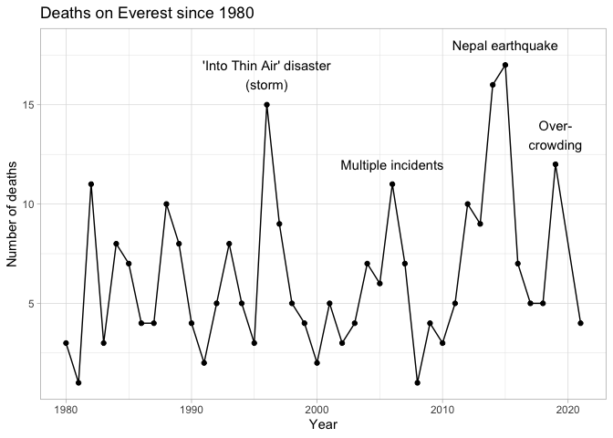<!-- -->

``` r
deaths_per_year %>% 
  filter(mountain == "K2", year >= 1980) %>% 
  ggplot(aes(x = year, y = n)) +
  geom_point() +
  geom_line() +
  labs(
    title = "Deaths on K2 ('The Savage Mountain') since 1980",
    x = "Year",
    y = "Number of deaths"
  ) +
  ylim(c(0,15)) +
  theme_light() +
  annotate("text", x = 1986, y = 14.5, label = "Storm\n(+ other incidents)") +
  annotate("text", x = 1995, y = 9, label = "Storm") +
  annotate("text", x = 2008, y = 12, label = "Serac collapse") +
  annotate("text", x = 2021, y = 7, label = "Winter\ndeaths")
```

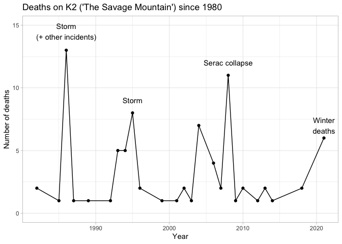<!-- -->

``` r
  # annotate("text", x = 2019, y = 13.5, label = "Over-\ncrowding")
```
