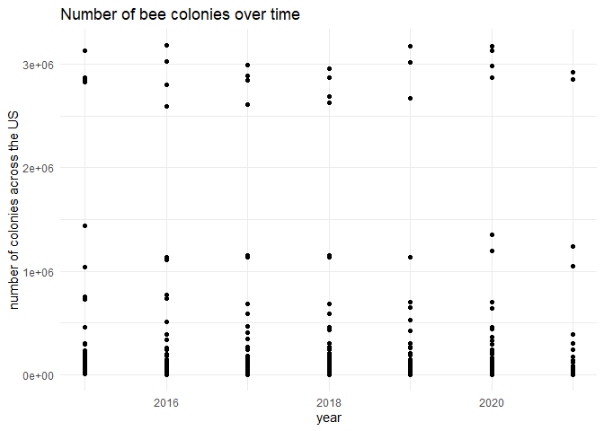
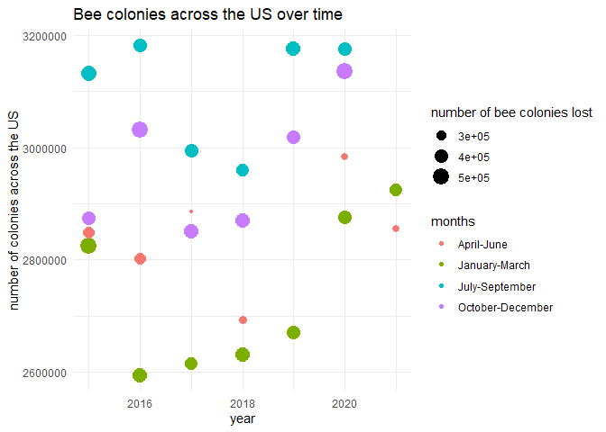
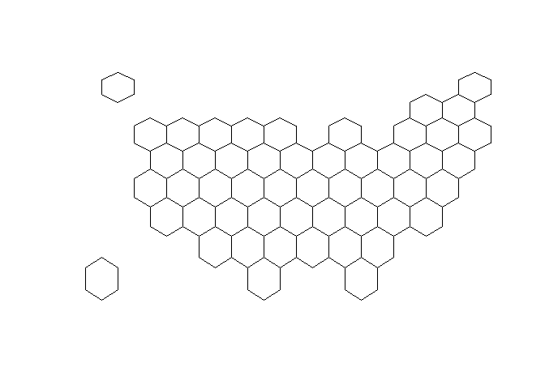
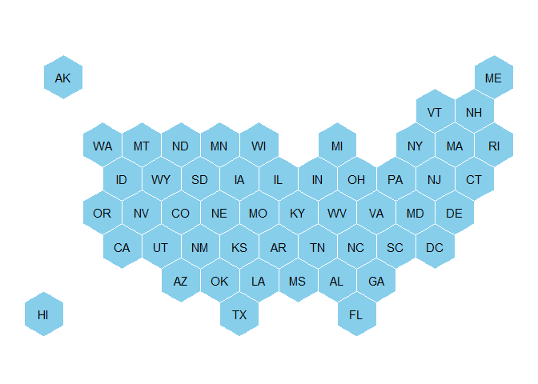
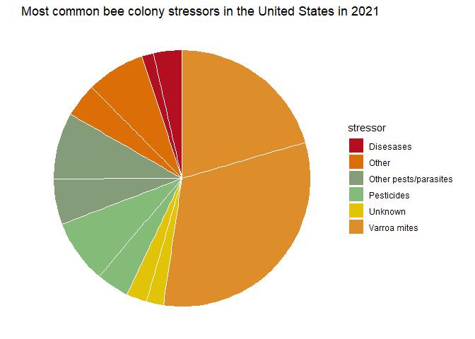

Tidy Tuesday: Bee Colonies
================
Sophie Jano
18/01/2022

!(\\2021-01-25\\bee1.jpeg)

*Colony data*

Let’s start with colony data. I’m interested in whether bee colony sizes
are increasing or decreasing with time

``` r
col_time <- colony_data %>%
  ggplot(aes(x = year, y = colony_n)) +
  geom_point() +
  theme_minimal() +
  ylab("number of colonies across the US") +
  ggtitle("Number of bee colonies over time")

print(col_time)
```

<!-- -->

``` r
#this doesn't quite work because for each year, there are a number of samples, as they were taken quarterly
#let's simplify and see if we can build up

most_colonies <- arrange(colony_data, desc(colony_n))

#after arranging, I realised that there's a 'united states' column, so I can look across all states

US <- colony_data %>%
  filter(state == "United States")

#let's try plotting again

col_time2 <- US %>%
  ggplot(aes(x = year, y = colony_n, fill = months)) +
  geom_point(aes(colour = months, size = colony_lost)) +
  theme_minimal() +
  ylab("number of colonies across the US") +
  labs(size = "number of bee colonies lost") +
  ggtitle("Bee colonies across the US over time") +
  scale_fill_brewer(palette = "Set2") 
  

print(col_time2)
```

<!-- -->

It seems like colonies are smallest in January-March and largest in
July-September. Some areas with the largest number of colonies have also
lost a lot of colonies, although in April-June, colonies seem to lose
the least.

This ended up a bit more complicated as a starter, so let’s plot a line
and see if colony numbers are actually increasing with time

``` r
col_smooth <- US %>%
  ggplot(aes(x = year, y = colony_n, fill = months)) +
  geom_smooth(aes(colour = months)) +
  theme_minimal() +
  ylab("number of colonies across the US") 

ggplotly(col_smooth)
```

    ## `geom_smooth()` using method = 'loess' and formula 'y ~ x'

<div id="htmlwidget-86afee7f7a9b31064186" style="width:672px;height:480px;" class="plotly html-widget"></div>
<script type="application/json" data-for="htmlwidget-86afee7f7a9b31064186">{"x":{"data":[{"x":[2015,2015.07594936709,2015.15189873418,2015.22784810127,2015.30379746835,2015.37974683544,2015.45569620253,2015.53164556962,2015.60759493671,2015.6835443038,2015.75949367089,2015.83544303797,2015.91139240506,2015.98734177215,2016.06329113924,2016.13924050633,2016.21518987342,2016.29113924051,2016.36708860759,2016.44303797468,2016.51898734177,2016.59493670886,2016.67088607595,2016.74683544304,2016.82278481013,2016.89873417722,2016.9746835443,2017.05063291139,2017.12658227848,2017.20253164557,2017.27848101266,2017.35443037975,2017.43037974684,2017.50632911392,2017.58227848101,2017.6582278481,2017.73417721519,2017.81012658228,2017.88607594937,2017.96202531646,2018.03797468354,2018.11392405063,2018.18987341772,2018.26582278481,2018.3417721519,2018.41772151899,2018.49367088608,2018.56962025316,2018.64556962025,2018.72151898734,2018.79746835443,2018.87341772152,2018.94936708861,2019.0253164557,2019.10126582278,2019.17721518987,2019.25316455696,2019.32911392405,2019.40506329114,2019.48101265823,2019.55696202532,2019.63291139241,2019.70886075949,2019.78481012658,2019.86075949367,2019.93670886076,2020.01265822785,2020.08860759494,2020.16455696203,2020.24050632911,2020.3164556962,2020.39240506329,2020.46835443038,2020.54430379747,2020.62025316456,2020.69620253165,2020.77215189873,2020.84810126582,2020.92405063291,2021],"y":[2849500,2841199.4984778,2833663.81669605,2826892.9546547,2820886.9123538,2815645.6897933,2811169.28697324,2807457.70389361,2804510.9405544,2802328.99695562,2800911.87309726,2800259.56897933,2800372.08460183,2801249.41996475,2803661.75957683,2808723.99755394,2815929.8937001,2824739.9025432,2834614.47861123,2845014.0764321,2855399.15053373,2865230.1554441,2873967.5456911,2881071.77580273,2886003.30030688,2888222.57373149,2887190.05060451,2882345.50814439,2873618.76163955,2861602.60776529,2846916.47500503,2830179.79184202,2812011.98675969,2793032.4882413,2773860.72477023,2755116.1248299,2737418.11690352,2721386.12947457,2707639.59102627,2696797.93004204,2689462.52229794,2685807.76395731,2685574.53415704,2688484.35184387,2694258.7359646,2702619.20546599,2713287.27929484,2725984.47639793,2740432.31572197,2756352.31621384,2773465.99682021,2791494.87648797,2810160.47416383,2829184.30879453,2848287.89932694,2867192.76470774,2885620.42388381,2903292.39580187,2919930.19940866,2935255.35365104,2948989.3774757,2960853.7898295,2970570.10965918,2977859.8559115,2982444.54753326,2984045.70347123,2982419.00817177,2978920.76750521,2974372.8873578,2968775.36772953,2962128.2086204,2954431.41003045,2945684.97195962,2935888.89440796,2925043.17737542,2913147.82086203,2900202.82486782,2886208.18939272,2871163.91443681,2855070],"text":["year: 2015.000<br />colony_n: 2849500<br />months: April-June<br />months: April-June","year: 2015.076<br />colony_n: 2841199<br />months: April-June<br />months: April-June","year: 2015.152<br />colony_n: 2833664<br />months: April-June<br />months: April-June","year: 2015.228<br />colony_n: 2826893<br />months: April-June<br />months: April-June","year: 2015.304<br />colony_n: 2820887<br />months: April-June<br />months: April-June","year: 2015.380<br />colony_n: 2815646<br />months: April-June<br />months: April-June","year: 2015.456<br />colony_n: 2811169<br />months: April-June<br />months: April-June","year: 2015.532<br />colony_n: 2807458<br />months: April-June<br />months: April-June","year: 2015.608<br />colony_n: 2804511<br />months: April-June<br />months: April-June","year: 2015.684<br />colony_n: 2802329<br />months: April-June<br />months: April-June","year: 2015.759<br />colony_n: 2800912<br />months: April-June<br />months: April-June","year: 2015.835<br />colony_n: 2800260<br />months: April-June<br />months: April-June","year: 2015.911<br />colony_n: 2800372<br />months: April-June<br />months: April-June","year: 2015.987<br />colony_n: 2801249<br />months: April-June<br />months: April-June","year: 2016.063<br />colony_n: 2803662<br />months: April-June<br />months: April-June","year: 2016.139<br />colony_n: 2808724<br />months: April-June<br />months: April-June","year: 2016.215<br />colony_n: 2815930<br />months: April-June<br />months: April-June","year: 2016.291<br />colony_n: 2824740<br />months: April-June<br />months: April-June","year: 2016.367<br />colony_n: 2834614<br />months: April-June<br />months: April-June","year: 2016.443<br />colony_n: 2845014<br />months: April-June<br />months: April-June","year: 2016.519<br />colony_n: 2855399<br />months: April-June<br />months: April-June","year: 2016.595<br />colony_n: 2865230<br />months: April-June<br />months: April-June","year: 2016.671<br />colony_n: 2873968<br />months: April-June<br />months: April-June","year: 2016.747<br />colony_n: 2881072<br />months: April-June<br />months: April-June","year: 2016.823<br />colony_n: 2886003<br />months: April-June<br />months: April-June","year: 2016.899<br />colony_n: 2888223<br />months: April-June<br />months: April-June","year: 2016.975<br />colony_n: 2887190<br />months: April-June<br />months: April-June","year: 2017.051<br />colony_n: 2882346<br />months: April-June<br />months: April-June","year: 2017.127<br />colony_n: 2873619<br />months: April-June<br />months: April-June","year: 2017.203<br />colony_n: 2861603<br />months: April-June<br />months: April-June","year: 2017.278<br />colony_n: 2846916<br />months: April-June<br />months: April-June","year: 2017.354<br />colony_n: 2830180<br />months: April-June<br />months: April-June","year: 2017.430<br />colony_n: 2812012<br />months: April-June<br />months: April-June","year: 2017.506<br />colony_n: 2793032<br />months: April-June<br />months: April-June","year: 2017.582<br />colony_n: 2773861<br />months: April-June<br />months: April-June","year: 2017.658<br />colony_n: 2755116<br />months: April-June<br />months: April-June","year: 2017.734<br />colony_n: 2737418<br />months: April-June<br />months: April-June","year: 2017.810<br />colony_n: 2721386<br />months: April-June<br />months: April-June","year: 2017.886<br />colony_n: 2707640<br />months: April-June<br />months: April-June","year: 2017.962<br />colony_n: 2696798<br />months: April-June<br />months: April-June","year: 2018.038<br />colony_n: 2689463<br />months: April-June<br />months: April-June","year: 2018.114<br />colony_n: 2685808<br />months: April-June<br />months: April-June","year: 2018.190<br />colony_n: 2685575<br />months: April-June<br />months: April-June","year: 2018.266<br />colony_n: 2688484<br />months: April-June<br />months: April-June","year: 2018.342<br />colony_n: 2694259<br />months: April-June<br />months: April-June","year: 2018.418<br />colony_n: 2702619<br />months: April-June<br />months: April-June","year: 2018.494<br />colony_n: 2713287<br />months: April-June<br />months: April-June","year: 2018.570<br />colony_n: 2725984<br />months: April-June<br />months: April-June","year: 2018.646<br />colony_n: 2740432<br />months: April-June<br />months: April-June","year: 2018.722<br />colony_n: 2756352<br />months: April-June<br />months: April-June","year: 2018.797<br />colony_n: 2773466<br />months: April-June<br />months: April-June","year: 2018.873<br />colony_n: 2791495<br />months: April-June<br />months: April-June","year: 2018.949<br />colony_n: 2810160<br />months: April-June<br />months: April-June","year: 2019.025<br />colony_n: 2829184<br />months: April-June<br />months: April-June","year: 2019.101<br />colony_n: 2848288<br />months: April-June<br />months: April-June","year: 2019.177<br />colony_n: 2867193<br />months: April-June<br />months: April-June","year: 2019.253<br />colony_n: 2885620<br />months: April-June<br />months: April-June","year: 2019.329<br />colony_n: 2903292<br />months: April-June<br />months: April-June","year: 2019.405<br />colony_n: 2919930<br />months: April-June<br />months: April-June","year: 2019.481<br />colony_n: 2935255<br />months: April-June<br />months: April-June","year: 2019.557<br />colony_n: 2948989<br />months: April-June<br />months: April-June","year: 2019.633<br />colony_n: 2960854<br />months: April-June<br />months: April-June","year: 2019.709<br />colony_n: 2970570<br />months: April-June<br />months: April-June","year: 2019.785<br />colony_n: 2977860<br />months: April-June<br />months: April-June","year: 2019.861<br />colony_n: 2982445<br />months: April-June<br />months: April-June","year: 2019.937<br />colony_n: 2984046<br />months: April-June<br />months: April-June","year: 2020.013<br />colony_n: 2982419<br />months: April-June<br />months: April-June","year: 2020.089<br />colony_n: 2978921<br />months: April-June<br />months: April-June","year: 2020.165<br />colony_n: 2974373<br />months: April-June<br />months: April-June","year: 2020.241<br />colony_n: 2968775<br />months: April-June<br />months: April-June","year: 2020.316<br />colony_n: 2962128<br />months: April-June<br />months: April-June","year: 2020.392<br />colony_n: 2954431<br />months: April-June<br />months: April-June","year: 2020.468<br />colony_n: 2945685<br />months: April-June<br />months: April-June","year: 2020.544<br />colony_n: 2935889<br />months: April-June<br />months: April-June","year: 2020.620<br />colony_n: 2925043<br />months: April-June<br />months: April-June","year: 2020.696<br />colony_n: 2913148<br />months: April-June<br />months: April-June","year: 2020.772<br />colony_n: 2900203<br />months: April-June<br />months: April-June","year: 2020.848<br />colony_n: 2886208<br />months: April-June<br />months: April-June","year: 2020.924<br />colony_n: 2871164<br />months: April-June<br />months: April-June","year: 2021.000<br />colony_n: 2855070<br />months: April-June<br />months: April-June"],"type":"scatter","mode":"lines","name":"April-June","line":{"width":3.77952755905512,"color":"rgba(248,118,109,1)","dash":"solid"},"hoveron":"points","legendgroup":"April-June","showlegend":true,"xaxis":"x","yaxis":"y","hoverinfo":"text","frame":null},{"x":[2015,2015.07594936709,2015.15189873418,2015.22784810127,2015.30379746835,2015.37974683544,2015.45569620253,2015.53164556962,2015.60759493671,2015.6835443038,2015.75949367089,2015.83544303797,2015.91139240506,2015.98734177215,2016.06329113924,2016.13924050633,2016.21518987342,2016.29113924051,2016.36708860759,2016.44303797468,2016.51898734177,2016.59493670886,2016.67088607595,2016.74683544304,2016.82278481013,2016.89873417722,2016.9746835443,2017.05063291139,2017.12658227848,2017.20253164557,2017.27848101266,2017.35443037975,2017.43037974684,2017.50632911392,2017.58227848101,2017.6582278481,2017.73417721519,2017.81012658228,2017.88607594937,2017.96202531646,2018.03797468354,2018.11392405063,2018.18987341772,2018.26582278481,2018.3417721519,2018.41772151899,2018.49367088608,2018.56962025316,2018.64556962025,2018.72151898734,2018.79746835443,2018.87341772152,2018.94936708861,2019.0253164557,2019.10126582278,2019.17721518987,2019.25316455696,2019.32911392405,2019.40506329114,2019.48101265823,2019.55696202532,2019.63291139241,2019.70886075949,2019.78481012658,2019.86075949367,2019.93670886076,2020.01265822785,2020.08860759494,2020.16455696203,2020.24050632911,2020.3164556962,2020.39240506329,2020.46835443038,2020.54430379747,2020.62025316456,2020.69620253165,2020.77215189873,2020.84810126582,2020.92405063291,2021],"y":[2815782.69446685,2796004.92186383,2777213.7880234,2759387.59357501,2742504.63914833,2726543.22537285,2711481.65287817,2697298.22229391,2683971.23424956,2671478.98937477,2659799.78829902,2648911.93165194,2638793.72006311,2629423.45416206,2621227.17271348,2614910.27023137,2610297.05586983,2607193.12971808,2605404.0918653,2604735.5424007,2604993.08141346,2605982.30899278,2607508.82522785,2609378.23020787,2611396.12402203,2613368.10675953,2615099.77850957,2616473.96216121,2617655.47991133,2618698.72332615,2619643.10819225,2620528.05029623,2621392.96542464,2622277.26936409,2623220.37790114,2624261.70682238,2625440.67191439,2626796.68896375,2628369.17375705,2630197.54208085,2632201.81910559,2633759.17834086,2634927.90414146,2635891.68274721,2636834.20039794,2637939.14333349,2639390.19779369,2641371.05001836,2644065.38624734,2647656.89272046,2652329.25567754,2658266.16135843,2665651.29600296,2674653.5953351,2685138.25278014,2696833.90217482,2709496.49539218,2722881.98430514,2736746.32078663,2750845.45670968,2764935.34394719,2778771.93437219,2792111.17985761,2804709.03227637,2816321.44350151,2826704.36540593,2835637.10567418,2843999.59656035,2852325.07487188,2860588.19490881,2868763.61097112,2876825.97735879,2884749.94837187,2892510.17831032,2900081.32147418,2907438.03216344,2914554.96467808,2921406.77331814,2927968.11238358,2934213.63617444],"text":["year: 2015.000<br />colony_n: 2815783<br />months: January-March<br />months: January-March","year: 2015.076<br />colony_n: 2796005<br />months: January-March<br />months: January-March","year: 2015.152<br />colony_n: 2777214<br />months: January-March<br />months: January-March","year: 2015.228<br />colony_n: 2759388<br />months: January-March<br />months: January-March","year: 2015.304<br />colony_n: 2742505<br />months: January-March<br />months: January-March","year: 2015.380<br />colony_n: 2726543<br />months: January-March<br />months: January-March","year: 2015.456<br />colony_n: 2711482<br />months: January-March<br />months: January-March","year: 2015.532<br />colony_n: 2697298<br />months: January-March<br />months: January-March","year: 2015.608<br />colony_n: 2683971<br />months: January-March<br />months: January-March","year: 2015.684<br />colony_n: 2671479<br />months: January-March<br />months: January-March","year: 2015.759<br />colony_n: 2659800<br />months: January-March<br />months: January-March","year: 2015.835<br />colony_n: 2648912<br />months: January-March<br />months: January-March","year: 2015.911<br />colony_n: 2638794<br />months: January-March<br />months: January-March","year: 2015.987<br />colony_n: 2629423<br />months: January-March<br />months: January-March","year: 2016.063<br />colony_n: 2621227<br />months: January-March<br />months: January-March","year: 2016.139<br />colony_n: 2614910<br />months: January-March<br />months: January-March","year: 2016.215<br />colony_n: 2610297<br />months: January-March<br />months: January-March","year: 2016.291<br />colony_n: 2607193<br />months: January-March<br />months: January-March","year: 2016.367<br />colony_n: 2605404<br />months: January-March<br />months: January-March","year: 2016.443<br />colony_n: 2604736<br />months: January-March<br />months: January-March","year: 2016.519<br />colony_n: 2604993<br />months: January-March<br />months: January-March","year: 2016.595<br />colony_n: 2605982<br />months: January-March<br />months: January-March","year: 2016.671<br />colony_n: 2607509<br />months: January-March<br />months: January-March","year: 2016.747<br />colony_n: 2609378<br />months: January-March<br />months: January-March","year: 2016.823<br />colony_n: 2611396<br />months: January-March<br />months: January-March","year: 2016.899<br />colony_n: 2613368<br />months: January-March<br />months: January-March","year: 2016.975<br />colony_n: 2615100<br />months: January-March<br />months: January-March","year: 2017.051<br />colony_n: 2616474<br />months: January-March<br />months: January-March","year: 2017.127<br />colony_n: 2617655<br />months: January-March<br />months: January-March","year: 2017.203<br />colony_n: 2618699<br />months: January-March<br />months: January-March","year: 2017.278<br />colony_n: 2619643<br />months: January-March<br />months: January-March","year: 2017.354<br />colony_n: 2620528<br />months: January-March<br />months: January-March","year: 2017.430<br />colony_n: 2621393<br />months: January-March<br />months: January-March","year: 2017.506<br />colony_n: 2622277<br />months: January-March<br />months: January-March","year: 2017.582<br />colony_n: 2623220<br />months: January-March<br />months: January-March","year: 2017.658<br />colony_n: 2624262<br />months: January-March<br />months: January-March","year: 2017.734<br />colony_n: 2625441<br />months: January-March<br />months: January-March","year: 2017.810<br />colony_n: 2626797<br />months: January-March<br />months: January-March","year: 2017.886<br />colony_n: 2628369<br />months: January-March<br />months: January-March","year: 2017.962<br />colony_n: 2630198<br />months: January-March<br />months: January-March","year: 2018.038<br />colony_n: 2632202<br />months: January-March<br />months: January-March","year: 2018.114<br />colony_n: 2633759<br />months: January-March<br />months: January-March","year: 2018.190<br />colony_n: 2634928<br />months: January-March<br />months: January-March","year: 2018.266<br />colony_n: 2635892<br />months: January-March<br />months: January-March","year: 2018.342<br />colony_n: 2636834<br />months: January-March<br />months: January-March","year: 2018.418<br />colony_n: 2637939<br />months: January-March<br />months: January-March","year: 2018.494<br />colony_n: 2639390<br />months: January-March<br />months: January-March","year: 2018.570<br />colony_n: 2641371<br />months: January-March<br />months: January-March","year: 2018.646<br />colony_n: 2644065<br />months: January-March<br />months: January-March","year: 2018.722<br />colony_n: 2647657<br />months: January-March<br />months: January-March","year: 2018.797<br />colony_n: 2652329<br />months: January-March<br />months: January-March","year: 2018.873<br />colony_n: 2658266<br />months: January-March<br />months: January-March","year: 2018.949<br />colony_n: 2665651<br />months: January-March<br />months: January-March","year: 2019.025<br />colony_n: 2674654<br />months: January-March<br />months: January-March","year: 2019.101<br />colony_n: 2685138<br />months: January-March<br />months: January-March","year: 2019.177<br />colony_n: 2696834<br />months: January-March<br />months: January-March","year: 2019.253<br />colony_n: 2709496<br />months: January-March<br />months: January-March","year: 2019.329<br />colony_n: 2722882<br />months: January-March<br />months: January-March","year: 2019.405<br />colony_n: 2736746<br />months: January-March<br />months: January-March","year: 2019.481<br />colony_n: 2750845<br />months: January-March<br />months: January-March","year: 2019.557<br />colony_n: 2764935<br />months: January-March<br />months: January-March","year: 2019.633<br />colony_n: 2778772<br />months: January-March<br />months: January-March","year: 2019.709<br />colony_n: 2792111<br />months: January-March<br />months: January-March","year: 2019.785<br />colony_n: 2804709<br />months: January-March<br />months: January-March","year: 2019.861<br />colony_n: 2816321<br />months: January-March<br />months: January-March","year: 2019.937<br />colony_n: 2826704<br />months: January-March<br />months: January-March","year: 2020.013<br />colony_n: 2835637<br />months: January-March<br />months: January-March","year: 2020.089<br />colony_n: 2844000<br />months: January-March<br />months: January-March","year: 2020.165<br />colony_n: 2852325<br />months: January-March<br />months: January-March","year: 2020.241<br />colony_n: 2860588<br />months: January-March<br />months: January-March","year: 2020.316<br />colony_n: 2868764<br />months: January-March<br />months: January-March","year: 2020.392<br />colony_n: 2876826<br />months: January-March<br />months: January-March","year: 2020.468<br />colony_n: 2884750<br />months: January-March<br />months: January-March","year: 2020.544<br />colony_n: 2892510<br />months: January-March<br />months: January-March","year: 2020.620<br />colony_n: 2900081<br />months: January-March<br />months: January-March","year: 2020.696<br />colony_n: 2907438<br />months: January-March<br />months: January-March","year: 2020.772<br />colony_n: 2914555<br />months: January-March<br />months: January-March","year: 2020.848<br />colony_n: 2921407<br />months: January-March<br />months: January-March","year: 2020.924<br />colony_n: 2927968<br />months: January-March<br />months: January-March","year: 2021.000<br />colony_n: 2934214<br />months: January-March<br />months: January-March"],"type":"scatter","mode":"lines","name":"January-March","line":{"width":3.77952755905512,"color":"rgba(124,174,0,1)","dash":"solid"},"hoveron":"points","legendgroup":"January-March","showlegend":true,"xaxis":"x","yaxis":"y","hoverinfo":"text","frame":null},{"x":[2015,2015.06329113924,2015.12658227848,2015.18987341772,2015.25316455696,2015.3164556962,2015.37974683544,2015.44303797468,2015.50632911392,2015.56962025316,2015.63291139241,2015.69620253165,2015.75949367089,2015.82278481013,2015.88607594937,2015.94936708861,2016.01265822785,2016.07594936709,2016.13924050633,2016.20253164557,2016.26582278481,2016.32911392405,2016.39240506329,2016.45569620253,2016.51898734177,2016.58227848101,2016.64556962025,2016.70886075949,2016.77215189873,2016.83544303797,2016.89873417722,2016.96202531646,2017.0253164557,2017.08860759494,2017.15189873418,2017.21518987342,2017.27848101266,2017.3417721519,2017.40506329114,2017.46835443038,2017.53164556962,2017.59493670886,2017.6582278481,2017.72151898734,2017.78481012658,2017.84810126582,2017.91139240506,2017.9746835443,2018.03797468354,2018.10126582278,2018.16455696203,2018.22784810127,2018.29113924051,2018.35443037975,2018.41772151899,2018.48101265823,2018.54430379747,2018.60759493671,2018.67088607595,2018.73417721519,2018.79746835443,2018.86075949367,2018.92405063291,2018.98734177215,2019.05063291139,2019.11392405063,2019.17721518987,2019.24050632911,2019.30379746835,2019.36708860759,2019.43037974684,2019.49367088608,2019.55696202532,2019.62025316456,2019.6835443038,2019.74683544304,2019.81012658228,2019.87341772152,2019.93670886076,2020],"y":[3132880,3142902.40025639,3151983.52507611,3160123.37445924,3167321.94840571,3173579.24691557,3178895.26998878,3183270.01762539,3186703.48982535,3189195.68658869,3190746.6079154,3191356.25380548,3191024.62425893,3189751.71927576,3187537.53885595,3184382.08299952,3180254.82257996,3174218.74825317,3166047.63136385,3156035.02120521,3144474.46707056,3131659.5182531,3117883.72404618,3103440.63374295,3088623.79663679,3073726.76202084,3059043.07918847,3044866.29743284,3031489.96604732,3019207.63432506,3008312.85155942,2999099.16704357,2991701.48533889,2984875.31966031,2978354.19323827,2972215.61768947,2966537.10463067,2961396.16567857,2956870.31244993,2953037.05656145,2949973.90962987,2947758.38327191,2946467.98910431,2946180.23874379,2946972.64380708,2948922.71591091,2952107.966672,2956605.9077071,2962744.26972308,2971443.42709198,2982468.20778882,2995460.61782132,3010062.66319701,3025916.34992365,3042663.68400875,3059946.67146008,3077407.31828514,3094687.63049171,3111429.6140873,3127275.27507967,3141866.61947633,3154845.65328504,3165854.38251334,3174534.81316894,3181162.83928857,3186881.17769588,3191727.05976606,3195700.48549912,3198801.45489505,3201029.96795386,3202386.02467553,3202869.62506009,3202480.76910752,3201219.45681782,3199085.688191,3196079.46322705,3192200.78192598,3187449.64428778,3181826.05031246,3175330],"text":["year: 2015.000<br />colony_n: 3132880<br />months: July-September<br />months: July-September","year: 2015.063<br />colony_n: 3142902<br />months: July-September<br />months: July-September","year: 2015.127<br />colony_n: 3151984<br />months: July-September<br />months: July-September","year: 2015.190<br />colony_n: 3160123<br />months: July-September<br />months: July-September","year: 2015.253<br />colony_n: 3167322<br />months: July-September<br />months: July-September","year: 2015.316<br />colony_n: 3173579<br />months: July-September<br />months: July-September","year: 2015.380<br />colony_n: 3178895<br />months: July-September<br />months: July-September","year: 2015.443<br />colony_n: 3183270<br />months: July-September<br />months: July-September","year: 2015.506<br />colony_n: 3186703<br />months: July-September<br />months: July-September","year: 2015.570<br />colony_n: 3189196<br />months: July-September<br />months: July-September","year: 2015.633<br />colony_n: 3190747<br />months: July-September<br />months: July-September","year: 2015.696<br />colony_n: 3191356<br />months: July-September<br />months: July-September","year: 2015.759<br />colony_n: 3191025<br />months: July-September<br />months: July-September","year: 2015.823<br />colony_n: 3189752<br />months: July-September<br />months: July-September","year: 2015.886<br />colony_n: 3187538<br />months: July-September<br />months: July-September","year: 2015.949<br />colony_n: 3184382<br />months: July-September<br />months: July-September","year: 2016.013<br />colony_n: 3180255<br />months: July-September<br />months: July-September","year: 2016.076<br />colony_n: 3174219<br />months: July-September<br />months: July-September","year: 2016.139<br />colony_n: 3166048<br />months: July-September<br />months: July-September","year: 2016.203<br />colony_n: 3156035<br />months: July-September<br />months: July-September","year: 2016.266<br />colony_n: 3144474<br />months: July-September<br />months: July-September","year: 2016.329<br />colony_n: 3131660<br />months: July-September<br />months: July-September","year: 2016.392<br />colony_n: 3117884<br />months: July-September<br />months: July-September","year: 2016.456<br />colony_n: 3103441<br />months: July-September<br />months: July-September","year: 2016.519<br />colony_n: 3088624<br />months: July-September<br />months: July-September","year: 2016.582<br />colony_n: 3073727<br />months: July-September<br />months: July-September","year: 2016.646<br />colony_n: 3059043<br />months: July-September<br />months: July-September","year: 2016.709<br />colony_n: 3044866<br />months: July-September<br />months: July-September","year: 2016.772<br />colony_n: 3031490<br />months: July-September<br />months: July-September","year: 2016.835<br />colony_n: 3019208<br />months: July-September<br />months: July-September","year: 2016.899<br />colony_n: 3008313<br />months: July-September<br />months: July-September","year: 2016.962<br />colony_n: 2999099<br />months: July-September<br />months: July-September","year: 2017.025<br />colony_n: 2991701<br />months: July-September<br />months: July-September","year: 2017.089<br />colony_n: 2984875<br />months: July-September<br />months: July-September","year: 2017.152<br />colony_n: 2978354<br />months: July-September<br />months: July-September","year: 2017.215<br />colony_n: 2972216<br />months: July-September<br />months: July-September","year: 2017.278<br />colony_n: 2966537<br />months: July-September<br />months: July-September","year: 2017.342<br />colony_n: 2961396<br />months: July-September<br />months: July-September","year: 2017.405<br />colony_n: 2956870<br />months: July-September<br />months: July-September","year: 2017.468<br />colony_n: 2953037<br />months: July-September<br />months: July-September","year: 2017.532<br />colony_n: 2949974<br />months: July-September<br />months: July-September","year: 2017.595<br />colony_n: 2947758<br />months: July-September<br />months: July-September","year: 2017.658<br />colony_n: 2946468<br />months: July-September<br />months: July-September","year: 2017.722<br />colony_n: 2946180<br />months: July-September<br />months: July-September","year: 2017.785<br />colony_n: 2946973<br />months: July-September<br />months: July-September","year: 2017.848<br />colony_n: 2948923<br />months: July-September<br />months: July-September","year: 2017.911<br />colony_n: 2952108<br />months: July-September<br />months: July-September","year: 2017.975<br />colony_n: 2956606<br />months: July-September<br />months: July-September","year: 2018.038<br />colony_n: 2962744<br />months: July-September<br />months: July-September","year: 2018.101<br />colony_n: 2971443<br />months: July-September<br />months: July-September","year: 2018.165<br />colony_n: 2982468<br />months: July-September<br />months: July-September","year: 2018.228<br />colony_n: 2995461<br />months: July-September<br />months: July-September","year: 2018.291<br />colony_n: 3010063<br />months: July-September<br />months: July-September","year: 2018.354<br />colony_n: 3025916<br />months: July-September<br />months: July-September","year: 2018.418<br />colony_n: 3042664<br />months: July-September<br />months: July-September","year: 2018.481<br />colony_n: 3059947<br />months: July-September<br />months: July-September","year: 2018.544<br />colony_n: 3077407<br />months: July-September<br />months: July-September","year: 2018.608<br />colony_n: 3094688<br />months: July-September<br />months: July-September","year: 2018.671<br />colony_n: 3111430<br />months: July-September<br />months: July-September","year: 2018.734<br />colony_n: 3127275<br />months: July-September<br />months: July-September","year: 2018.797<br />colony_n: 3141867<br />months: July-September<br />months: July-September","year: 2018.861<br />colony_n: 3154846<br />months: July-September<br />months: July-September","year: 2018.924<br />colony_n: 3165854<br />months: July-September<br />months: July-September","year: 2018.987<br />colony_n: 3174535<br />months: July-September<br />months: July-September","year: 2019.051<br />colony_n: 3181163<br />months: July-September<br />months: July-September","year: 2019.114<br />colony_n: 3186881<br />months: July-September<br />months: July-September","year: 2019.177<br />colony_n: 3191727<br />months: July-September<br />months: July-September","year: 2019.241<br />colony_n: 3195700<br />months: July-September<br />months: July-September","year: 2019.304<br />colony_n: 3198801<br />months: July-September<br />months: July-September","year: 2019.367<br />colony_n: 3201030<br />months: July-September<br />months: July-September","year: 2019.430<br />colony_n: 3202386<br />months: July-September<br />months: July-September","year: 2019.494<br />colony_n: 3202870<br />months: July-September<br />months: July-September","year: 2019.557<br />colony_n: 3202481<br />months: July-September<br />months: July-September","year: 2019.620<br />colony_n: 3201219<br />months: July-September<br />months: July-September","year: 2019.684<br />colony_n: 3199086<br />months: July-September<br />months: July-September","year: 2019.747<br />colony_n: 3196079<br />months: July-September<br />months: July-September","year: 2019.810<br />colony_n: 3192201<br />months: July-September<br />months: July-September","year: 2019.873<br />colony_n: 3187450<br />months: July-September<br />months: July-September","year: 2019.937<br />colony_n: 3181826<br />months: July-September<br />months: July-September","year: 2020.000<br />colony_n: 3175330<br />months: July-September<br />months: July-September"],"type":"scatter","mode":"lines","name":"July-September","line":{"width":3.77952755905512,"color":"rgba(0,191,196,1)","dash":"solid"},"hoveron":"points","legendgroup":"July-September","showlegend":true,"xaxis":"x","yaxis":"y","hoverinfo":"text","frame":null},{"x":[2015,2015.06329113924,2015.12658227848,2015.18987341772,2015.25316455696,2015.3164556962,2015.37974683544,2015.44303797468,2015.50632911392,2015.56962025316,2015.63291139241,2015.69620253165,2015.75949367089,2015.82278481013,2015.88607594937,2015.94936708861,2016.01265822785,2016.07594936709,2016.13924050633,2016.20253164557,2016.26582278481,2016.32911392405,2016.39240506329,2016.45569620253,2016.51898734177,2016.58227848101,2016.64556962025,2016.70886075949,2016.77215189873,2016.83544303797,2016.89873417722,2016.96202531646,2017.0253164557,2017.08860759494,2017.15189873418,2017.21518987342,2017.27848101266,2017.3417721519,2017.40506329114,2017.46835443038,2017.53164556962,2017.59493670886,2017.6582278481,2017.72151898734,2017.78481012658,2017.84810126582,2017.91139240506,2017.9746835443,2018.03797468354,2018.10126582278,2018.16455696203,2018.22784810127,2018.29113924051,2018.35443037975,2018.41772151899,2018.48101265823,2018.54430379747,2018.60759493671,2018.67088607595,2018.73417721519,2018.79746835443,2018.86075949367,2018.92405063291,2018.98734177215,2019.05063291139,2019.11392405063,2019.17721518987,2019.24050632911,2019.30379746835,2019.36708860759,2019.43037974684,2019.49367088608,2019.55696202532,2019.62025316456,2019.6835443038,2019.74683544304,2019.81012658228,2019.87341772152,2019.93670886076,2020],"y":[2874760,2894782.05576033,2913443.79266143,2930745.21070344,2946686.30988624,2961267.09020993,2974487.55167441,2986347.69427978,2996847.51802596,3005987.02291301,3013766.20894087,3020185.07610961,3025243.62441916,3028941.85386958,3031279.76446082,3032257.35619292,3031831.82896282,3028689.54883893,3022513.3560834,3013714.79014843,3002705.39048636,2989896.69654934,2975700.24778974,2960527.58365969,2944790.24361157,2928899.76709751,2913267.69356989,2898305.56248084,2884424.91328273,2872037.28542771,2861554.21836813,2853387.25155616,2847792.48793706,2843591.46580696,2840407.99046323,2838187.6417687,2836875.99958624,2836418.64377869,2836761.1542089,2837849.11073972,2839628.093234,2842043.68155461,2845041.45556437,2848566.99512615,2852565.88010279,2856983.69035716,2861766.00575208,2866858.40615043,2872372.28923066,2878905.62635005,2886410.84449708,2894764.84235528,2903844.51860805,2913526.77193894,2923688.50103135,2934206.60456881,2944957.98123474,2955819.52971267,2966668.14868599,2977380.73683827,2987834.19285288,2997905.41541339,3007471.30320318,3016408.7549058,3024812.64060246,3033075.89969556,3041211.33472199,3049218.94568178,3057098.7325749,3064850.69540138,3072474.83416118,3079971.14885435,3087339.63948084,3094580.3060407,3101693.14853388,3108678.16696043,3115535.36132029,3122264.73161353,3128866.27784008,3135340],"text":["year: 2015.000<br />colony_n: 2874760<br />months: October-December<br />months: October-December","year: 2015.063<br />colony_n: 2894782<br />months: October-December<br />months: October-December","year: 2015.127<br />colony_n: 2913444<br />months: October-December<br />months: October-December","year: 2015.190<br />colony_n: 2930745<br />months: October-December<br />months: October-December","year: 2015.253<br />colony_n: 2946686<br />months: October-December<br />months: October-December","year: 2015.316<br />colony_n: 2961267<br />months: October-December<br />months: October-December","year: 2015.380<br />colony_n: 2974488<br />months: October-December<br />months: October-December","year: 2015.443<br />colony_n: 2986348<br />months: October-December<br />months: October-December","year: 2015.506<br />colony_n: 2996848<br />months: October-December<br />months: October-December","year: 2015.570<br />colony_n: 3005987<br />months: October-December<br />months: October-December","year: 2015.633<br />colony_n: 3013766<br />months: October-December<br />months: October-December","year: 2015.696<br />colony_n: 3020185<br />months: October-December<br />months: October-December","year: 2015.759<br />colony_n: 3025244<br />months: October-December<br />months: October-December","year: 2015.823<br />colony_n: 3028942<br />months: October-December<br />months: October-December","year: 2015.886<br />colony_n: 3031280<br />months: October-December<br />months: October-December","year: 2015.949<br />colony_n: 3032257<br />months: October-December<br />months: October-December","year: 2016.013<br />colony_n: 3031832<br />months: October-December<br />months: October-December","year: 2016.076<br />colony_n: 3028690<br />months: October-December<br />months: October-December","year: 2016.139<br />colony_n: 3022513<br />months: October-December<br />months: October-December","year: 2016.203<br />colony_n: 3013715<br />months: October-December<br />months: October-December","year: 2016.266<br />colony_n: 3002705<br />months: October-December<br />months: October-December","year: 2016.329<br />colony_n: 2989897<br />months: October-December<br />months: October-December","year: 2016.392<br />colony_n: 2975700<br />months: October-December<br />months: October-December","year: 2016.456<br />colony_n: 2960528<br />months: October-December<br />months: October-December","year: 2016.519<br />colony_n: 2944790<br />months: October-December<br />months: October-December","year: 2016.582<br />colony_n: 2928900<br />months: October-December<br />months: October-December","year: 2016.646<br />colony_n: 2913268<br />months: October-December<br />months: October-December","year: 2016.709<br />colony_n: 2898306<br />months: October-December<br />months: October-December","year: 2016.772<br />colony_n: 2884425<br />months: October-December<br />months: October-December","year: 2016.835<br />colony_n: 2872037<br />months: October-December<br />months: October-December","year: 2016.899<br />colony_n: 2861554<br />months: October-December<br />months: October-December","year: 2016.962<br />colony_n: 2853387<br />months: October-December<br />months: October-December","year: 2017.025<br />colony_n: 2847792<br />months: October-December<br />months: October-December","year: 2017.089<br />colony_n: 2843591<br />months: October-December<br />months: October-December","year: 2017.152<br />colony_n: 2840408<br />months: October-December<br />months: October-December","year: 2017.215<br />colony_n: 2838188<br />months: October-December<br />months: October-December","year: 2017.278<br />colony_n: 2836876<br />months: October-December<br />months: October-December","year: 2017.342<br />colony_n: 2836419<br />months: October-December<br />months: October-December","year: 2017.405<br />colony_n: 2836761<br />months: October-December<br />months: October-December","year: 2017.468<br />colony_n: 2837849<br />months: October-December<br />months: October-December","year: 2017.532<br />colony_n: 2839628<br />months: October-December<br />months: October-December","year: 2017.595<br />colony_n: 2842044<br />months: October-December<br />months: October-December","year: 2017.658<br />colony_n: 2845041<br />months: October-December<br />months: October-December","year: 2017.722<br />colony_n: 2848567<br />months: October-December<br />months: October-December","year: 2017.785<br />colony_n: 2852566<br />months: October-December<br />months: October-December","year: 2017.848<br />colony_n: 2856984<br />months: October-December<br />months: October-December","year: 2017.911<br />colony_n: 2861766<br />months: October-December<br />months: October-December","year: 2017.975<br />colony_n: 2866858<br />months: October-December<br />months: October-December","year: 2018.038<br />colony_n: 2872372<br />months: October-December<br />months: October-December","year: 2018.101<br />colony_n: 2878906<br />months: October-December<br />months: October-December","year: 2018.165<br />colony_n: 2886411<br />months: October-December<br />months: October-December","year: 2018.228<br />colony_n: 2894765<br />months: October-December<br />months: October-December","year: 2018.291<br />colony_n: 2903845<br />months: October-December<br />months: October-December","year: 2018.354<br />colony_n: 2913527<br />months: October-December<br />months: October-December","year: 2018.418<br />colony_n: 2923689<br />months: October-December<br />months: October-December","year: 2018.481<br />colony_n: 2934207<br />months: October-December<br />months: October-December","year: 2018.544<br />colony_n: 2944958<br />months: October-December<br />months: October-December","year: 2018.608<br />colony_n: 2955820<br />months: October-December<br />months: October-December","year: 2018.671<br />colony_n: 2966668<br />months: October-December<br />months: October-December","year: 2018.734<br />colony_n: 2977381<br />months: October-December<br />months: October-December","year: 2018.797<br />colony_n: 2987834<br />months: October-December<br />months: October-December","year: 2018.861<br />colony_n: 2997905<br />months: October-December<br />months: October-December","year: 2018.924<br />colony_n: 3007471<br />months: October-December<br />months: October-December","year: 2018.987<br />colony_n: 3016409<br />months: October-December<br />months: October-December","year: 2019.051<br />colony_n: 3024813<br />months: October-December<br />months: October-December","year: 2019.114<br />colony_n: 3033076<br />months: October-December<br />months: October-December","year: 2019.177<br />colony_n: 3041211<br />months: October-December<br />months: October-December","year: 2019.241<br />colony_n: 3049219<br />months: October-December<br />months: October-December","year: 2019.304<br />colony_n: 3057099<br />months: October-December<br />months: October-December","year: 2019.367<br />colony_n: 3064851<br />months: October-December<br />months: October-December","year: 2019.430<br />colony_n: 3072475<br />months: October-December<br />months: October-December","year: 2019.494<br />colony_n: 3079971<br />months: October-December<br />months: October-December","year: 2019.557<br />colony_n: 3087340<br />months: October-December<br />months: October-December","year: 2019.620<br />colony_n: 3094580<br />months: October-December<br />months: October-December","year: 2019.684<br />colony_n: 3101693<br />months: October-December<br />months: October-December","year: 2019.747<br />colony_n: 3108678<br />months: October-December<br />months: October-December","year: 2019.810<br />colony_n: 3115535<br />months: October-December<br />months: October-December","year: 2019.873<br />colony_n: 3122265<br />months: October-December<br />months: October-December","year: 2019.937<br />colony_n: 3128866<br />months: October-December<br />months: October-December","year: 2020.000<br />colony_n: 3135340<br />months: October-December<br />months: October-December"],"type":"scatter","mode":"lines","name":"October-December","line":{"width":3.77952755905512,"color":"rgba(199,124,255,1)","dash":"solid"},"hoveron":"points","legendgroup":"October-December","showlegend":true,"xaxis":"x","yaxis":"y","hoverinfo":"text","frame":null},{"x":[2015,2015.07594936709,2015.15189873418,2015.22784810127,2015.30379746835,2015.37974683544,2015.45569620253,2015.53164556962,2015.60759493671,2015.6835443038,2015.75949367089,2015.83544303797,2015.91139240506,2015.98734177215,2016.06329113924,2016.13924050633,2016.21518987342,2016.29113924051,2016.36708860759,2016.44303797468,2016.51898734177,2016.59493670886,2016.67088607595,2016.74683544304,2016.82278481013,2016.89873417722,2016.9746835443,2017.05063291139,2017.12658227848,2017.20253164557,2017.27848101266,2017.35443037975,2017.43037974684,2017.50632911392,2017.58227848101,2017.6582278481,2017.73417721519,2017.81012658228,2017.88607594937,2017.96202531646,2018.03797468354,2018.11392405063,2018.18987341772,2018.26582278481,2018.3417721519,2018.41772151899,2018.49367088608,2018.56962025316,2018.64556962025,2018.72151898734,2018.79746835443,2018.87341772152,2018.94936708861,2019.0253164557,2019.10126582278,2019.17721518987,2019.25316455696,2019.32911392405,2019.40506329114,2019.48101265823,2019.55696202532,2019.63291139241,2019.70886075949,2019.78481012658,2019.86075949367,2019.93670886076,2020.01265822785,2020.08860759494,2020.16455696203,2020.24050632911,2020.3164556962,2020.39240506329,2020.46835443038,2020.54430379747,2020.62025316456,2020.69620253165,2020.77215189873,2020.84810126582,2020.92405063291,2021,2021,2020.92405063291,2020.84810126582,2020.77215189873,2020.69620253165,2020.62025316456,2020.54430379747,2020.46835443038,2020.39240506329,2020.3164556962,2020.24050632911,2020.16455696203,2020.08860759494,2020.01265822785,2019.93670886076,2019.86075949367,2019.78481012658,2019.70886075949,2019.63291139241,2019.55696202532,2019.48101265823,2019.40506329114,2019.32911392405,2019.25316455696,2019.17721518987,2019.10126582278,2019.0253164557,2018.94936708861,2018.87341772152,2018.79746835443,2018.72151898734,2018.64556962025,2018.56962025316,2018.49367088608,2018.41772151899,2018.3417721519,2018.26582278481,2018.18987341772,2018.11392405063,2018.03797468354,2017.96202531646,2017.88607594937,2017.81012658228,2017.73417721519,2017.6582278481,2017.58227848101,2017.50632911392,2017.43037974684,2017.35443037975,2017.27848101266,2017.20253164557,2017.12658227848,2017.05063291139,2016.9746835443,2016.89873417722,2016.82278481013,2016.74683544304,2016.67088607595,2016.59493670886,2016.51898734177,2016.44303797468,2016.36708860759,2016.29113924051,2016.21518987342,2016.13924050633,2016.06329113924,2015.98734177215,2015.91139240506,2015.83544303797,2015.75949367089,2015.6835443038,2015.60759493671,2015.53164556962,2015.45569620253,2015.37974683544,2015.30379746835,2015.22784810127,2015.15189873418,2015.07594936709,2015,2015],"y":[null,null,null,null,null,null,null,null,null,null,null,null,null,null,null,null,null,null,null,null,null,null,null,null,null,null,null,null,null,null,null,null,null,null,null,null,null,null,null,null,null,null,null,null,null,null,null,null,null,null,null,null,null,null,null,null,null,null,null,null,null,null,null,null,null,null,null,null,null,null,null,null,null,null,null,null,null,null,null,null,null,null,null,null,null,null,null,null,null,null,null,null,null,null,null,null,null,null,null,null,null,null,null,null,null,null,null,null,null,null,null,null,null,null,null,null,null,null,null,null,null,null,null,null,null,null,null,null,null,null,null,null,null,null,null,null,null,null,null,null,null,null,null,null,null,null,null,null,null,null,null,null,null,null,null,null,null,null,null,null,null],"text":["year: 2015.000<br />colony_n: 2849500<br />months: April-June<br />months: April-June","year: 2015.076<br />colony_n: 2841199<br />months: April-June<br />months: April-June","year: 2015.152<br />colony_n: 2833664<br />months: April-June<br />months: April-June","year: 2015.228<br />colony_n: 2826893<br />months: April-June<br />months: April-June","year: 2015.304<br />colony_n: 2820887<br />months: April-June<br />months: April-June","year: 2015.380<br />colony_n: 2815646<br />months: April-June<br />months: April-June","year: 2015.456<br />colony_n: 2811169<br />months: April-June<br />months: April-June","year: 2015.532<br />colony_n: 2807458<br />months: April-June<br />months: April-June","year: 2015.608<br />colony_n: 2804511<br />months: April-June<br />months: April-June","year: 2015.684<br />colony_n: 2802329<br />months: April-June<br />months: April-June","year: 2015.759<br />colony_n: 2800912<br />months: April-June<br />months: April-June","year: 2015.835<br />colony_n: 2800260<br />months: April-June<br />months: April-June","year: 2015.911<br />colony_n: 2800372<br />months: April-June<br />months: April-June","year: 2015.987<br />colony_n: 2801249<br />months: April-June<br />months: April-June","year: 2016.063<br />colony_n: 2803662<br />months: April-June<br />months: April-June","year: 2016.139<br />colony_n: 2808724<br />months: April-June<br />months: April-June","year: 2016.215<br />colony_n: 2815930<br />months: April-June<br />months: April-June","year: 2016.291<br />colony_n: 2824740<br />months: April-June<br />months: April-June","year: 2016.367<br />colony_n: 2834614<br />months: April-June<br />months: April-June","year: 2016.443<br />colony_n: 2845014<br />months: April-June<br />months: April-June","year: 2016.519<br />colony_n: 2855399<br />months: April-June<br />months: April-June","year: 2016.595<br />colony_n: 2865230<br />months: April-June<br />months: April-June","year: 2016.671<br />colony_n: 2873968<br />months: April-June<br />months: April-June","year: 2016.747<br />colony_n: 2881072<br />months: April-June<br />months: April-June","year: 2016.823<br />colony_n: 2886003<br />months: April-June<br />months: April-June","year: 2016.899<br />colony_n: 2888223<br />months: April-June<br />months: April-June","year: 2016.975<br />colony_n: 2887190<br />months: April-June<br />months: April-June","year: 2017.051<br />colony_n: 2882346<br />months: April-June<br />months: April-June","year: 2017.127<br />colony_n: 2873619<br />months: April-June<br />months: April-June","year: 2017.203<br />colony_n: 2861603<br />months: April-June<br />months: April-June","year: 2017.278<br />colony_n: 2846916<br />months: April-June<br />months: April-June","year: 2017.354<br />colony_n: 2830180<br />months: April-June<br />months: April-June","year: 2017.430<br />colony_n: 2812012<br />months: April-June<br />months: April-June","year: 2017.506<br />colony_n: 2793032<br />months: April-June<br />months: April-June","year: 2017.582<br />colony_n: 2773861<br />months: April-June<br />months: April-June","year: 2017.658<br />colony_n: 2755116<br />months: April-June<br />months: April-June","year: 2017.734<br />colony_n: 2737418<br />months: April-June<br />months: April-June","year: 2017.810<br />colony_n: 2721386<br />months: April-June<br />months: April-June","year: 2017.886<br />colony_n: 2707640<br />months: April-June<br />months: April-June","year: 2017.962<br />colony_n: 2696798<br />months: April-June<br />months: April-June","year: 2018.038<br />colony_n: 2689463<br />months: April-June<br />months: April-June","year: 2018.114<br />colony_n: 2685808<br />months: April-June<br />months: April-June","year: 2018.190<br />colony_n: 2685575<br />months: April-June<br />months: April-June","year: 2018.266<br />colony_n: 2688484<br />months: April-June<br />months: April-June","year: 2018.342<br />colony_n: 2694259<br />months: April-June<br />months: April-June","year: 2018.418<br />colony_n: 2702619<br />months: April-June<br />months: April-June","year: 2018.494<br />colony_n: 2713287<br />months: April-June<br />months: April-June","year: 2018.570<br />colony_n: 2725984<br />months: April-June<br />months: April-June","year: 2018.646<br />colony_n: 2740432<br />months: April-June<br />months: April-June","year: 2018.722<br />colony_n: 2756352<br />months: April-June<br />months: April-June","year: 2018.797<br />colony_n: 2773466<br />months: April-June<br />months: April-June","year: 2018.873<br />colony_n: 2791495<br />months: April-June<br />months: April-June","year: 2018.949<br />colony_n: 2810160<br />months: April-June<br />months: April-June","year: 2019.025<br />colony_n: 2829184<br />months: April-June<br />months: April-June","year: 2019.101<br />colony_n: 2848288<br />months: April-June<br />months: April-June","year: 2019.177<br />colony_n: 2867193<br />months: April-June<br />months: April-June","year: 2019.253<br />colony_n: 2885620<br />months: April-June<br />months: April-June","year: 2019.329<br />colony_n: 2903292<br />months: April-June<br />months: April-June","year: 2019.405<br />colony_n: 2919930<br />months: April-June<br />months: April-June","year: 2019.481<br />colony_n: 2935255<br />months: April-June<br />months: April-June","year: 2019.557<br />colony_n: 2948989<br />months: April-June<br />months: April-June","year: 2019.633<br />colony_n: 2960854<br />months: April-June<br />months: April-June","year: 2019.709<br />colony_n: 2970570<br />months: April-June<br />months: April-June","year: 2019.785<br />colony_n: 2977860<br />months: April-June<br />months: April-June","year: 2019.861<br />colony_n: 2982445<br />months: April-June<br />months: April-June","year: 2019.937<br />colony_n: 2984046<br />months: April-June<br />months: April-June","year: 2020.013<br />colony_n: 2982419<br />months: April-June<br />months: April-June","year: 2020.089<br />colony_n: 2978921<br />months: April-June<br />months: April-June","year: 2020.165<br />colony_n: 2974373<br />months: April-June<br />months: April-June","year: 2020.241<br />colony_n: 2968775<br />months: April-June<br />months: April-June","year: 2020.316<br />colony_n: 2962128<br />months: April-June<br />months: April-June","year: 2020.392<br />colony_n: 2954431<br />months: April-June<br />months: April-June","year: 2020.468<br />colony_n: 2945685<br />months: April-June<br />months: April-June","year: 2020.544<br />colony_n: 2935889<br />months: April-June<br />months: April-June","year: 2020.620<br />colony_n: 2925043<br />months: April-June<br />months: April-June","year: 2020.696<br />colony_n: 2913148<br />months: April-June<br />months: April-June","year: 2020.772<br />colony_n: 2900203<br />months: April-June<br />months: April-June","year: 2020.848<br />colony_n: 2886208<br />months: April-June<br />months: April-June","year: 2020.924<br />colony_n: 2871164<br />months: April-June<br />months: April-June","year: 2021.000<br />colony_n: 2855070<br />months: April-June<br />months: April-June","year: 2021.000<br />colony_n: 2855070<br />months: April-June<br />months: April-June","year: 2020.924<br />colony_n: 2871164<br />months: April-June<br />months: April-June","year: 2020.848<br />colony_n: 2886208<br />months: April-June<br />months: April-June","year: 2020.772<br />colony_n: 2900203<br />months: April-June<br />months: April-June","year: 2020.696<br />colony_n: 2913148<br />months: April-June<br />months: April-June","year: 2020.620<br />colony_n: 2925043<br />months: April-June<br />months: April-June","year: 2020.544<br />colony_n: 2935889<br />months: April-June<br />months: April-June","year: 2020.468<br />colony_n: 2945685<br />months: April-June<br />months: April-June","year: 2020.392<br />colony_n: 2954431<br />months: April-June<br />months: April-June","year: 2020.316<br />colony_n: 2962128<br />months: April-June<br />months: April-June","year: 2020.241<br />colony_n: 2968775<br />months: April-June<br />months: April-June","year: 2020.165<br />colony_n: 2974373<br />months: April-June<br />months: April-June","year: 2020.089<br />colony_n: 2978921<br />months: April-June<br />months: April-June","year: 2020.013<br />colony_n: 2982419<br />months: April-June<br />months: April-June","year: 2019.937<br />colony_n: 2984046<br />months: April-June<br />months: April-June","year: 2019.861<br />colony_n: 2982445<br />months: April-June<br />months: April-June","year: 2019.785<br />colony_n: 2977860<br />months: April-June<br />months: April-June","year: 2019.709<br />colony_n: 2970570<br />months: April-June<br />months: April-June","year: 2019.633<br />colony_n: 2960854<br />months: April-June<br />months: April-June","year: 2019.557<br />colony_n: 2948989<br />months: April-June<br />months: April-June","year: 2019.481<br />colony_n: 2935255<br />months: April-June<br />months: April-June","year: 2019.405<br />colony_n: 2919930<br />months: April-June<br />months: April-June","year: 2019.329<br />colony_n: 2903292<br />months: April-June<br />months: April-June","year: 2019.253<br />colony_n: 2885620<br />months: April-June<br />months: April-June","year: 2019.177<br />colony_n: 2867193<br />months: April-June<br />months: April-June","year: 2019.101<br />colony_n: 2848288<br />months: April-June<br />months: April-June","year: 2019.025<br />colony_n: 2829184<br />months: April-June<br />months: April-June","year: 2018.949<br />colony_n: 2810160<br />months: April-June<br />months: April-June","year: 2018.873<br />colony_n: 2791495<br />months: April-June<br />months: April-June","year: 2018.797<br />colony_n: 2773466<br />months: April-June<br />months: April-June","year: 2018.722<br />colony_n: 2756352<br />months: April-June<br />months: April-June","year: 2018.646<br />colony_n: 2740432<br />months: April-June<br />months: April-June","year: 2018.570<br />colony_n: 2725984<br />months: April-June<br />months: April-June","year: 2018.494<br />colony_n: 2713287<br />months: April-June<br />months: April-June","year: 2018.418<br />colony_n: 2702619<br />months: April-June<br />months: April-June","year: 2018.342<br />colony_n: 2694259<br />months: April-June<br />months: April-June","year: 2018.266<br />colony_n: 2688484<br />months: April-June<br />months: April-June","year: 2018.190<br />colony_n: 2685575<br />months: April-June<br />months: April-June","year: 2018.114<br />colony_n: 2685808<br />months: April-June<br />months: April-June","year: 2018.038<br />colony_n: 2689463<br />months: April-June<br />months: April-June","year: 2017.962<br />colony_n: 2696798<br />months: April-June<br />months: April-June","year: 2017.886<br />colony_n: 2707640<br />months: April-June<br />months: April-June","year: 2017.810<br />colony_n: 2721386<br />months: April-June<br />months: April-June","year: 2017.734<br />colony_n: 2737418<br />months: April-June<br />months: April-June","year: 2017.658<br />colony_n: 2755116<br />months: April-June<br />months: April-June","year: 2017.582<br />colony_n: 2773861<br />months: April-June<br />months: April-June","year: 2017.506<br />colony_n: 2793032<br />months: April-June<br />months: April-June","year: 2017.430<br />colony_n: 2812012<br />months: April-June<br />months: April-June","year: 2017.354<br />colony_n: 2830180<br />months: April-June<br />months: April-June","year: 2017.278<br />colony_n: 2846916<br />months: April-June<br />months: April-June","year: 2017.203<br />colony_n: 2861603<br />months: April-June<br />months: April-June","year: 2017.127<br />colony_n: 2873619<br />months: April-June<br />months: April-June","year: 2017.051<br />colony_n: 2882346<br />months: April-June<br />months: April-June","year: 2016.975<br />colony_n: 2887190<br />months: April-June<br />months: April-June","year: 2016.899<br />colony_n: 2888223<br />months: April-June<br />months: April-June","year: 2016.823<br />colony_n: 2886003<br />months: April-June<br />months: April-June","year: 2016.747<br />colony_n: 2881072<br />months: April-June<br />months: April-June","year: 2016.671<br />colony_n: 2873968<br />months: April-June<br />months: April-June","year: 2016.595<br />colony_n: 2865230<br />months: April-June<br />months: April-June","year: 2016.519<br />colony_n: 2855399<br />months: April-June<br />months: April-June","year: 2016.443<br />colony_n: 2845014<br />months: April-June<br />months: April-June","year: 2016.367<br />colony_n: 2834614<br />months: April-June<br />months: April-June","year: 2016.291<br />colony_n: 2824740<br />months: April-June<br />months: April-June","year: 2016.215<br />colony_n: 2815930<br />months: April-June<br />months: April-June","year: 2016.139<br />colony_n: 2808724<br />months: April-June<br />months: April-June","year: 2016.063<br />colony_n: 2803662<br />months: April-June<br />months: April-June","year: 2015.987<br />colony_n: 2801249<br />months: April-June<br />months: April-June","year: 2015.911<br />colony_n: 2800372<br />months: April-June<br />months: April-June","year: 2015.835<br />colony_n: 2800260<br />months: April-June<br />months: April-June","year: 2015.759<br />colony_n: 2800912<br />months: April-June<br />months: April-June","year: 2015.684<br />colony_n: 2802329<br />months: April-June<br />months: April-June","year: 2015.608<br />colony_n: 2804511<br />months: April-June<br />months: April-June","year: 2015.532<br />colony_n: 2807458<br />months: April-June<br />months: April-June","year: 2015.456<br />colony_n: 2811169<br />months: April-June<br />months: April-June","year: 2015.380<br />colony_n: 2815646<br />months: April-June<br />months: April-June","year: 2015.304<br />colony_n: 2820887<br />months: April-June<br />months: April-June","year: 2015.228<br />colony_n: 2826893<br />months: April-June<br />months: April-June","year: 2015.152<br />colony_n: 2833664<br />months: April-June<br />months: April-June","year: 2015.076<br />colony_n: 2841199<br />months: April-June<br />months: April-June","year: 2015.000<br />colony_n: 2849500<br />months: April-June<br />months: April-June","year: 2015.000<br />colony_n: 2849500<br />months: April-June<br />months: April-June"],"type":"scatter","mode":"lines","line":{"width":3.77952755905512,"color":"transparent","dash":"solid"},"fill":"toself","fillcolor":"rgba(248,118,109,0.4)","hoveron":"points","hoverinfo":"x+y","name":"April-June","legendgroup":"April-June","showlegend":false,"xaxis":"x","yaxis":"y","frame":null},{"x":[2015,2015.07594936709,2015.15189873418,2015.22784810127,2015.30379746835,2015.37974683544,2015.45569620253,2015.53164556962,2015.60759493671,2015.6835443038,2015.75949367089,2015.83544303797,2015.91139240506,2015.98734177215,2016.06329113924,2016.13924050633,2016.21518987342,2016.29113924051,2016.36708860759,2016.44303797468,2016.51898734177,2016.59493670886,2016.67088607595,2016.74683544304,2016.82278481013,2016.89873417722,2016.9746835443,2017.05063291139,2017.12658227848,2017.20253164557,2017.27848101266,2017.35443037975,2017.43037974684,2017.50632911392,2017.58227848101,2017.6582278481,2017.73417721519,2017.81012658228,2017.88607594937,2017.96202531646,2018.03797468354,2018.11392405063,2018.18987341772,2018.26582278481,2018.3417721519,2018.41772151899,2018.49367088608,2018.56962025316,2018.64556962025,2018.72151898734,2018.79746835443,2018.87341772152,2018.94936708861,2019.0253164557,2019.10126582278,2019.17721518987,2019.25316455696,2019.32911392405,2019.40506329114,2019.48101265823,2019.55696202532,2019.63291139241,2019.70886075949,2019.78481012658,2019.86075949367,2019.93670886076,2020.01265822785,2020.08860759494,2020.16455696203,2020.24050632911,2020.3164556962,2020.39240506329,2020.46835443038,2020.54430379747,2020.62025316456,2020.69620253165,2020.77215189873,2020.84810126582,2020.92405063291,2021,2021,2021,2020.92405063291,2020.84810126582,2020.77215189873,2020.69620253165,2020.62025316456,2020.54430379747,2020.46835443038,2020.39240506329,2020.3164556962,2020.24050632911,2020.16455696203,2020.08860759494,2020.01265822785,2019.93670886076,2019.86075949367,2019.78481012658,2019.70886075949,2019.63291139241,2019.55696202532,2019.48101265823,2019.40506329114,2019.32911392405,2019.25316455696,2019.17721518987,2019.10126582278,2019.0253164557,2018.94936708861,2018.87341772152,2018.79746835443,2018.72151898734,2018.64556962025,2018.56962025316,2018.49367088608,2018.41772151899,2018.3417721519,2018.26582278481,2018.18987341772,2018.11392405063,2018.03797468354,2017.96202531646,2017.88607594937,2017.81012658228,2017.73417721519,2017.6582278481,2017.58227848101,2017.50632911392,2017.43037974684,2017.35443037975,2017.27848101266,2017.20253164557,2017.12658227848,2017.05063291139,2016.9746835443,2016.89873417722,2016.82278481013,2016.74683544304,2016.67088607595,2016.59493670886,2016.51898734177,2016.44303797468,2016.36708860759,2016.29113924051,2016.21518987342,2016.13924050633,2016.06329113924,2015.98734177215,2015.91139240506,2015.83544303797,2015.75949367089,2015.6835443038,2015.60759493671,2015.53164556962,2015.45569620253,2015.37974683544,2015.30379746835,2015.22784810127,2015.15189873418,2015.07594936709,2015,2015],"y":[2329893.42383,2348978.15253775,2362968.17194796,2371718.68761505,2375225.44194475,2373685.96785046,2367531.93110876,2357413.49677784,2344136.40911187,2328573.76930977,2311581.68841614,2293938.8057586,2276314.65196297,2259261.28455005,2244101.20713259,2232235.38642993,2222627.45780273,2213935.35385808,2204898.26452184,2194610.13182752,2182696.48082724,2169370.35025084,2155373.64171398,2141844.71850483,2130163.36684331,2121808.34918644,2118237.36735941,2121960.21833578,2136011.13620784,2157159.08019335,2181118.84045694,2203164.6132628,2218692.01671787,2224247.84796755,2218698.31494461,2203704.94184436,2183077.929448,2161580.0770283,2143969.85065531,2134509.30307419,2136513.58009893,2149359.85523913,2169711.29220601,2193528.94028081,2216277.43541992,2233417.08037696,2241360.77639714,2238670.10131159,2226701.94921391,2209132.62498515,2190789.61254474,2176621.81765495,2171137.55217754,2177791.18418494,2193578.49520704,2215601.14499609,2241962.98368914,2270746.80079127,2300134.36204469,2328548.85612347,2354809.93337401,2378266.10702872,2398853.4039976,2417039.43420927,2433646.55970007,2449578.39982504,2465475.04497286,2481525.62502916,2497368.51185638,2512402.76265528,2525909.14499416,2537058.50480161,2544943.73535609,2548640.9959128,2547295.11122087,2540208.83143869,2526906.33527235,2507148.75294356,2480901.1710123,2448270.57583435,2448270.57583435,3420156.69651454,3375035.05375485,3335664.79369271,3302203.59408381,3274667.2328882,3252867.5317275,3236379.36070784,3224556.16138765,3216593.44991596,3211618.07694807,3208773.62716233,3207281.63788737,3206473.56809154,3205799.1663755,3203830.33098681,3198996.32730295,3192378.63034347,3185368.95571761,3179277.76171565,3175060.75452036,3173142.0572959,3173358.27952856,3175017.16781901,3177030.00709522,3178066.65935355,3176698.01035323,3171516.00648525,3160165.03982839,3139910.50506192,3113868.89881033,3086181.16045577,3061428.82328076,3044071.99872513,3037419.61919023,3042461.20629002,3057390.96537596,3078254.4252136,3100144.51607691,3118158.5014426,3127890.05811225,3125885.78108751,3112768.49685878,3092013.3008992,3067803.41438079,3044818.4718004,3027742.44085767,3020306.69076063,3024093.91413141,3037891.48732965,3058167.37592757,3080238.36645894,3099299.82361481,3110987.70598663,3111962.18965973,3104927.86433263,3092628.88120076,3076911.74191091,3059644.00874172,3042594.26773471,3027289.68199967,3014860.95297388,3005909.91920877,3000450.90557809,2997966.65393693,2997585.15403281,2998353.13829436,2999585.62377406,3001272.78816325,3003885.05754527,3008017.88818191,3014384.20943976,3023806.05938726,3037182.94780998,3055431.37464758,3079400.48289523,3109783.83635192,3147056.49953497,3191459.40409884,3243031.69118991,3301671.96510369,2329893.42383],"text":["year: 2015.000<br />colony_n: 2815783<br />months: January-March<br />months: January-March","year: 2015.076<br />colony_n: 2796005<br />months: January-March<br />months: January-March","year: 2015.152<br />colony_n: 2777214<br />months: January-March<br />months: January-March","year: 2015.228<br />colony_n: 2759388<br />months: January-March<br />months: January-March","year: 2015.304<br />colony_n: 2742505<br />months: January-March<br />months: January-March","year: 2015.380<br />colony_n: 2726543<br />months: January-March<br />months: January-March","year: 2015.456<br />colony_n: 2711482<br />months: January-March<br />months: January-March","year: 2015.532<br />colony_n: 2697298<br />months: January-March<br />months: January-March","year: 2015.608<br />colony_n: 2683971<br />months: January-March<br />months: January-March","year: 2015.684<br />colony_n: 2671479<br />months: January-March<br />months: January-March","year: 2015.759<br />colony_n: 2659800<br />months: January-March<br />months: January-March","year: 2015.835<br />colony_n: 2648912<br />months: January-March<br />months: January-March","year: 2015.911<br />colony_n: 2638794<br />months: January-March<br />months: January-March","year: 2015.987<br />colony_n: 2629423<br />months: January-March<br />months: January-March","year: 2016.063<br />colony_n: 2621227<br />months: January-March<br />months: January-March","year: 2016.139<br />colony_n: 2614910<br />months: January-March<br />months: January-March","year: 2016.215<br />colony_n: 2610297<br />months: January-March<br />months: January-March","year: 2016.291<br />colony_n: 2607193<br />months: January-March<br />months: January-March","year: 2016.367<br />colony_n: 2605404<br />months: January-March<br />months: January-March","year: 2016.443<br />colony_n: 2604736<br />months: January-March<br />months: January-March","year: 2016.519<br />colony_n: 2604993<br />months: January-March<br />months: January-March","year: 2016.595<br />colony_n: 2605982<br />months: January-March<br />months: January-March","year: 2016.671<br />colony_n: 2607509<br />months: January-March<br />months: January-March","year: 2016.747<br />colony_n: 2609378<br />months: January-March<br />months: January-March","year: 2016.823<br />colony_n: 2611396<br />months: January-March<br />months: January-March","year: 2016.899<br />colony_n: 2613368<br />months: January-March<br />months: January-March","year: 2016.975<br />colony_n: 2615100<br />months: January-March<br />months: January-March","year: 2017.051<br />colony_n: 2616474<br />months: January-March<br />months: January-March","year: 2017.127<br />colony_n: 2617655<br />months: January-March<br />months: January-March","year: 2017.203<br />colony_n: 2618699<br />months: January-March<br />months: January-March","year: 2017.278<br />colony_n: 2619643<br />months: January-March<br />months: January-March","year: 2017.354<br />colony_n: 2620528<br />months: January-March<br />months: January-March","year: 2017.430<br />colony_n: 2621393<br />months: January-March<br />months: January-March","year: 2017.506<br />colony_n: 2622277<br />months: January-March<br />months: January-March","year: 2017.582<br />colony_n: 2623220<br />months: January-March<br />months: January-March","year: 2017.658<br />colony_n: 2624262<br />months: January-March<br />months: January-March","year: 2017.734<br />colony_n: 2625441<br />months: January-March<br />months: January-March","year: 2017.810<br />colony_n: 2626797<br />months: January-March<br />months: January-March","year: 2017.886<br />colony_n: 2628369<br />months: January-March<br />months: January-March","year: 2017.962<br />colony_n: 2630198<br />months: January-March<br />months: January-March","year: 2018.038<br />colony_n: 2632202<br />months: January-March<br />months: January-March","year: 2018.114<br />colony_n: 2633759<br />months: January-March<br />months: January-March","year: 2018.190<br />colony_n: 2634928<br />months: January-March<br />months: January-March","year: 2018.266<br />colony_n: 2635892<br />months: January-March<br />months: January-March","year: 2018.342<br />colony_n: 2636834<br />months: January-March<br />months: January-March","year: 2018.418<br />colony_n: 2637939<br />months: January-March<br />months: January-March","year: 2018.494<br />colony_n: 2639390<br />months: January-March<br />months: January-March","year: 2018.570<br />colony_n: 2641371<br />months: January-March<br />months: January-March","year: 2018.646<br />colony_n: 2644065<br />months: January-March<br />months: January-March","year: 2018.722<br />colony_n: 2647657<br />months: January-March<br />months: January-March","year: 2018.797<br />colony_n: 2652329<br />months: January-March<br />months: January-March","year: 2018.873<br />colony_n: 2658266<br />months: January-March<br />months: January-March","year: 2018.949<br />colony_n: 2665651<br />months: January-March<br />months: January-March","year: 2019.025<br />colony_n: 2674654<br />months: January-March<br />months: January-March","year: 2019.101<br />colony_n: 2685138<br />months: January-March<br />months: January-March","year: 2019.177<br />colony_n: 2696834<br />months: January-March<br />months: January-March","year: 2019.253<br />colony_n: 2709496<br />months: January-March<br />months: January-March","year: 2019.329<br />colony_n: 2722882<br />months: January-March<br />months: January-March","year: 2019.405<br />colony_n: 2736746<br />months: January-March<br />months: January-March","year: 2019.481<br />colony_n: 2750845<br />months: January-March<br />months: January-March","year: 2019.557<br />colony_n: 2764935<br />months: January-March<br />months: January-March","year: 2019.633<br />colony_n: 2778772<br />months: January-March<br />months: January-March","year: 2019.709<br />colony_n: 2792111<br />months: January-March<br />months: January-March","year: 2019.785<br />colony_n: 2804709<br />months: January-March<br />months: January-March","year: 2019.861<br />colony_n: 2816321<br />months: January-March<br />months: January-March","year: 2019.937<br />colony_n: 2826704<br />months: January-March<br />months: January-March","year: 2020.013<br />colony_n: 2835637<br />months: January-March<br />months: January-March","year: 2020.089<br />colony_n: 2844000<br />months: January-March<br />months: January-March","year: 2020.165<br />colony_n: 2852325<br />months: January-March<br />months: January-March","year: 2020.241<br />colony_n: 2860588<br />months: January-March<br />months: January-March","year: 2020.316<br />colony_n: 2868764<br />months: January-March<br />months: January-March","year: 2020.392<br />colony_n: 2876826<br />months: January-March<br />months: January-March","year: 2020.468<br />colony_n: 2884750<br />months: January-March<br />months: January-March","year: 2020.544<br />colony_n: 2892510<br />months: January-March<br />months: January-March","year: 2020.620<br />colony_n: 2900081<br />months: January-March<br />months: January-March","year: 2020.696<br />colony_n: 2907438<br />months: January-March<br />months: January-March","year: 2020.772<br />colony_n: 2914555<br />months: January-March<br />months: January-March","year: 2020.848<br />colony_n: 2921407<br />months: January-March<br />months: January-March","year: 2020.924<br />colony_n: 2927968<br />months: January-March<br />months: January-March","year: 2021.000<br />colony_n: 2934214<br />months: January-March<br />months: January-March","year: 2021.000<br />colony_n: 2934214<br />months: January-March<br />months: January-March","year: 2021.000<br />colony_n: 2934214<br />months: January-March<br />months: January-March","year: 2020.924<br />colony_n: 2927968<br />months: January-March<br />months: January-March","year: 2020.848<br />colony_n: 2921407<br />months: January-March<br />months: January-March","year: 2020.772<br />colony_n: 2914555<br />months: January-March<br />months: January-March","year: 2020.696<br />colony_n: 2907438<br />months: January-March<br />months: January-March","year: 2020.620<br />colony_n: 2900081<br />months: January-March<br />months: January-March","year: 2020.544<br />colony_n: 2892510<br />months: January-March<br />months: January-March","year: 2020.468<br />colony_n: 2884750<br />months: January-March<br />months: January-March","year: 2020.392<br />colony_n: 2876826<br />months: January-March<br />months: January-March","year: 2020.316<br />colony_n: 2868764<br />months: January-March<br />months: January-March","year: 2020.241<br />colony_n: 2860588<br />months: January-March<br />months: January-March","year: 2020.165<br />colony_n: 2852325<br />months: January-March<br />months: January-March","year: 2020.089<br />colony_n: 2844000<br />months: January-March<br />months: January-March","year: 2020.013<br />colony_n: 2835637<br />months: January-March<br />months: January-March","year: 2019.937<br />colony_n: 2826704<br />months: January-March<br />months: January-March","year: 2019.861<br />colony_n: 2816321<br />months: January-March<br />months: January-March","year: 2019.785<br />colony_n: 2804709<br />months: January-March<br />months: January-March","year: 2019.709<br />colony_n: 2792111<br />months: January-March<br />months: January-March","year: 2019.633<br />colony_n: 2778772<br />months: January-March<br />months: January-March","year: 2019.557<br />colony_n: 2764935<br />months: January-March<br />months: January-March","year: 2019.481<br />colony_n: 2750845<br />months: January-March<br />months: January-March","year: 2019.405<br />colony_n: 2736746<br />months: January-March<br />months: January-March","year: 2019.329<br />colony_n: 2722882<br />months: January-March<br />months: January-March","year: 2019.253<br />colony_n: 2709496<br />months: January-March<br />months: January-March","year: 2019.177<br />colony_n: 2696834<br />months: January-March<br />months: January-March","year: 2019.101<br />colony_n: 2685138<br />months: January-March<br />months: January-March","year: 2019.025<br />colony_n: 2674654<br />months: January-March<br />months: January-March","year: 2018.949<br />colony_n: 2665651<br />months: January-March<br />months: January-March","year: 2018.873<br />colony_n: 2658266<br />months: January-March<br />months: January-March","year: 2018.797<br />colony_n: 2652329<br />months: January-March<br />months: January-March","year: 2018.722<br />colony_n: 2647657<br />months: January-March<br />months: January-March","year: 2018.646<br />colony_n: 2644065<br />months: January-March<br />months: January-March","year: 2018.570<br />colony_n: 2641371<br />months: January-March<br />months: January-March","year: 2018.494<br />colony_n: 2639390<br />months: January-March<br />months: January-March","year: 2018.418<br />colony_n: 2637939<br />months: January-March<br />months: January-March","year: 2018.342<br />colony_n: 2636834<br />months: January-March<br />months: January-March","year: 2018.266<br />colony_n: 2635892<br />months: January-March<br />months: January-March","year: 2018.190<br />colony_n: 2634928<br />months: January-March<br />months: January-March","year: 2018.114<br />colony_n: 2633759<br />months: January-March<br />months: January-March","year: 2018.038<br />colony_n: 2632202<br />months: January-March<br />months: January-March","year: 2017.962<br />colony_n: 2630198<br />months: January-March<br />months: January-March","year: 2017.886<br />colony_n: 2628369<br />months: January-March<br />months: January-March","year: 2017.810<br />colony_n: 2626797<br />months: January-March<br />months: January-March","year: 2017.734<br />colony_n: 2625441<br />months: January-March<br />months: January-March","year: 2017.658<br />colony_n: 2624262<br />months: January-March<br />months: January-March","year: 2017.582<br />colony_n: 2623220<br />months: January-March<br />months: January-March","year: 2017.506<br />colony_n: 2622277<br />months: January-March<br />months: January-March","year: 2017.430<br />colony_n: 2621393<br />months: January-March<br />months: January-March","year: 2017.354<br />colony_n: 2620528<br />months: January-March<br />months: January-March","year: 2017.278<br />colony_n: 2619643<br />months: January-March<br />months: January-March","year: 2017.203<br />colony_n: 2618699<br />months: January-March<br />months: January-March","year: 2017.127<br />colony_n: 2617655<br />months: January-March<br />months: January-March","year: 2017.051<br />colony_n: 2616474<br />months: January-March<br />months: January-March","year: 2016.975<br />colony_n: 2615100<br />months: January-March<br />months: January-March","year: 2016.899<br />colony_n: 2613368<br />months: January-March<br />months: January-March","year: 2016.823<br />colony_n: 2611396<br />months: January-March<br />months: January-March","year: 2016.747<br />colony_n: 2609378<br />months: January-March<br />months: January-March","year: 2016.671<br />colony_n: 2607509<br />months: January-March<br />months: January-March","year: 2016.595<br />colony_n: 2605982<br />months: January-March<br />months: January-March","year: 2016.519<br />colony_n: 2604993<br />months: January-March<br />months: January-March","year: 2016.443<br />colony_n: 2604736<br />months: January-March<br />months: January-March","year: 2016.367<br />colony_n: 2605404<br />months: January-March<br />months: January-March","year: 2016.291<br />colony_n: 2607193<br />months: January-March<br />months: January-March","year: 2016.215<br />colony_n: 2610297<br />months: January-March<br />months: January-March","year: 2016.139<br />colony_n: 2614910<br />months: January-March<br />months: January-March","year: 2016.063<br />colony_n: 2621227<br />months: January-March<br />months: January-March","year: 2015.987<br />colony_n: 2629423<br />months: January-March<br />months: January-March","year: 2015.911<br />colony_n: 2638794<br />months: January-March<br />months: January-March","year: 2015.835<br />colony_n: 2648912<br />months: January-March<br />months: January-March","year: 2015.759<br />colony_n: 2659800<br />months: January-March<br />months: January-March","year: 2015.684<br />colony_n: 2671479<br />months: January-March<br />months: January-March","year: 2015.608<br />colony_n: 2683971<br />months: January-March<br />months: January-March","year: 2015.532<br />colony_n: 2697298<br />months: January-March<br />months: January-March","year: 2015.456<br />colony_n: 2711482<br />months: January-March<br />months: January-March","year: 2015.380<br />colony_n: 2726543<br />months: January-March<br />months: January-March","year: 2015.304<br />colony_n: 2742505<br />months: January-March<br />months: January-March","year: 2015.228<br />colony_n: 2759388<br />months: January-March<br />months: January-March","year: 2015.152<br />colony_n: 2777214<br />months: January-March<br />months: January-March","year: 2015.076<br />colony_n: 2796005<br />months: January-March<br />months: January-March","year: 2015.000<br />colony_n: 2815783<br />months: January-March<br />months: January-March","year: 2015.000<br />colony_n: 2815783<br />months: January-March<br />months: January-March"],"type":"scatter","mode":"lines","line":{"width":3.77952755905512,"color":"transparent","dash":"solid"},"fill":"toself","fillcolor":"rgba(124,174,0,0.4)","hoveron":"points","hoverinfo":"x+y","name":"January-March","legendgroup":"January-March","showlegend":false,"xaxis":"x","yaxis":"y","frame":null},{"x":[2015,2015.06329113924,2015.12658227848,2015.18987341772,2015.25316455696,2015.3164556962,2015.37974683544,2015.44303797468,2015.50632911392,2015.56962025316,2015.63291139241,2015.69620253165,2015.75949367089,2015.82278481013,2015.88607594937,2015.94936708861,2016.01265822785,2016.07594936709,2016.13924050633,2016.20253164557,2016.26582278481,2016.32911392405,2016.39240506329,2016.45569620253,2016.51898734177,2016.58227848101,2016.64556962025,2016.70886075949,2016.77215189873,2016.83544303797,2016.89873417722,2016.96202531646,2017.0253164557,2017.08860759494,2017.15189873418,2017.21518987342,2017.27848101266,2017.3417721519,2017.40506329114,2017.46835443038,2017.53164556962,2017.59493670886,2017.6582278481,2017.72151898734,2017.78481012658,2017.84810126582,2017.91139240506,2017.9746835443,2018.03797468354,2018.10126582278,2018.16455696203,2018.22784810127,2018.29113924051,2018.35443037975,2018.41772151899,2018.48101265823,2018.54430379747,2018.60759493671,2018.67088607595,2018.73417721519,2018.79746835443,2018.86075949367,2018.92405063291,2018.98734177215,2019.05063291139,2019.11392405063,2019.17721518987,2019.24050632911,2019.30379746835,2019.36708860759,2019.43037974684,2019.49367088608,2019.55696202532,2019.62025316456,2019.6835443038,2019.74683544304,2019.81012658228,2019.87341772152,2019.93670886076,2020,2020,2019.93670886076,2019.87341772152,2019.81012658228,2019.74683544304,2019.6835443038,2019.62025316456,2019.55696202532,2019.49367088608,2019.43037974684,2019.36708860759,2019.30379746835,2019.24050632911,2019.17721518987,2019.11392405063,2019.05063291139,2018.98734177215,2018.92405063291,2018.86075949367,2018.79746835443,2018.73417721519,2018.67088607595,2018.60759493671,2018.54430379747,2018.48101265823,2018.41772151899,2018.35443037975,2018.29113924051,2018.22784810127,2018.16455696203,2018.10126582278,2018.03797468354,2017.9746835443,2017.91139240506,2017.84810126582,2017.78481012658,2017.72151898734,2017.6582278481,2017.59493670886,2017.53164556962,2017.46835443038,2017.40506329114,2017.3417721519,2017.27848101266,2017.21518987342,2017.15189873418,2017.08860759494,2017.0253164557,2016.96202531646,2016.89873417722,2016.83544303797,2016.77215189873,2016.70886075949,2016.64556962025,2016.58227848101,2016.51898734177,2016.45569620253,2016.39240506329,2016.32911392405,2016.26582278481,2016.20253164557,2016.13924050633,2016.07594936709,2016.01265822785,2015.94936708861,2015.88607594937,2015.82278481013,2015.75949367089,2015.69620253165,2015.63291139241,2015.56962025316,2015.50632911392,2015.44303797468,2015.37974683544,2015.3164556962,2015.25316455696,2015.18987341772,2015.12658227848,2015.06329113924,2015,2015],"y":[null,null,null,null,null,null,null,null,null,null,null,null,null,null,null,null,null,null,null,null,null,null,null,null,null,null,null,null,null,null,null,null,null,null,null,null,null,null,null,null,null,null,null,null,null,null,null,null,null,null,null,null,null,null,null,null,null,null,null,null,null,null,null,null,null,null,null,null,null,null,null,null,null,null,null,null,null,null,null,null,null,null,null,null,null,null,null,null,null,null,null,null,null,null,null,null,null,null,null,null,null,null,null,null,null,null,null,null,null,null,null,null,null,null,null,null,null,null,null,null,null,null,null,null,null,null,null,null,null,null,null,null,null,null,null,null,null,null,null,null,null,null,null,null,null,null,null,null,null,null,null,null,null,null,null,null,null,null,null,null,null],"text":["year: 2015.000<br />colony_n: 3132880<br />months: July-September<br />months: July-September","year: 2015.063<br />colony_n: 3142902<br />months: July-September<br />months: July-September","year: 2015.127<br />colony_n: 3151984<br />months: July-September<br />months: July-September","year: 2015.190<br />colony_n: 3160123<br />months: July-September<br />months: July-September","year: 2015.253<br />colony_n: 3167322<br />months: July-September<br />months: July-September","year: 2015.316<br />colony_n: 3173579<br />months: July-September<br />months: July-September","year: 2015.380<br />colony_n: 3178895<br />months: July-September<br />months: July-September","year: 2015.443<br />colony_n: 3183270<br />months: July-September<br />months: July-September","year: 2015.506<br />colony_n: 3186703<br />months: July-September<br />months: July-September","year: 2015.570<br />colony_n: 3189196<br />months: July-September<br />months: July-September","year: 2015.633<br />colony_n: 3190747<br />months: July-September<br />months: July-September","year: 2015.696<br />colony_n: 3191356<br />months: July-September<br />months: July-September","year: 2015.759<br />colony_n: 3191025<br />months: July-September<br />months: July-September","year: 2015.823<br />colony_n: 3189752<br />months: July-September<br />months: July-September","year: 2015.886<br />colony_n: 3187538<br />months: July-September<br />months: July-September","year: 2015.949<br />colony_n: 3184382<br />months: July-September<br />months: July-September","year: 2016.013<br />colony_n: 3180255<br />months: July-September<br />months: July-September","year: 2016.076<br />colony_n: 3174219<br />months: July-September<br />months: July-September","year: 2016.139<br />colony_n: 3166048<br />months: July-September<br />months: July-September","year: 2016.203<br />colony_n: 3156035<br />months: July-September<br />months: July-September","year: 2016.266<br />colony_n: 3144474<br />months: July-September<br />months: July-September","year: 2016.329<br />colony_n: 3131660<br />months: July-September<br />months: July-September","year: 2016.392<br />colony_n: 3117884<br />months: July-September<br />months: July-September","year: 2016.456<br />colony_n: 3103441<br />months: July-September<br />months: July-September","year: 2016.519<br />colony_n: 3088624<br />months: July-September<br />months: July-September","year: 2016.582<br />colony_n: 3073727<br />months: July-September<br />months: July-September","year: 2016.646<br />colony_n: 3059043<br />months: July-September<br />months: July-September","year: 2016.709<br />colony_n: 3044866<br />months: July-September<br />months: July-September","year: 2016.772<br />colony_n: 3031490<br />months: July-September<br />months: July-September","year: 2016.835<br />colony_n: 3019208<br />months: July-September<br />months: July-September","year: 2016.899<br />colony_n: 3008313<br />months: July-September<br />months: July-September","year: 2016.962<br />colony_n: 2999099<br />months: July-September<br />months: July-September","year: 2017.025<br />colony_n: 2991701<br />months: July-September<br />months: July-September","year: 2017.089<br />colony_n: 2984875<br />months: July-September<br />months: July-September","year: 2017.152<br />colony_n: 2978354<br />months: July-September<br />months: July-September","year: 2017.215<br />colony_n: 2972216<br />months: July-September<br />months: July-September","year: 2017.278<br />colony_n: 2966537<br />months: July-September<br />months: July-September","year: 2017.342<br />colony_n: 2961396<br />months: July-September<br />months: July-September","year: 2017.405<br />colony_n: 2956870<br />months: July-September<br />months: July-September","year: 2017.468<br />colony_n: 2953037<br />months: July-September<br />months: July-September","year: 2017.532<br />colony_n: 2949974<br />months: July-September<br />months: July-September","year: 2017.595<br />colony_n: 2947758<br />months: July-September<br />months: July-September","year: 2017.658<br />colony_n: 2946468<br />months: July-September<br />months: July-September","year: 2017.722<br />colony_n: 2946180<br />months: July-September<br />months: July-September","year: 2017.785<br />colony_n: 2946973<br />months: July-September<br />months: July-September","year: 2017.848<br />colony_n: 2948923<br />months: July-September<br />months: July-September","year: 2017.911<br />colony_n: 2952108<br />months: July-September<br />months: July-September","year: 2017.975<br />colony_n: 2956606<br />months: July-September<br />months: July-September","year: 2018.038<br />colony_n: 2962744<br />months: July-September<br />months: July-September","year: 2018.101<br />colony_n: 2971443<br />months: July-September<br />months: July-September","year: 2018.165<br />colony_n: 2982468<br />months: July-September<br />months: July-September","year: 2018.228<br />colony_n: 2995461<br />months: July-September<br />months: July-September","year: 2018.291<br />colony_n: 3010063<br />months: July-September<br />months: July-September","year: 2018.354<br />colony_n: 3025916<br />months: July-September<br />months: July-September","year: 2018.418<br />colony_n: 3042664<br />months: July-September<br />months: July-September","year: 2018.481<br />colony_n: 3059947<br />months: July-September<br />months: July-September","year: 2018.544<br />colony_n: 3077407<br />months: July-September<br />months: July-September","year: 2018.608<br />colony_n: 3094688<br />months: July-September<br />months: July-September","year: 2018.671<br />colony_n: 3111430<br />months: July-September<br />months: July-September","year: 2018.734<br />colony_n: 3127275<br />months: July-September<br />months: July-September","year: 2018.797<br />colony_n: 3141867<br />months: July-September<br />months: July-September","year: 2018.861<br />colony_n: 3154846<br />months: July-September<br />months: July-September","year: 2018.924<br />colony_n: 3165854<br />months: July-September<br />months: July-September","year: 2018.987<br />colony_n: 3174535<br />months: July-September<br />months: July-September","year: 2019.051<br />colony_n: 3181163<br />months: July-September<br />months: July-September","year: 2019.114<br />colony_n: 3186881<br />months: July-September<br />months: July-September","year: 2019.177<br />colony_n: 3191727<br />months: July-September<br />months: July-September","year: 2019.241<br />colony_n: 3195700<br />months: July-September<br />months: July-September","year: 2019.304<br />colony_n: 3198801<br />months: July-September<br />months: July-September","year: 2019.367<br />colony_n: 3201030<br />months: July-September<br />months: July-September","year: 2019.430<br />colony_n: 3202386<br />months: July-September<br />months: July-September","year: 2019.494<br />colony_n: 3202870<br />months: July-September<br />months: July-September","year: 2019.557<br />colony_n: 3202481<br />months: July-September<br />months: July-September","year: 2019.620<br />colony_n: 3201219<br />months: July-September<br />months: July-September","year: 2019.684<br />colony_n: 3199086<br />months: July-September<br />months: July-September","year: 2019.747<br />colony_n: 3196079<br />months: July-September<br />months: July-September","year: 2019.810<br />colony_n: 3192201<br />months: July-September<br />months: July-September","year: 2019.873<br />colony_n: 3187450<br />months: July-September<br />months: July-September","year: 2019.937<br />colony_n: 3181826<br />months: July-September<br />months: July-September","year: 2020.000<br />colony_n: 3175330<br />months: July-September<br />months: July-September","year: 2020.000<br />colony_n: 3175330<br />months: July-September<br />months: July-September","year: 2019.937<br />colony_n: 3181826<br />months: July-September<br />months: July-September","year: 2019.873<br />colony_n: 3187450<br />months: July-September<br />months: July-September","year: 2019.810<br />colony_n: 3192201<br />months: July-September<br />months: July-September","year: 2019.747<br />colony_n: 3196079<br />months: July-September<br />months: July-September","year: 2019.684<br />colony_n: 3199086<br />months: July-September<br />months: July-September","year: 2019.620<br />colony_n: 3201219<br />months: July-September<br />months: July-September","year: 2019.557<br />colony_n: 3202481<br />months: July-September<br />months: July-September","year: 2019.494<br />colony_n: 3202870<br />months: July-September<br />months: July-September","year: 2019.430<br />colony_n: 3202386<br />months: July-September<br />months: July-September","year: 2019.367<br />colony_n: 3201030<br />months: July-September<br />months: July-September","year: 2019.304<br />colony_n: 3198801<br />months: July-September<br />months: July-September","year: 2019.241<br />colony_n: 3195700<br />months: July-September<br />months: July-September","year: 2019.177<br />colony_n: 3191727<br />months: July-September<br />months: July-September","year: 2019.114<br />colony_n: 3186881<br />months: July-September<br />months: July-September","year: 2019.051<br />colony_n: 3181163<br />months: July-September<br />months: July-September","year: 2018.987<br />colony_n: 3174535<br />months: July-September<br />months: July-September","year: 2018.924<br />colony_n: 3165854<br />months: July-September<br />months: July-September","year: 2018.861<br />colony_n: 3154846<br />months: July-September<br />months: July-September","year: 2018.797<br />colony_n: 3141867<br />months: July-September<br />months: July-September","year: 2018.734<br />colony_n: 3127275<br />months: July-September<br />months: July-September","year: 2018.671<br />colony_n: 3111430<br />months: July-September<br />months: July-September","year: 2018.608<br />colony_n: 3094688<br />months: July-September<br />months: July-September","year: 2018.544<br />colony_n: 3077407<br />months: July-September<br />months: July-September","year: 2018.481<br />colony_n: 3059947<br />months: July-September<br />months: July-September","year: 2018.418<br />colony_n: 3042664<br />months: July-September<br />months: July-September","year: 2018.354<br />colony_n: 3025916<br />months: July-September<br />months: July-September","year: 2018.291<br />colony_n: 3010063<br />months: July-September<br />months: July-September","year: 2018.228<br />colony_n: 2995461<br />months: July-September<br />months: July-September","year: 2018.165<br />colony_n: 2982468<br />months: July-September<br />months: July-September","year: 2018.101<br />colony_n: 2971443<br />months: July-September<br />months: July-September","year: 2018.038<br />colony_n: 2962744<br />months: July-September<br />months: July-September","year: 2017.975<br />colony_n: 2956606<br />months: July-September<br />months: July-September","year: 2017.911<br />colony_n: 2952108<br />months: July-September<br />months: July-September","year: 2017.848<br />colony_n: 2948923<br />months: July-September<br />months: July-September","year: 2017.785<br />colony_n: 2946973<br />months: July-September<br />months: July-September","year: 2017.722<br />colony_n: 2946180<br />months: July-September<br />months: July-September","year: 2017.658<br />colony_n: 2946468<br />months: July-September<br />months: July-September","year: 2017.595<br />colony_n: 2947758<br />months: July-September<br />months: July-September","year: 2017.532<br />colony_n: 2949974<br />months: July-September<br />months: July-September","year: 2017.468<br />colony_n: 2953037<br />months: July-September<br />months: July-September","year: 2017.405<br />colony_n: 2956870<br />months: July-September<br />months: July-September","year: 2017.342<br />colony_n: 2961396<br />months: July-September<br />months: July-September","year: 2017.278<br />colony_n: 2966537<br />months: July-September<br />months: July-September","year: 2017.215<br />colony_n: 2972216<br />months: July-September<br />months: July-September","year: 2017.152<br />colony_n: 2978354<br />months: July-September<br />months: July-September","year: 2017.089<br />colony_n: 2984875<br />months: July-September<br />months: July-September","year: 2017.025<br />colony_n: 2991701<br />months: July-September<br />months: July-September","year: 2016.962<br />colony_n: 2999099<br />months: July-September<br />months: July-September","year: 2016.899<br />colony_n: 3008313<br />months: July-September<br />months: July-September","year: 2016.835<br />colony_n: 3019208<br />months: July-September<br />months: July-September","year: 2016.772<br />colony_n: 3031490<br />months: July-September<br />months: July-September","year: 2016.709<br />colony_n: 3044866<br />months: July-September<br />months: July-September","year: 2016.646<br />colony_n: 3059043<br />months: July-September<br />months: July-September","year: 2016.582<br />colony_n: 3073727<br />months: July-September<br />months: July-September","year: 2016.519<br />colony_n: 3088624<br />months: July-September<br />months: July-September","year: 2016.456<br />colony_n: 3103441<br />months: July-September<br />months: July-September","year: 2016.392<br />colony_n: 3117884<br />months: July-September<br />months: July-September","year: 2016.329<br />colony_n: 3131660<br />months: July-September<br />months: July-September","year: 2016.266<br />colony_n: 3144474<br />months: July-September<br />months: July-September","year: 2016.203<br />colony_n: 3156035<br />months: July-September<br />months: July-September","year: 2016.139<br />colony_n: 3166048<br />months: July-September<br />months: July-September","year: 2016.076<br />colony_n: 3174219<br />months: July-September<br />months: July-September","year: 2016.013<br />colony_n: 3180255<br />months: July-September<br />months: July-September","year: 2015.949<br />colony_n: 3184382<br />months: July-September<br />months: July-September","year: 2015.886<br />colony_n: 3187538<br />months: July-September<br />months: July-September","year: 2015.823<br />colony_n: 3189752<br />months: July-September<br />months: July-September","year: 2015.759<br />colony_n: 3191025<br />months: July-September<br />months: July-September","year: 2015.696<br />colony_n: 3191356<br />months: July-September<br />months: July-September","year: 2015.633<br />colony_n: 3190747<br />months: July-September<br />months: July-September","year: 2015.570<br />colony_n: 3189196<br />months: July-September<br />months: July-September","year: 2015.506<br />colony_n: 3186703<br />months: July-September<br />months: July-September","year: 2015.443<br />colony_n: 3183270<br />months: July-September<br />months: July-September","year: 2015.380<br />colony_n: 3178895<br />months: July-September<br />months: July-September","year: 2015.316<br />colony_n: 3173579<br />months: July-September<br />months: July-September","year: 2015.253<br />colony_n: 3167322<br />months: July-September<br />months: July-September","year: 2015.190<br />colony_n: 3160123<br />months: July-September<br />months: July-September","year: 2015.127<br />colony_n: 3151984<br />months: July-September<br />months: July-September","year: 2015.063<br />colony_n: 3142902<br />months: July-September<br />months: July-September","year: 2015.000<br />colony_n: 3132880<br />months: July-September<br />months: July-September","year: 2015.000<br />colony_n: 3132880<br />months: July-September<br />months: July-September"],"type":"scatter","mode":"lines","line":{"width":3.77952755905512,"color":"transparent","dash":"solid"},"fill":"toself","fillcolor":"rgba(0,191,196,0.4)","hoveron":"points","hoverinfo":"x+y","name":"July-September","legendgroup":"July-September","showlegend":false,"xaxis":"x","yaxis":"y","frame":null},{"x":[2015,2015.06329113924,2015.12658227848,2015.18987341772,2015.25316455696,2015.3164556962,2015.37974683544,2015.44303797468,2015.50632911392,2015.56962025316,2015.63291139241,2015.69620253165,2015.75949367089,2015.82278481013,2015.88607594937,2015.94936708861,2016.01265822785,2016.07594936709,2016.13924050633,2016.20253164557,2016.26582278481,2016.32911392405,2016.39240506329,2016.45569620253,2016.51898734177,2016.58227848101,2016.64556962025,2016.70886075949,2016.77215189873,2016.83544303797,2016.89873417722,2016.96202531646,2017.0253164557,2017.08860759494,2017.15189873418,2017.21518987342,2017.27848101266,2017.3417721519,2017.40506329114,2017.46835443038,2017.53164556962,2017.59493670886,2017.6582278481,2017.72151898734,2017.78481012658,2017.84810126582,2017.91139240506,2017.9746835443,2018.03797468354,2018.10126582278,2018.16455696203,2018.22784810127,2018.29113924051,2018.35443037975,2018.41772151899,2018.48101265823,2018.54430379747,2018.60759493671,2018.67088607595,2018.73417721519,2018.79746835443,2018.86075949367,2018.92405063291,2018.98734177215,2019.05063291139,2019.11392405063,2019.17721518987,2019.24050632911,2019.30379746835,2019.36708860759,2019.43037974684,2019.49367088608,2019.55696202532,2019.62025316456,2019.6835443038,2019.74683544304,2019.81012658228,2019.87341772152,2019.93670886076,2020,2020,2019.93670886076,2019.87341772152,2019.81012658228,2019.74683544304,2019.6835443038,2019.62025316456,2019.55696202532,2019.49367088608,2019.43037974684,2019.36708860759,2019.30379746835,2019.24050632911,2019.17721518987,2019.11392405063,2019.05063291139,2018.98734177215,2018.92405063291,2018.86075949367,2018.79746835443,2018.73417721519,2018.67088607595,2018.60759493671,2018.54430379747,2018.48101265823,2018.41772151899,2018.35443037975,2018.29113924051,2018.22784810127,2018.16455696203,2018.10126582278,2018.03797468354,2017.9746835443,2017.91139240506,2017.84810126582,2017.78481012658,2017.72151898734,2017.6582278481,2017.59493670886,2017.53164556962,2017.46835443038,2017.40506329114,2017.3417721519,2017.27848101266,2017.21518987342,2017.15189873418,2017.08860759494,2017.0253164557,2016.96202531646,2016.89873417722,2016.83544303797,2016.77215189873,2016.70886075949,2016.64556962025,2016.58227848101,2016.51898734177,2016.45569620253,2016.39240506329,2016.32911392405,2016.26582278481,2016.20253164557,2016.13924050633,2016.07594936709,2016.01265822785,2015.94936708861,2015.88607594937,2015.82278481013,2015.75949367089,2015.69620253165,2015.63291139241,2015.56962025316,2015.50632911392,2015.44303797468,2015.37974683544,2015.3164556962,2015.25316455696,2015.18987341772,2015.12658227848,2015.06329113924,2015,2015],"y":[null,null,null,null,null,null,null,null,null,null,null,null,null,null,null,null,null,null,null,null,null,null,null,null,null,null,null,null,null,null,null,null,null,null,null,null,null,null,null,null,null,null,null,null,null,null,null,null,null,null,null,null,null,null,null,null,null,null,null,null,null,null,null,null,null,null,null,null,null,null,null,null,null,null,null,null,null,null,null,null,null,null,null,null,null,null,null,null,null,null,null,null,null,null,null,null,null,null,null,null,null,null,null,null,null,null,null,null,null,null,null,null,null,null,null,null,null,null,null,null,null,null,null,null,null,null,null,null,null,null,null,null,null,null,null,null,null,null,null,null,null,null,null,null,null,null,null,null,null,null,null,null,null,null,null,null,null,null,null,null,null],"text":["year: 2015.000<br />colony_n: 2874760<br />months: October-December<br />months: October-December","year: 2015.063<br />colony_n: 2894782<br />months: October-December<br />months: October-December","year: 2015.127<br />colony_n: 2913444<br />months: October-December<br />months: October-December","year: 2015.190<br />colony_n: 2930745<br />months: October-December<br />months: October-December","year: 2015.253<br />colony_n: 2946686<br />months: October-December<br />months: October-December","year: 2015.316<br />colony_n: 2961267<br />months: October-December<br />months: October-December","year: 2015.380<br />colony_n: 2974488<br />months: October-December<br />months: October-December","year: 2015.443<br />colony_n: 2986348<br />months: October-December<br />months: October-December","year: 2015.506<br />colony_n: 2996848<br />months: October-December<br />months: October-December","year: 2015.570<br />colony_n: 3005987<br />months: October-December<br />months: October-December","year: 2015.633<br />colony_n: 3013766<br />months: October-December<br />months: October-December","year: 2015.696<br />colony_n: 3020185<br />months: October-December<br />months: October-December","year: 2015.759<br />colony_n: 3025244<br />months: October-December<br />months: October-December","year: 2015.823<br />colony_n: 3028942<br />months: October-December<br />months: October-December","year: 2015.886<br />colony_n: 3031280<br />months: October-December<br />months: October-December","year: 2015.949<br />colony_n: 3032257<br />months: October-December<br />months: October-December","year: 2016.013<br />colony_n: 3031832<br />months: October-December<br />months: October-December","year: 2016.076<br />colony_n: 3028690<br />months: October-December<br />months: October-December","year: 2016.139<br />colony_n: 3022513<br />months: October-December<br />months: October-December","year: 2016.203<br />colony_n: 3013715<br />months: October-December<br />months: October-December","year: 2016.266<br />colony_n: 3002705<br />months: October-December<br />months: October-December","year: 2016.329<br />colony_n: 2989897<br />months: October-December<br />months: October-December","year: 2016.392<br />colony_n: 2975700<br />months: October-December<br />months: October-December","year: 2016.456<br />colony_n: 2960528<br />months: October-December<br />months: October-December","year: 2016.519<br />colony_n: 2944790<br />months: October-December<br />months: October-December","year: 2016.582<br />colony_n: 2928900<br />months: October-December<br />months: October-December","year: 2016.646<br />colony_n: 2913268<br />months: October-December<br />months: October-December","year: 2016.709<br />colony_n: 2898306<br />months: October-December<br />months: October-December","year: 2016.772<br />colony_n: 2884425<br />months: October-December<br />months: October-December","year: 2016.835<br />colony_n: 2872037<br />months: October-December<br />months: October-December","year: 2016.899<br />colony_n: 2861554<br />months: October-December<br />months: October-December","year: 2016.962<br />colony_n: 2853387<br />months: October-December<br />months: October-December","year: 2017.025<br />colony_n: 2847792<br />months: October-December<br />months: October-December","year: 2017.089<br />colony_n: 2843591<br />months: October-December<br />months: October-December","year: 2017.152<br />colony_n: 2840408<br />months: October-December<br />months: October-December","year: 2017.215<br />colony_n: 2838188<br />months: October-December<br />months: October-December","year: 2017.278<br />colony_n: 2836876<br />months: October-December<br />months: October-December","year: 2017.342<br />colony_n: 2836419<br />months: October-December<br />months: October-December","year: 2017.405<br />colony_n: 2836761<br />months: October-December<br />months: October-December","year: 2017.468<br />colony_n: 2837849<br />months: October-December<br />months: October-December","year: 2017.532<br />colony_n: 2839628<br />months: October-December<br />months: October-December","year: 2017.595<br />colony_n: 2842044<br />months: October-December<br />months: October-December","year: 2017.658<br />colony_n: 2845041<br />months: October-December<br />months: October-December","year: 2017.722<br />colony_n: 2848567<br />months: October-December<br />months: October-December","year: 2017.785<br />colony_n: 2852566<br />months: October-December<br />months: October-December","year: 2017.848<br />colony_n: 2856984<br />months: October-December<br />months: October-December","year: 2017.911<br />colony_n: 2861766<br />months: October-December<br />months: October-December","year: 2017.975<br />colony_n: 2866858<br />months: October-December<br />months: October-December","year: 2018.038<br />colony_n: 2872372<br />months: October-December<br />months: October-December","year: 2018.101<br />colony_n: 2878906<br />months: October-December<br />months: October-December","year: 2018.165<br />colony_n: 2886411<br />months: October-December<br />months: October-December","year: 2018.228<br />colony_n: 2894765<br />months: October-December<br />months: October-December","year: 2018.291<br />colony_n: 2903845<br />months: October-December<br />months: October-December","year: 2018.354<br />colony_n: 2913527<br />months: October-December<br />months: October-December","year: 2018.418<br />colony_n: 2923689<br />months: October-December<br />months: October-December","year: 2018.481<br />colony_n: 2934207<br />months: October-December<br />months: October-December","year: 2018.544<br />colony_n: 2944958<br />months: October-December<br />months: October-December","year: 2018.608<br />colony_n: 2955820<br />months: October-December<br />months: October-December","year: 2018.671<br />colony_n: 2966668<br />months: October-December<br />months: October-December","year: 2018.734<br />colony_n: 2977381<br />months: October-December<br />months: October-December","year: 2018.797<br />colony_n: 2987834<br />months: October-December<br />months: October-December","year: 2018.861<br />colony_n: 2997905<br />months: October-December<br />months: October-December","year: 2018.924<br />colony_n: 3007471<br />months: October-December<br />months: October-December","year: 2018.987<br />colony_n: 3016409<br />months: October-December<br />months: October-December","year: 2019.051<br />colony_n: 3024813<br />months: October-December<br />months: October-December","year: 2019.114<br />colony_n: 3033076<br />months: October-December<br />months: October-December","year: 2019.177<br />colony_n: 3041211<br />months: October-December<br />months: October-December","year: 2019.241<br />colony_n: 3049219<br />months: October-December<br />months: October-December","year: 2019.304<br />colony_n: 3057099<br />months: October-December<br />months: October-December","year: 2019.367<br />colony_n: 3064851<br />months: October-December<br />months: October-December","year: 2019.430<br />colony_n: 3072475<br />months: October-December<br />months: October-December","year: 2019.494<br />colony_n: 3079971<br />months: October-December<br />months: October-December","year: 2019.557<br />colony_n: 3087340<br />months: October-December<br />months: October-December","year: 2019.620<br />colony_n: 3094580<br />months: October-December<br />months: October-December","year: 2019.684<br />colony_n: 3101693<br />months: October-December<br />months: October-December","year: 2019.747<br />colony_n: 3108678<br />months: October-December<br />months: October-December","year: 2019.810<br />colony_n: 3115535<br />months: October-December<br />months: October-December","year: 2019.873<br />colony_n: 3122265<br />months: October-December<br />months: October-December","year: 2019.937<br />colony_n: 3128866<br />months: October-December<br />months: October-December","year: 2020.000<br />colony_n: 3135340<br />months: October-December<br />months: October-December","year: 2020.000<br />colony_n: 3135340<br />months: October-December<br />months: October-December","year: 2019.937<br />colony_n: 3128866<br />months: October-December<br />months: October-December","year: 2019.873<br />colony_n: 3122265<br />months: October-December<br />months: October-December","year: 2019.810<br />colony_n: 3115535<br />months: October-December<br />months: October-December","year: 2019.747<br />colony_n: 3108678<br />months: October-December<br />months: October-December","year: 2019.684<br />colony_n: 3101693<br />months: October-December<br />months: October-December","year: 2019.620<br />colony_n: 3094580<br />months: October-December<br />months: October-December","year: 2019.557<br />colony_n: 3087340<br />months: October-December<br />months: October-December","year: 2019.494<br />colony_n: 3079971<br />months: October-December<br />months: October-December","year: 2019.430<br />colony_n: 3072475<br />months: October-December<br />months: October-December","year: 2019.367<br />colony_n: 3064851<br />months: October-December<br />months: October-December","year: 2019.304<br />colony_n: 3057099<br />months: October-December<br />months: October-December","year: 2019.241<br />colony_n: 3049219<br />months: October-December<br />months: October-December","year: 2019.177<br />colony_n: 3041211<br />months: October-December<br />months: October-December","year: 2019.114<br />colony_n: 3033076<br />months: October-December<br />months: October-December","year: 2019.051<br />colony_n: 3024813<br />months: October-December<br />months: October-December","year: 2018.987<br />colony_n: 3016409<br />months: October-December<br />months: October-December","year: 2018.924<br />colony_n: 3007471<br />months: October-December<br />months: October-December","year: 2018.861<br />colony_n: 2997905<br />months: October-December<br />months: October-December","year: 2018.797<br />colony_n: 2987834<br />months: October-December<br />months: October-December","year: 2018.734<br />colony_n: 2977381<br />months: October-December<br />months: October-December","year: 2018.671<br />colony_n: 2966668<br />months: October-December<br />months: October-December","year: 2018.608<br />colony_n: 2955820<br />months: October-December<br />months: October-December","year: 2018.544<br />colony_n: 2944958<br />months: October-December<br />months: October-December","year: 2018.481<br />colony_n: 2934207<br />months: October-December<br />months: October-December","year: 2018.418<br />colony_n: 2923689<br />months: October-December<br />months: October-December","year: 2018.354<br />colony_n: 2913527<br />months: October-December<br />months: October-December","year: 2018.291<br />colony_n: 2903845<br />months: October-December<br />months: October-December","year: 2018.228<br />colony_n: 2894765<br />months: October-December<br />months: October-December","year: 2018.165<br />colony_n: 2886411<br />months: October-December<br />months: October-December","year: 2018.101<br />colony_n: 2878906<br />months: October-December<br />months: October-December","year: 2018.038<br />colony_n: 2872372<br />months: October-December<br />months: October-December","year: 2017.975<br />colony_n: 2866858<br />months: October-December<br />months: October-December","year: 2017.911<br />colony_n: 2861766<br />months: October-December<br />months: October-December","year: 2017.848<br />colony_n: 2856984<br />months: October-December<br />months: October-December","year: 2017.785<br />colony_n: 2852566<br />months: October-December<br />months: October-December","year: 2017.722<br />colony_n: 2848567<br />months: October-December<br />months: October-December","year: 2017.658<br />colony_n: 2845041<br />months: October-December<br />months: October-December","year: 2017.595<br />colony_n: 2842044<br />months: October-December<br />months: October-December","year: 2017.532<br />colony_n: 2839628<br />months: October-December<br />months: October-December","year: 2017.468<br />colony_n: 2837849<br />months: October-December<br />months: October-December","year: 2017.405<br />colony_n: 2836761<br />months: October-December<br />months: October-December","year: 2017.342<br />colony_n: 2836419<br />months: October-December<br />months: October-December","year: 2017.278<br />colony_n: 2836876<br />months: October-December<br />months: October-December","year: 2017.215<br />colony_n: 2838188<br />months: October-December<br />months: October-December","year: 2017.152<br />colony_n: 2840408<br />months: October-December<br />months: October-December","year: 2017.089<br />colony_n: 2843591<br />months: October-December<br />months: October-December","year: 2017.025<br />colony_n: 2847792<br />months: October-December<br />months: October-December","year: 2016.962<br />colony_n: 2853387<br />months: October-December<br />months: October-December","year: 2016.899<br />colony_n: 2861554<br />months: October-December<br />months: October-December","year: 2016.835<br />colony_n: 2872037<br />months: October-December<br />months: October-December","year: 2016.772<br />colony_n: 2884425<br />months: October-December<br />months: October-December","year: 2016.709<br />colony_n: 2898306<br />months: October-December<br />months: October-December","year: 2016.646<br />colony_n: 2913268<br />months: October-December<br />months: October-December","year: 2016.582<br />colony_n: 2928900<br />months: October-December<br />months: October-December","year: 2016.519<br />colony_n: 2944790<br />months: October-December<br />months: October-December","year: 2016.456<br />colony_n: 2960528<br />months: October-December<br />months: October-December","year: 2016.392<br />colony_n: 2975700<br />months: October-December<br />months: October-December","year: 2016.329<br />colony_n: 2989897<br />months: October-December<br />months: October-December","year: 2016.266<br />colony_n: 3002705<br />months: October-December<br />months: October-December","year: 2016.203<br />colony_n: 3013715<br />months: October-December<br />months: October-December","year: 2016.139<br />colony_n: 3022513<br />months: October-December<br />months: October-December","year: 2016.076<br />colony_n: 3028690<br />months: October-December<br />months: October-December","year: 2016.013<br />colony_n: 3031832<br />months: October-December<br />months: October-December","year: 2015.949<br />colony_n: 3032257<br />months: October-December<br />months: October-December","year: 2015.886<br />colony_n: 3031280<br />months: October-December<br />months: October-December","year: 2015.823<br />colony_n: 3028942<br />months: October-December<br />months: October-December","year: 2015.759<br />colony_n: 3025244<br />months: October-December<br />months: October-December","year: 2015.696<br />colony_n: 3020185<br />months: October-December<br />months: October-December","year: 2015.633<br />colony_n: 3013766<br />months: October-December<br />months: October-December","year: 2015.570<br />colony_n: 3005987<br />months: October-December<br />months: October-December","year: 2015.506<br />colony_n: 2996848<br />months: October-December<br />months: October-December","year: 2015.443<br />colony_n: 2986348<br />months: October-December<br />months: October-December","year: 2015.380<br />colony_n: 2974488<br />months: October-December<br />months: October-December","year: 2015.316<br />colony_n: 2961267<br />months: October-December<br />months: October-December","year: 2015.253<br />colony_n: 2946686<br />months: October-December<br />months: October-December","year: 2015.190<br />colony_n: 2930745<br />months: October-December<br />months: October-December","year: 2015.127<br />colony_n: 2913444<br />months: October-December<br />months: October-December","year: 2015.063<br />colony_n: 2894782<br />months: October-December<br />months: October-December","year: 2015.000<br />colony_n: 2874760<br />months: October-December<br />months: October-December","year: 2015.000<br />colony_n: 2874760<br />months: October-December<br />months: October-December"],"type":"scatter","mode":"lines","line":{"width":3.77952755905512,"color":"transparent","dash":"solid"},"fill":"toself","fillcolor":"rgba(199,124,255,0.4)","hoveron":"points","hoverinfo":"x+y","name":"October-December","legendgroup":"October-December","showlegend":false,"xaxis":"x","yaxis":"y","frame":null}],"layout":{"margin":{"t":26.2283105022831,"r":7.30593607305936,"b":40.1826484018265,"l":66.4840182648402},"font":{"color":"rgba(0,0,0,1)","family":"","size":14.6118721461187},"xaxis":{"domain":[0,1],"automargin":true,"type":"linear","autorange":false,"range":[2014.7,2021.3],"tickmode":"array","ticktext":["2016","2018","2020"],"tickvals":[2016,2018,2020],"categoryorder":"array","categoryarray":["2016","2018","2020"],"nticks":null,"ticks":"","tickcolor":null,"ticklen":3.65296803652968,"tickwidth":0,"showticklabels":true,"tickfont":{"color":"rgba(77,77,77,1)","family":"","size":11.689497716895},"tickangle":-0,"showline":false,"linecolor":null,"linewidth":0,"showgrid":true,"gridcolor":"rgba(235,235,235,1)","gridwidth":0.66417600664176,"zeroline":false,"anchor":"y","title":{"text":"year","font":{"color":"rgba(0,0,0,1)","family":"","size":14.6118721461187}},"hoverformat":".2f"},"yaxis":{"domain":[0,1],"automargin":true,"type":"linear","autorange":false,"range":[2053141.40090165,3485252.6629723],"tickmode":"array","ticktext":["2500000","3000000"],"tickvals":[2500000,3000000],"categoryorder":"array","categoryarray":["2500000","3000000"],"nticks":null,"ticks":"","tickcolor":null,"ticklen":3.65296803652968,"tickwidth":0,"showticklabels":true,"tickfont":{"color":"rgba(77,77,77,1)","family":"","size":11.689497716895},"tickangle":-0,"showline":false,"linecolor":null,"linewidth":0,"showgrid":true,"gridcolor":"rgba(235,235,235,1)","gridwidth":0.66417600664176,"zeroline":false,"anchor":"x","title":{"text":"number of colonies across the US","font":{"color":"rgba(0,0,0,1)","family":"","size":14.6118721461187}},"hoverformat":".2f"},"shapes":[{"type":"rect","fillcolor":null,"line":{"color":null,"width":0,"linetype":[]},"yref":"paper","xref":"paper","x0":0,"x1":1,"y0":0,"y1":1}],"showlegend":true,"legend":{"bgcolor":null,"bordercolor":null,"borderwidth":0,"font":{"color":"rgba(0,0,0,1)","family":"","size":11.689497716895},"title":{"text":"months","font":{"color":"rgba(0,0,0,1)","family":"","size":14.6118721461187}}},"hovermode":"closest","barmode":"relative"},"config":{"doubleClick":"reset","modeBarButtonsToAdd":["hoverclosest","hovercompare"],"showSendToCloud":false},"source":"A","attrs":{"6a4c6d904f1a":{"x":{},"y":{},"fill":{},"colour":{},"type":"scatter"}},"cur_data":"6a4c6d904f1a","visdat":{"6a4c6d904f1a":["function (y) ","x"]},"highlight":{"on":"plotly_click","persistent":false,"dynamic":false,"selectize":false,"opacityDim":0.2,"selected":{"opacity":1},"debounce":0},"shinyEvents":["plotly_hover","plotly_click","plotly_selected","plotly_relayout","plotly_brushed","plotly_brushing","plotly_clickannotation","plotly_doubleclick","plotly_deselect","plotly_afterplot","plotly_sunburstclick"],"base_url":"https://plot.ly"},"evals":[],"jsHooks":[]}</script>

``` r
print(col_smooth)
```

    ## `geom_smooth()` using method = 'loess' and formula 'y ~ x'

<!-- -->

I’m not sure why so much of the shading is green, or what this
‘chernobyl’ error means but this looks kind of cool. The number of bee
colonies seems to fluctuate but there is perhaps a very slight increase
over time. There’s also some missing data for the end of 2021.

Again, there seems to be the most colonies in July-September
(summer/early autumn in the US), and least in winter. During winter,
honeybees retreat into the hive to form a cluster to keep warm, so it
would probably be quite hard for new colonies to form. When the
temperature does rise slightly, the bees leave the hive briefly to
relive themselves (how polite!)

There are also winter-ready bees (bees that are more plump), and
summer-ready bees. The survival of the hive during winter depends on
those winter-ready bees

I want to try plotting using the hexagon shape. I’ve got an idea from
twitter.

``` r
spdf <- geojson_read("us_states_hexgrid.geojson",  what = "sp")

# Bit of reformating
spdf@data = spdf@data %>%
  mutate(google_name = gsub(" \\(United States\\)", "", google_name))

# Show it
plot(spdf)
```

<!-- -->

``` r
# I need to 'fortify' the data to be able to show it with ggplot2 (I think this means make it into a data frame format)

library(broom)
```

    ## Warning: package 'broom' was built under R version 4.1.2

``` r
spdf_fortified <- tidy(spdf, region = "google_name")

# Calculate the centroid of each hexagon to add the label:
library(rgeos)
```

    ## Warning: package 'rgeos' was built under R version 4.1.2

    ## rgeos version: 0.5-9, (SVN revision 684)
    ##  GEOS runtime version: 3.9.1-CAPI-1.14.2 
    ##  Please note that rgeos will be retired by the end of 2023,
    ## plan transition to sf functions using GEOS at your earliest convenience.
    ##  GEOS using OverlayNG
    ##  Linking to sp version: 1.4-6 
    ##  Polygon checking: TRUE

``` r
centers <- cbind.data.frame(data.frame(gCentroid(spdf, byid=TRUE), id=spdf@data$iso3166_2))
 
# Now I can plot this shape easily as described before:
ggplot() +
  geom_polygon(data = spdf_fortified, aes( x = long, y = lat, group = group), fill="skyblue", color="white") +
  geom_text(data=centers, aes(x=x, y=y, label=id)) +
  theme_void() +
  coord_map()
```

<!-- -->

``` r
#now we have to join it with our data
#but let's first restrict the bee data to 2020 and the summer months

col_jul <- colony_data %>%
  filter(year == "2020", months == "July-September")

# Merge geospatial and numerical information
spdf_new <- spdf_fortified %>%
  left_join(. , col_jul, by=c("id"="state")) 
 
# Make a first chloropleth map

pal <- wes_palette("Zissou1", 40, type = "continuous")

#make colony_n a factor so we can use it with a continuous scale
spdf_new$colony_n <- as.factor(spdf_new$colony_n)


ggplot() +
  geom_polygon(data=spdf_new, aes(fill = colony_n, x= long, y = lat, group = group)) +
  geom_text(data=centers, aes(x = x, y = y, label=id), color="white", size=3, alpha=0.6) +
  scale_fill_manual(values = pal, name = "Number of Colonies") +
  theme_void() +
  coord_map() +
  ggtitle("Bee colonies across the US in the summer months of 2020") +
  theme(plot.title = element_text(hjust = 1))
```

<!-- -->

Now let’s look at the number of colonies in the winter months

``` r
#now we have to join it with our data
#but let's first restrict the bee data to 2020 and the summer months

col_jan <- colony_data %>%
  filter(year == "2020", months == "January-March")

# Merge geospatial and numerical information
spdf_new2 <- spdf_fortified %>%
  left_join(. , col_jan, by=c("id"="state")) 
 
# Make a first chloropleth map

pal <- wes_palette("Zissou1", 40, type = "continuous")

#make colony_n a factor so we can use it with a continuous scale
spdf_new2$colony_n <- as.factor(spdf_new2$colony_n)


ggplot() +
  geom_polygon(data=spdf_new2, aes(fill = colony_n, x= long, y = lat, group = group)) +
  geom_text(data=centers, aes(x = x, y = y, label=id), color="white", size=3, alpha=0.6) +
  scale_fill_manual(values = pal, name = "Number of Colonies") +
  theme_void() +
  coord_map() +
  ggtitle("Bee colonies across the US in the winter months of 2020") +
  theme(plot.title = element_text(hjust = 1))
```

<!-- -->

We can see that consistently, the coldest states in the US have the
least bee colonies in summer and in winter. In winter there seems to be
an overall decrease in most places, with hardly any bright red hexes. It
is strange though that there seems to be a lot of colonies in California
in winter… have I made an error?

Upon doing some more reading, it seems that bee colonies in CA do quite
well over winter because the winter is quite mild compared to other
states. The bees can continue foraging and don’t need to shut down.
Perhaps bees migrate to CA from other states when they get cold?

In winter, millions of bees apparently travel to CA for a big ALMOND
HARVEST. Let’s look at this further by examining the colonies added in
california across the months.

``` r
ca_data <- colony_data %>%
  filter(state == "California")


ca_data %>%
  ggplot(aes(x = year, y = colony_added, colour = months)) +
  geom_point(size = 3) +
  theme_minimal() +
  ylab("bee colonies added") +
  ggtitle("Bee colonies added in California over time")
```

    ## Warning: Removed 1 rows containing missing values (geom_point).

<!-- -->

Now let’s look at stress data, I want to see the most common stressor.
This is already in percent which is great!

``` r
stress_2021 <- stress_data %>%
  filter(year == 2021, state == 'United States')

#make the palette
pal2 <- wes_palette("FantasticFox1", 6, type = "continuous")

#pie chart
#note 'stress_pct' is the percent of colonies affected by the stressor
stress_pie <- ggplot(stress_2021, aes(x = "", y = stress_pct, fill = stressor)) +
  geom_bar(stat = "identity", width = 1, colour = "white") +
  coord_polar("y" , start = 0) +
  theme(legend.position = "right") +
  scale_fill_manual(values = rev(pal2)) +
  theme_void() +
  ggtitle("Most common bee colony stressors in the United States in 2021") 

stress_pie
```

<!-- -->

Varroa mites seem to be the most common stressor. This is taken from
Wkipedia: “The Varroa mite can reproduce only in a honey bee colony. It
attaches to the body of the bee and weakens the bee.”

Also we have an ‘other’ and an ‘unknown’ group, I’m not sure what the
difference is between them

\#\#Thank you!

!(\\2021-01-25\\bee2.jpeg)
