Boardgames
================
Kate Riggall
03/02/2022

\#Prep

``` r
bgames2<-bgames
bgames2<-bgames2%>%
  mutate(publisher_all = {str_replace_all(publisher, pattern = "\\[|\\]", replacement = "")}) %>%  
  separate(publisher_all, into = c("publisher"), sep = ",") %>% 
  mutate(publisher = gsub("[[:punct:]]", "", publisher))

bgames2<-bgames2 %>%
  mutate(artist_all = {str_replace_all(artist, pattern = "\\[|\\]", replacement = "")}) %>%  
  separate(artist_all, into = c("artist"), sep = ",") %>% 
  mutate(artist = gsub("[[:punct:]]", "", artist))

bgames2<-bgames2 %>%
  mutate(category_all = {str_replace_all(category, pattern = "\\[|\\]", replacement = "")}) %>%  
  separate(category_all, into = c("category"), sep = ",") %>% 
  mutate(category = gsub("[[:punct:]]", "", category))

bgames2<-bgames2 %>%
  mutate(category_all = {str_replace_all(category, pattern = "\\[|\\]", replacement = "")}) %>%  
  separate(category_all, into = c("category"), sep = ",") %>% 
  mutate(category = gsub("[[:punct:]]", "", category))

bgames2<-bgames2 %>%
  mutate(mechanic_all = {str_replace_all(mechanic, pattern = "\\[|\\]", replacement = "")}) %>%  
  separate(mechanic_all, into = c("mechanic"), sep = ",") %>% 
  mutate(mechanic = gsub("[[:punct:]]", "", mechanic))

variables<-names(bgames2)
```

``` r
bgames2$timebracket<-cut(bgames2$playingtime, breaks = c(0,60,120,180,240,300,360,420,480,540 ), include.lowest=TRUE, ordered_result = TRUE, labels = c("<60", "<120", "<180", "<240", "<300", "<360", "<420", "<480", "<540"))

bgames2$mintimebracket<-cut(bgames2$minplaytime, breaks = c(0,60,120,180,240,300,360,420,480,540 ), include.lowest=TRUE, ordered_result = TRUE, labels = c("<60", "<120", "<180", "<240", "<300", "<360", "<420", "<480", "<540"))

summary(bgames2$timebracket)
```

    ##   <60  <120  <180  <240  <300  <360  <420  <480  <540  NA's 
    ## 15434  3731  1031   587   180   330    18    71     9   240

``` r
summary(bgames2$mintimebracket)
```

    ##   <60  <120  <180  <240  <300  <360  <420  <480  <540  NA's 
    ## 17276  2681   739   425   122   284    10    31     3    60

``` r
#plot average rating by playing time and minimum number of players
ggplot(bgames2, aes(playingtime, minplayers)) +
  geom_tile(aes(fill=average),na.rm=TRUE) +
  scale_fill_gradient2(low=mypal[4], mid=mypal[3],high=mypal[5], midpoint=5)
```

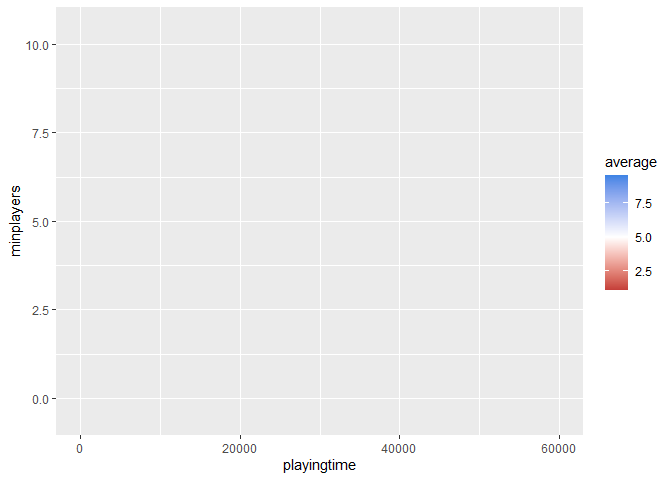<!-- -->

``` r
#turns out there are some games you can play forever? may be a data quality issue - for now let's cut that variable (I do this up the top so it goes into all dataframes)

ggplot(bgames2, aes(timebracket, minplayers)) +
  geom_tile(aes(fill=average),na.rm=TRUE) +
  scale_fill_gradient2(low=mypal[4], mid=mypal[3],high=mypal[5], midpoint=5)
```

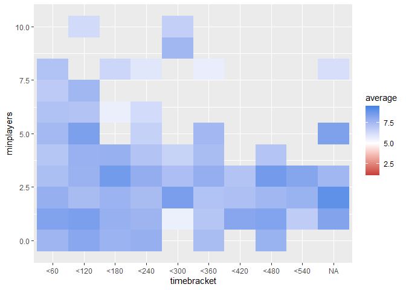<!-- -->

``` r
#why is this not working?
hist(bgames2$average)
```

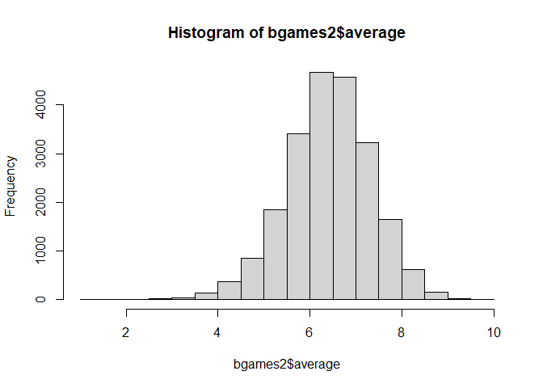<!-- -->

``` r
#data is skewed!

#is bayes average better?
hist(bgames2$bayes_average)
```

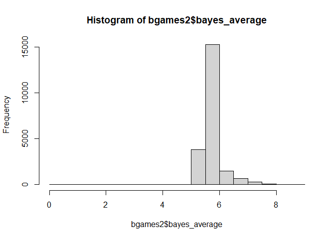<!-- -->

``` r
#no, that's worse.

#standardize the original average (just for this plot)
bgames2$st_average<- (bgames2$average - mean(bgames2$average)) / sd(bgames2$average)

#plot the standardised average
ggplot(bgames2, aes(timebracket, minplayers)) +
  geom_tile(aes(fill=st_average),na.rm=TRUE) +
  scale_fill_gradient2(low=mypal[4], mid=mypal[3],high=mypal[5], midpoint=0)
```

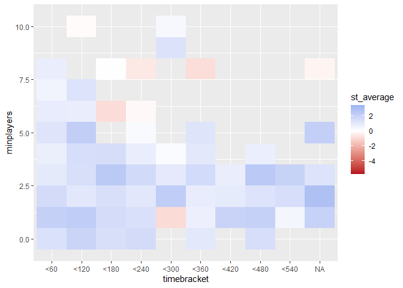<!-- -->

``` r
#or we could just eliminate outliers, and set the midpoint to the median for the data
boxplot(bgames2$average)
```

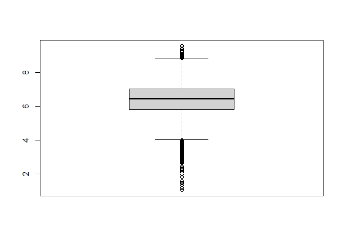<!-- -->

``` r
Q <- quantile(bgames2$average, probs=c(.25, .75), na.rm = FALSE)

iqr <- IQR(bgames2$average)

up <-  Q[2]+1.5*iqr # Upper Range  
low<- Q[1]-1.5*iqr # Lower Range

eliminated<- subset(bgames2, bgames2$average > (Q[1] - 1.5*iqr) & bgames2$average< (Q[2]+1.5*iqr))

g<-ggplot(eliminated, aes(timebracket, minplayers)) +
  geom_tile(aes(fill=average),na.rm=TRUE) +
  scale_fill_gradient2(low=mypal[4], mid=mypal[3],high=mypal[5], midpoint=median(eliminated$average))+
  labs(title="Average User Ratings by Minimum Number of Players and Estimated Play Time", x="Estimated Play Time (Bracketed)", y="Minimum Players")
g
```

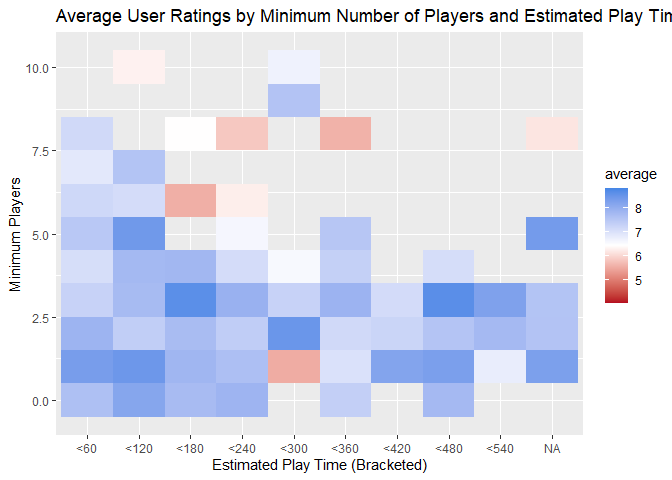<!-- -->

``` r
#this is okay, but not really making use of the colour scale - we can adjust the colour scale to improve (thanks Hayley for reminding me!)

g<-ggplot(eliminated, aes(timebracket, minplayers)) +
  geom_tile(aes(fill=average),na.rm=TRUE) +
  scale_fill_gradient2(low=mypal[4], mid=mypal[3],high=mypal[5], midpoint=7, limits=c(5,9))+
  labs(title="Average User Ratings by Minimum Number of Players and Estimated Play Time", x="Estimated Play Time (Bracketed)", y="Minimum Players")
g
```

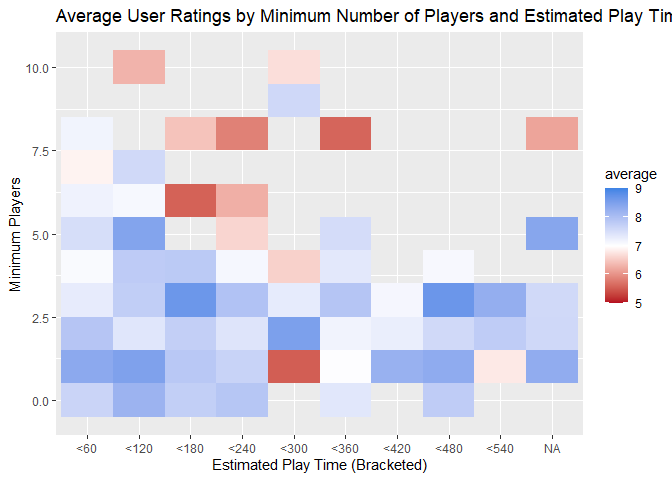<!-- -->

``` r
#finally, since there are gaps in the plot, adjust the theme so the data is more obvious

g<-g +
  theme(panel.grid.major = element_blank(),
  panel.grid.minor = element_blank(),panel.background = element_rect(fill="grey30"))+
  labs(title="Average User Ratings by Minimum Number of Players and Estimated Play Time", x="Estimated Play Time (Bracketed)", y="Minimum Players")
g
```

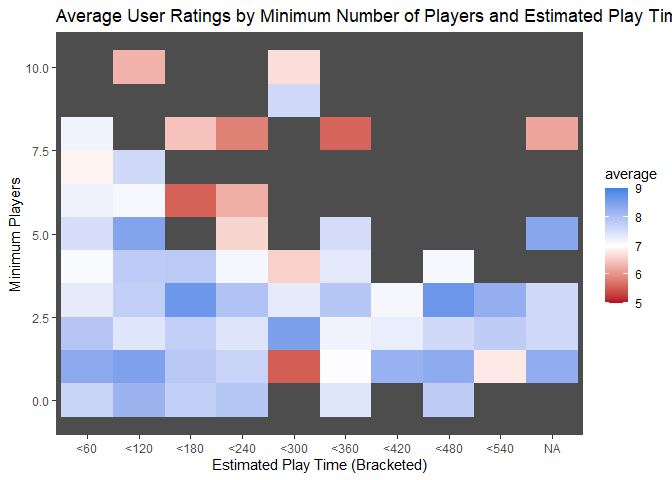<!-- -->

``` r
#just for fun let's make it look like a tabletop

library(ggpubr)
library(jpeg)
# Import the image
img <- readJPEG("background-texture.jpeg")
  
# Plot with background image [must go first]
g<-ggplot(eliminated, aes(timebracket, minplayers)) +
  background_image(img)+
  geom_tile(aes(fill=average),na.rm=TRUE) +
  scale_fill_gradient2(low=mypal[4], mid=mypal[3],high=mypal[5], midpoint=7, limits=c(5,9))+
  labs(title="Average User Ratings by Minimum Number of Players and Estimated Play Time", x="Estimated Play Time (Bracketed)", y="Minimum Players")
g
```

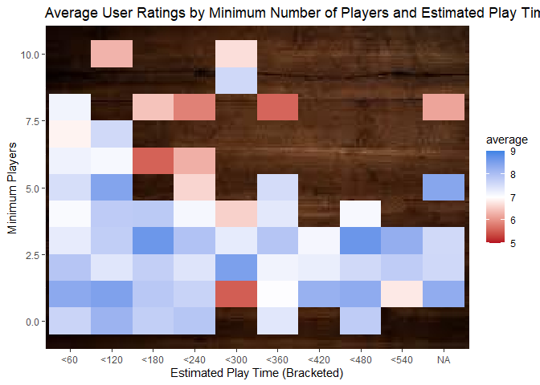<!-- -->

This is interesting, but keep in mind that these ratings are given by
players who are very interested in boardgames generally, who have
already decided to buy or play the game, and then bothered to rate it.
Let’s look at how many users rated each game.

``` r
g<-ggplot(bgames2, aes(timebracket, minplayers)) +
  background_image(img)+
  geom_tile(aes(fill=users_rated),na.rm=TRUE) +
  scale_fill_gradient2(low=mypal[4], mid=mypal[3],high=mypal[5], midpoint=median(bgames2$users_rated))+
labs(title="Number of Users Who Rated",subtitle = "by minimum players and typical play time")
g
```

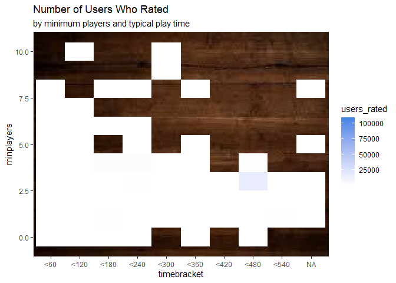<!-- -->

``` r
hist(bgames2$users_rated)
```

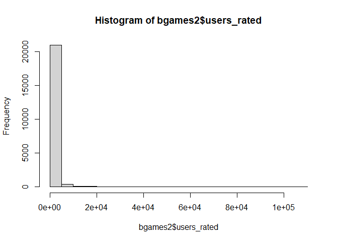<!-- -->

``` r
Q <- quantile(bgames2$users_rated, probs=c(.25, .75), na.rm = FALSE)

iqr <- IQR(bgames2$users_rated)

up <-  Q[2]+1.5*iqr # Upper Range  
low<- Q[1]-1.5*iqr # Lower Range

eliminated<- subset(bgames2, bgames2$users_rated > (Q[1] - 1.5*iqr) & bgames2$users_rated< (Q[2]+1.5*iqr))

hist(eliminated$users_rated)
```

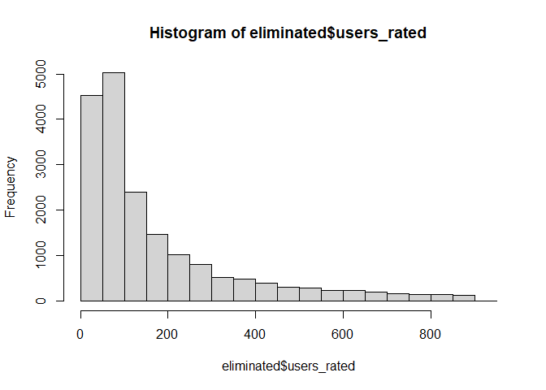<!-- -->

``` r
hist(log(eliminated$users_rated))
```

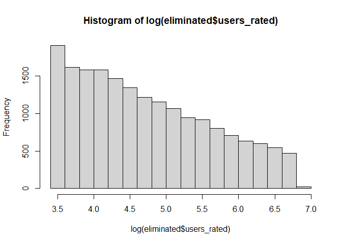<!-- -->

``` r
g<-ggplot(eliminated, aes(timebracket, minplayers)) +
  background_image(img)+
  geom_tile(aes(fill=log(users_rated)),na.rm=TRUE) +
  scale_fill_gradient2(low=mypal[1], mid=mypal[3],high=mypal[2], midpoint=5,  limits=c(3,7))+
labs(title="Number of Users Who Rated",subtitle = "by minimum players and typical play time")
g
```

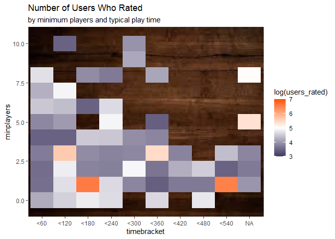<!-- -->
it would be good to look at some categorical variables, but there are
too many categories in each, so let’s take the top 10

``` r
top10<-function(data, variable) {
  top10list<-sort(table(data[[variable]]),decreasing=TRUE)[1:10]
  names(top10list)
  }
  
top10pub<-top10(bgames2,"publisher")
top10cat<-top10(bgames2, "category")
top10mech<-top10(bgames2, "mechanic")
top10art<-top10(bgames2, "artist")
```

\#Publishers by country

``` r
url <-  "https://boardgamegeek.com/wiki/page/Game_Manufacturers"

df <- url %>% 
  read_html() %>% 
  html_nodes("table") %>% 
  html_table(fill = T) %>% 
  lapply(., function(x) setNames(x,c("publisher", "country", "website"))) 

pub_countries <- df[[2]]

pub_countries<-inner_join(bgames2,pub_countries, by="publisher") 

pub_countries$country<-as.factor(pub_countries$country)
pub_countries$country<-droplevels(pub_countries$country)
levels<-levels(pub_countries$country) [1:6]
levels(pub_countries$country)<-c(levels,levels[2],"International")

summary(pub_countries$country)
```

    ##                 France France / United States                Germany 
    ##                    246                     92                   1339 
    ##                  Italy         United Kingdom          United States 
    ##                     56                      9                   1450 
    ##          International 
    ##                      5

``` r
ggplot(pub_countries, aes(country)) +
  geom_bar()+
  labs(title="Total Games Published By Country", subtitle="By Currently Active Publishers", x="Country", y="Games")
```

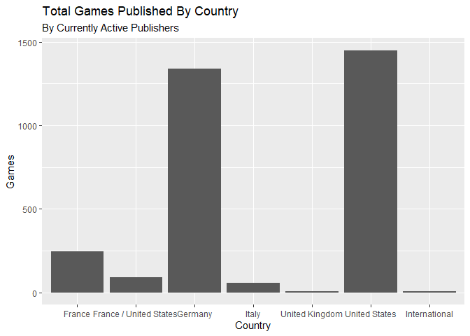<!-- -->
let’s try breaking this down by category

``` r
ggplot(pub_countries[pub_countries$category %in% top10cat,], aes(country, category))+geom_count()
```

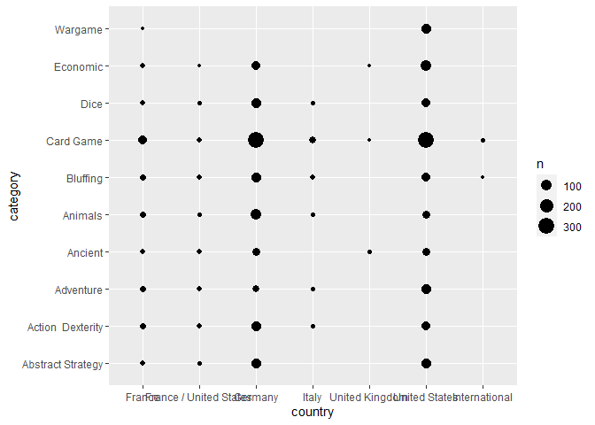<!-- -->
I would like to try to use some fun shapes - unicode should work but
doesn’t (see code commented out), so for now I will use the standard
shapes

``` r
#doesn't work
# ggplot(pub_countries[pub_countries$category %in% top10cat,], aes(country, category, shape=factor(category))) +
#   geom_count()+
#   scale_shape_manual(values = c("\u1F9E0", "\u1F590", "\u26F0", "\u1F3DB", "\u1F43E", "\u1F610", "\u1F0A0", "\u1F3B2", "\u1F4B0", "\u2694"))

ggplot(pub_countries[pub_countries$category %in% top10cat,], aes(country, category, shape=factor(category))) +
  geom_count()+
  scale_shape_manual(values=c(1:10))
```

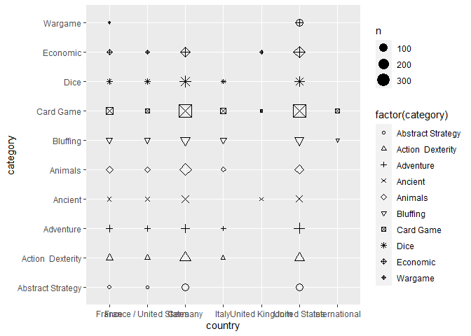<!-- -->
Okay then, just for fun let’s colour it like a Go board - black and
white (by popularity)

``` r
category_ratings<-pub_countries %>%
  group_by(category) %>%
  summarise(mean_rating = mean(average))

pub_countries<-left_join(pub_countries, category_ratings)
```

    ## Joining, by = "category"

``` r
pub_countries<-pub_countries %>%
  mutate(popular=ifelse(mean_rating>mean(mean_rating),"Yes", "No"))

ggplot(pub_countries[pub_countries$category %in% top10cat,], aes(country, category, colour=popular))+ geom_count() +
  scale_colour_manual(values=c("black","white")) +labs(title="Common and Popular Categories by Country")+
  theme(axis.text.x=element_text(angle =90, vjust=.5))
```

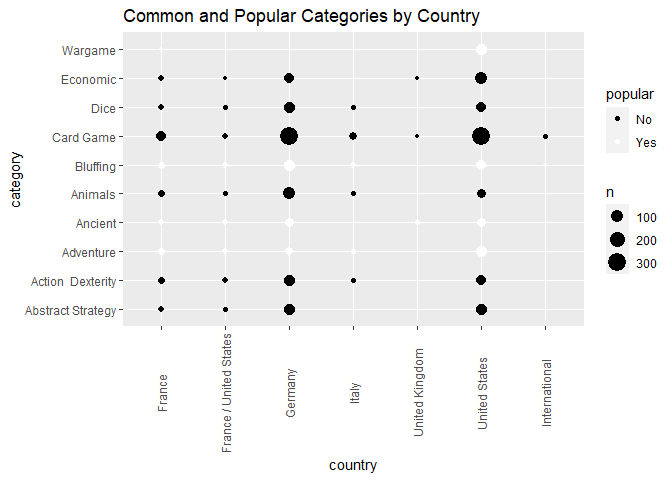<!-- -->

\#Publishing Trends By Year/Country

We only have one timepoint for the boardgame ratings, but because we
have publishing year, we can look at what kinds of games are being
published using a frequency plot (adapted from a plot of word use
frequency on different twitter feeds)

I initially thought there was a data quality problem with the publishing
dates

``` r
boxplot(bgames$yearpublished)
```

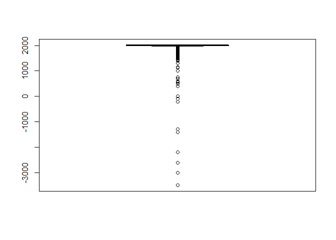<!-- -->
but then I remembered that a few boardgames were invented in Ancient
Egypt and Sumeria, and yep, turns out:

``` r
subset(bgames2,yearpublished<(-2000), select=name)
```

    ##                      name
    ## 164                    Go
    ## 1191 The Royal Game of Ur
    ## 1715           Backgammon
    ## 1717                Senet
    ## 3331              Marbles
    ## 5289         Knucklebones

So I have restricted it to games published after 1980; I’m also using
the dataframe with countries so that I can look at one at a time

``` r
pub_countries$minplayers<-as.factor(pub_countries$minplayers)
minplay_by_time <- subset(pub_countries,yearpublished>1980) %>%
  count(yearpublished, country, minplayers) %>%
  group_by(country, yearpublished) %>%
  mutate(time_total = sum(n)) %>%
  group_by(minplayers) %>%
  mutate(minplayers_total = sum(n)) %>%
  ungroup() %>%
  rename(count = n) %>%
  filter(minplayers_total > 30)

minplay_by_time 
```

    ## # A tibble: 397 x 6
    ##    yearpublished country       minplayers count time_total minplayers_total
    ##            <dbl> <fct>         <fct>      <int>      <int>            <int>
    ##  1          1981 France        2              3          3             2241
    ##  2          1981 Germany       2              2          3             2241
    ##  3          1981 Germany       3              1          3              483
    ##  4          1981 United States 2              4          4             2241
    ##  5          1982 Germany       1              1          2              346
    ##  6          1982 Germany       2              1          2             2241
    ##  7          1982 United States 1              1         10              346
    ##  8          1982 United States 2              9         10             2241
    ##  9          1983 France        2              2          2             2241
    ## 10          1983 Germany       2              2          3             2241
    ## # ... with 387 more rows

``` r
nested_data <- minplay_by_time %>%
  nest(data = c(-minplayers, -country))

nested_data
```

    ## # A tibble: 26 x 3
    ##    country                minplayers data             
    ##    <fct>                  <fct>      <list>           
    ##  1 France                 2          <tibble [30 x 4]>
    ##  2 Germany                2          <tibble [41 x 4]>
    ##  3 Germany                3          <tibble [38 x 4]>
    ##  4 United States          2          <tibble [42 x 4]>
    ##  5 Germany                1          <tibble [25 x 4]>
    ##  6 United States          1          <tibble [35 x 4]>
    ##  7 United States          3          <tibble [30 x 4]>
    ##  8 France                 3          <tibble [23 x 4]>
    ##  9 Germany                4          <tibble [8 x 4]> 
    ## 10 France / United States 3          <tibble [14 x 4]>
    ## # ... with 16 more rows

``` r
library(purrr)

nested_models <- nested_data %>%
  mutate(models = map(data, ~ glm(cbind(count, time_total) ~ yearpublished, ., 
                                  family = "binomial")))
```

``` r
library(broom)

slopes <- nested_models %>%
  mutate(models = map(models, tidy)) %>%
  unnest(cols = c(models)) %>%
  filter(term == "yearpublished") %>%
  mutate(adjusted.p.value = p.adjust(p.value))

slopes
```

    ## # A tibble: 26 x 9
    ##    country     minplayers data     term    estimate std.error statistic  p.value
    ##    <fct>       <fct>      <list>   <chr>      <dbl>     <dbl>     <dbl>    <dbl>
    ##  1 France      2          <tibble~ yearpu~ -8.95e-3   0.0129    -0.691   4.90e-1
    ##  2 Germany     2          <tibble~ yearpu~ -4.82e-4   0.00492   -0.0980  9.22e-1
    ##  3 Germany     3          <tibble~ yearpu~ -3.76e-2   0.00792   -4.74    2.10e-6
    ##  4 United Sta~ 2          <tibble~ yearpu~ -3.55e-3   0.00495   -0.717   4.73e-1
    ##  5 Germany     1          <tibble~ yearpu~  9.48e-2   0.0167     5.67    1.47e-8
    ##  6 United Sta~ 1          <tibble~ yearpu~  2.18e-2   0.0100     2.17    3.00e-2
    ##  7 United Sta~ 3          <tibble~ yearpu~ -2.07e-2   0.0119    -1.74    8.16e-2
    ##  8 France      3          <tibble~ yearpu~ -7.53e-2   0.0246    -3.06    2.23e-3
    ##  9 Germany     4          <tibble~ yearpu~ -5.84e-2   0.0561    -1.04    2.98e-1
    ## 10 France / U~ 3          <tibble~ yearpu~ -7.15e-2   0.0374    -1.91    5.59e-2
    ## # ... with 16 more rows, and 1 more variable: adjusted.p.value <dbl>

``` r
minplay_by_time %>%
  inner_join(slopes, by = c("minplayers", "country")) %>%
  filter(country == "United States") %>%
  ggplot(aes(yearpublished, count/time_total, color = minplayers)) +
  geom_line(size = 1.3) +
  labs(x = NULL, y = "Frequency") +
  labs(title="Publishing Trends over Time",subtitle="Minimum Player Number", x="Year")+
  scale_colour_discrete(name="Minimum Players")
```

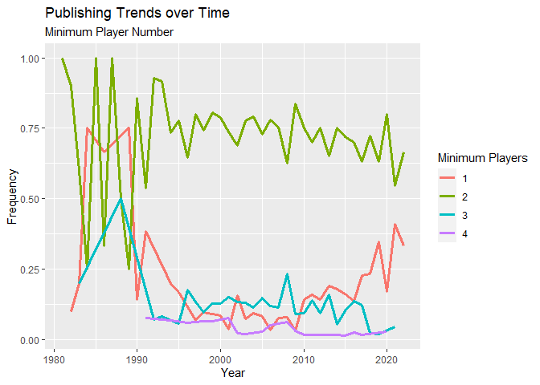<!-- -->

``` r
minplay_by_time <- subset(pub_countries,yearpublished>1980) %>%
  count(yearpublished, country, publisher) %>%
  group_by(country, yearpublished) %>%
  mutate(time_total = sum(n)) %>%
  group_by(publisher) %>%
  mutate(publisher_total = sum(n)) %>%
  ungroup() %>%
  rename(count = n) %>%
  filter(publisher_total > 30)

minplay_by_time 
```

    ## # A tibble: 674 x 6
    ##    yearpublished country       publisher        count time_total publisher_total
    ##            <dbl> <fct>         <chr>            <int>      <int>           <int>
    ##  1          1981 Germany       ABACUSSPIELE         2          3             137
    ##  2          1981 Germany       Ravensburger         1          3             263
    ##  3          1981 United States Mayfair Games        2          4              96
    ##  4          1981 United States Steve Jackson G~     2          4              56
    ##  5          1982 Germany       AMIGO                1          2             247
    ##  6          1982 Germany       Ravensburger         1          2             263
    ##  7          1982 United States Hasbro               3         10             375
    ##  8          1982 United States Mayfair Games        5         10              96
    ##  9          1982 United States Steve Jackson G~     2         10              56
    ## 10          1983 Germany       AMIGO                1          3             247
    ## # ... with 664 more rows

``` r
nested_data <- minplay_by_time %>%
  nest(data = c(-publisher, -country))

nested_data
```

    ## # A tibble: 26 x 3
    ##    country       publisher           data             
    ##    <fct>         <chr>               <list>           
    ##  1 Germany       ABACUSSPIELE        <tibble [33 x 4]>
    ##  2 Germany       Ravensburger        <tibble [39 x 4]>
    ##  3 United States Mayfair Games       <tibble [29 x 4]>
    ##  4 United States Steve Jackson Games <tibble [26 x 4]>
    ##  5 Germany       AMIGO               <tibble [39 x 4]>
    ##  6 United States Hasbro              <tibble [38 x 4]>
    ##  7 Germany       Hans im Glück       <tibble [34 x 4]>
    ##  8 Germany       Queen Games         <tibble [31 x 4]>
    ##  9 Germany       Schmidt Spiele      <tibble [27 x 4]>
    ## 10 Germany       KOSMOS              <tibble [33 x 4]>
    ## # ... with 16 more rows

``` r
library(purrr)

nested_models <- nested_data %>%
  mutate(models = map(data, ~ glm(cbind(count, time_total) ~ yearpublished, ., 
                                  family = "binomial")))
```

``` r
library(broom)

slopes <- nested_models %>%
  mutate(models = map(models, tidy)) %>%
  unnest(cols = c(models)) %>%
  filter(term == "yearpublished") %>%
  mutate(adjusted.p.value = p.adjust(p.value))

slopes
```

    ## # A tibble: 26 x 9
    ##    country       publisher   data    term   estimate std.error statistic p.value
    ##    <fct>         <chr>       <list>  <chr>     <dbl>     <dbl>     <dbl>   <dbl>
    ##  1 Germany       ABACUSSPIE~ <tibbl~ yearp~ -3.72e-2   0.0109    -3.42   6.37e-4
    ##  2 Germany       Ravensburg~ <tibbl~ yearp~ -6.98e-4   0.00769   -0.0908 9.28e-1
    ##  3 United States Mayfair Ga~ <tibbl~ yearp~ -6.58e-2   0.0120    -5.51   3.59e-8
    ##  4 United States Steve Jack~ <tibbl~ yearp~ -6.56e-2   0.0146    -4.48   7.38e-6
    ##  5 Germany       AMIGO       <tibbl~ yearp~ -2.69e-2   0.00784   -3.43   6.00e-4
    ##  6 United States Hasbro      <tibbl~ yearp~ -3.08e-2   0.00728   -4.24   2.26e-5
    ##  7 Germany       Hans im Gl~ <tibbl~ yearp~ -3.81e-2   0.0136    -2.81   4.93e-3
    ##  8 Germany       Queen Games <tibbl~ yearp~  3.38e-3   0.0125     0.271  7.86e-1
    ##  9 Germany       Schmidt Sp~ <tibbl~ yearp~  2.25e-2   0.0150     1.50   1.33e-1
    ## 10 Germany       KOSMOS      <tibbl~ yearp~  3.23e-2   0.00912    3.54   3.98e-4
    ## # ... with 16 more rows, and 1 more variable: adjusted.p.value <dbl>

``` r
minplay_by_time %>%
  inner_join(slopes, by = c("publisher", "country")) %>%
  filter(country == "United States") %>%
  ggplot(aes(yearpublished, count/time_total, color = publisher)) +
  geom_line(size = 1.3) +
  labs(x = NULL, y = "Frequency") +
  labs(title="Publisher Output over Time",subtitle="United States", x="Year")+
  scale_colour_discrete(name="Publisher")
```

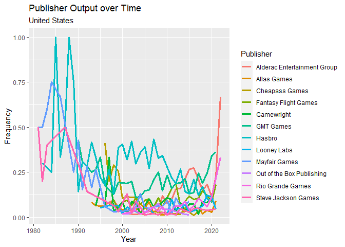<!-- -->

``` r
minplay_by_time %>%
  inner_join(slopes, by = c("publisher", "country")) %>%
  filter(country == "Germany") %>%
  ggplot(aes(yearpublished, count/time_total, color = publisher)) +
  geom_line(size = 1.3) +
  labs(x = NULL, y = "Frequency")+
  labs(title="Publisher Output over Time",subtitle="Germany", x="Year")+
  scale_colour_discrete(name="Publisher")
```

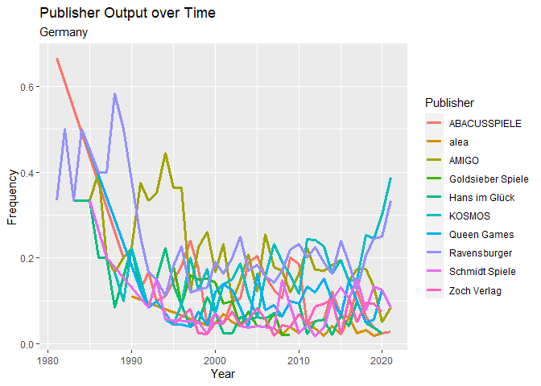<!-- -->
