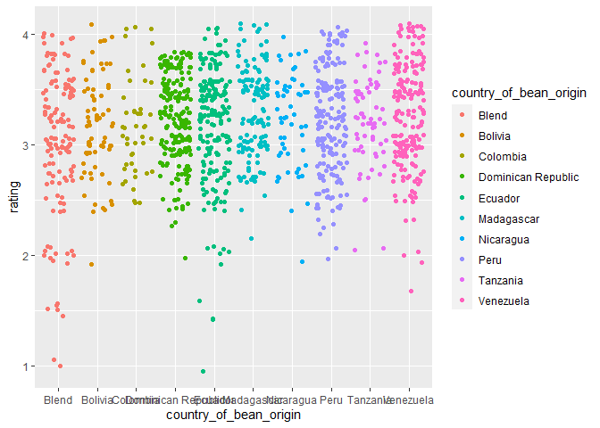
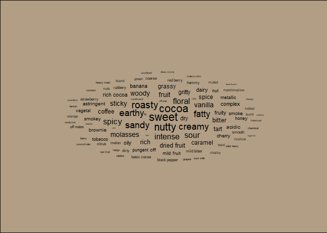

TT\_Chocolate
================
Annaliese Anesbury
01/03/2022

## About the Dataset

ref - reference ID, the highest REF numbers were the last entries were
made (not really relevant so excluded).

company manufacturer - manufacturer name (excluding as it doesn’t
provide much value in the scope of what is being explored).

company\_location - manufacturer region, might include to see where most
companies are located and if that corresponds with ratings

review\_date - year, (might include to see how reviews change across
time)

country\_of\_bean\_origin - country of origin (definitely include for
comparing characteristics, ingredients, ratings, cocoa percent)

specific\_bean\_origin\_or\_bar\_name - specific bean or bar name, (hard
to distinguish which is the bean which is the bar name, didn’t want to
mess around with trying to seperate them)

cocoa\_percent - cocoa percent, % chocolate. (include to see how it
varies across country bean origin or company location, ingredients,
rating and most\_memorable characteristics)

ingredients - \# represents the number of ingredients in the chocolate;
B = Beans, S = sugar, S\* sweetener other than white cane or beet sugar,
C = Cocoa Butter, V = Vanilla, L = Lecithin, Sa= Salt

most\_memorable\_characteristics - summary review of the most memorable
characteristics of that bar, terms generally relate to anything from
texture, flavor, overall opinion, etc. - use to compare the most popular

rating - rating between 1-5 -will also use.

\#creating data set

``` r
choc <- chocolate %>% 
  select(company_location, country_of_bean_origin, cocoa_percent, ingredients, most_memorable_characteristics, rating)
```

\#The top origins for sourcing beans

``` r
choc %>%
  count(country_of_bean_origin)%>%
  arrange(desc(n))
```

    ## # A tibble: 62 x 2
    ##    country_of_bean_origin     n
    ##    <chr>                  <int>
    ##  1 Venezuela                253
    ##  2 Peru                     244
    ##  3 Dominican Republic       226
    ##  4 Ecuador                  219
    ##  5 Madagascar               177
    ##  6 Blend                    156
    ##  7 Nicaragua                100
    ##  8 Bolivia                   80
    ##  9 Colombia                  79
    ## 10 Tanzania                  79
    ## # ... with 52 more rows

Venezuela, Peru, Dominican Republic, Ecuador and Madagascar were the top
5 origins for beans.

\#Company Location

``` r
choc %>%
  count(company_location)%>%
  arrange(desc(n))
```

    ## # A tibble: 67 x 2
    ##    company_location     n
    ##    <chr>            <int>
    ##  1 U.S.A.            1136
    ##  2 Canada             177
    ##  3 France             176
    ##  4 U.K.               133
    ##  5 Italy               78
    ##  6 Belgium             63
    ##  7 Ecuador             58
    ##  8 Australia           53
    ##  9 Switzerland         44
    ## 10 Germany             42
    ## # ... with 57 more rows

USA, Canada, France, U.K. and Italy were the top 5 countries of company
location.

\#Refining data set to only include top 5 country of bean origin and
company location.

``` r
top_5 <- choc %>%
  filter(country_of_bean_origin == "Venezuela"|
           country_of_bean_origin == "Peru" |
           country_of_bean_origin == "Dominican Republic" |           
           country_of_bean_origin =="Ecuador"|
           country_of_bean_origin == "Madagascar") %>%
  filter(company_location == "U.S.A." | 
           company_location == "Canada" |
           company_location == "France" |
           company_location == "U.K." | 
           company_location == "Italy") %>% 
  select(country_of_bean_origin, most_memorable_characteristics, rating, cocoa_percent, ingredients, company_location)
```

\#First Plot to see ratings across different bean origins.

``` r
top_5 %>%
  ggplot(aes(x = country_of_bean_origin, y = rating, colour = country_of_bean_origin))+
  geom_jitter()
```

<!-- -->
That is pretty similar, Dominican Republic and Equador are more closely
clustered whereas Peru and Venezuela vary across all rating a little
more.  
Top 5 potentially to limited. Extend to 10.

\#Creating Top 10 Dataset

``` r
top10 <- choc %>%
  filter(country_of_bean_origin == "Venezuela"| country_of_bean_origin == "Peru" | country_of_bean_origin == "Dominican Republic" | country_of_bean_origin =="Ecuador"| country_of_bean_origin == "Madagascar" | country_of_bean_origin == "Blend" | country_of_bean_origin == "Nicaragua" |country_of_bean_origin == "Bolivia" | country_of_bean_origin == "Colombia" |country_of_bean_origin == "Tanzania") %>%
  filter(company_location == "U.S.A." | 
           company_location == "Canada" |
           company_location == "France" |
           company_location == "U.K." | 
           company_location == "Italy" |
           company_location == "Belgium" |
           company_location == "Ecuador" |
           company_location == "Australia" |
          company_location == "Switzerland" |
           company_location == "Germany") %>% 
  select(country_of_bean_origin, most_memorable_characteristics, rating, cocoa_percent, ingredients, company_location)
```

\#Plot with 10 to see any variation ratings for bean origin

``` r
top10 %>%
  ggplot(aes(x = country_of_bean_origin, y = rating, colour = country_of_bean_origin))+
  geom_jitter()
```

<!-- -->

Using the top 10 data set I wanted to see where cocoa beans are sent to
(in terms of company location) and where they are orignated from.

\#Alluvium plot showing connection between bean origin and company
location with Top 10 dataset

``` r
counts <- top10%>%
count(country_of_bean_origin)

with_count <- left_join(top10, counts, by = "country_of_bean_origin")

with_count %>%
ggplot(aes(axis1 = country_of_bean_origin,
           axis2 = company_location,
           y = n)) +
  geom_alluvium(aes(fill = country_of_bean_origin)) +
  geom_stratum() +
  geom_text(stat = "stratum",
            aes(label = after_stat(stratum))) +
  scale_x_discrete(limits = c("Country of Bean origin", "Company Location"),
                   expand = c(0.15, 0.05)) +
  theme_void()
```

    ## Warning in to_lodes_form(data = data, axes = axis_ind, discern =
    ## params$discern): Some strata appear at multiple axes.

    ## Warning in to_lodes_form(data = data, axes = axis_ind, discern =
    ## params$discern): Some strata appear at multiple axes.

    ## Warning in to_lodes_form(data = data, axes = axis_ind, discern =
    ## params$discern): Some strata appear at multiple axes.

<!-- -->
Whilst this is pretty it is slightly chaotic. Going to go back and use
the Top\_5 data set.

\#Alluvium plot showing connection between bean origin and company
location with Top 5 dataset

``` r
counts <- top_5%>%
count(country_of_bean_origin)

with_count <- left_join(top_5, counts, by = "country_of_bean_origin")

with_count %>%
ggplot(aes(axis1 = country_of_bean_origin,
           axis2 = company_location,
           y = n)) +
  geom_alluvium(aes(fill = country_of_bean_origin)) +
  geom_stratum() +
  geom_text(stat = "stratum",
            aes(label = after_stat(stratum))) +
  scale_x_discrete(limits = c("Country of Bean origin", "Company Location"),
                   expand = c(0.15, 0.05)) +
  theme_void()
```

<!-- -->
Mainly just shows that USA receives a variety of the top 5 bean origin
but mainly from Dominican Republic, which is interesting since it is no.
3 on the top 5 bean origin providers with Venezuela being first. So
Venezuela origin splits their share of beans between other countries
even though USA still uses approx 50%.

I wanted to just experiment with how this plot may interplay with
ratings so I included another axis to include ratings.

\#Alluvium Plot with ratings against company location against country of
bean origin

``` r
counts <- top_5%>%
count(country_of_bean_origin)

with_count <- left_join(top_5, counts, by = "country_of_bean_origin")

with_count %>%
ggplot(aes(axis1 = country_of_bean_origin,
           axis2 = company_location,
           axis3 = rating,
           y = n)) +
  geom_alluvium(aes(fill = country_of_bean_origin)) +
  geom_stratum() +
  geom_text(stat = "stratum",
            aes(label = after_stat(stratum))) +
  scale_x_discrete(limits = c("Country of Bean origin", "Company Location"),
                   expand = c(0.15, 0.05)) +
  theme_void()
```

<!-- -->
I think this is super pretty so I kept it for aesthetic purposes but it
is not informative. I did go on to look at ratings against country of
bean origin but i think i exhausted the use of the pretty plot because
it returned nothing that was informative.

I then moved on to trying to create some word clouds to see how
chocolate and different types were described.

\#creating word dataset

``` r
characteristics <- top_5 %>%
  select(most_memorable_characteristics)
#extracting the words to get them to show individually in rows as opposed to listed. 
tidy_characteristic <- characteristics %>%
  unnest_tokens("word", most_memorable_characteristics)

tidy_characteristic
```

    ## # A tibble: 2,587 x 1
    ##    word      
    ##    <chr>     
    ##  1 cocoa     
    ##  2 vegetal   
    ##  3 savory    
    ##  4 cocoa     
    ##  5 blackberry
    ##  6 full      
    ##  7 body      
    ##  8 fatty     
    ##  9 earthy    
    ## 10 moss      
    ## # ... with 2,577 more rows

``` r
#creating a count for amount of times a characteristic was mentioned
clean_characteristic <- tidy_characteristic %>%
  anti_join(get_stopwords())
```

    ## Joining, by = "word"

``` r
clean_characteristic %>%
  count(word, sort = TRUE)
```

    ## # A tibble: 312 x 2
    ##    word        n
    ##    <chr>   <int>
    ##  1 cocoa     119
    ##  2 nutty      97
    ##  3 fruit      96
    ##  4 sweet      79
    ##  5 floral     76
    ##  6 sour       75
    ##  7 earthy     71
    ##  8 roasty     70
    ##  9 intense    68
    ## 10 mild       68
    ## # ... with 302 more rows

\#intial word cloud

``` r
clean_characteristic %>%
  count(word)%>%
  with(wordcloud(word, n, max.words = 150))
```

<!-- -->

This gave an overall look at the most used words to describe the
characteristics of chocolate. Top words being, nutty, fruit, intense,
floral, sour, creamy, eathy and sweet. Some odd ones I thought were
soapy, hay, chemical, chalky hammy?, leather.

Then for fun just tried a word cloud that looked a little different -
kind of like a bean almost.

``` r
#making percentage cocoa a number
chocolate_type <- chocolate %>%
  mutate(cocoa_percent = parse_number(cocoa_percent)) 

#split the memorable characteristics into individual phrases and make a long data frame (1 line per characteristic)
chocolate_long <- chocolate_type %>%
  mutate(most_memorable_characteristics = str_split(most_memorable_characteristics, pattern = ", ")) %>%
  unnest(everything()) %>%
  mutate(most_memorable_characteristics = str_split(most_memorable_characteristics, pattern = ",")) %>% # repeat because sometimes no space 
  unnest(everything())

# count number of times a phrase is used
chocolate_sum <- chocolate_long %>%
  group_by(most_memorable_characteristics) %>%
  count() %>%
  arrange(desc(n))

# word cloud
p1 <- ggplot(chocolate_sum[1:100,], aes(label = most_memorable_characteristics, size = n)) +
  geom_text_wordcloud() +
  theme_minimal() +
  theme(plot.background = element_rect(fill = "#B19E85"))

p1
```

    ## Warning in png(filename = tmp_file, width = gw_pix, height = gh_pix, res =
    ## dev_dpi, : 'width=16, height=16' are unlikely values in pixels

    ## Warning in png(filename = tmp_file, width = gw_pix, height = gh_pix, res =
    ## dev_dpi, : 'width=8, height=16' are unlikely values in pixels

    ## Warning in png(filename = tmp_file, width = gw_pix, height = gh_pix, res =
    ## dev_dpi, : 'width=12, height=12' are unlikely values in pixels

    ## Warning in png(filename = tmp_file, width = gw_pix, height = gh_pix, res =
    ## dev_dpi, : 'width=12, height=12' are unlikely values in pixels

    ## Warning in png(filename = tmp_file, width = gw_pix, height = gh_pix, res =
    ## dev_dpi, : 'width=12, height=12' are unlikely values in pixels

<!-- -->

I wanted to go further with a word cloud by splitting up into either
ratings or cocoa percentage but wasn’t sure how to go about it. I
consulted Twitter for a bit of inspo and saw a word cloud segmented by
cocoa percentage by Jacob Bellmund so I adapted his code.

\#Word Cloud against cocoa percentage.

``` r
# count number of times a phrase is used
chocolate_sum <- chocolate_long %>%
  mutate(cocoa_group = case_when(cocoa_percent<60 ~ "<60% cocoa",
                                 cocoa_percent>59 & cocoa_percent <= 75 ~ "60-75% cocoa",
                                 cocoa_percent>75 & cocoa_percent <= 90 ~ "76-90% cocoa",
                                 cocoa_percent>90 ~ ">90% cocoa"),
         cocoa_group = factor(cocoa_group, levels = c("<60% cocoa",
                                                      "60-75% cocoa",
                                                      "76-90% cocoa",
                                                      ">90% cocoa"))) %>%
group_by(cocoa_group, most_memorable_characteristics) %>%
  count() %>%
  ungroup() %>%
  group_by(cocoa_group) %>%
  mutate(prop = n/sum(n),
         n_group = n()) %>% 
  slice_max(order_by = n, n = 20, with_ties = FALSE)

#plot
p2 <- list()
for (i in 1:length(levels(chocolate_sum$cocoa_group)))
{
  i_level <- levels(chocolate_sum$cocoa_group)[i]

  p2[[i]] <- ggplot(chocolate_sum %>% filter(cocoa_group == i_level),
                    aes(label = most_memorable_characteristics, 
                        size = prop)) +
    geom_text_wordcloud() +
    facet_wrap(~cocoa_group, nrow = 1, strip.position = "bottom") +
    theme_minimal() +
    theme(plot.background = element_rect(fill = "#B19E85"))
    print(p2[[i]])
}
```

    ## Warning in png(filename = tmp_file, width = gw_pix, height = gh_pix, res =
    ## dev_dpi, : 'width=16, height=12' are unlikely values in pixels

    ## Warning in png(filename = tmp_file, width = gw_pix, height = gh_pix, res =
    ## dev_dpi, : 'width=12, height=12' are unlikely values in pixels

<!-- -->

    ## Warning in png(filename = tmp_file, width = gw_pix, height = gh_pix, res =
    ## dev_dpi, : 'width=12, height=12' are unlikely values in pixels

    ## Warning in png(filename = tmp_file, width = gw_pix, height = gh_pix, res =
    ## dev_dpi, : 'width=12, height=12' are unlikely values in pixels

<!-- -->

    ## Warning in png(filename = tmp_file, width = gw_pix, height = gh_pix, res =
    ## dev_dpi, : 'width=12, height=12' are unlikely values in pixels

    ## Warning in png(filename = tmp_file, width = gw_pix, height = gh_pix, res =
    ## dev_dpi, : 'width=16, height=12' are unlikely values in pixels

<!-- -->

    ## Warning in png(filename = tmp_file, width = gw_pix, height = gh_pix, res =
    ## dev_dpi, : 'width=12, height=12' are unlikely values in pixels

    ## Warning in png(filename = tmp_file, width = gw_pix, height = gh_pix, res =
    ## dev_dpi, : 'width=12, height=12' are unlikely values in pixels

    ## Warning in png(filename = tmp_file, width = gw_pix, height = gh_pix, res =
    ## dev_dpi, : 'width=12, height=12' are unlikely values in pixels

    ## Warning in png(filename = tmp_file, width = gw_pix, height = gh_pix, res =
    ## dev_dpi, : 'width=16, height=12' are unlikely values in pixels

    ## Warning in png(filename = tmp_file, width = gw_pix, height = gh_pix, res =
    ## dev_dpi, : 'width=12, height=12' are unlikely values in pixels

    ## Warning in png(filename = tmp_file, width = gw_pix, height = gh_pix, res =
    ## dev_dpi, : 'width=16, height=12' are unlikely values in pixels

    ## Warning in png(filename = tmp_file, width = gw_pix, height = gh_pix, res =
    ## dev_dpi, : 'width=12, height=12' are unlikely values in pixels

<!-- -->

``` r
#code adapted from Jacob Bellmund
```

I was going to continue with characteristic analysis by doing a
sentiment analysis but then considered that chocolate preference is
subjective so what someone deems as great another could not. Another way
to look at this could be to compare what the ratings suggest is more
favourable against characteristics. Wasn’t entirely sure how to go about
this so I instead looked at cocoa percentage and ratings against country
of bean origin.

\#Plot of Cocoa Percentage against ratings across country of bean
origin.

``` r
choc %>%
  mutate(cocoa_percent = as.numeric(sub("%", "", cocoa_percent))) %>%
  with_groups(country_of_bean_origin, filter, n() > 40) %>%
  ggplot(aes(x = cocoa_percent, y = rating)) +
  geom_point() +
  theme_classic()+
  facet_wrap(~country_of_bean_origin) +
  geom_smooth() +
  xlab("Cocoa percent (% chocolate)") +
  ylab("Rating between 1-5") 
```

    ## `geom_smooth()` using method = 'loess' and formula 'y ~ x'

<!-- -->
around the 70% mark of cocoa seems to be the sweet spot.

As a last little exploration of ratings and what may influence a
chocolates rating I looked at if the number of ingredients influences
ratings.

``` r
#making dataset to tidy up the ingredients column as it contained the number plus letters indicating what ingredients were used. I just wanted to use the number in this instance. 
adapt_chocolate <- chocolate %>% 
  mutate(
    cocoa_percent = cocoa_percent %>% 
      str_sub(end = -2L) %>% 
      as.numeric()
  ) %>% 
  separate(ingredients, 
           into = c("n_ingredients", "ingredients"),
           sep = "-") %>% 
  mutate(n_ingredients = as.numeric(n_ingredients)) %>% # max is 6
  mutate(ingredients = str_trim(ingredients))


#Wanted to look at different summaries (total, mean, standard deviation) and plot these.
summarize_rating <- function(df) {
  df %>% 
    summarize(
    n = n(),
    avg_rating = mean(rating),
    median_rating = median(rating))}
```

\#Bar Graph showing count of how many ingredients were used and which is
most common.

``` r
#bar graph showing the count of how many ingredients were used. 
adapt_chocolate %>% 
  ggplot(aes(factor(n_ingredients), fill = n_ingredients)) +
  geom_bar()+
  labs(
    title = "Count of Ingredients",
    x = "No. of Ingredients",
    y = "Count"
  )
```

<!-- -->
Most common to use 2-3 ingredients.

\#Boxplot Across No of ingredients and ratings.

``` r
#Boxplot
adapt_chocolate %>% 
  ggplot(aes(factor(n_ingredients), rating)) +
  geom_boxplot()+
  theme_bw()+
  labs(
    title = "Boxplot of No. of Ingredients against Ratings", 
    x = "No. of Ingredients",
    y = "Rating"
  )
```

<!-- -->
2 and 3 ingredients seem to be the better no of ingredients to use for
better ratings. I wanted to see the actual numbers of this so I created
a table.

\#Table showing no. of ingredient totals, avg rating & Median

``` r
#table showing rating by number of ingredients and how many occurences of the number of ingredients there were, the average rating and median rating.
adapt_chocolate %>% 
  group_by(n_ingredients) %>% 
  summarize_rating()
```

    ## # A tibble: 7 x 4
    ##   n_ingredients     n avg_rating median_rating
    ##           <dbl> <int>      <dbl>         <dbl>
    ## 1             1     6       2.96          3   
    ## 2             2   750       3.22          3.25
    ## 3             3  1023       3.27          3.25
    ## 4             4   469       3.13          3   
    ## 5             5   191       3.08          3   
    ## 6             6     4       2.94          2.75
    ## 7            NA    87       2.81          3

Would be interesting to see the most commonly used ingredients which
warrants using 2-3 ingredients. which 2 or 3 ingredients are the best to
use?
