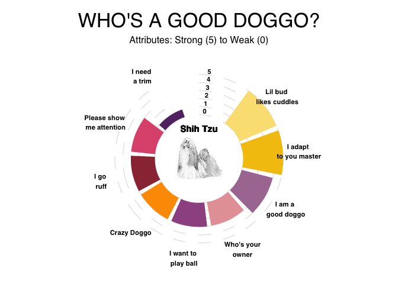
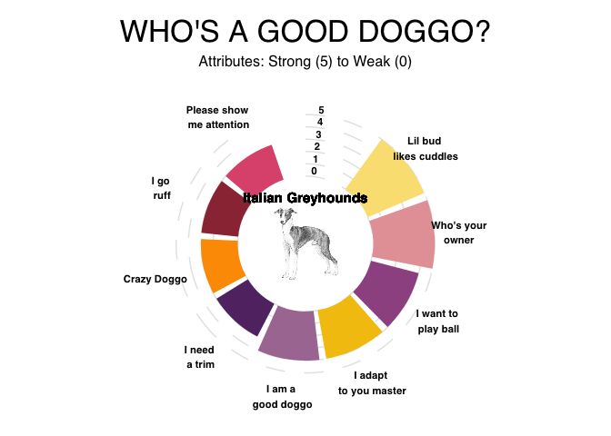
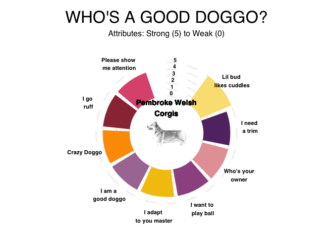

Week5\_TidyTues\_GC
================
Gloria Cricelli
17/03/2022

``` r
#install.packages("shiny")
#install.packages("tidyverse")
#install.packages("janitor")
#install.packages("showtext")
#install.packages("ggimage")
#install.packages("cowplot")
#install.packages("ggplot2")
#install.packages("sysfonts")
#install.packages("showtextdb") 
```

``` r
library(tidyverse)
```

    ## ── Attaching packages ─────────────────────────────────────── tidyverse 1.3.1 ──

    ## ✓ ggplot2 3.3.5     ✓ purrr   0.3.4
    ## ✓ tibble  3.1.1     ✓ dplyr   1.0.5
    ## ✓ tidyr   1.1.3     ✓ stringr 1.4.0
    ## ✓ readr   2.1.1     ✓ forcats 0.5.1

    ## ── Conflicts ────────────────────────────────────────── tidyverse_conflicts() ──
    ## x dplyr::filter() masks stats::filter()
    ## x dplyr::lag()    masks stats::lag()

``` r
library(janitor)
```

    ## 
    ## Attaching package: 'janitor'

    ## The following objects are masked from 'package:stats':
    ## 
    ##     chisq.test, fisher.test

``` r
library(showtext)
```

    ## Loading required package: sysfonts

    ## Loading required package: showtextdb

``` r
library(ggimage)
library(ggplot2)
library(cowplot)
```

    ## 
    ## Attaching package: 'cowplot'

    ## The following object is masked from 'package:ggimage':
    ## 
    ##     theme_nothing

``` r
# import data for project

# for traits
breed_traits_raw      <- readr::read_csv('https://raw.githubusercontent.com/rfordatascience/tidytuesday/master/data/2022/2022-02-01/breed_traits.csv')
```

    ## Rows: 195 Columns: 17

    ## ── Column specification ────────────────────────────────────────────────────────
    ## Delimiter: ","
    ## chr  (3): Breed, Coat Type, Coat Length
    ## dbl (14): Affectionate With Family, Good With Young Children, Good With Othe...

    ## 
    ## ℹ Use `spec()` to retrieve the full column specification for this data.
    ## ℹ Specify the column types or set `show_col_types = FALSE` to quiet this message.

``` r
# for images
breed_rank_all_raw    <- readr::read_csv('https://raw.githubusercontent.com/rfordatascience/tidytuesday/master/data/2022/2022-02-01/breed_rank.csv')
```

    ## Rows: 195 Columns: 11

    ## ── Column specification ────────────────────────────────────────────────────────
    ## Delimiter: ","
    ## chr (3): Breed, links, Image
    ## dbl (8): 2013 Rank, 2014 Rank, 2015 Rank, 2016 Rank, 2017 Rank, 2018 Rank, 2...

    ## 
    ## ℹ Use `spec()` to retrieve the full column specification for this data.
    ## ℹ Specify the column types or set `show_col_types = FALSE` to quiet this message.

``` r
#clean the imported data 

#for the first section we want to clean the dogs rank data 
#the data ranges from rankings from 2013-2020. This ranking coverts it into long columns, ranks by breed, year and rank for that year
dogs_rank_long <- 
  breed_rank_all_raw %>%
  pivot_longer(cols = c(`2013 Rank`:`2020 Rank`), names_to = "year", values_to = "rank") %>%
  mutate(year = as.numeric(str_remove(year, " Rank"))) %>%
  select(Breed, year, rank, everything()) %>%
  janitor::clean_names() %>%
  mutate(breed = str_squish(breed))

#for the second section we want to analyse, we must go through the data and clean the dogs traits 
#transformed the data into columns categorized by breed, trait and the value of trait (in ranking with the data)
# wanted to look at the traits of Affectionate With Family` : `Mental Stimulation Needs. There were a few that I decided to cut from the data, you can observe this from the select. 

dogs_trait_long <-
  breed_traits_raw %>%
  select(-`Coat Type`, -`Coat Length`, - `Good With Young Children`, - `Good With Other Dogs`, - `Watchdog/Protective Nature`, - `Coat Grooming Frequency`, - `Drooling Level`) %>%
  pivot_longer(cols = c(`Affectionate With Family` : `Mental Stimulation Needs`), names_to = "attribute", values_to = "value") %>%
  janitor::clean_names() %>%
  mutate(breed = str_squish(breed))
```

``` r
#here we are looking to transform the data and combining the clean data sets into a new data set called top_dogs. This included joining the dog ranking and dog trait data set. 
#we also want to filter for 2020 
top_dogs <-
  dogs_rank_long %>%
  left_join(dogs_trait_long) %>%
  filter(year == 2020) %>%
  mutate(breed = as_factor(breed)) %>%
  group_by(attribute) %>%
    mutate(attribute = case_when(attribute == "Affectionate With Family"   ~ "Lil bud \nlikes cuddles", 
                                 attribute == "Openness To Strangers"      ~ "Who's your\nowner",
                                 attribute == "Mental Stimulation Needs"   ~ "Please show \nme attention",
                                 attribute == "Playfulness Level"          ~ "I want to \nplay ball",
                                 attribute == "Adaptability Level"         ~ "I adapt \nto you master",
                                 attribute == "Trainability Level"         ~ "I am a \ngood doggo",
                                 attribute == "Energy Level"               ~ "Crazy Doggo",
                                 attribute == "Barking Level"              ~ "I go \nruff",
                                 attribute == "Shedding Level"             ~ "I need \na trim",
                                 
                                   TRUE ~ attribute)) %>%
mutate(attribute = factor(attribute)) %>%
  ungroup() %>%
  group_by(breed) %>%
    arrange(desc(value)) %>%
    mutate(id = row_number()) %>% #adding I=id numbers and filling the attributes in the case where the trait occurs in the data
  ungroup() %>% 
  mutate(fill = case_when(attribute == "Lil bud \nlikes cuddles"   ~  "#fbe183",
                          attribute == "Who's your\nowner"       ~  "#e6a2a6",
                          attribute == "I want to \nplay ball"    ~  "#9f5691",
                          attribute == "I adapt \nto you master"   ~  "#f4c40f",
                          attribute == "I am a \ngood doggo"   ~  "#aa7aa1",
                          attribute == "Crazy Doggo"         ~  "#fe9b00",
                          attribute == "Please show \nme attention"    ~  "#de597c",
                          attribute == "I go \nruff"        ~  "#9b3441",
                          attribute == "I need \na trim"       ~  "#633372", 
                          attribute == "Please show \nme attention"       ~  "#1f6e9c"))
```

    ## Joining, by = "breed"

``` r
# Adding Google fonts for plotting the breeds 

library(showtext)
library(sysfonts)

font_add_google("Oswald")
font_add_google("Amatic SC")
font_add_google("Abel")
```

``` r
# Code adapted from @NearandDistant twitter 

#plotting the details 

library(cowplot)

for(i in levels(top_dogs$breed)) 
  
  breed_i <- "Australian Shepherds"
AustralianShepherd <- ggdraw(
top_dogs %>%
  filter(breed == breed_i) %>%
  ggplot() +
  geom_segment( data = data.frame(y=seq(0,5,1)), aes(x = -0.5, xend = 9, y=y, yend=y), linetype = "ff", color = "grey90") +
  geom_text(data = data.frame(y=seq(0,5,1)), aes(x = -0.3 , y = y + 0.5, label = y), family = "sans", size = 3, fontface = "bold") + 
  geom_col(aes(id, value, fill = fill), show.legend = FALSE) +
  ggimage::geom_image(aes(x = -0.1, y = -5.5, image = image), size = 0.2) +
  geom_text(aes(x = id, y = 7, label = attribute), size = 3, fontface = 'bold', family = "sans") +
  geom_text(aes(label = str_wrap(breed,20)), x = -0.5, y = -1.7, size = 4, fontface = 'bold', family = "sans") +
  scale_fill_identity() +
  scale_y_continuous(limits = c(-5.5, 7), breaks = seq(0,5,1)) +
  scale_x_continuous(limits = c(-0.5, max(top_dogs$id)+1)) +
  coord_polar(clip = "off") +
  theme_void() +
  theme(plot.margin = margin(1.5,0,0,0, unit = "cm"))
) +
draw_text("WHO'S A GOOD DOGGO?",    x = 0.5 , y = 0.93, size = 25, family = "sans") +
draw_text("Attributes: Strong (5) to Weak (0)",       x = 0.5 , y = 0.86, size = 12, family = "sans") 


print(AustralianShepherd)
```

<!-- -->

``` r
library(cowplot)

for(i in levels(top_dogs$breed)) 
  
  breed_i <- "Shih Tzu"
    ShihTzu <- ggdraw(
top_dogs %>%
filter(breed == breed_i) %>%
  ggplot() +
  geom_segment( data = data.frame(y=seq(0,5,1)), aes(x = -0.5, xend = 9, y=y, yend=y), linetype = "ff", color = "grey90") +
  geom_text(data = data.frame(y=seq(0,5,1)), aes(x = -0.3 , y = y + 0.5, label = y), family = "sans", size = 3, fontface = "bold") + 
  geom_col(aes(id, value, fill = fill), show.legend = FALSE) +
  ggimage::geom_image(aes(x = -0.1, y = -5.5, image = image), size = 0.2) +
  geom_text(aes(x = id, y = 7, label = attribute), size = 3, fontface = 'bold', family = "sans") +
  geom_text(aes(label = str_wrap(breed,20)), x = -0.5, y = -1.7, size = 4, fontface = 'bold', family = "sans") +
  scale_fill_identity() +
  scale_y_continuous(limits = c(-5.5, 7), breaks = seq(0,5,1)) +
  scale_x_continuous(limits = c(-0.5, max(top_dogs$id)+1)) +
  coord_polar(clip = "off") +
  theme_void() +
  theme(plot.margin = margin(1.5,0,0,0, unit = "cm"))
) +
draw_text("WHO'S A GOOD DOGGO?",    x = 0.5 , y = 0.93, size = 25, family = "sans") +
draw_text("Attributes: Strong (5) to Weak (0)",       x = 0.5 , y = 0.86, size = 12, family = "sans") 


print(ShihTzu)
```

<!-- -->

``` r
library(cowplot)

for(i in levels(top_dogs$breed)) 
  
  breed_i <- "Italian Greyhounds"
  ItalianGreyhounds <- ggdraw(
top_dogs %>%
filter(breed == breed_i) %>%
  ggplot() +
  geom_segment( data = data.frame(y=seq(0,5,1)), aes(x = -0.5, xend = 9, y=y, yend=y), linetype = "ff", color = "grey90") +
  geom_text(data = data.frame(y=seq(0,5,1)), aes(x = -0.3 , y = y + 0.5, label = y), family = "sans", size = 3, fontface = "bold") + 
  geom_col(aes(id, value, fill = fill), show.legend = FALSE) +
  ggimage::geom_image(aes(x = -0.1, y = -5.5, image = image), size = 0.2) +
  geom_text(aes(x = id, y = 7, label = attribute), size = 3, fontface = 'bold', family = "sans") +
  geom_text(aes(label = str_wrap(breed,20)), x = -0.5, y = -1.7, size = 4, fontface = 'bold', family = "sans") +
  scale_fill_identity() +
  scale_y_continuous(limits = c(-5.5, 7), breaks = seq(0,5,1)) +
  scale_x_continuous(limits = c(-0.5, max(top_dogs$id)+1)) +
  coord_polar(clip = "off") +
  theme_void() +
  theme(plot.margin = margin(1.5,0,0,0, unit = "cm"))
) +
draw_text("WHO'S A GOOD DOGGO?",    x = 0.5 , y = 0.93, size = 25, family = "sans") +
draw_text("Attributes: Strong (5) to Weak (0)",       x = 0.5 , y = 0.86, size = 12, family = "sans") 


print(ItalianGreyhounds)
```

<!-- -->

``` r
library(cowplot)

for(i in levels(top_dogs$breed)) 
  
  breed_i <- "Pembroke Welsh Corgis"

PembrokeWelshCorgis<- ggdraw(
top_dogs %>%
filter(breed == breed_i) %>%
  ggplot() +
  geom_segment( data = data.frame(y=seq(0,5,1)), aes(x = -0.5, xend = 9, y=y, yend=y), linetype = "ff", color = "grey90") +
  geom_text(data = data.frame(y=seq(0,5,1)), aes(x = -0.3 , y = y + 0.5, label = y), family = "sans", size = 3, fontface = "bold") + 
  geom_col(aes(id, value, fill = fill), show.legend = FALSE) +
  ggimage::geom_image(aes(x = -0.1, y = -5.5, image = image), size = 0.2) +
  geom_text(aes(x = id, y = 7, label = attribute), size = 3, fontface = 'bold', family = "sans") +
  geom_text(aes(label = str_wrap(breed,20)), x = -0.5, y = -1.7, size = 4, fontface = 'bold', family = "sans") +
  scale_fill_identity() +
  scale_y_continuous(limits = c(-5.5, 7), breaks = seq(0,5,1)) +
  scale_x_continuous(limits = c(-0.5, max(top_dogs$id)+1)) +
  coord_polar(clip = "off") +
  theme_void() +
  theme(plot.margin = margin(1.5,0,0,0, unit = "cm"))
) +
draw_text("WHO'S A GOOD DOGGO?",    x = 0.5 , y = 0.93, size = 25, family = "sans") +
draw_text("Attributes: Strong (5) to Weak (0)",       x = 0.5 , y = 0.86, size = 12, family = "sans") 


print(PembrokeWelshCorgis)
```

<!-- -->
