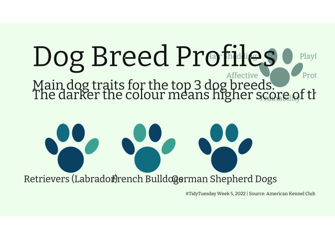
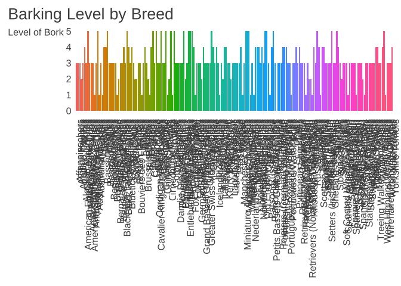
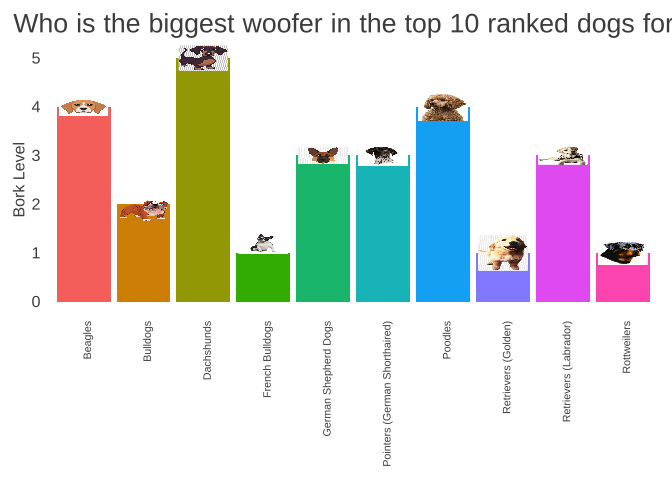

Week5\_TidyTues\_IW
================
Imogen Weigall
17/03/2022

### Loading in the Data

``` r
breed_traits <- readr::read_csv('https://raw.githubusercontent.com/rfordatascience/tidytuesday/master/data/2022/2022-02-01/breed_traits.csv')
trait_description <- readr::read_csv('https://raw.githubusercontent.com/rfordatascience/tidytuesday/master/data/2022/2022-02-01/trait_description.csv')
breed_rank_all <- readr::read_csv('https://raw.githubusercontent.com/rfordatascience/tidytuesday/master/data/2022/2022-02-01/breed_rank.csv')

breed_traits
```

    ## # A tibble: 195 x 17
    ##    Breed   `Affectionate Wi… `Good With Young… `Good With Othe… `Shedding Level`
    ##    <chr>               <dbl>             <dbl>            <dbl>            <dbl>
    ##  1 Retrie…                 5                 5                5                4
    ##  2 French…                 5                 5                4                3
    ##  3 German…                 5                 5                3                4
    ##  4 Retrie…                 5                 5                5                4
    ##  5 Bulldo…                 4                 3                3                3
    ##  6 Poodles                 5                 5                3                1
    ##  7 Beagles                 3                 5                5                3
    ##  8 Rottwe…                 5                 3                3                3
    ##  9 Pointe…                 5                 5                4                3
    ## 10 Dachsh…                 5                 3                4                2
    ## # … with 185 more rows, and 12 more variables: Coat Grooming Frequency <dbl>,
    ## #   Drooling Level <dbl>, Coat Type <chr>, Coat Length <chr>,
    ## #   Openness To Strangers <dbl>, Playfulness Level <dbl>,
    ## #   Watchdog/Protective Nature <dbl>, Adaptability Level <dbl>,
    ## #   Trainability Level <dbl>, Energy Level <dbl>, Barking Level <dbl>,
    ## #   Mental Stimulation Needs <dbl>

``` r
trait_description
```

    ## # A tibble: 16 x 4
    ##    Trait         Trait_1        Trait_5       Description                       
    ##    <chr>         <chr>          <chr>         <chr>                             
    ##  1 Affectionate… Independent    Lovey-Dovey   How affectionate a breed is likel…
    ##  2 Good With Yo… Not Recommend… Good With Ch… A breed's level of tolerance and …
    ##  3 Good With Ot… Not Recommend… Good With Ot… How generally friendly a breed is…
    ##  4 Shedding Lev… No Shedding    Hair Everywh… How much fur and hair you can exp…
    ##  5 Coat Groomin… Monthly        Daily         How frequently a breed requires b…
    ##  6 Drooling Lev… Less Likely t… Always Have … How drool-prone a breed tends to …
    ##  7 Coat Type     -              -             Canine coats come in many differe…
    ##  8 Coat Length   -              -             How long the breed's coat is expe…
    ##  9 Openness To … Reserved       Everyone Is … How welcoming a breed is likely t…
    ## 10 Playfulness … Only When You… Non-Stop      How enthusiastic about play a bre…
    ## 11 Watchdog/Pro… What's Mine I… Vigilant      A breed's tendency to alert you t…
    ## 12 Adaptability… Lives For Rou… Highly Adapt… How easily a breed handles change…
    ## 13 Trainability… Self-Willed    Eager to Ple… How easy it will be to train your…
    ## 14 Energy Level  Couch Potato   High Energy   The amount of exercise and mental…
    ## 15 Barking Level Only To Alert  Very Vocal    How often this breed vocalizes, w…
    ## 16 Mental Stimu… Happy to Loun… Needs a Job … How much mental stimulation a bre…

``` r
breed_rank_all
```

    ## # A tibble: 195 x 11
    ##    Breed `2013 Rank` `2014 Rank` `2015 Rank` `2016 Rank` `2017 Rank` `2018 Rank`
    ##    <chr>       <dbl>       <dbl>       <dbl>       <dbl>       <dbl>       <dbl>
    ##  1 Retr…           1           1           1           1           1           1
    ##  2 Fren…          11           9           6           6           4           4
    ##  3 Germ…           2           2           2           2           2           2
    ##  4 Retr…           3           3           3           3           3           3
    ##  5 Bull…           5           4           4           4           5           5
    ##  6 Pood…           8           7           8           7           7           7
    ##  7 Beag…           4           5           5           5           6           6
    ##  8 Rott…           9          10           9           8           8           8
    ##  9 Poin…          13          12          11          11          10           9
    ## 10 Dach…          10          11          13          13          13          12
    ## # … with 185 more rows, and 4 more variables: 2019 Rank <dbl>, 2020 Rank <dbl>,
    ## #   links <chr>, Image <chr>

## Dog Breeds Data Set

Each year, Americans purchase nearly 1 million purebred dogs.These dogs
are registered through the American Kennel Club (AKC), which categorizes
and tallies up the totals of more than 150 breeds. VOX has created a
dataset of these registrations going back 80 years — and what we found
shows that Americans’ taste in dogs has dramatically changed over time.

breed\_rank\_all : Source - American Kennel Club : To identify the 50
most popular breeds in the United States, 24/7 Tempo reviewed data from
the American Kennel Club released in March 2021, based on 2020 AKC
registration statistics

Influences on Dog Choice: Movies + Mimic choices of others
(Friends/Family/Neighbours)

Hypothesis: “breeds enjoy heydays of approximately 25 years … \[which\]
usually allows for two to three generations of dogs, as the breed
transforms from novel to passé.”

This would suggest that the Labrador retriever is nearing the end of
it’s reign (it has topped the list for exactly 25 years now). But Gina
DiNardo, who currently serves as the vice president of the American
Kennel Club, says that’s not going to happen any time soon.

The cocker spaniel has long since faded as America’s favorite dog,
however, it still holds the record for most years at the top (26),
thanks to a resurgence in the 1980s.

``` r
library(tidyverse)
library(dplyr)

#plots
library(ggplot2)
library(janitor)
library(ggfx)
library(ggforce)
library(patchwork)
library(ggimage)
library(ggbump)
library(here)
##fonts
library(ggtext)
library(showtext)
library(sysfonts)
##colour
library(rcartocolor)
library(RColorBrewer)
```

### First I wanted to look at the latest rankings of dogs - what dogs are recently most popular.

``` r
#creating a new df filtering for top 10 ranked breeds in 2020

top_10_2020 <- breed_rank_all %>% 
  clean_names() %>% 
  select(breed, x2020_rank, image) %>% 
  head(10) %>%
    mutate(breed = str_wrap(breed, 18) %>% fct_reorder(., x2020_rank))
 
#janitor package used to clean up spacing in col names
#str_wrap breed name for future use in ggplot
#fct_reorder to ensure factors are ordered in decending order of rank


top_10_2020
```

    ## # A tibble: 10 x 3
    ##    breed                x2020_rank image                                        
    ##    <fct>                     <dbl> <chr>                                        
    ##  1 "Retrievers\n(Labra…          1 https://www.akc.org/wp-content/uploads/2017/…
    ##  2 "French Bulldogs"             2 https://www.akc.org/wp-content/uploads/2017/…
    ##  3 "German Shepherd\nD…          3 https://www.akc.org/wp-content/uploads/2017/…
    ##  4 "Retrievers\n(Golde…          4 https://www.akc.org/wp-content/uploads/2017/…
    ##  5 "Bulldogs"                    5 https://www.akc.org/wp-content/uploads/2017/…
    ##  6 "Poodles"                     6 https://www.akc.org/wp-content/uploads/2017/…
    ##  7 "Beagles"                     7 https://www.akc.org/wp-content/uploads/2017/…
    ##  8 "Rottweilers"                 8 https://www.akc.org/wp-content/uploads/2017/…
    ##  9 "Pointers (German\n…          9 https://www.akc.org/wp-content/uploads/2017/…
    ## 10 "Dachshunds"                 10 https://www.akc.org/wp-content/uploads/2017/…

``` r
##Plotting

p1 <- ggplot(top_10_2020) +
  geom_image(aes(x = 1, y = 1, image = image),
            size = 0.95) +
  as_reference(
    geom_tile(aes(1, 1, fill = x2020_rank),
              height = 1, 
              width = 1,
              alpha = 0.2),
    id = "tile"
  ) +
  with_blend(
    geom_image(aes(x = 1, y = 1, image = image),
               size = 0.95),
    bg_layer = "tile",
    flip_order = TRUE,
    blend_type = "pegtop_light",
    alpha = "src"
  ) +
  geom_text(aes(1, 1, label = x2020_rank, colour = x2020_rank),
            hjust = 0.5,
            vjust = 0.5,
            family = "mono",
            fontface = "bold",
            size = 6) +
  scale_x_continuous(limits = c(0, 2)) +
  scale_y_continuous(limits = c(0, 2)) +
  scale_fill_gradient(high = "#008db9", low = "#f26d78", guide = "none", aesthetics = c("fill", "colour")) +
  facet_wrap(. ~ breed, ncol = 3) +
  coord_equal(expand = FALSE) +
  labs(title = "TOP 10 DOGS of 2020",
       caption = "Source: American Kennel Club courtesy of KKakey  |  #TidyTuesday 2022 W5  | adapted from @quite_grey") +
  theme(panel.background = element_blank(),
        strip.background = element_rect(fill = "white", colour = "white"),
        plot.title = element_text(size = 20, family = "mono", face = "bold", hjust = 0.5),
        plot.caption = element_text(size = 5, family = "mono", face = "bold", hjust = 0.5),
        strip.text = element_text(size = 4, family = "mono", face = "bold", vjust = 0),
        axis.title = element_blank(),
        axis.text = element_blank(),
        axis.ticks = element_blank(),
        plot.margin = unit(c(1, 1, 1, 1), "cm"),
        plot.title.position = "plot",
        plot.caption.position = "plot")

print(p1)
```

<!-- -->

### Why are Labradors so popular?

“Labs are easy to train and get along great with people and other dogs,
are easy to please, and have a friendly disposition. They shed, but not
an unbearable amount. They’re good with water. They’re also very
versatile: People can live with them in a variety of settings — cities,
country, apartments, houses.”

#### I then wanted to look at the top ranked dogs over time - to see whether there has been any substantial change

``` r
##creating df

top_10_time <- breed_rank_all %>%
  clean_names() %>%
  pivot_longer(x2013_rank:x2020_rank,
               names_to = "year",
               values_to = "rank") %>%
  mutate(year = parse_number(year),
         # This puts Dachshunds below everything so the line does not show
         # and French Bulldogs on top of everything to highlight the gains
         breed = factor(breed,
                        levels = c("Dachshunds",
                                   "Retrievers (Labrador)",
                                   "German Shepherd Dogs",
                                   "Retrievers (Golden)",
                                   "Beagles",
                                   "Bulldogs",
                                   "Yorkshire Terriers",
                                   "Boxers",
                                   "Poodles",
                                   "Rottweilers",
                                   "Pointers (German Shorthaired)",
                                   "Pembroke Welsh Corgis",
                                   "French Bulldogs"))) %>%
  filter(rank <= 10) %>%
  group_by(breed) %>%
  mutate(first_year = year == min(year),
         last_year = year == max(year)) %>%
  ungroup() 

top_10_time
```

    ## # A tibble: 80 x 7
    ##    breed     links          image                year  rank first_year last_year
    ##    <fct>     <chr>          <chr>               <dbl> <dbl> <lgl>      <lgl>    
    ##  1 Retrieve… https://www.a… https://www.akc.or…  2013     1 TRUE       FALSE    
    ##  2 Retrieve… https://www.a… https://www.akc.or…  2014     1 FALSE      FALSE    
    ##  3 Retrieve… https://www.a… https://www.akc.or…  2015     1 FALSE      FALSE    
    ##  4 Retrieve… https://www.a… https://www.akc.or…  2016     1 FALSE      FALSE    
    ##  5 Retrieve… https://www.a… https://www.akc.or…  2017     1 FALSE      FALSE    
    ##  6 Retrieve… https://www.a… https://www.akc.or…  2018     1 FALSE      FALSE    
    ##  7 Retrieve… https://www.a… https://www.akc.or…  2019     1 FALSE      FALSE    
    ##  8 Retrieve… https://www.a… https://www.akc.or…  2020     1 FALSE      TRUE     
    ##  9 French B… https://www.a… https://www.akc.or…  2014     9 TRUE       FALSE    
    ## 10 French B… https://www.a… https://www.akc.or…  2015     6 FALSE      FALSE    
    ## # … with 70 more rows

``` r
##formatting

font <- "Trebuchet MS"
title_font <- "Candara"
fontcolor <- "gray30"
bcolor <- "white"

theme_set(theme_minimal(base_size = 12, base_family = font))

theme_update(
  panel.grid.minor = element_blank(),
  panel.grid.major = element_blank(),
  
  panel.background = element_rect(fill = bcolor, color = NA),
  plot.background = element_rect(fill = bcolor, color = NA),
  
  axis.title.y = element_text(size = 12, color = fontcolor, angle = 0, vjust = 0.98),
  axis.title.x = element_blank(),
  axis.text = element_text(size = 12, color = fontcolor),
  axis.ticks = element_blank(),
  axis.line = element_blank(),
  
  plot.title.position = "plot",
  plot.title = element_markdown(size = 20, color = fontcolor, family = title_font),
  
  plot.subtitle = element_markdown(size = 12, color = fontcolor),
  
  plot.caption.position = "plot",
  plot.caption = element_markdown(size = 8, color = fontcolor),
  
  plot.margin = margin(t = 10, r = 10, b = 10, l = 10)
)
```

``` r
##plot
# this plot was adapted from @datasciencejenn (Jenn Schillings) code available on Twitter

p2 <- ggplot() +
  geom_bump(data = top_10_time,
            mapping = aes(x = year,
                          y = rank,
                          group = breed,
                          color = breed),
            smooth = 15, size = 2.5) +
  geom_image(data = top_10_time %>% filter(first_year == TRUE | last_year == TRUE),
             mapping = aes(x = year,
                           y = rank,
                           image = image),
             size = 0.07) +
  geom_text(data = top_10_time %>% filter(first_year == TRUE | last_year == TRUE),
            mapping = aes(x = year,
                          y = rank,
                          label = breed),
            nudge_y = -0.5,
            color = fontcolor,
            family = font,
            size = 3) +
  scale_y_reverse(breaks = seq(from = 1, to = 10)) +
  scale_x_continuous(breaks = seq(from = 2013, to = 2020),
                     limits = c(2012.7, 2021.2)) +
  scale_color_brewer(palette = "Spectral") +
  coord_cartesian(clip = "off") +
  guides(color = "none") + ggtitle( "Top Ranked Dogs from 2013 to 2020") + ylab("Rank")

print(p2)
```

<!-- -->

As you can see Labradors have consistently remained the top ranked dog.
We have seen an exponential climb of the french bulldog.

``` r
#selecting the traits we want to plot
traits <- trait_description$Trait[c(1,4, 10, 11, 13)]

#creating a new df with breed and traits
top_3_trait<- breed_traits[1:3,] %>%
  select(Breed, traits) 

#checking df is how we want it
top_3_trait
```

    ## # A tibble: 3 x 6
    ##   Breed   `Affectionate Wit… `Shedding Level` `Playfulness Le… `Watchdog/Protec…
    ##   <chr>                <dbl>            <dbl>            <dbl>             <dbl>
    ## 1 Retrie…                  5                4                5                 3
    ## 2 French…                  5                3                5                 3
    ## 3 German…                  5                4                4                 5
    ## # … with 1 more variable: Trainability Level <dbl>

``` r
#Plot

#This plot has been adapted from Paula LC on Twitter @elartedeldato . Inspired by their plot of Top 8 dog breed traits I decided to give it a go for myself. 

##Formatting

#Selecting font type
#Google has a fonts repository in from which you can source any font from a selection
font_add_google(name = "Bitter", family = "Thin 100")
showtext_auto()
font_family <- 'Thin 100'

colors <- carto_pal(5, 'BluYl')
bg_color <- 'honeydew'
text_color <- '#111111'
font_size <- 5

caption_title <- '#TidyTuesday Week 5, 2022 | Source: American Kennel Club '

p3 <- ggplot() +
  # Footprints
  geom_ellipse(aes(x0 = 0, y0 = 33, a = 3, b = 5, angle = 0.5, m1 = 2), fill = colors[pull(top_3_trait[1,],2)], color=bg_color) +
  geom_ellipse(aes(x0 = 6, y0 = 40, a = 3.5, b = 5, angle = 0, m1 = 2), fill = colors[pull(top_3_trait[1,],3)], color=bg_color) +
  geom_ellipse(aes(x0 = 14, y0 = 40, a = 3.5, b = 5, angle = 0, m1 = 2), fill = colors[pull(top_3_trait[1,],4)], color=bg_color)  +
  geom_ellipse(aes(x0 = 21, y0 = 33, a = 3, b = 5, angle = 2.5, m1 = 2), fill = colors[pull(top_3_trait[1,],5)], color=bg_color) +
  geom_ellipse(aes(x0 = 10, y0 = 26, a = 7, b = 7, angle = 3, m1 = 2), fill = colors[pull(top_3_trait[1,],6)], color=bg_color) +
  annotate(geom='text', label=top_3_trait$Breed[1], x=10, y=16, color=text_color, family=font_family, size=font_size) +

  geom_ellipse(aes(x0 = 0+40, y0 = 33, a = 3, b = 5, angle = 0.5, m1 = 2), fill = colors[pull(top_3_trait[2,],2)], color=bg_color) +
  geom_ellipse(aes(x0 = 6+40, y0 = 40, a = 3.5, b = 5, angle = 0, m1 = 2), fill = colors[pull(top_3_trait[2,],3)], color=bg_color) +
  geom_ellipse(aes(x0 = 14+40, y0 = 40, a = 3.5, b = 5, angle = 0, m1 = 2), fill = colors[pull(top_3_trait[2,],4)], color=bg_color)  +
  geom_ellipse(aes(x0 = 21+40, y0 = 33, a = 3, b = 5, angle = 2.5, m1 = 2), fill = colors[pull(top_3_trait[2,],5)], color=bg_color) +
  geom_ellipse(aes(x0 = 10+40, y0 = 26, a = 7, b = 7, angle = 3, m1 = 2), fill = colors[pull(top_3_trait[2,],6)], color=bg_color) +
  annotate(geom='text', label=top_3_trait$Breed[2], x=10+40, y=16, color=text_color, family=font_family, size=font_size)  +

  geom_ellipse(aes(x0 = 0+80, y0 = 33, a = 3, b = 5, angle = 0.5, m1 = 2), fill = colors[pull(top_3_trait[3,],2)], color=bg_color) +
  geom_ellipse(aes(x0 = 6+80, y0 = 40, a = 3.5, b = 5, angle = 0, m1 = 2), fill = colors[pull(top_3_trait[3,],3)], color=bg_color) +
  geom_ellipse(aes(x0 = 14+80, y0 = 40, a = 3.5, b = 5, angle = 0, m1 = 2), fill = colors[pull(top_3_trait[3,],4)], color=bg_color)  +
  geom_ellipse(aes(x0 = 21+80, y0 = 33, a = 3, b = 5, angle = 2.5, m1 = 2), fill = colors[pull(top_3_trait[3,],5)], color=bg_color) +
  geom_ellipse(aes(x0 = 10+80, y0 = 26, a = 7, b = 7, angle = 3, m1 = 2), fill = colors[pull(top_3_trait[3,],6)], color=bg_color) +
  annotate(geom='text', label=top_3_trait$Breed[3], x=10+80, y=16, color=text_color, family=font_family, size=font_size)  +


  # Legend Footprint
  geom_ellipse(aes(x0 = 1+110, y0 = 73, a = 2, b = 4, angle = 0.5, m1 = 2), fill = '#84a59d', color= '#84a59d') +
  annotate(geom='text', label="Affective", x=1+110, y=70, size=4, hjust=1.2, family=font_family, color= '#84a59d') +
  geom_ellipse(aes(x0 = 5+110, y0 = 80, a = 2.5, b = 4, angle = 0, m1 = 2), fill = '#84a59d', color= '#84a59d') +
  annotate(geom='text', label="Hair Shedding", x=5+110, y=80, size=4, hjust=1.3, family=font_family, color= '#84a59d') +
  geom_ellipse(aes(x0 = 13+110, y0 = 80, a = 2.5, b = 4, angle = 0, m1 = 2), fill = '#84a59d', color= '#84a59d')  +
  annotate(geom='text', label="Playfulness", x=13+110, y=80, size=4, hjust=-0.3, family=font_family, color= '#84a59d') +
  geom_ellipse(aes(x0 = 18+110, y0 = 73, a =2, b = 4, angle = 2.5, m1 = 2), fill = '#84a59d', color= '#84a59d') +
  annotate(geom='text', label="Protectiveness", x=18+110, y=70, size=4,  hjust=-0.1, family=font_family, color= '#84a59d') +
  geom_ellipse(aes(x0 = 9+110, y0 = 69, a = 5, b = 5, angle = 3, m1 = 2), fill = '#84a59d', color= '#84a59d') +
  annotate(geom='text', label="Trainability", x=9+110, y=65, size=4, vjust=3, family=font_family, color= '#84a59d') +
  coord_equal() +
  theme_void() +
  annotate(geom='text', label='Dog Breed Profiles', x=-10, y=80, size=15, hjust=0, family=font_family, color=text_color) +
  annotate(geom='text', label='Main dog traits for the top 3 dog breeds.',size=7, x=-10, y=65, hjust=0, family=font_family, color=text_color) +
  annotate(geom='text', label='The darker the colour means higher score of this trait.', size=7, x=-10, y=60, hjust=0, family=font_family, color=text_color) +
  labs(caption=caption_title) +
  theme(plot.background = element_rect(fill=bg_color, color=bg_color),
        plot.margin=margin(1,1,1,1,'cm'),
        plot.caption=element_text(family=font_family, size=7, margin=margin(10,1,1,1)))

print(p3)
```

<!-- -->

``` r
# Who's the biggest woofers?

borkers <- breed_traits %>%
  select(Breed, "Barking Level") %>% clean_names()

#exploring with visualisations
ggplot(borkers) + geom_col( aes(x = breed, y = barking_level, fill = breed)) +
    theme(axis.text.x = element_text(angle=90, hjust=1), legend.position = "none") +
  ylab("Level of Bork") +
  ggtitle("Barking Level by Breed")
```

<!-- -->

``` r
#this is too hectic - Let's cut this down a little

top_borkers <- filter(borkers, barking_level == 5)

top_borkers
```

    ## # A tibble: 25 x 2
    ##    breed                        barking_level
    ##    <chr>                                <dbl>
    ##  1 Dachshunds                               5
    ##  2 Siberian Huskies                         5
    ##  3 Miniature Schnauzers                     5
    ##  4 Shetland Sheepdogs                       5
    ##  5 Chihuahuas                               5
    ##  6 Collies                                  5
    ##  7 West Highland White Terriers             5
    ##  8 Bloodhounds                              5
    ##  9 Papillons                                5
    ## 10 Samoyeds                                 5
    ## # … with 15 more rows

``` r
##Barkers in the Top 10 of 2020
top_10_borkers <- breed_traits[1:10,] %>%
  select(Breed, "Barking Level") %>% clean_names() %>% arrange((barking_level)) 

#setting image file path
#users will need to change this path to where they downloaded and stored the dog_images folder
#image_path <- here('/Users/imogenweigall/LabTidyTuesday/week5_dogbreeds/dog_images')

#here(image_path)

library(here)

#plot
p4 <- ggplot(top_10_borkers) + geom_col( aes(x = breed, y = barking_level, fill = breed)) +
    theme(axis.text.x = element_text(angle=90, hjust=1, size = 8), legend.position = "none", axis.title.y = element_text(angle=90)) +
  ylab("Bork Level") +
  xlab("Breed") +
  ggtitle("Who is the biggest woofer in the top 10 ranked dogs for 2020? ") + 
  geom_image(x = 1, y = 4, aes(image= here('dog_images','beagle.jpeg')), size = 0.08) +
  geom_image(x = 2, y = 1.859, aes(image = here('dog_images', 'bulldog.png')), size = 0.08) +
  geom_image(x = 3, y = 5, aes(image = here('dog_images','dachshund.jpeg')), size = 0.08) +
  geom_image(x = 4, y = 1.20, aes(image = here('dog_images','frenchbulldog.jpeg')), size = 0.08) +
  geom_image(x = 5, y = 3, aes(image = here('dog_images', 'german_shepard.jpeg')), size = 0.08) +
  geom_image(x = 6, y = 3, aes(image = here('dog_images', 'pointer.jpeg')), size = 0.08) +
  geom_image(x = 7, y = 4, aes(image = here('dog_images','poodle.jpeg')), size = 0.08) +
  geom_image(x = 8, y = 1, aes(image = here('dog_images','goldenretriever.jpeg')), size = 0.08) +
  geom_image(x = 9, y = 3, aes(image = here('dog_images','labrador.jpeg')), size = 0.08) +
  geom_image(x = 10, y = 1, aes(image = here('dog_images','rotweiler.jpeg')), size = 0.08)
  
p4
```

<!-- -->

``` r
## wanting to create a plot with images overlayed

#For some reason I am unable to get the Images to join properly to the data set by 'breed'
#breed_rank_all1 <- breed_rank_all %>% clean_names()
#borkers_wpics <- left_join(borkers, breed_rank_all1$image, by = "breed", copy = TRUE)
#tried to clean names in breed_rank_all df so that all consistent - but will still miss joining some of the key images

#Temporary solution: imported own images to use in plot
```

### Webscraping

For my own development I wanted to try webscraping some other related
data - I chose to webscrape puppy prices. I found the following website:
<https://www.petbudget.com/puppy-prices/>

``` r
library(rvest)
```

    ## 
    ## Attaching package: 'rvest'

    ## The following object is masked from 'package:readr':
    ## 
    ##     guess_encoding

``` r
library(xml2)
library(dplyr)


dog_price_page <- read_html("https://www.petbudget.com/puppy-prices/") 

dog_price_page
```

    ## {html_document}
    ## <html lang="en-us">
    ## [1] <head>\n<meta http-equiv="Content-Type" content="text/html; charset=UTF-8 ...
    ## [2] <body class="post-template-default single single-post postid-7589 single- ...

``` r
#importing table data from webpage

table <- dog_price_page %>% html_table(fill = TRUE, header = TRUE) 

table
```

    ## [[1]]
    ## # A tibble: 151 x 4
    ##    Breed                          `Average Price` `Price Range`   Ads
    ##    <chr>                          <chr>           <chr>         <int>
    ##  1 Afghan Hound                   $2250           $2000-2500       17
    ##  2 Airedale Terrier               $850            $500-1500        78
    ##  3 Akita                          $1000           $600-1980       273
    ##  4 Alaskan Malamute               $975            $500-2500       207
    ##  5 American Eskimo Dog            $1000           $700-1500        43
    ##  6 American Hairless Terrier      $1500           $1125-1900        6
    ##  7 American Staffordshire Terrier $750            $250-1500        43
    ##  8 Anatolian Shepherd Dog         $900            $500-2000        56
    ##  9 Australian Cattle Dog          $450            $250-1200       300
    ## 10 Australian Shepherd            $800            $400-1500      1740
    ## # … with 141 more rows

``` r
#using table information to create new df
dog_price <- as.data.frame(table)
#cleaning names in df
dog_price <- dog_price %>% clean_names()
#removing the $ from all cols - the \\ is an escape character
dog_price <- lapply(dog_price, gsub, pattern="\\$", replacement="")

dog_price <- as.data.frame(dog_price)

dog_price
```

    ##                                  breed average_price price_range  ads
    ## 1                         Afghan Hound          2250   2000-2500   17
    ## 2                     Airedale Terrier           850    500-1500   78
    ## 3                                Akita          1000    600-1980  273
    ## 4                     Alaskan Malamute           975    500-2500  207
    ## 5                  American Eskimo Dog          1000    700-1500   43
    ## 6            American Hairless Terrier          1500   1125-1900    6
    ## 7       American Staffordshire Terrier           750    250-1500   43
    ## 8               Anatolian Shepherd Dog           900    500-2000   56
    ## 9                Australian Cattle Dog           450    250-1200  300
    ## 10                 Australian Shepherd           800    400-1500 1740
    ## 11                  Australian Terrier          1500   1440-1600   10
    ## 12                             Basenji          1400   1250-2000   19
    ## 13                        Basset Hound           800    450-1400  393
    ## 14                              Beagle           550    295-1125  528
    ## 15                      Bearded Collie          1300    850-2600    6
    ## 16                           Beauceron          1350    920-1850    4
    ## 17                    Belgian Malinois          1000    595-2000  176
    ## 18                    Belgian Sheepdog          1800   1200-2500   14
    ## 19                    Belgian Tervuren          1700   1500-2000   29
    ## 20                Bernese Mountain Dog          1200    675-1995  302
    ## 21                        Bichon Frise           920    600-1700  160
    ## 22             Black and Tan Coonhound           550     250-800   24
    ## 23               Black Russian Terrier          2000   1000-2500    8
    ## 24                          Bloodhound           750    450-1200  187
    ## 25                  Bluetick Coonhound           600    300-1200   40
    ## 26                            Boerboel          2000   1200-2500   41
    ## 27                       Border Collie           700    300-1000  513
    ## 28                      Border Terrier          1900   1450-2000   13
    ## 29                              Borzoi          1900   1800-2000   10
    ## 30                      Boston Terrier           850    550-1400  897
    ## 31                Bouvier des Flandres          1800   1500-2500   16
    ## 32                               Boxer           900    500-1500 1041
    ## 33                      Boykin Spaniel          1050    750-1500   27
    ## 34                              Briard          2150   2000-2300    6
    ## 35                            Brittany           750    500-1060  275
    ## 36                    Brussels Griffon          2300   1500-4000   49
    ## 37                        Bull Terrier          1500    815-2000   94
    ## 38                         Bullmastiff          1500   1000-2200  131
    ## 39                       Cairn Terrier           950    725-1450   76
    ## 40                 Cane Corso Italiano          1500    700-2500  332
    ## 41                Cardigan Welsh Corgi          1300    800-1750   63
    ## 42               Cavalier King Charles          1500    800-2500  790
    ## 43            Chesapeake Bay Retriever          1000    550-1200   68
    ## 44                           Chihuahua           800    375-2420  899
    ## 45                     Chinese Crested          1100    600-2500   39
    ## 46                    Chinese Shar-Pei          1000    750-1800  141
    ## 47                           Chow Chow          2250    850-3800   32
    ## 48                     Clumber Spaniel          1500    800-2400    5
    ## 49                            Cockapoo          2000   1310-3460  223
    ## 50                      Cocker Spaniel           800    500-1500  600
    ## 51                              Collie           800    375-1450  288
    ## 52                     Coton de Tulear          1800   1400-3000   34
    ## 53                           Dachshund           850    450-1500  593
    ## 54                           Dalmatian           800    450-1200  256
    ## 55                   Doberman Pinscher          1000    500-2250  536
    ## 56                   Dogue de Bordeaux          1500    900-2750   81
    ## 57                     English Bulldog          2500   1500-4500 1573
    ## 58              English Cocker Spaniel          1000    800-1600   33
    ## 59                      English Setter           800    600-1400   30
    ## 60            English Springer Spaniel           850    600-1200  449
    ## 61                 English Toy Spaniel          2500   2000-3000    7
    ## 62               Flat-Coated Retriever          2000   1500-2500    7
    ## 63                      French Bulldog          2800   1800-4500 3716
    ## 64                     German Pinscher          2800   2000-3550   10
    ## 65                     German Shepherd           800    450-1900 2349
    ## 66          German Shorthaired Pointer           800    500-1000  663
    ## 67           German Wirehaired Pointer           800     600-945   22
    ## 68                     Giant Schnauzer          2500   1200-3500   32
    ## 69                    Golden Retriever          1000    700-2000 1934
    ## 70                        Goldendoodle          2000   1200-3200 1890
    ## 71                       Gordon Setter          1400    800-2200    8
    ## 72                          Great Dane          1000    500-1800 1445
    ## 73                      Great Pyrenees           550    290-1000  267
    ## 74          Greater Swiss Mountain Dog          2500   1000-3000   35
    ## 75                            Havanese          1100    650-1800  514
    ## 76                  Icelandic Sheepdog          2250   2000-2500    4
    ## 77                        Irish Setter          1200    700-2500   31
    ## 78                       Irish Terrier          2100    900-3500    4
    ## 79                     Irish Wolfhound          2000   1400-2500   33
    ## 80                   Italian Greyhound          1600   1200-3000   34
    ## 81                Jack Russell Terrier          1000    500-1500   80
    ## 82                       Japanese Chin          1650   1200-2000   38
    ## 83                            Keeshond          1500    800-1800   22
    ## 84                  Kerry Blue Terrier          2000   1200-2500    7
    ## 85                         Labradoodle          1550    900-2800  775
    ## 86                  Labrador Retriever           800    400-1500 3160
    ## 87                          Leonberger          2400   1700-3250   16
    ## 88                          Lhasa Apso           950    550-1240  127
    ## 89                             Maltese          1200    600-2340  359
    ## 90                    Maltese Shih Tzu          1450    830-2460   53
    ## 91                            Maltipoo          2000   1150-3825  396
    ## 92                  Manchester Terrier          1600   1000-2500    6
    ## 93                             Mastiff          1200    600-2000  273
    ## 94         Miniature American Shepherd           800    450-1500 1102
    ## 95              Miniature Bull Terrier          2500   1500-3500   23
    ## 96                  Miniature Pinscher           700    350-1215  148
    ## 97                 Miniature Schnauzer           950    600-1800 1087
    ## 98                  Neapolitan Mastiff          3500   2500-4500   36
    ## 99                        Newfoundland          1200    600-2000  325
    ## 100                    Norfolk Terrier          3250   2340-4000    8
    ## 101                 Norwegian Elkhound          1000    700-1500   27
    ## 102                    Norwich Terrier          3500   2000-4800   13
    ## 103 Nova Scotia Duck Tolling Retriever          2500   1800-3500    8
    ## 104               Old English Sheepdog          1250    950-2000  180
    ## 105                           Papillon          1000    500-1900  126
    ## 106             Parson Russell Terrier          1200    450-2000   27
    ## 107                           Peekapoo          1375    900-2315   30
    ## 108                          Pekingese          1800    800-3745   57
    ## 109               Pembroke Welsh Corgi          1050    750-1800 1221
    ## 110                            Pointer          1000    400-1475   16
    ## 111                         Pomeranian          1200    600-2000 1083
    ## 112               Portuguese Water Dog          2200   1500-2890  132
    ## 113                                Pug          1175    600-1900  609
    ## 114                             Puggle          1000    850-2220   63
    ## 115                        Rat Terrier           700    500-1100   55
    ## 116                  Redbone Coonhound           600    450-1200   25
    ## 117                Rhodesian Ridgeback          1250    600-2000  185
    ## 118                         Rottweiler          1150    600-2000  495
    ## 119                      Saint Bernard          1000    550-2000  276
    ## 120                             Saluki          2400   1700-2700    6
    ## 121                            Samoyed          1850   1200-3040   43
    ## 122                         Schipperke           850    700-1100   20
    ## 123                          Schnoodle          2000   1230-2695   87
    ## 124                   Scottish Terrier          1100    600-1600  101
    ## 125                  Shetland Sheepdog           900    500-1285  274
    ## 126                          Shiba Inu          1000    650-1800  315
    ## 127                           Shih Tzu           850    500-1600 1173
    ## 128                     Siberian Husky           650    400-1200 1485
    ## 129                      Silky Terrier          1400    900-2000   10
    ## 130                 Smooth Fox Terrier           900    500-1500   11
    ## 131        Soft Coated Wheaten Terrier          1000    900-1500  133
    ## 132                   Spinone Italiano          1750   1000-2000    5
    ## 133         Staffordshire Bull Terrier          2000    975-2500   38
    ## 134                    Standard Poodle          1000    600-2000 1447
    ## 135                 Standard Schnauzer          2000    900-2600   18
    ## 136                    Tibetan Mastiff          2500   1800-4500   53
    ## 137                    Tibetan Spaniel          2000    800-3500   29
    ## 138                    Tibetan Terrier          2000   1300-2500    7
    ## 139                    Toy Fox Terrier           800    500-1500   41
    ## 140           Treeing Walker Coonhound           650    300-1500   19
    ## 141                             Vizsla          1100    500-1700  200
    ## 142                         Weimaraner           700    500-1200  324
    ## 143             Welsh Springer Spaniel          1900   1800-2000    6
    ## 144                      Welsh Terrier          1600    950-3000   13
    ## 145                             Westie          1000    650-1700  135
    ## 146                            Whippet          1200    850-1500   42
    ## 147                   Wire Fox Terrier          1800   1150-3500   12
    ## 148        Wirehaired Pointing Griffon          1200   1000-1545   38
    ## 149                     Xoloitzcuintli          2750    800-4000   32
    ## 150                           Yorkipoo          1600   1135-2500  177
    ## 151                  Yorkshire Terrier          1200    600-2500 1406

``` r
#now looks how we want it but the variables are not in the class we want
#checking the class
sapply(dog_price, class)
```

    ##         breed average_price   price_range           ads 
    ##   "character"   "character"   "character"   "character"

``` r
# changing the class

dog_price$average_price <- as.numeric(dog_price$average_price)

dog_price
```

    ##                                  breed average_price price_range  ads
    ## 1                         Afghan Hound          2250   2000-2500   17
    ## 2                     Airedale Terrier           850    500-1500   78
    ## 3                                Akita          1000    600-1980  273
    ## 4                     Alaskan Malamute           975    500-2500  207
    ## 5                  American Eskimo Dog          1000    700-1500   43
    ## 6            American Hairless Terrier          1500   1125-1900    6
    ## 7       American Staffordshire Terrier           750    250-1500   43
    ## 8               Anatolian Shepherd Dog           900    500-2000   56
    ## 9                Australian Cattle Dog           450    250-1200  300
    ## 10                 Australian Shepherd           800    400-1500 1740
    ## 11                  Australian Terrier          1500   1440-1600   10
    ## 12                             Basenji          1400   1250-2000   19
    ## 13                        Basset Hound           800    450-1400  393
    ## 14                              Beagle           550    295-1125  528
    ## 15                      Bearded Collie          1300    850-2600    6
    ## 16                           Beauceron          1350    920-1850    4
    ## 17                    Belgian Malinois          1000    595-2000  176
    ## 18                    Belgian Sheepdog          1800   1200-2500   14
    ## 19                    Belgian Tervuren          1700   1500-2000   29
    ## 20                Bernese Mountain Dog          1200    675-1995  302
    ## 21                        Bichon Frise           920    600-1700  160
    ## 22             Black and Tan Coonhound           550     250-800   24
    ## 23               Black Russian Terrier          2000   1000-2500    8
    ## 24                          Bloodhound           750    450-1200  187
    ## 25                  Bluetick Coonhound           600    300-1200   40
    ## 26                            Boerboel          2000   1200-2500   41
    ## 27                       Border Collie           700    300-1000  513
    ## 28                      Border Terrier          1900   1450-2000   13
    ## 29                              Borzoi          1900   1800-2000   10
    ## 30                      Boston Terrier           850    550-1400  897
    ## 31                Bouvier des Flandres          1800   1500-2500   16
    ## 32                               Boxer           900    500-1500 1041
    ## 33                      Boykin Spaniel          1050    750-1500   27
    ## 34                              Briard          2150   2000-2300    6
    ## 35                            Brittany           750    500-1060  275
    ## 36                    Brussels Griffon          2300   1500-4000   49
    ## 37                        Bull Terrier          1500    815-2000   94
    ## 38                         Bullmastiff          1500   1000-2200  131
    ## 39                       Cairn Terrier           950    725-1450   76
    ## 40                 Cane Corso Italiano          1500    700-2500  332
    ## 41                Cardigan Welsh Corgi          1300    800-1750   63
    ## 42               Cavalier King Charles          1500    800-2500  790
    ## 43            Chesapeake Bay Retriever          1000    550-1200   68
    ## 44                           Chihuahua           800    375-2420  899
    ## 45                     Chinese Crested          1100    600-2500   39
    ## 46                    Chinese Shar-Pei          1000    750-1800  141
    ## 47                           Chow Chow          2250    850-3800   32
    ## 48                     Clumber Spaniel          1500    800-2400    5
    ## 49                            Cockapoo          2000   1310-3460  223
    ## 50                      Cocker Spaniel           800    500-1500  600
    ## 51                              Collie           800    375-1450  288
    ## 52                     Coton de Tulear          1800   1400-3000   34
    ## 53                           Dachshund           850    450-1500  593
    ## 54                           Dalmatian           800    450-1200  256
    ## 55                   Doberman Pinscher          1000    500-2250  536
    ## 56                   Dogue de Bordeaux          1500    900-2750   81
    ## 57                     English Bulldog          2500   1500-4500 1573
    ## 58              English Cocker Spaniel          1000    800-1600   33
    ## 59                      English Setter           800    600-1400   30
    ## 60            English Springer Spaniel           850    600-1200  449
    ## 61                 English Toy Spaniel          2500   2000-3000    7
    ## 62               Flat-Coated Retriever          2000   1500-2500    7
    ## 63                      French Bulldog          2800   1800-4500 3716
    ## 64                     German Pinscher          2800   2000-3550   10
    ## 65                     German Shepherd           800    450-1900 2349
    ## 66          German Shorthaired Pointer           800    500-1000  663
    ## 67           German Wirehaired Pointer           800     600-945   22
    ## 68                     Giant Schnauzer          2500   1200-3500   32
    ## 69                    Golden Retriever          1000    700-2000 1934
    ## 70                        Goldendoodle          2000   1200-3200 1890
    ## 71                       Gordon Setter          1400    800-2200    8
    ## 72                          Great Dane          1000    500-1800 1445
    ## 73                      Great Pyrenees           550    290-1000  267
    ## 74          Greater Swiss Mountain Dog          2500   1000-3000   35
    ## 75                            Havanese          1100    650-1800  514
    ## 76                  Icelandic Sheepdog          2250   2000-2500    4
    ## 77                        Irish Setter          1200    700-2500   31
    ## 78                       Irish Terrier          2100    900-3500    4
    ## 79                     Irish Wolfhound          2000   1400-2500   33
    ## 80                   Italian Greyhound          1600   1200-3000   34
    ## 81                Jack Russell Terrier          1000    500-1500   80
    ## 82                       Japanese Chin          1650   1200-2000   38
    ## 83                            Keeshond          1500    800-1800   22
    ## 84                  Kerry Blue Terrier          2000   1200-2500    7
    ## 85                         Labradoodle          1550    900-2800  775
    ## 86                  Labrador Retriever           800    400-1500 3160
    ## 87                          Leonberger          2400   1700-3250   16
    ## 88                          Lhasa Apso           950    550-1240  127
    ## 89                             Maltese          1200    600-2340  359
    ## 90                    Maltese Shih Tzu          1450    830-2460   53
    ## 91                            Maltipoo          2000   1150-3825  396
    ## 92                  Manchester Terrier          1600   1000-2500    6
    ## 93                             Mastiff          1200    600-2000  273
    ## 94         Miniature American Shepherd           800    450-1500 1102
    ## 95              Miniature Bull Terrier          2500   1500-3500   23
    ## 96                  Miniature Pinscher           700    350-1215  148
    ## 97                 Miniature Schnauzer           950    600-1800 1087
    ## 98                  Neapolitan Mastiff          3500   2500-4500   36
    ## 99                        Newfoundland          1200    600-2000  325
    ## 100                    Norfolk Terrier          3250   2340-4000    8
    ## 101                 Norwegian Elkhound          1000    700-1500   27
    ## 102                    Norwich Terrier          3500   2000-4800   13
    ## 103 Nova Scotia Duck Tolling Retriever          2500   1800-3500    8
    ## 104               Old English Sheepdog          1250    950-2000  180
    ## 105                           Papillon          1000    500-1900  126
    ## 106             Parson Russell Terrier          1200    450-2000   27
    ## 107                           Peekapoo          1375    900-2315   30
    ## 108                          Pekingese          1800    800-3745   57
    ## 109               Pembroke Welsh Corgi          1050    750-1800 1221
    ## 110                            Pointer          1000    400-1475   16
    ## 111                         Pomeranian          1200    600-2000 1083
    ## 112               Portuguese Water Dog          2200   1500-2890  132
    ## 113                                Pug          1175    600-1900  609
    ## 114                             Puggle          1000    850-2220   63
    ## 115                        Rat Terrier           700    500-1100   55
    ## 116                  Redbone Coonhound           600    450-1200   25
    ## 117                Rhodesian Ridgeback          1250    600-2000  185
    ## 118                         Rottweiler          1150    600-2000  495
    ## 119                      Saint Bernard          1000    550-2000  276
    ## 120                             Saluki          2400   1700-2700    6
    ## 121                            Samoyed          1850   1200-3040   43
    ## 122                         Schipperke           850    700-1100   20
    ## 123                          Schnoodle          2000   1230-2695   87
    ## 124                   Scottish Terrier          1100    600-1600  101
    ## 125                  Shetland Sheepdog           900    500-1285  274
    ## 126                          Shiba Inu          1000    650-1800  315
    ## 127                           Shih Tzu           850    500-1600 1173
    ## 128                     Siberian Husky           650    400-1200 1485
    ## 129                      Silky Terrier          1400    900-2000   10
    ## 130                 Smooth Fox Terrier           900    500-1500   11
    ## 131        Soft Coated Wheaten Terrier          1000    900-1500  133
    ## 132                   Spinone Italiano          1750   1000-2000    5
    ## 133         Staffordshire Bull Terrier          2000    975-2500   38
    ## 134                    Standard Poodle          1000    600-2000 1447
    ## 135                 Standard Schnauzer          2000    900-2600   18
    ## 136                    Tibetan Mastiff          2500   1800-4500   53
    ## 137                    Tibetan Spaniel          2000    800-3500   29
    ## 138                    Tibetan Terrier          2000   1300-2500    7
    ## 139                    Toy Fox Terrier           800    500-1500   41
    ## 140           Treeing Walker Coonhound           650    300-1500   19
    ## 141                             Vizsla          1100    500-1700  200
    ## 142                         Weimaraner           700    500-1200  324
    ## 143             Welsh Springer Spaniel          1900   1800-2000    6
    ## 144                      Welsh Terrier          1600    950-3000   13
    ## 145                             Westie          1000    650-1700  135
    ## 146                            Whippet          1200    850-1500   42
    ## 147                   Wire Fox Terrier          1800   1150-3500   12
    ## 148        Wirehaired Pointing Griffon          1200   1000-1545   38
    ## 149                     Xoloitzcuintli          2750    800-4000   32
    ## 150                           Yorkipoo          1600   1135-2500  177
    ## 151                  Yorkshire Terrier          1200    600-2500 1406

``` r
#plotting output - to keep it simple lets look at the top 10 most expensive dogs

spenny_dogs <- dog_price %>% 
  select(breed, average_price) %>% arrange(average_price) %>% tail(10)

spenny_dogs
```

    ##                                  breed average_price
    ## 142         Greater Swiss Mountain Dog          2500
    ## 143             Miniature Bull Terrier          2500
    ## 144 Nova Scotia Duck Tolling Retriever          2500
    ## 145                    Tibetan Mastiff          2500
    ## 146                     Xoloitzcuintli          2750
    ## 147                     French Bulldog          2800
    ## 148                    German Pinscher          2800
    ## 149                    Norfolk Terrier          3250
    ## 150                 Neapolitan Mastiff          3500
    ## 151                    Norwich Terrier          3500

``` r
p5 <- ggplot(spenny_dogs) + geom_col( aes(x = breed, y = average_price, fill = breed)) +
    theme(axis.text.x = element_text(angle=90, hjust=1, size = 5), legend.position = "none") +
  ylab("$$ (US)") +
  ggtitle("Top 10 Most Expensive Pups in the US")

print(p5)
```

<!-- -->

``` r
#look at prices of top 10 ranked dogs
```

## Thank you for listening
