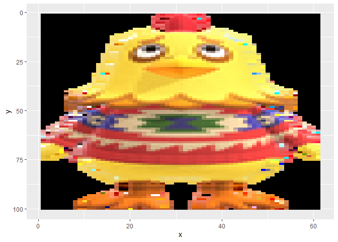
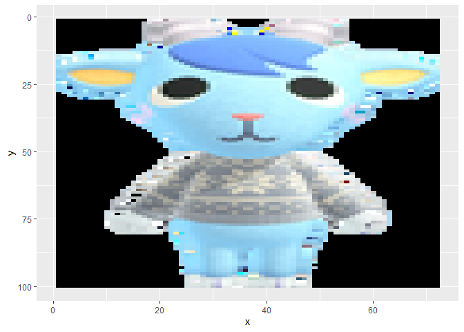
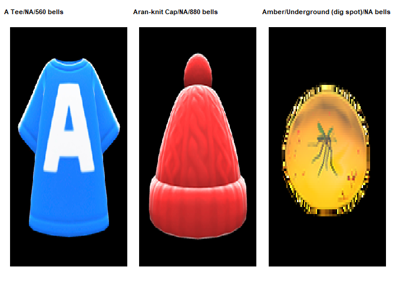
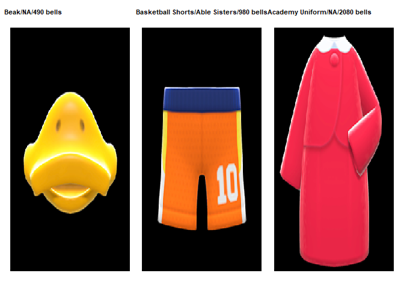
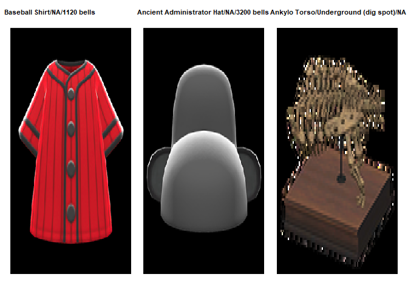
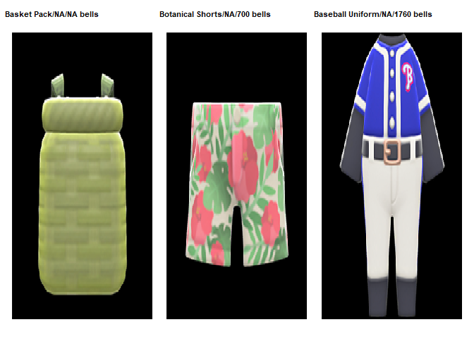

Animal crossing gift recommender
================
vina
24/03/2022

Inspect dataset

``` r
glimpse(villagers)
```

    ## Rows: 391
    ## Columns: 11
    ## $ row_n       <dbl> 2, 3, 4, 6, 7, 8, 9, 10, 11, 13, 14, 15, 16, 17, 18, 19, 2~
    ## $ id          <chr> "admiral", "agent-s", "agnes", "al", "alfonso", "alice", "~
    ## $ name        <chr> "Admiral", "Agent S", "Agnes", "Al", "Alfonso", "Alice", "~
    ## $ gender      <chr> "male", "female", "female", "male", "male", "female", "fem~
    ## $ species     <chr> "bird", "squirrel", "pig", "gorilla", "alligator", "koala"~
    ## $ birthday    <chr> "1-27", "7-2", "4-21", "10-18", "6-9", "8-19", "11-8", "11~
    ## $ personality <chr> "cranky", "peppy", "uchi", "lazy", "lazy", "normal", "snoo~
    ## $ song        <chr> "Steep Hill", "DJ K.K.", "K.K. House", "Steep Hill", "Fore~
    ## $ phrase      <chr> "aye aye", "sidekick", "snuffle", "Ayyeeee", "it'sa me", "~
    ## $ full_id     <chr> "villager-admiral", "villager-agent-s", "villager-agnes", ~
    ## $ url         <chr> "https://villagerdb.com/images/villagers/thumb/admiral.982~

``` r
head(items)
```

    ## # A tibble: 6 x 16
    ##   num_id id       name     category orderable sell_value sell_currency buy_value
    ##    <dbl> <chr>    <chr>    <chr>    <lgl>          <dbl> <chr>             <dbl>
    ## 1     12 3d-glas~ 3D Glas~ Accesso~ NA               122 bells               490
    ## 2     14 a-tee    A Tee    Tops     NA               140 bells               560
    ## 3     17 abstrac~ Abstrac~ Wallpap~ TRUE             390 bells              1560
    ## 4     19 academy~ Academy~ Dresses  NA               520 bells              2080
    ## 5     20 acantho~ Acantho~ Fossils  FALSE           2000 bells                NA
    ## 6     21 accesso~ Accesso~ Furnitu~ TRUE             375 bells              1500
    ## # ... with 8 more variables: buy_currency <chr>, sources <chr>,
    ## #   customizable <lgl>, recipe <dbl>, recipe_id <chr>, games_id <chr>,
    ## #   id_full <chr>, image_url <chr>

Loading img URL

``` r
plot_villager<-function(villager_name){
  ind=which(villagers$name==villager_name)
  villager_of_choice_img <- load.image(villagers$url[ind])%>%as.data.frame(wide="c") %>% mutate(rgb.val=rgb(c.1,c.2,c.3))

plot=ggplot()  + geom_raster(data=villager_of_choice_img, aes(x=x, y=y, fill=rgb.val)) +scale_fill_identity()+scale_y_reverse()
return(plot)
}

plot_villager("Egbert")
```

<!-- -->

``` r
plot_villager("Sherb")
```

<!-- -->

Extract hex codes from center of image. This is because if we just look
at which colors are available, we might end up detecting the black
background the most etc so we we should focus our efforts around the
centre of the villager iamge.

``` r
choose_villager<- function(villager_name){
  
  ind=which(villagers$name==villager_name)
villager_of_choice_img <- load.image(villagers$url[ind])%>%as.data.frame(wide="c") %>% mutate(rgb.val=rgb(c.1,c.2,c.3))

#get center coordinates 
clothes_x= round(max(villager_of_choice_img$x)/2 )
clothes_y= round(max(villager_of_choice_img$y)/2 )

# iteratively find coords and colours close to center  

up=list()
low=list()
for (i in 1:20) {
    upper=villager_of_choice_img%>%filter(x==clothes_x+i,y==clothes_y+i)
    lower=villager_of_choice_img%>%filter(x==clothes_x-i,y==clothes_y-i)
    up[[length(up) + 1]] <- upper$rgb.val
    low[[length(low) + 1]] <- lower$rgb.val
}

total_col= as_tibble(c(unlist(up),unlist(low)))

return(total_col)
}


print(choose_villager("Egbert"))
```

    ## # A tibble: 40 x 1
    ##    value  
    ##    <chr>  
    ##  1 #C9B08B
    ##  2 #5D6E3D
    ##  3 #41603A
    ##  4 #47476A
    ##  5 #496C34
    ##  6 #4E7038
    ##  7 #4D6F37
    ##  8 #446931
    ##  9 #BAB27E
    ## 10 #FAE2B4
    ## # ... with 30 more rows

Now over to items.

``` r
#omit no source info as we want to know how to get desired items

gift_type<- function(gift_type){
  choice=items%>%filter(category==gift_type)
  return(choice)
}

gift_choice= gift_type("Tops")

#loop through items and extract colors- this is the same procedure as what we did for villagers earlier. The only differece here is that we need a double loop that will first loop through each desired  gift item and then over corrdinates/colours to extract centre colours. 

tot=list()
for (x in 1:length(gift_choice)) {
    img <- load.image(gift_choice$image_url[x])%>%as.data.frame(wide="c") %>% mutate(rgb.val=rgb(c.1,c.2,c.3))
    clothes_x= round(max(img$x)/2 )
    clothes_y= round(max(img$y)/2 )
    up=list()
    low=list()
    for (i in 1:20) {
        upper=img%>%filter(x==clothes_x+i,y==clothes_y+i)
        lower=img%>%filter(x==clothes_x-i,y==clothes_y-i)
        up[[length(up) + 1]] <- upper$rgb.val
        low[[length(low) + 1]] <- lower$rgb.val
    }
    
    total_col= as_tibble(c(unlist(up),unlist(low)))
    tot[[x]]=total_col
    colnames(tot[[x]])<-gift_choice$name[x]
    
}

tot=flatten_dfc(tot)

head(tot)
```

    ## # A tibble: 6 x 16
    ##   `A Tee` `Acid-washed Jac~ `After-school Ja~ `Animal-print Co~ `Animal-stripes~
    ##   <chr>   <chr>             <chr>             <chr>             <chr>           
    ## 1 #F9F9FB #5586BA           #4B55DA           #2A4727           #474641         
    ## 2 #F9F9FB #5C8FC2           #4B55DA           #365731           #3F3F3A         
    ## 3 #F9F9FB #629BCC           #4955DA           #3C5E36           #42413C         
    ## 4 #F6F9F9 #5D9BCC           #4955DA           #2A4727           #44423D         
    ## 5 #F4F8FA #5492C7           #4955DA           #243820           #43423D         
    ## 6 #F7F8FA #518DC3           #4A54DA           #296B28           #42413C         
    ## # ... with 11 more variables: Annyeong Tee <chr>, Anorak Jacket <chr>,
    ## #   Apron <chr>, Aran-knit Cardigan <chr>, Aran-knit Sweater <chr>,
    ## #   Argyle Sweater <chr>, Argyle Vest <chr>, Athletic Jacket <chr>,
    ## #   Baggy Shirt <chr>, Baseball Shirt <chr>, Basketball Tank <chr>

convert hex to decimal values so that we can quantitatively comapre
colours between villagers and items to find nearest matches.

``` r
#convert hex to dec for items of choice :
for (x in 1:length(tot)) {
    tot[x][[1]]=gsub("#","",tot[x][[1]])
    tot[x][[1]]= broman::hex2dec(tot[x][[1]])
}

tot=pivot_longer(tot, everything())

#convert hex to dec for villager of choice:
fav_villager=choose_villager("Egbert")

median_col=list()
for (x in 1:nrow(fav_villager)) {
    y=gsub("#","",fav_villager$value[x])
    col_convert=broman::hex2dec(y)
   median_col[x]=col_convert
    
}
```

Matching villager and item colors. This was a difficult process because
colors were so varied and sometimes unique that they did not
automatically match. As a compromise I decided to just find the median
color value as this was most representative of those center colors.
After computing median colour value, I looked through the items colours
to find the closest match and this was the recommended gift item.

``` r
median= median_col%>%unlist()%>%as_tibble()%>%summarise(median(value))

closest<-function(xv,sv){
    xv[which(abs(xv-sv)==min(abs(xv-sv)))] }


tot$name[which.min(abs(tot$value- median$`median(value)`))]
```

    ## [1] "A Tee"

main play- putting all relevant previous function together into a large
function. This main play function does not only output the name of
chosen gift but also prints a ggplot of the gift+additional details like
price.

``` r
main_play<-function(gift,villager){
    gift_choice= gift_type(gift)
    
    #loop through items and extract colors  
    tot=list()
    for (x in 1:length(gift_choice)) {
        
        img <- load.image(gift_choice$image_url[x])%>%as.data.frame(wide="c") %>% mutate(rgb.val=rgb(c.1,c.2,c.3))
        clothes_x= round(max(img$x)/2 )
        clothes_y= round(max(img$y)/2 )
        up=list()
        low=list()
        for (i in 1:20) {
            upper=img%>%filter(x==clothes_x+i,y==clothes_y+i)
            lower=img%>%filter(x==clothes_x-i,y==clothes_y-i)
            up[[length(up) + 1]] <- upper$rgb.val
            low[[length(low) + 1]] <- lower$rgb.val
        }
        
        total_col= as_tibble(c(unlist(up),unlist(low)))
        tot[[x]]=total_col
        colnames(tot[[x]])<-gift_choice$name[x]
        
    }
    
    tot=flatten_dfc(tot)
    
    #convert to decimal for item colours
    
    for (x in 1:length(tot)) {
        tot[x][[1]]=gsub("#","",tot[x][[1]])
        tot[x][[1]]= broman::hex2dec(tot[x][[1]])
    }
    
    tot=pivot_longer(tot, everything())
    fav_villager=choose_villager(villager)
    
    median_col=list()
    for (x in 1:nrow(fav_villager)) {
        y=gsub("#","",fav_villager$value[x])
        col_convert=broman::hex2dec(y)
        median_col[x]=col_convert
        
    }
    
    
    median= median_col%>%unlist()%>%as_tibble()%>%summarise(median(value))
    
    closest<-function(xv,sv){
        xv[which(abs(xv-sv)==min(abs(xv-sv)))] }
    
    
    out=as.character(tot$name[which.min(abs(tot$value- median$`median(value)`))])
    
    plot1=items%>%filter(name==out)
    p1=load.image(plot1$image_url)%>%as.data.frame(wide="c") %>% mutate(rgb.val=rgb(c.1,c.2,c.3))%>% ggplot()+ geom_raster(aes(x=x, y=y, fill=rgb.val)) +scale_fill_identity()+scale_y_reverse()+theme_void()+ggtitle(paste0(plot1$name,"/", plot1$sources, "/", plot1$buy_value," ","bells"))+ theme(plot.title = element_text(size = 8, face = "bold"))
    return(p1)
    
}
```

Trying it out

``` r
p1=main_play("Tops","Egbert")
p2=main_play("Hats","Egbert")
p3=main_play("Fossils","Egbert")
p4=main_play("Accessories","Egbert")
```

    ## New names:
    ## * `Bunny Day Bag` -> `Bunny Day Bag...11`
    ## * `Bunny Day Bag` -> `Bunny Day Bag...12`
    ## * `Bunny Day Bag` -> `Bunny Day Bag...13`
    ## * `Bunny Day Bag` -> `Bunny Day Bag...14`
    ## * `Bunny Day Bag` -> `Bunny Day Bag...15`
    ## * ...

``` r
p5=main_play("Bottoms","Egbert")
p6=main_play("Dresses","Egbert")

p1+p2+p3
```

<!-- -->

``` r
p4+p5+p6
```

<!-- -->

``` r
S1=main_play("Tops","Sherb")
S2=main_play("Hats","Sherb")
S3=main_play("Fossils","Sherb")
S4=main_play("Accessories","Sherb")
```

    ## New names:
    ## * `Bunny Day Bag` -> `Bunny Day Bag...11`
    ## * `Bunny Day Bag` -> `Bunny Day Bag...12`
    ## * `Bunny Day Bag` -> `Bunny Day Bag...13`
    ## * `Bunny Day Bag` -> `Bunny Day Bag...14`
    ## * `Bunny Day Bag` -> `Bunny Day Bag...15`
    ## * ...

``` r
S5=main_play("Bottoms","Sherb")
S6=main_play("Dresses","Sherb")

S1+S2+S3
```

<!-- -->

``` r
S4+S5+S6
```

<!-- -->
