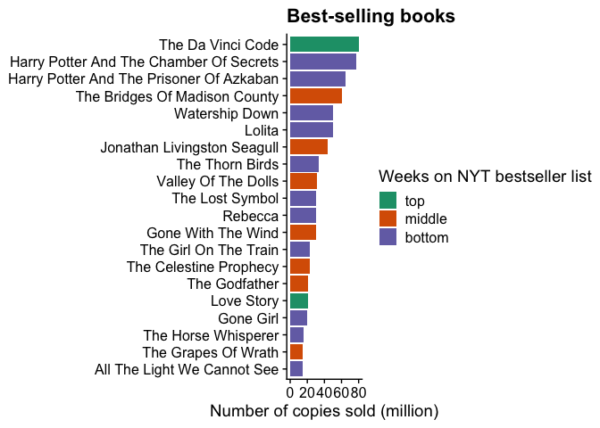

TidyTuesday - Live coding session
================
Ina Bornkessel-Schlesewsky
21/06/2022

Code from a TidyTuesday live coding session. The NYT Bestsellers list
data set was chosen at the beginning of the session.

This document includes several small updates / improvements that were
added after the session.

## Read data

The direct downloads seems to work best to read the tsv files.

``` r
nyt_titles <- readr::read_tsv('https://raw.githubusercontent.com/rfordatascience/tidytuesday/master/data/2022/2022-05-10/nyt_titles.tsv')
```

    ## Rows: 7431 Columns: 8
    ## ── Column specification ────────────────────────────────────────────────────────
    ## Delimiter: "\t"
    ## chr  (2): title, author
    ## dbl  (5): id, year, total_weeks, debut_rank, best_rank
    ## date (1): first_week
    ## 
    ## ℹ Use `spec()` to retrieve the full column specification for this data.
    ## ℹ Specify the column types or set `show_col_types = FALSE` to quiet this message.

``` r
nyt_full <- readr::read_tsv('https://raw.githubusercontent.com/rfordatascience/tidytuesday/master/data/2022/2022-05-10/nyt_full.tsv')
```

    ## Rows: 60386 Columns: 6
    ## ── Column specification ────────────────────────────────────────────────────────
    ## Delimiter: "\t"
    ## chr  (2): title, author
    ## dbl  (3): year, rank, title_id
    ## date (1): week
    ## 
    ## ℹ Use `spec()` to retrieve the full column specification for this data.
    ## ℹ Specify the column types or set `show_col_types = FALSE` to quiet this message.

## Who has held the top spot for longest?

Initial exploration: which books were at \#1 of the bestseller list for
longest?

Note the use of the native pipe `|>` in this script. It provides an
alternative option for piping to the `%>%` pipe from the **magrittr**
package, which is loaded when you load the **tidyverse**. The two pipes
work similarly in many, but not all contexts. See [this blog
post](https://ivelasq.rbind.io/blog/understanding-the-r-pipe/) for a
useful summary.

``` r
# look at the range of years in the data first
range(nyt_full$year)
```

    ## [1] 1931 2020

``` r
# titles with highest no of weeks at #1
nyt_full |> 
  filter(rank == 1) |> 
  count(title, sort = TRUE)
```

    ## # A tibble: 967 × 2
    ##    title                                 n
    ##    <chr>                             <int>
    ##  1 THE DA VINCI CODE                    59
    ##  2 WHERE THE CRAWDADS SING              54
    ##  3 HAWAII                               49
    ##  4 THE CAINE MUTINY                     48
    ##  5 LOVE STORY                           41
    ##  6 THE SOURCE                           41
    ##  7 JONATHAN LIVINGSTON SEAGULL          38
    ##  8 THE BRIDGES OF MADISON COUNTY        38
    ##  9 TRINITY                              36
    ## 10 THE SPY WHO CAME IN FROM THE COLD    34
    ## # … with 957 more rows

``` r
# add year for more information
# this doesn't quite do what we want as it splits up the count by year
nyt_full |> 
  filter(rank == 1) |> 
  count(title, year, sort = TRUE)
```

    ## # A tibble: 1,086 × 3
    ##    title                              year     n
    ##    <chr>                             <dbl> <int>
    ##  1 HAWAII                             1960    37
    ##  2 THE BRIDGES OF MADISON COUNTY      1993    35
    ##  3 LOVE STORY                         1970    34
    ##  4 THE SPY WHO CAME IN FROM THE COLD  1964    34
    ##  5 DESIREE                            1953    32
    ##  6 THE ROBE                           1943    31
    ##  7 AIRPORT                            1968    30
    ##  8 WHERE THE CRAWDADS SING            2019    30
    ##  9 ANATOMY OF A MURDER                1958    29
    ## 10 THE DA VINCI CODE                  2004    28
    ## # … with 1,076 more rows

``` r
# improved version
# added after the session
top_titles <- nyt_full |> 
  filter(rank == 1) |> 
  count(title, year) |> 
  group_by(title) |> 
  mutate(total_weeks = sum(n),
         # note the use of glue to insert variables into strings
         years = glue::glue("{min(year)}-{max(year)}")) |> 
  select(title, total_weeks, years) |> 
  ungroup() |> 
  distinct() |> 
  arrange(-total_weeks)

top_titles
```

    ## # A tibble: 967 × 3
    ##    title                             total_weeks years    
    ##    <chr>                                   <int> <glue>   
    ##  1 THE DA VINCI CODE                          59 2003-2006
    ##  2 WHERE THE CRAWDADS SING                    54 2019-2020
    ##  3 HAWAII                                     49 1960-1961
    ##  4 THE CAINE MUTINY                           48 1951-1952
    ##  5 LOVE STORY                                 41 1970-1971
    ##  6 THE SOURCE                                 41 1965-1966
    ##  7 JONATHAN LIVINGSTON SEAGULL                38 1972-1973
    ##  8 THE BRIDGES OF MADISON COUNTY              38 1993-1995
    ##  9 TRINITY                                    36 1976-1977
    ## 10 THE SPY WHO CAME IN FROM THE COLD          34 1964-1964
    ## # … with 957 more rows

Some additional exploration that didn’t go anywhere. (The idea was to
isolate all titles that were at no. 1 at some point and use this as a
starting point for further analysis. However, this was abandoned quite
quickly to allow us to move on to other things.)

``` r
no1_titles <- nyt_full |> 
  filter(rank == 1) |> 
  select(title) |> 
  pull() |> 
  unique()

nyt_full |> 
  filter(title %in% no1_titles) 
```

    ## # A tibble: 19,453 × 6
    ##     year week        rank title_id title                author         
    ##    <dbl> <date>     <dbl>    <dbl> <chr>                <chr>          
    ##  1  1931 1931-10-12     1     6477 THE TEN COMMANDMENTS Warwick Deeping
    ##  2  1931 1931-10-12     3     5304 THE GOOD EARTH       Pearl S. Buck  
    ##  3  1931 1931-11-16     1     2878 MAID IN WAITING      John Galsworthy
    ##  4  1931 1931-11-30     1     2878 MAID IN WAITING      John Galsworthy
    ##  5  1931 1931-12-07     1     2878 MAID IN WAITING      John Galsworthy
    ##  6  1931 1931-12-07     2     5303 THE GOOD EARTH       Pearl Buck     
    ##  7  1931 1931-12-14     1     2878 MAID IN WAITING      John Galsworthy
    ##  8  1931 1931-12-21     1     2878 MAID IN WAITING      John Galsworthy
    ##  9  1931 1931-12-28     1     2878 MAID IN WAITING      John Galsworthy
    ## 10  1932 1932-01-04     1     2878 MAID IN WAITING      John Galsworthy
    ## # … with 19,443 more rows

## Add sales data

The TT data set does not include any information on how many books were
actually sold. We can add this from Wikipedia.

Define functions for wikipedia table access (taken / adapted from TT
session on High Mountain Deaths from January 2022):

``` r
get_wiki_tables <- function(title){
    wiki_api <- "https://en.wikipedia.org/w/api.php"

    params <- list(action = "parse", 
                   page = title, 
                   format = "xml")
  
    webdata <- GET(url = wiki_api, query = params)
    webdata_xml <- content(webdata)
  
    page_html <- read_html(xml_text(webdata_xml))
    table_elements <- html_nodes(x = page_html, css =".wikitable")

    table_elements
}

convert_table <- function(index){
  html_table(sales_tables[index])[[1]] |>  
    janitor::clean_names() |> 
    # first_published varies in type
    # coerce to integer to allow joining of dfs
    mutate(first_published = as.integer(first_published))
}
```

Get data from first 4 tables on the Wikipedia page “List of best-selling
books”:

``` r
wiki_sales_title <- "List of best-selling books"

sales_tables <- get_wiki_tables(wiki_sales_title)

all_sales <- c(1:4) |>  
  map_df(convert_table) |> 
  drop_na() |> 
  mutate(sales_in_mil = str_extract(approximate_sales,"[:digit:]+"),
         sales_in_mil = as.numeric(sales_in_mil),
         # convert to all lower case to allow joining
         book = str_to_lower(book))
```

    ## Warning in mask$eval_all_mutate(quo): NAs introduced by coercion

    ## Warning in mask$eval_all_mutate(quo): NAs introduced by coercion

Join with NYT data (added after the TT session out of curiosity):

``` r
top_titles_sales <- top_titles |> 
  mutate(title = str_to_lower(title)) |> 
  left_join(all_sales, by = c("title" = "book")) |> 
  mutate(title = str_to_title(title)) |> 
  select(-approximate_sales)

top_titles_sales |> 
  mutate(weeks_cat = cut_interval(total_weeks, n = 3,
                                  labels = c("bottom","middle","top")),
         weeks_cat = fct_relevel(weeks_cat, 
                                levels = c("top","middle",
                                           "bottom"))) |> 
  slice_max(order_by = sales_in_mil, n = 20) |> 
  ggplot(aes(x = fct_reorder(title, sales_in_mil),
             y = sales_in_mil, 
             fill = weeks_cat)) +
  scale_fill_brewer(palette = "Dark2") +
  geom_col() +
  labs(title = "Best-selling books",
       y = "Number of copies sold (million)",
       x = NULL,
       fill = "Weeks on NYT bestseller list") +
  coord_flip() +
  theme_cowplot()
```

    ## Warning: Outer names are only allowed for unnamed scalar atomic inputs

<!-- -->
