Tidy Tuesday Presentation
================
Tabitha McLoughney
2022-07-19

## Honours Data Analysis

### Data importing and tidying

``` r
library(tidyverse)
library(lme4)
library(RColorBrewer)
library(ggrepel)
library(ggpubr)
```

``` r
d <- read_csv("C:\\Users\\Tabi\\Desktop\\Honours\\Data\\participant_info.csv") 
```

``` r
data0 = d[-c(38, 39, 40),]
```

``` r
library(reactable)

reactable(data0)
```

<div id="htmlwidget-8c7b4a5f846d91ec2021" class="reactable html-widget" style="width:auto;height:auto;"></div>
<script type="application/json" data-for="htmlwidget-8c7b4a5f846d91ec2021">{"x":{"tag":{"name":"Reactable","attribs":{"data":{"ID":[1,2,3,4,5,6,7,8,9,10,11,12,13,14,15,16,17,18,19,20,21,22,23,24,25,26,27,28,29,30,31,32,33,34,35,36,37],"Condition":["a","b","a","a","a","b","a","b","a","b","b","b","b","a","b","b","a","a","b","a","b","a","b","a","a","a","b","b","a","a","b","a","b","b","a","b","a"],"Age":[23,33,18,28,24,21,23,20,25,24,27,23,30,25,20,41,21,23,22,33,23,23,21,21,34,18,32,38,22,35,19,19,24,22,19,20,19],"Gender":[1,1,2,1,1,2,1,1,2,2,2,1,2,1,1,2,1,2,1,1,1,2,1,1,1,1,1,2,1,2,1,1,1,2,1,1,1],"HP_score_self":[52,63,16,86,80,16,91,57,67,22,70,21,71,43,80,52,89,28,84,8,46,62,22,79,74,70,56,65,49,43,77,78,65,24,30,58,18],"CFMT":[96,69,78,83,93,69,86,99,76,93,71,82,71,71,90,86,83,71,74,68,90,81,93,92,83,97,93,89,86,75,83,96,82,74,93,72,76],"Hand":[10,10,10,4,10,10,10,10,10,10,10,10,8,8,10,10,10,10,10,10,10,10,10,10,10,10,10,10,3,8,10,10,9,10,10,10,10],"KSS":[3,3,2,2,5,6,4,3,4,3,4,3,2,5,2,2,3,3,4,1,3,2,3,3,3,2,2,3,6,3,3,3,3,2,4,3,2],"HP_score_test_p1":[4,2,2,5,6,4,8,3,4,1,2,0,5,6,5,1,7,4,6,0,3,4,1,6,5,8,5,1,5,0,6,2,5,2,2,3,0],"HP_score_test_p2":[4,6,1,7,7,2,10,6,5,2,3,1,3,5,7,1,6,2,8,0,9,3,2,3,5,8,6,4,3,1,9,2,9,2,0,5,2],"HP_score_test":[8,8,3,12,13,6,18,9,9,3,5,1,8,11,12,2,13,6,14,0,12,7,3,9,10,16,11,5,8,1,15,4,14,4,2,8,2],"HP_score_test_perc":[44.4,44.4,16.7,66.7,72.2,33.3,100,50,50,16.7,27.8,5.5,44.4,61.1,66.7,11.1,72.2,33.3,77.8,0,66.6,38.9,16.7,50,55.6,88.9,61,27.8,44.4,5.6,83.33,22.2,77.8,22.2,11.1,44.4,11.1]},"columns":[{"accessor":"ID","name":"ID","type":"numeric"},{"accessor":"Condition","name":"Condition","type":"character"},{"accessor":"Age","name":"Age","type":"numeric"},{"accessor":"Gender","name":"Gender","type":"numeric"},{"accessor":"HP_score_self","name":"HP_score_self","type":"numeric"},{"accessor":"CFMT","name":"CFMT","type":"numeric"},{"accessor":"Hand","name":"Hand","type":"numeric"},{"accessor":"KSS","name":"KSS","type":"numeric"},{"accessor":"HP_score_test_p1","name":"HP_score_test_p1","type":"numeric"},{"accessor":"HP_score_test_p2","name":"HP_score_test_p2","type":"numeric"},{"accessor":"HP_score_test","name":"HP_score_test","type":"numeric"},{"accessor":"HP_score_test_perc","name":"HP_score_test_perc","type":"numeric"}],"defaultPageSize":10,"paginationType":"numbers","showPageInfo":true,"minRows":1,"dataKey":"d97915aec91e20b2dc6d2ed65a085917"},"children":[]},"class":"reactR_markup"},"evals":[],"jsHooks":[]}</script>

``` r
data0$gender <- as_factor(data0$Gender)
```

### Data distribution

``` r
data0 %>%
  ggplot(aes(x = Age)) +
  geom_histogram(fill = "#80DEEA", colour = "black") +
  labs(title = "Distribution of age in the study sample")
```

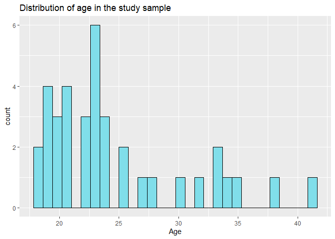<!-- -->

``` r
data0 %>%
  ggplot(aes(x = gender)) +
  geom_histogram(fill = "#B39DDB", colour = "black", stat = "count") +
  xlab("Gender") +
  scale_x_discrete(labels = c("1" = "Women", "2" = "Men")) +
  labs(title = "Distribution of gender in the study sample")
```

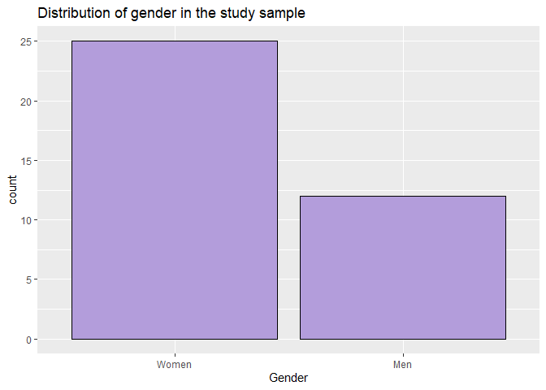<!-- -->

``` r
data0 %>%
  ggplot(aes(x = CFMT)) +
  geom_histogram(fill = "#C5E1A5", colour = "black") +
  labs(title = "Distribution of Cambridge Face Memory Test scores")
```

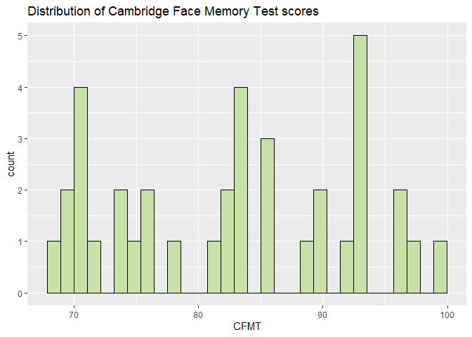<!-- -->

``` r
CFMT2 <- seq(min(data0$CFMT), max(data0$CFMT), length = 40)
fun <- dnorm(CFMT2, mean = mean(data0$CFMT), sd = sd(data0$CFMT))
hist(data0$CFMT, prob = TRUE, col = "white",
     ylim = c(0, max(fun)), 
     main = "Histogram with normal curve for CFMT scores",
     xlab = "CFMT score")
lines(CFMT2, fun, col = 2, lwd = 2)
```

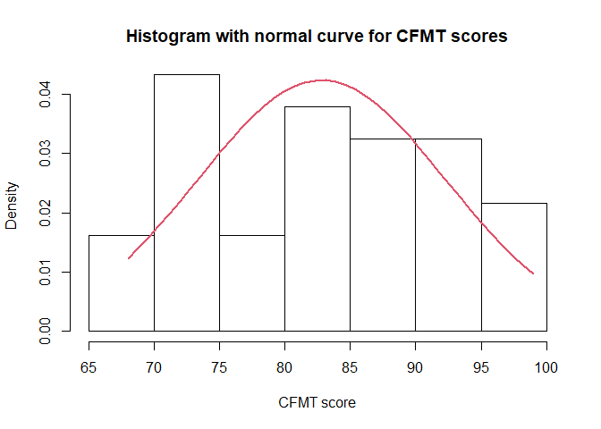<!-- -->

``` r
data0 %>%
  ggplot(aes(x = Hand)) +
  geom_histogram(fill = "#FFE082", colour = "black") +
  labs(title = "Distribution of handedness in the study sample", x = "Handedness score")
```

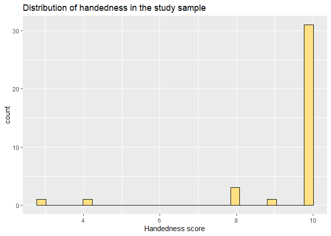<!-- -->

``` r
Hand2 <- seq(min(data0$Hand), max(data0$Hand), length = 40)
fun <- dnorm(Hand2, mean = mean(data0$Hand), sd = sd(data0$Hand))
hist(data0$Hand, prob = TRUE, col = "white",
     ylim = c(0, max(fun)), 
     main = "Histogram with normal curve for handedness scores",
     xlab = "Handedness score")
lines(Hand2, fun, col = 2, lwd = 2)
```

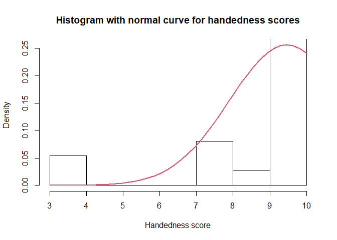<!-- -->

``` r
data0 %>%
  ggplot(aes(x = Age)) +
  geom_histogram(fill = "#80DEEA", colour = "black") +
  facet_wrap(~gender) +
  labs(title = "Distribution of age faceted by gender")
```

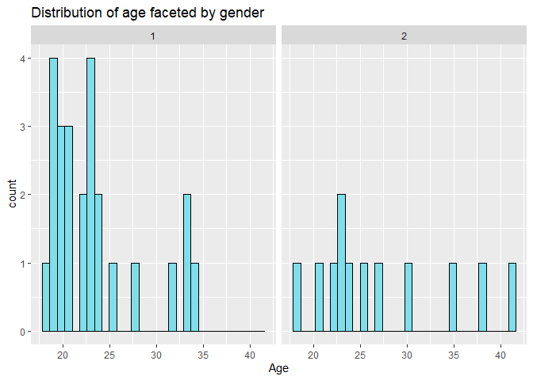<!-- -->

``` r
data <- data0 %>%
  mutate(gender = recode(gender, "1" = "Female", "2" = "Male")) 
```

``` r
reactable(data)
```

<div id="htmlwidget-f6d1a5590419224e75f4" class="reactable html-widget" style="width:auto;height:auto;"></div>
<script type="application/json" data-for="htmlwidget-f6d1a5590419224e75f4">{"x":{"tag":{"name":"Reactable","attribs":{"data":{"ID":[1,2,3,4,5,6,7,8,9,10,11,12,13,14,15,16,17,18,19,20,21,22,23,24,25,26,27,28,29,30,31,32,33,34,35,36,37],"Condition":["a","b","a","a","a","b","a","b","a","b","b","b","b","a","b","b","a","a","b","a","b","a","b","a","a","a","b","b","a","a","b","a","b","b","a","b","a"],"Age":[23,33,18,28,24,21,23,20,25,24,27,23,30,25,20,41,21,23,22,33,23,23,21,21,34,18,32,38,22,35,19,19,24,22,19,20,19],"Gender":[1,1,2,1,1,2,1,1,2,2,2,1,2,1,1,2,1,2,1,1,1,2,1,1,1,1,1,2,1,2,1,1,1,2,1,1,1],"HP_score_self":[52,63,16,86,80,16,91,57,67,22,70,21,71,43,80,52,89,28,84,8,46,62,22,79,74,70,56,65,49,43,77,78,65,24,30,58,18],"CFMT":[96,69,78,83,93,69,86,99,76,93,71,82,71,71,90,86,83,71,74,68,90,81,93,92,83,97,93,89,86,75,83,96,82,74,93,72,76],"Hand":[10,10,10,4,10,10,10,10,10,10,10,10,8,8,10,10,10,10,10,10,10,10,10,10,10,10,10,10,3,8,10,10,9,10,10,10,10],"KSS":[3,3,2,2,5,6,4,3,4,3,4,3,2,5,2,2,3,3,4,1,3,2,3,3,3,2,2,3,6,3,3,3,3,2,4,3,2],"HP_score_test_p1":[4,2,2,5,6,4,8,3,4,1,2,0,5,6,5,1,7,4,6,0,3,4,1,6,5,8,5,1,5,0,6,2,5,2,2,3,0],"HP_score_test_p2":[4,6,1,7,7,2,10,6,5,2,3,1,3,5,7,1,6,2,8,0,9,3,2,3,5,8,6,4,3,1,9,2,9,2,0,5,2],"HP_score_test":[8,8,3,12,13,6,18,9,9,3,5,1,8,11,12,2,13,6,14,0,12,7,3,9,10,16,11,5,8,1,15,4,14,4,2,8,2],"HP_score_test_perc":[44.4,44.4,16.7,66.7,72.2,33.3,100,50,50,16.7,27.8,5.5,44.4,61.1,66.7,11.1,72.2,33.3,77.8,0,66.6,38.9,16.7,50,55.6,88.9,61,27.8,44.4,5.6,83.33,22.2,77.8,22.2,11.1,44.4,11.1],"gender":["Female","Female","Male","Female","Female","Male","Female","Female","Male","Male","Male","Female","Male","Female","Female","Male","Female","Male","Female","Female","Female","Male","Female","Female","Female","Female","Female","Male","Female","Male","Female","Female","Female","Male","Female","Female","Female"]},"columns":[{"accessor":"ID","name":"ID","type":"numeric"},{"accessor":"Condition","name":"Condition","type":"character"},{"accessor":"Age","name":"Age","type":"numeric"},{"accessor":"Gender","name":"Gender","type":"numeric"},{"accessor":"HP_score_self","name":"HP_score_self","type":"numeric"},{"accessor":"CFMT","name":"CFMT","type":"numeric"},{"accessor":"Hand","name":"Hand","type":"numeric"},{"accessor":"KSS","name":"KSS","type":"numeric"},{"accessor":"HP_score_test_p1","name":"HP_score_test_p1","type":"numeric"},{"accessor":"HP_score_test_p2","name":"HP_score_test_p2","type":"numeric"},{"accessor":"HP_score_test","name":"HP_score_test","type":"numeric"},{"accessor":"HP_score_test_perc","name":"HP_score_test_perc","type":"numeric"},{"accessor":"gender","name":"gender","type":"factor"}],"defaultPageSize":10,"paginationType":"numbers","showPageInfo":true,"minRows":1,"dataKey":"e6976921eb6a1f3afd43e2900fabb633"},"children":[]},"class":"reactR_markup"},"evals":[],"jsHooks":[]}</script>

``` r
data %>%
  ggplot(aes(x = CFMT)) +
  geom_histogram(fill = "#C5E1A5", colour = "black") +
  facet_wrap(~gender) +
  labs(title = "Distribution of Cambridge Face Memory Test scores faceted by gender")
```

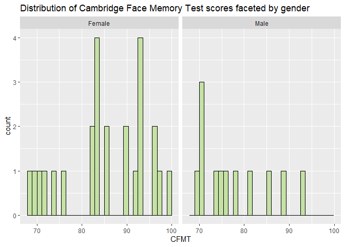<!-- -->

``` r
data %>%
  ggplot(aes(x = HP_score_self)) +
  geom_histogram(fill = "#F48FB1", colour = "black") +
  facet_wrap(~gender) +
  xlab("Harry potter knowledge self score (%)") +
  labs(title = "Distribution of Harry Potter knowledge self scores faceted by gender")
```

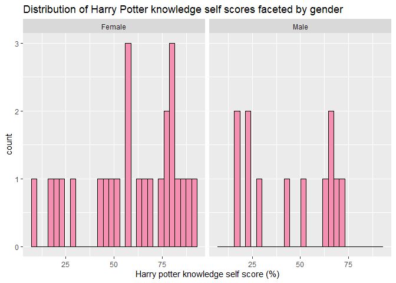<!-- -->

``` r
data %>%
  ggplot(aes(x = Age)) +
  geom_histogram(fill = "#80DEEA", colour = "black") +
  facet_grid(gender~Condition) +
  labs(title = "Distribution of participant age, faceted by condition and gender")
```

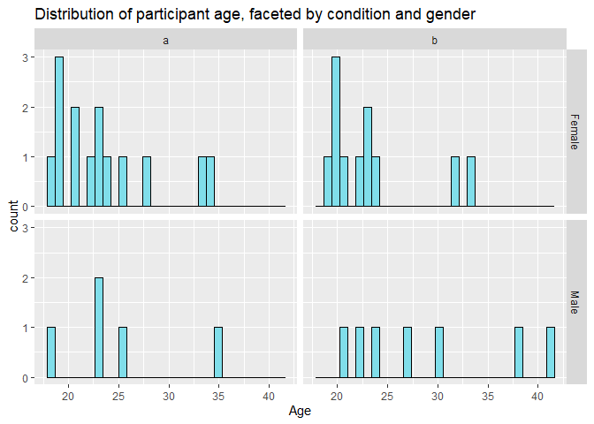<!-- -->

``` r
data%>%
  ggplot(aes(x = gender, y = Age)) +
  geom_boxplot(fill = "#B39DDB") +
  stat_summary(fun.y = "mean", geom = "point", shape = 23, size = 3, fill = "#80DEEA") +
  facet_wrap(~Condition) +
  labs(title = "Distribution of age and gender, faceted by condition", x = "Gender")
```

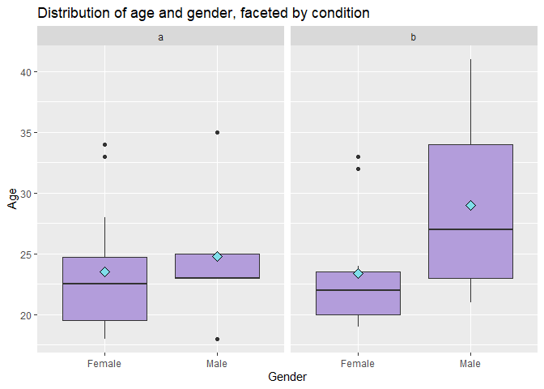<!-- -->

``` r
data %>%
  ggplot(aes(x = CFMT)) +
  geom_histogram(fill = "#C5E1A5", colour = "black") +
  facet_grid(gender~Condition) +
  labs(title = "Distribution of participant Cambridge Face Memory Test scores, faceted by \n condition and gender")
```

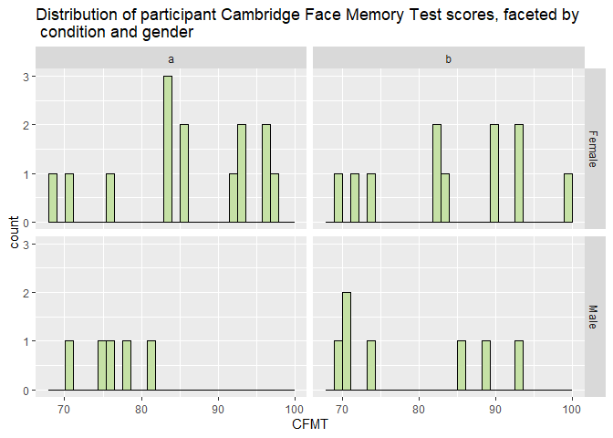<!-- -->

``` r
data%>%
  ggplot(aes(x = gender, y = CFMT)) +
  geom_boxplot(fill = "#B39DDB") +
  stat_summary(fun.y = "mean", geom = "point", shape = 23, size = 3, fill = "#C5E1A5") +
  facet_wrap(~Condition) +
  labs(title = "Distribution of Cambridge Face Memory Test and gender, \n faceted by condition", x = "Gender", y = "Cambridge Face Memory Test")
```

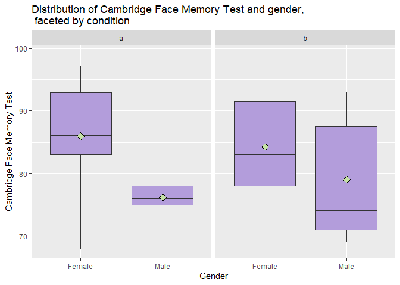<!-- -->

``` r
data%>%
  ggplot(aes(x = Condition, y = Age)) +
  geom_boxplot(fill = "#80DEEA") +
  stat_summary(fun.y = "mean", geom = "point", shape = 23, size = 3, fill = "#FFF59D") +
  labs(title = "Distribution of age and condition")
```

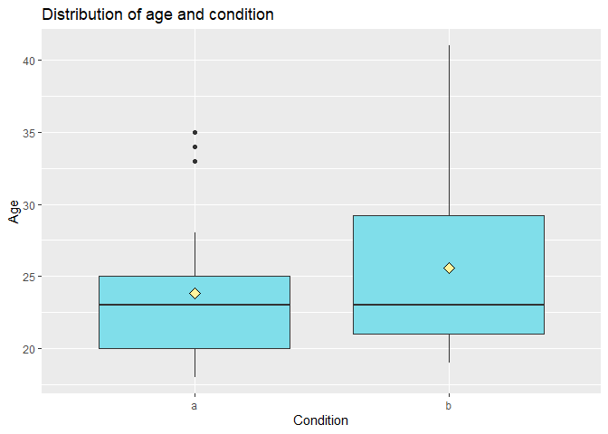<!-- -->

``` r
data%>%
  ggplot(aes(x = Condition, y = CFMT)) +
  geom_boxplot(fill = "#C5E1A5") +
  stat_summary(fun.y = "mean", geom = "point", shape = 23, size = 3, fill = "#F48FB1") +
  labs(title = "Distribution of Cambridge Face Memory Test and condition", x = "Condition", y = "Cambridge Face Memory Test")
```

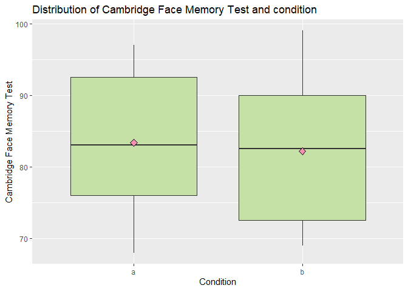<!-- -->

``` r
data %>%
  ggplot(aes(x = gender)) +
  geom_histogram(fill = "#B39DDB", colour = "black", stat = "count") +
  facet_wrap(~Condition) +
  labs(title = "Distribution of gender by condition", x = "Gender")
```

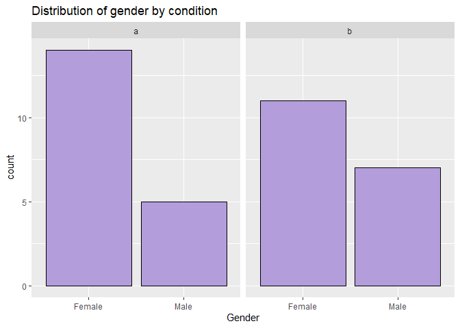<!-- -->

``` r
data%>%
  ggplot(aes(x = Condition, y = HP_score_test_perc)) +
  geom_boxplot(fill = "#F48FB1") +
  stat_summary(fun.y = "mean", geom = "point", shape = 23, size = 3, fill = "#ECEFE1") +
  ylab("Quiz score (%)") +
  labs(title = "Harry Potter knowledge quiz score distribution by condition")
```

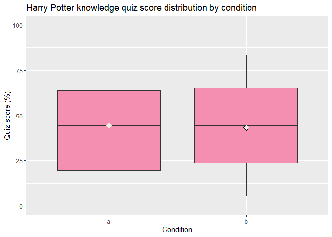<!-- -->

### Scatterplots and correlations

``` r
data %>%
  ggplot(aes(x = Age, y = CFMT, colour = gender)) +
  geom_point() +
  stat_cor(method = "pearson", label.x = 35, p.digits = .1) +
  geom_smooth(method=lm, se = FALSE) +
  scale_color_brewer(palette = "Paired") +
  labs(colour = "Gender", title = "The relationship between participant age and Cambridge Face Memory \n Test score")
```

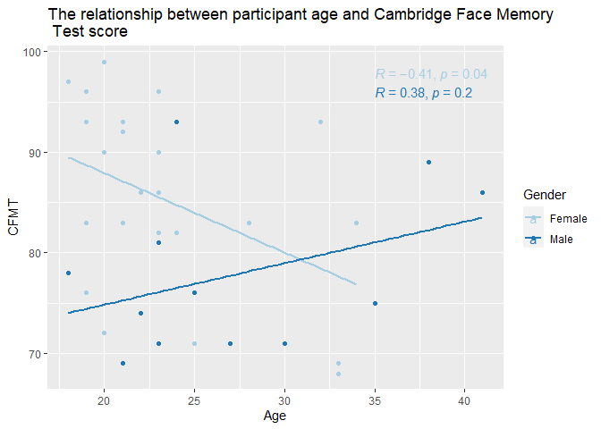<!-- -->

``` r
data %>%
  ggplot(aes(x = Age, y = CFMT, colour = gender)) +
  geom_point() +
  stat_cor(method = "pearson", label.x = 25, p.digits = .1) +
  geom_smooth(method=lm, se = FALSE) +
  facet_wrap(~Condition) +
  scale_color_brewer(palette = "Set2") +
  labs(colour = "Gender", title = "The relationship between participant age and Cambridge Face Memory \n Test score")
```

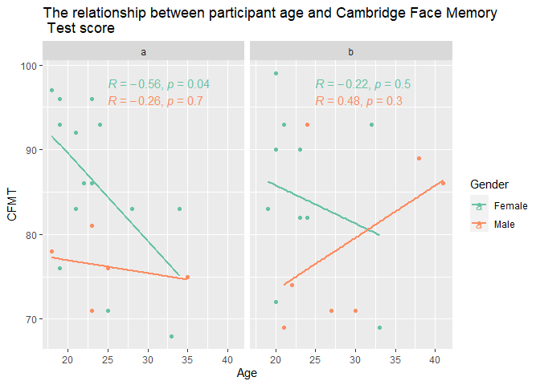<!-- -->

``` r
fun_color_range <- colorRampPalette(c("#9C27B0", "#F44336"))
```

``` r
my_colors <- fun_color_range(40) 
```

``` r
data %>%
  ggplot(aes(x = HP_score_self, y = HP_score_test_perc, colour = -Age)) +
  geom_point() +
  stat_cor(method = "pearson", label.x = 0, label.y = 100, p.digits = .1) +
  geom_smooth(method = "lm", colour = "#FFA000") +
  scale_colour_gradientn(colors = my_colors) +
  facet_wrap(~gender) +
  ggtitle("The relationship between Harry Potter knowledge self score and quiz score \n faceted by gender.") +
  xlab("Self score") +
  ylab("Quiz score") +
  labs(colour = "Age")
```

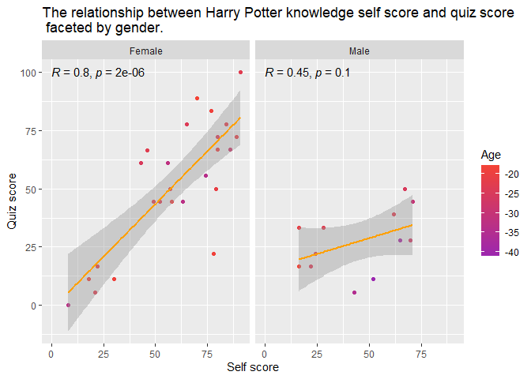<!-- -->

``` r
data %>%
  ggplot(aes(x = Age, y = HP_score_test_perc)) +
  geom_point(colour = "#5C6BC0") +
  stat_cor(method = "pearson", label.x = 15, label.y = 115, p.digits = .1) +
  geom_smooth(method = "lm", colour = "#FF5722") +
  facet_wrap(~gender) +
  ggtitle("The relationship between age and Harry Potter knowledge quiz score, \n faceted by gender.") +
  xlab("Age") +
  ylab("Quiz score")
```

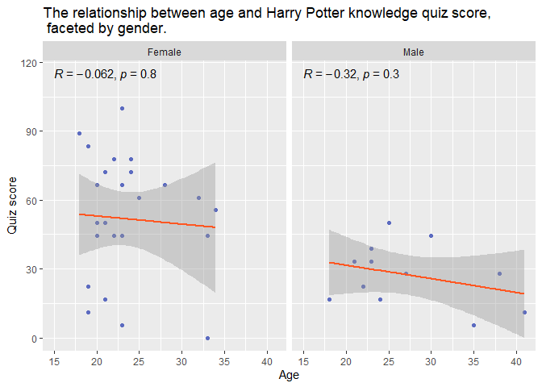<!-- -->

``` r
data %>%
  ggplot(aes(x = CFMT, y = HP_score_test_p2, colour = HP_score_test_p1)) +
  geom_point() +
  geom_smooth(method = "lm", col = "#311B92") +
  stat_cor(method = "pearson", label.x = 65, label.y = 10, p.digits = .1) +
  scale_colour_gradientn(colors = my_colors1) +
  ggtitle("The relationship between Cambridge Face Memory Test scores and Harry \n Potter knowledge quiz part 2 scores") +
  xlab("Cambridge Face Memory Test") +
  ylab("Harry Potter quiz part 2 score") +
  labs(colour = "Harry Potter quiz part 1 score")
```

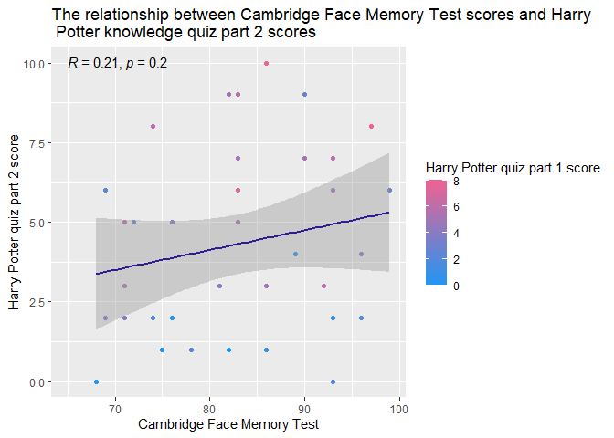<!-- -->

``` r
data%>%
  ggplot(aes(x = HP_score_self, y = HP_score_test_perc, colour = -Age, col = "#00C0B8")) +
  geom_point() +
  stat_cor(method = "pearson", label.x = 3, label.y = 115, p.digits = .1) +
  scale_colour_gradientn(colors = my_colors2) +
  geom_smooth(method = "lm", col = "#33691E") +
  facet_wrap(~Condition) +
  labs(x = "Self score", y = "Quiz score", colour = "Age", title = "The relationship between Harry Potter knowledge subjective and objective \n scores, faceted by condition.")
```

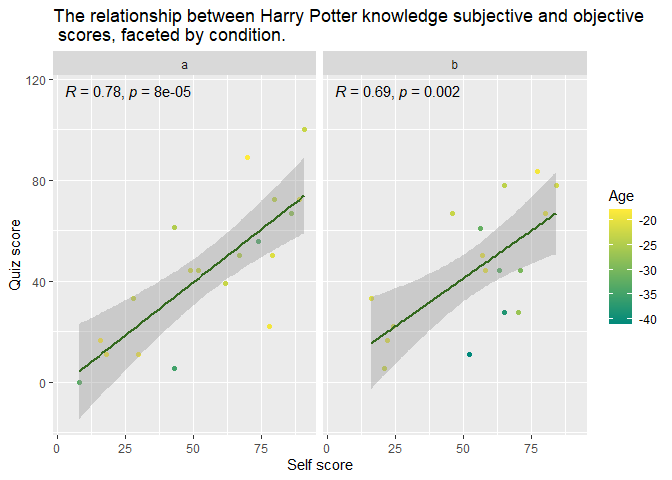<!-- -->

``` r
data %>%
  ggplot(aes(x = HP_score_test_p1, y = HP_score_test_p2)) +
  geom_point() +
  stat_cor(method = "pearson", label.x = .5, label.y = 10) +
  geom_smooth(method=lm, col='#F48FB1') +
  labs(x = "Quiz score for part 1 (cued recall)", y = "Quiz score for part 2 (free recall)", title = "The relationship between part 1 and part 2 scores from the Harry Potter \n knowledge quiz.")
```

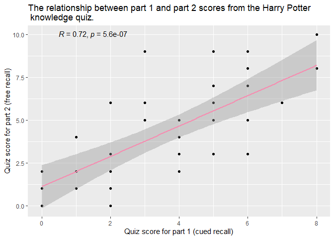<!-- -->

``` r
data %>%
  ggplot(aes(x = HP_score_test_p1, y = HP_score_test_p2)) +
  geom_point() +
  stat_cor(method = "pearson", label.x = .5, label.y = 10) +
  geom_smooth(method=lm, col="#F48FB1") +
  facet_wrap(~Condition) +
  labs(x = "Quiz score for part 1 (cued recall)", y = "Quiz score for part 2 (free recall)", title = "The relationship between part 1 and part 2 scores from the Harry Potter \n knowledge quiz, faceted by condition.")
```

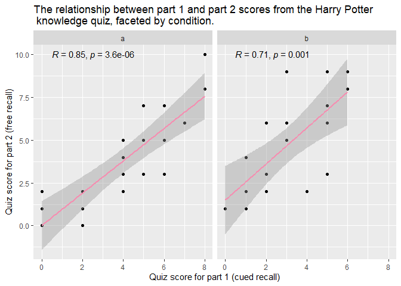<!-- -->

``` r
data %>% 
  mutate(group = case_when(
    between(Age, 18, 23) ~ "18-23",
    between(Age, 24, 29) ~ "24-29",
    between(Age, 30, 35) ~ "30-35",
    between(Age, 36, 41) ~ "36-41",
    TRUE ~ NA_character_
  )) %>%
  ggplot(aes(x = HP_score_self, y = HP_score_test_perc)) +
  geom_point(colour = "#5C6BC0") +
  facet_wrap(~group) +
  stat_cor(method = "pearson", label.x = .5, label.y = 110) +
  geom_smooth(method=lm, se = FALSE, col="#283523") +
  labs(x = "Self score", y = "Quiz score")
```

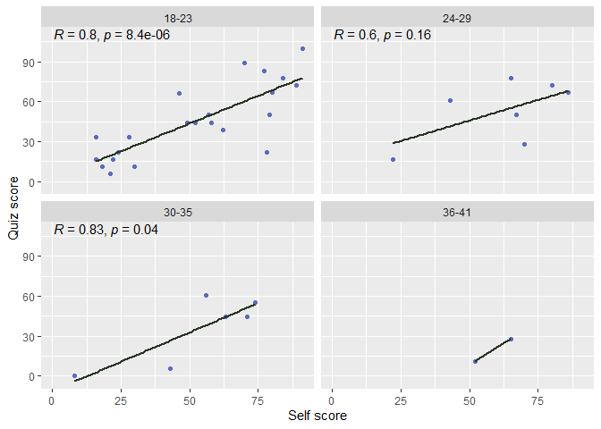<!-- -->
