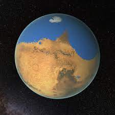

Load libraries

```{r setup,message=FALSE}
library(tidyverse)
library(readxl)
library(patchwork)
library(ggpattern)
library(ggimage)
library(purrr)
library(lubridate)
```

## Some background info 

Sol by sol (day by day) mission logs can be found here: https://pds-geosciences.wustl.edu/ made publicly available by The Geosciences Node of NASA's Planetary Data System. The purpose of the data system is to curate data archives to aid the terrestrial study of planets and celestial bodies. 

The datasets for this project are based on high-level information on Martian rover activities and can be found under the "Mission summaries" tab. Most information on Rover activities are derived from mission reports. 

The 4 rovers we will explore today include: Twin 2004 rovers: Spirit and Opportunity, 2012 Curiosity and the latest 2020 rover Perseverance. Here is a "family portrait":


## Loading datasets

Let us begin loading and inspecting the datasets. Begin by creating a list of files using a wildcard pattern match with the `list.files` function. Use `map` function from `purrr` package to load files iteratively via the `read_excel` function.
```{r}
files= list.files(path = "data/", pattern = "*.xlsx", full.names = T)
load_files= map(files, read_excel)

```

Create a list of rover names and use `names` function to name the four datasets in the `load_files` list. 

```{r}
rover_names=c("perseverance","spirit","opportunity","curiosity")
names(load_files) = rover_names
map(load_files,head)
```

The datasets offer useful information regarding rover activity which can be used to map out each rover's overall performance. For example,we can examine whether a rover has met/meets its mission expectations, how each iteration of a NASA Martian Rover has improved with time and lastly what we may be able to expect in terms of future rovers and their capabilities. We should first get an idea of how long each rover has been on Mars AND in contact with NASA. 

## Years on Mars

Begin by extracting  earth year information using the `year` function from `lubridate` and then count how many unique year values there are in each rover dataset. Once again, use `map` to do this iterately. 

```{r}
years_on_mars=map(load_files,function(x) x%>%mutate(earth_date=year(x[5][[1]])) %>% group_by(earth_date)%>%count()%>%nrow())

print(years_on_mars)
```


Aesthetic plotting with `ggimage` and `geom_col_pattern`. First create a list of rover images and include it to ggplot of list of rover years on Mars. 

```{r}
rover_img= c("https://d2pn8kiwq2w21t.cloudfront.net/images/28-mission-current-MSL-Curiosity-alt.height-700.png","https://upload.wikimedia.org/wikipedia/commons/thumb/0/07/Mars_2020_Rover_-_Artist%27s_Concept.png/1200px-Mars_2020_Rover_-_Artist%27s_Concept.png","https://upload.wikimedia.org/wikipedia/commons/thumb/0/07/Mars_2020_Rover_-_Artist%27s_Concept.png/1280px-Mars_2020_Rover_-_Artist%27s_Concept.png","https://mars.nasa.gov/layout/mer/images/mars-exploration-rover.png")

years_on_mars%>%as_tibble()%>% pivot_longer(cols = 1:4) %>% ggplot(aes(name,value)) +geom_col_pattern(pattern='circle',fill="white",width=0.5,pattern_angle=5,size=2)+  geom_image(aes(image=rover_img),size=0.2) +theme_minimal()+ylab("Number of years alive on Mars")+ xlab("Rover")
```


It looks like Opportunity has spent more than 15 years alive on Mars! This is accurate as Opportunity is in fact a record-breaking rover. In contrast, its twin Spirit has lasted half that time but has made some incredible discoveries of Martian past as we will see later. Curiosity and Perseverance are still alive and going strong. 

Although NASA rovers are often record-breakers, how do we go about evaluating their performance? 

## Distance traveled 

One of the most important tasks as a rover exploring foreign terrain is to be able to move. Let us explore how each rover has achieved this. 

Use the `map2` function to loop over the datasets and rover names list so that we can assign titles to our ggplots. 

```{r}

map2(load_files,rover_names,function(x,y) ggplot(x,aes(Sol,`Start site`))+geom_line(colour="red",size=1,linetype=4)+ggtitle(y)+theme_minimal())
```

Compared to all previous rovers, Perseverance's movements seem a little more flexible and variable. One reason for this is that Perseverance has a more advanced self driving navigation system enabling faster and easier driving over terrains and obstacles (enabling it to go where no rover has gone before).Interestingly, Spirit and Opportunity have a similar pattern in their movements while Curiosity's driving appears to remain on the rise. 

## Number of activities

We may be able to detect the general number of activities undertaken by each rover on a daily basis. The activity column separates each activity with commas and conjunctions like "and". Hence we can calculate the number of separators to get a general idea on the number of daily rover activities. To do this, we can create a custom function called `activties_per_day` which includes the `str_count` function and plotting capabilities so we can obtain a visual result. 

Use `map2` to then apply our custom function over the rover datasets. 

```{r}
#example
load_files$spirit$Activity[1]

activities_per_day <- function(data,rover_name) {
    df=data%>%mutate(act_num=str_count(Activity, c(",|and ")))
    p1=ggplot(df, aes(Sol, act_num,))+geom_smooth(alpha=0.5,colour="red")+ggtitle(rover_name)+theme_minimal()+ylab("Number of activties per Sol")
    return(p1)
}

map2(load_files,rover_names,activities_per_day)
```

As expected we see a steep decline in the number of daily activities undertaken by Spirit and Opportunity. Curiosity has a relatively variable activity pattern but seems to going well and Perseverance's number of daily activities seems to be at an all time high lately. Compared to the twin rovers, both Curiosity and Perseverance seem to be undertaking almost twice the number of daily activities. This is a good sign that the rovers' scientific capabilities are increasing as their technologies improve. 

## Key activities
Speaking of rover activities, what are some of the main activities undertaken  by the rover? Broadly speaking NASA rovers have gone with the mission of identifying signs of a watery Martian past, evidence for microbial life supporting elements and the latest rover is even tasked with sending martian soil/rock samples back to earth!

To this end, the rovers are equipped (in addition to driving capabilities) with robotic arms capable of closeup analysis and also remote sensing abilities. 

Let us focus on the following tasks: remote sensing (using spectrometry), driving and in-situ observations (tools attached to robotic arm capable of imaging, brushing, detailed spectrometry). 

To do this, we need to detect certain keywords in the activity descriptions. it will be easier if we first create a function called `detect_label_activity`. This function is capable of detecting key terms using the `str_detect` function and then generating different plots to visually illustrate the frequency of key activities. 

```{r}
#detect and mutate using at least three key descriptions 
detect_label_actvity=function(dat,rover_name,Act1,Act2,Act3){
    data=dat%>%mutate(timeline=case_when(str_detect(dat$Activity,Act1)~Act1,str_detect(dat$Activity,Act2)~Act2,str_detect(dat$Activity,Act3)~Act3))
    data$timeline[is.na(data$timeline)] <- "other"
    p1=ggplot(data, aes(timeline)) + geom_bar()
    p2=ggplot(data, aes(Sol, timeline))+   stat_density(
    aes(fill = after_stat(density)),
    geom = "raster",
    position = "identity"
)+scale_fill_gradientn(colours=c("red","yellow"))+geom_point(colour="brown",alpha=0.5,shape=3) +ggtitle(rover_name)
    return(p1+p2)
}

map2(load_files,rover_names,function(x, y) detect_label_actvity(x,y,"Observation","Drive","Remote Sensing"))
```

It is interesting to observe that rover activity appears to occur periodically potentially as a reflection of strategic mission planning to optimise the rover's life and battery. 

## Low activity periods

What were the rovers mainly doing during "low activity"  periods"? Can this be used to predict the life expectancy of a martian rover?


```{r}
map2(load_files,rover_names, function(x,y) x%>%mutate(act_num=str_count(Activity, c(",|and "))) %>% filter(act_num==0)%>% detect_label_actvity(rover_name = y,"Observation","Drive","Sensing"))
```


Another interesting observation! During periods of "low activity", the rovers mostly engage in "remote sensing" potentially because it involves the lowest energy consumption. Other activities such as driving and close-up observations (drilling, brushing, detailed spectrometry via robotic arm) are reduced during "low activity periods". Maybe a sign of rovers approaching its demise is to observe its activity patterns and capabilities.

## Key discoveries and achievements!

Spirit and opportunity  made great strides in identifying evidence of a watery Martian past. For example, within craters, Opportunity discovered mineral gypsum, clay minerals and hematite spheres which point towards signs of water and potentially even ancient microbial life. Additionally, Spirit discovered at "Home Plate" signs of ancient volcano eruptions. Curiosity on the other hand discovered organic molecules at a location called "Mount Sharp" further supporting Mars as a planet which once had the potential to host life. Lastly, Perseverance's greatest achievement (thus far and in my opinion) is carrying with it and deploying the first ever helicopter on Mars, its friend: Ingenuity!




We can plot the Sols and sites when and where these key achievements were made by first listing each achievement and then using the `map2` function as we have done thus far. 

```{r}
achievements=c("Helicopter","Home Plate","Crater","Sharp")

map2(load_files,achievements,function(x,y)x%>%filter(str_detect(Activity,y)==TRUE) %>% ggplot(aes(Sol,`Start site`))+geom_jitter(colour="red")+theme_minimal())
```

We see that perseverance often interacts with its helicopter friend, Curiosity only spent a small amount of time drilling into and analysing Mount Sharp, Spirit remains at Home plate as its resting place  where it made one of its greatest discovery and Opportunity spent a lot of its time within Martian craters. 


## Future directions as Perseverance perseveres

Perseverance's capabilities were not done full justice here and requires its own researching and analysis. The rover is capable of various analysis techniques and is virtually a scientist on wheels. As more data on perseverance become available, we may be able to better understand its capabilities and the implications of the rover's findings on future rover design and potentially Mars as a future human home planet. 


## Fun replication of NASA's logo

Thank you for joining me in my presentation today. Here is a logo I made using `geom_tile` based on the NASA Mars 2020 Mission logo. Boldy Go!

```{r}
df <- data.frame(
    x = c(1.5,2,2.5,3,2),
    y = c(0.91,1,1,0.91,1.09)
   
)
ggplot(df, aes(x, y)) +
    geom_tile(fill="black") + theme(panel.background  = element_rect(fill="red"),panel.grid = element_line(colour="red"), plot.background  = element_rect(fill="black")) +geom_point(aes(x=3,y=1.15),shape=8,size=8) +geom_text(label="To Boldy Go",aes(1.5,1.15),size=5) +
theme(axis.text.x=element_blank(),
      axis.ticks.x=element_blank(),
      axis.text.y=element_blank(),
      axis.ticks.y=element_blank())
```

