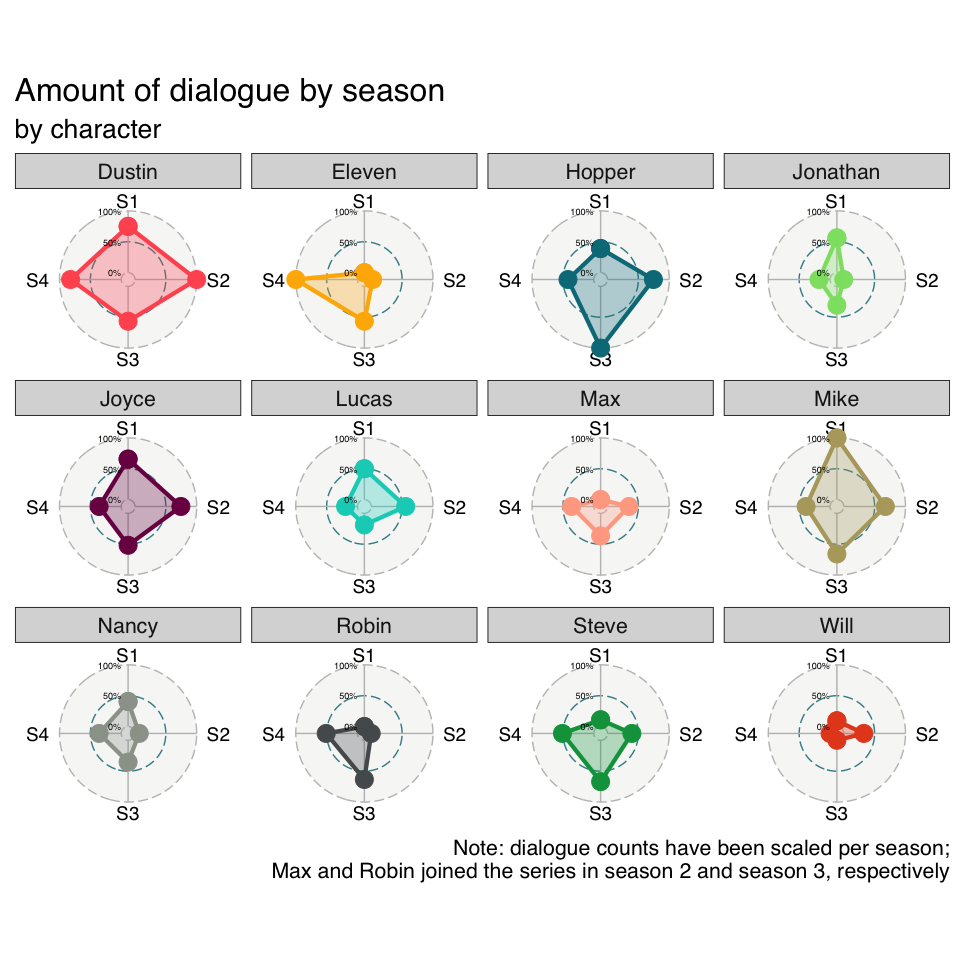
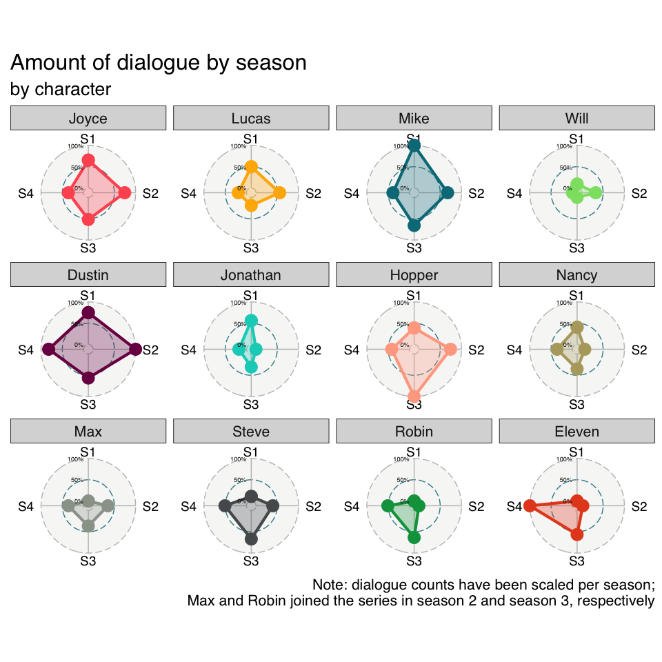
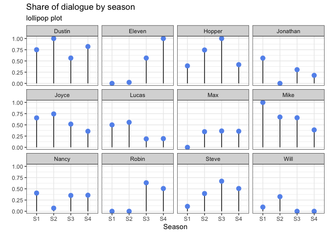
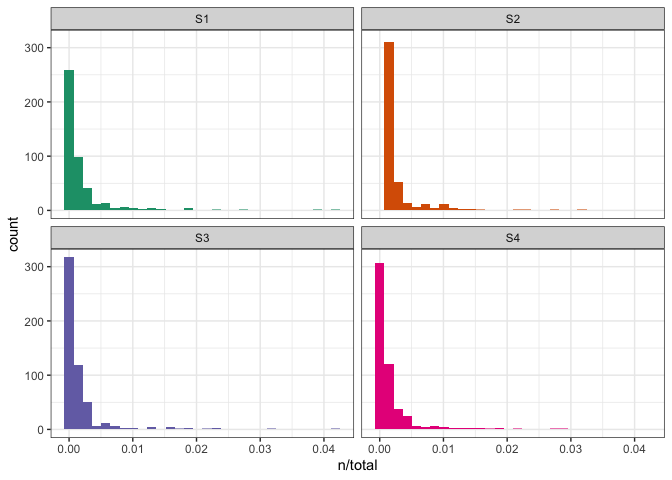
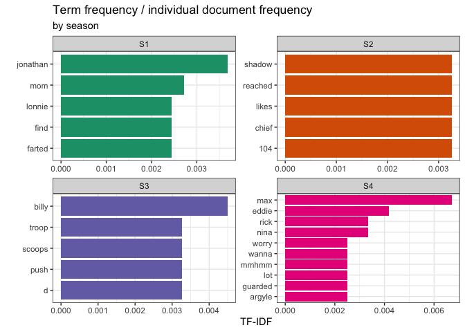
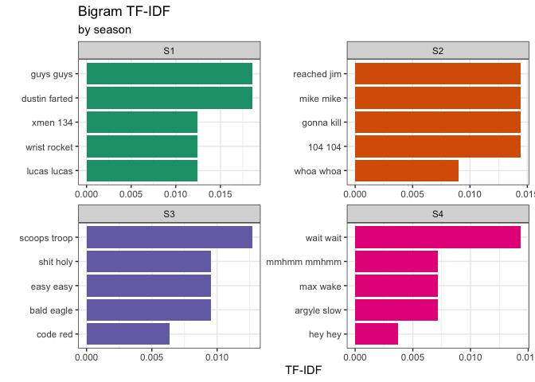
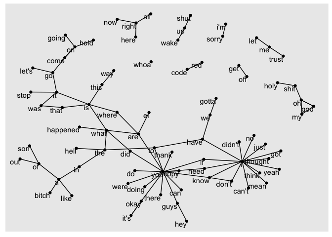
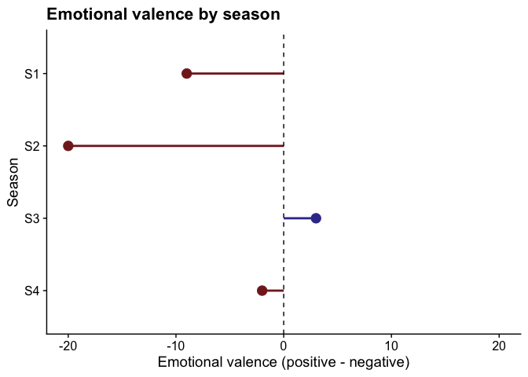
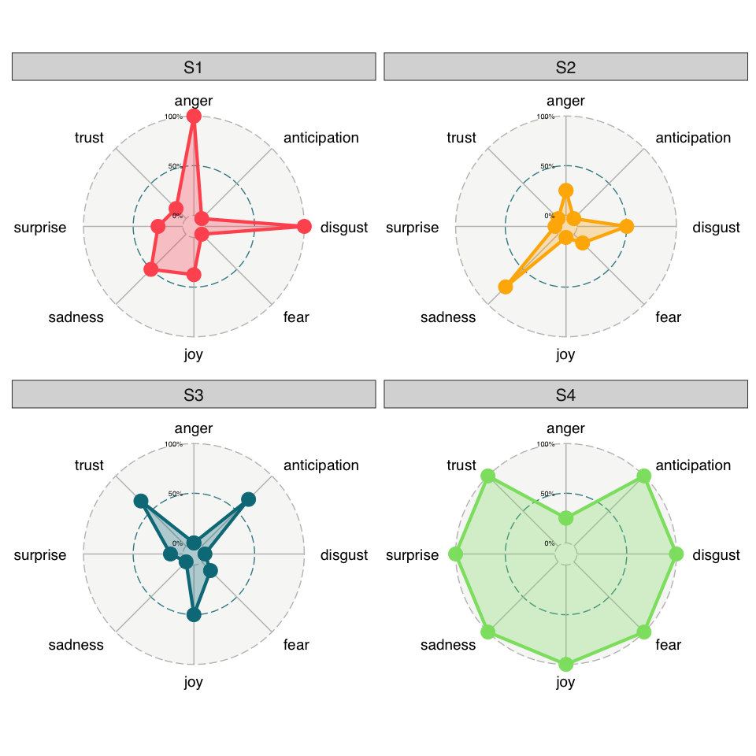

Stranger Things dialogue
================
Ina Bornkessel-Schlesewsky
2022-11-08

``` r
library(tidyverse)
library(tidytext)
library(ggradar)
library(scales)
library(ggpubr)
library(ggalt)
library(cowplot)
library(igraph)
library(ggraph)
```

## Read and inspect data

``` r
episodes <- readr::read_csv('https://raw.githubusercontent.com/rfordatascience/tidytuesday/master/data/2022/2022-10-18/episodes.csv')
all_dialogue <- readr::read_csv('https://raw.githubusercontent.com/rfordatascience/tidytuesday/master/data/2022/2022-10-18/stranger_things_all_dialogue.csv')
```

``` r
episodes
```

    # A tibble: 34 × 6
       season episode title                               direc…¹ writt…² original…³
        <dbl>   <dbl> <chr>                               <chr>   <chr>   <date>    
     1      1       1 Chapter One: The Vanishing of Will… The Du… The Du… 2016-07-15
     2      1       2 Chapter Two: The Weirdo on Maple S… The Du… The Du… 2016-07-15
     3      1       3 Chapter Three: Holly, Jolly         Shawn … Jessic… 2016-07-15
     4      1       4 Chapter Four: The Body              Shawn … Justin… 2016-07-15
     5      1       5 Chapter Five: The Flea and the Acr… The Du… Alison… 2016-07-15
     6      1       6 Chapter Six: The Monster            The Du… Jessie… 2016-07-15
     7      1       7 Chapter Seven: The Bathtub          The Du… Justin… 2016-07-15
     8      1       8 Chapter Eight: The Upside Down      The Du… Paul D… 2016-07-15
     9      2       1 Chapter One: MADMAX                 The Du… The Du… 2017-10-27
    10      2       2 Chapter Two: Trick or Treat, Freak  The Du… The Du… 2017-10-27
    # … with 24 more rows, and abbreviated variable names ¹​directed_by,
    #   ²​written_by, ³​original_release_date

``` r
all_dialogue
```

    # A tibble: 32,519 × 8
       season episode  line raw_text                 stage…¹ dialo…² start…³ end_t…⁴
        <dbl>   <dbl> <dbl> <chr>                    <chr>   <chr>   <time>  <time> 
     1      1       1     1 [crickets chirping]      [crick… <NA>    00'07"  00'09" 
     2      1       1     2 [alarm blaring]          [alarm… <NA>    00'49"  00'51" 
     3      1       1     3 [panting]                [panti… <NA>    00'52"  00'54" 
     4      1       1     4 [elevator descending]    [eleva… <NA>    01'01"  01'02" 
     5      1       1     5 [elevator dings]         [eleva… <NA>    01'09"  01'10" 
     6      1       1     6 [breathing heavily]      [breat… <NA>    01'15"  01'17" 
     7      1       1     7 [low growling]           [low g… <NA>    01'28"  01'31" 
     8      1       1     8 [screaming]              [screa… <NA>    01'35"  01'36" 
     9      1       1     9 [Mike] Something is com… [Mike]  Someth… 01'44"  01'48" 
    10      1       1    10 A shadow grows on the w… <NA>    A shad… 01'48"  01'52" 
    # … with 32,509 more rows, and abbreviated variable names ¹​stage_direction,
    #   ²​dialogue, ³​start_time, ⁴​end_time

## Who has the largest share of the dialogue?

``` r
characters <- c("Mike", "Dustin", "Lucas", "Will", "Eleven",
                "Nancy", "Jonathan", "Steve", "Max", "Robin",
                "Joyce", "Hopper")

char_regex <- characters[1]

for (i in 2:length(characters)){
  char_regex <- str_c(char_regex, characters[i], sep="|")
}

# only keep rows with dialogue from one of the main characters
# for simplicty, we only keep the first-named character
# when multiple are speaking
all_dialogue_sel <- all_dialogue |> 
  filter(str_detect(stage_direction,char_regex)) |> 
  mutate(character = str_extract(stage_direction,
                                     char_regex))
```

Start with a basic count

``` r
all_dialogue_sel |> 
  count(character, sort = TRUE)
```

    # A tibble: 12 × 2
       character     n
       <chr>     <int>
     1 Dustin      253
     2 Mike        234
     3 Hopper      229
     4 Joyce       201
     5 Eleven      175
     6 Steve       174
     7 Lucas       144
     8 Nancy       142
     9 Jonathan    133
    10 Robin       119
    11 Max         113
    12 Will         79

<div class="panel-tabset">

### Radar / spider plot

Plot by season using a radar (or spider) plot

``` r
dia_count_by_season <- all_dialogue_sel |> 
  count(character,season) |> 
  # add total count per season
  group_by(season) |> 
  mutate(total_season = sum(n)) |> 
  ungroup() |> 
  # calculate proportion of dialogue (within main chars)
  mutate(prop_dia = n/total_season*100) |> 
  select(character,season,prop_dia) |> 
  pivot_wider(
    names_from = season,
    values_from = prop_dia,
    names_prefix = "S"
  )

dia_count_by_season2 <- all_dialogue_sel |> 
  count(character, season) |> 
  pivot_wider(
  names_from = season,
  values_from = n,
  names_prefix = "S"
  ) |> 
  rename(group = character) |> 
  mutate(across(-group, scales::rescale)) |> 
  mutate(across(-group, ~ replace_na(.x,0)))
```

``` r
dia_count_by_season2 |> 
  ggradar(
    fill = TRUE,
    fill.alpha = 0.3,
    grid.label.size = 3,
  ) +
  facet_wrap(~group) +
  guides(colour = "none") +
  labs(
    title = "Amount of dialogue by season",
    subtitle = "by character",
    caption = "Note: dialogue counts have been scaled per season;\nMax and Robin joined the series in season 2 and season 3, respectively"
  )
```



Resources for generating this type of plot:

-   from [R
    Bloggers](https://www.r-bloggers.com/2022/10/ggradar-radar-plots-with-ggplot-in-r/)
-   from
    [Datanovia](https://www.datanovia.com/en/blog/beautiful-radar-chart-in-r-using-fmsb-and-ggplot-packages/#ggplot-radar-chart-using-the-ggradar-r-package)

Group by similarity

``` r
dia_similarity <- dia_count_by_season2 |> 
  pivot_longer(cols = -group) |> 
  pivot_wider(
    names_from = group,
    values_from = value
  ) |> 
  select(-name) |> 
  corrr::correlate() |> 
  arrange(Eleven)
```

Order radar plot by similarity: code from
[here](https://github.com/business-science/free_r_tips/blob/master/055_ggradar/055_ggradar.R).
Not sure how insightful this actually is though – given that the sorting
is character dependent, this really depends on which character you want
to focus on.

``` r
dia_count_by_season2 |> 
  mutate(group = factor(group, 
                        levels = dia_similarity$term)) |> 
  ggradar(
    fill = TRUE,
    fill.alpha = 0.3,
    grid.label.size = 3,
  ) +
  facet_wrap(~group) +
  guides(colour = "none") +
  labs(
    title = "Amount of dialogue by season",
    subtitle = "by character",
    caption = "Note: dialogue counts have been scaled per season;\nMax and Robin joined the series in season 2 and season 3, respectively"
  )
```



### Dot plot

Dot or lollipop plot

``` r
dia_by_season_long <- dia_count_by_season2 |> 
  pivot_longer(
    cols = -group,
    names_to = "season",
    values_to = "value",
  )

dia_by_season_long |> 
  ggplot(aes(x = season, y = value)) +
  # from ggalt package
  geom_lollipop(
    point.colour = "cornflowerblue",
    point.size = 3
  ) +
  labs(
    title = "Share of dialogue by season",
    subtitle = "lollipop plot",
    x = "Season",
    y = ""
  ) +
  facet_wrap(~group) +
  theme_bw()
```



</div>

## Which words / phrases are most important per season?

We look at this by using the “term frequency inverse document frequency”
(tf-idf) – from [Text Mining with
R](https://www.tidytextmining.com/index.html), Chapter 3.

> The statistic tf-idf is intended to measure how important a word is to
> a document in a collection (or corpus) of documents, for example, to
> one novel in a collection of novels or to one website in a collection
> of websites.

-   **tf**: how frequently a word occurs in a document
-   **idf**: decreases weights for words that are frequently used in a
    collection of documents

$$
idf(term) = ln(\frac{n_{documents}}{n_{documents\ containing\ term}})
$$

<div class="panel-tabset">

### Unigrams

``` r
all_words <- all_dialogue_sel |> 
  select(-c(raw_text, stage_direction,
            start_time, end_time)) |> 
  unnest_tokens(word, dialogue) |> 
  count(season, word, sort = TRUE) |> 
  drop_na() |> 
  mutate(season = str_c("S",season))

total_words <- all_words |> 
  group_by(season) |> 
  summarise(total = sum(n))

words_by_season <- all_words |> 
  left_join(total_words, by = "season")
```

Plot distribution by season

``` r
words_by_season |> 
  ggplot(aes(n/total, fill = season)) +
  geom_histogram() +
  facet_wrap(~season) +
  guides(fill = "none") +
  theme_bw() +
  scale_fill_brewer(palette = "Dark2")
```



Calculate tf-idf and look at most distinctive words

``` r
words_tf_idf <- words_by_season |> 
  bind_tf_idf(word,season,n)

words_tf_idf |> 
  arrange(-tf_idf)
```

    # A tibble: 1,948 × 7
       season word         n total      tf   idf  tf_idf
       <chr>  <chr>    <int> <int>   <dbl> <dbl>   <dbl>
     1 S4     max         16  1653 0.00968 0.693 0.00671
     2 S3     billy       11  1697 0.00648 0.693 0.00449
     3 S4     eddie        5  1653 0.00302 1.39  0.00419
     4 S1     jonathan     9  1697 0.00530 0.693 0.00368
     5 S4     nina         4  1653 0.00242 1.39  0.00335
     6 S4     rick         4  1653 0.00242 1.39  0.00335
     7 S3     d            4  1697 0.00236 1.39  0.00327
     8 S3     push         4  1697 0.00236 1.39  0.00327
     9 S3     scoops       4  1697 0.00236 1.39  0.00327
    10 S3     troop        4  1697 0.00236 1.39  0.00327
    # … with 1,938 more rows

Plot by season

``` r
words_tf_idf |> 
  group_by(season) |> 
  slice_max(tf_idf, n=5) |> 
  ungroup() |> 
  ggplot(aes(x= tf_idf, 
             y = fct_reorder(word,tf_idf),
             fill = season)) +
  geom_col() +
  scale_fill_brewer(palette = "Dark2") +
  facet_wrap(~season, ncol=2, scales = "free") +
  guides(fill = "none") +
  labs(
    title = "Term frequency / individual document frequency",
    subtitle = "by season",
    x = "TF-IDF",
    y = ""
  ) +
  theme_bw()
```



### Bigrams

``` r
all_bigrams <- all_dialogue_sel |> 
  select(-c(raw_text, stage_direction,
            start_time, end_time)) |> 
  unnest_tokens(bigram, dialogue, 
                token = "ngrams", n = 2) |> 
  separate(bigram, into = c("word1", "word2"), 
           sep = " ", remove = FALSE)
```

Most frequent bigrams across all seasons:

``` r
all_bigrams |> 
  count(bigram, sort = TRUE) |> 
  drop_na() 
```

    # A tibble: 3,324 × 2
       bigram        n
       <chr>     <int>
     1 go go        96
     2 come on      89
     3 are you      36
     4 my god       27
     5 oh my        26
     6 this is      26
     7 i don't      24
     8 do you       23
     9 let's go     20
    10 all right    17
    # … with 3,314 more rows

Remove stop words

``` r
bigrams_sel <- all_bigrams |> 
  filter(!word1 %in% stop_words$word,
         !word2 %in% stop_words$word)

bigrams_sel |> 
  count(bigram, sort = TRUE) |> 
  drop_na() 
```

    # A tibble: 348 × 2
       bigram           n
       <chr>        <int>
     1 hey hey         11
     2 holy shit       11
     3 shit shit       11
     4 whoa whoa        8
     5 code red         6
     6 hey guys         5
     7 jesus christ     4
     8 scoops troop     4
     9 wait wait        4
    10 bald eagle       3
    # … with 338 more rows

Look at tf-idf:

``` r
bigram_tf_idf <- bigrams_sel |> 
  count(season, bigram)  |> 
  bind_tf_idf(bigram, season, n) |> 
  arrange(-tf_idf)

bigram_tf_idf |> 
  group_by(season) |> 
  slice_max(order_by = tf_idf, n = 5) |> 
  ungroup() |> 
  mutate(season = str_c("S", season)) |> 
  ggplot(aes(x = tf_idf, y = fct_reorder(bigram,tf_idf),
             fill = season)) +
  geom_col() +
  scale_fill_brewer(palette = "Dark2") +
  facet_wrap(~season, ncol=2, scales = "free") +
  guides(fill = "none") +
  labs(
    title = "Bigram TF-IDF",
    subtitle = "by season",
    x = "TF-IDF",
    y = ""
  ) +
  theme_bw()
```



Create a graph with dependencies using the igraph package:

``` r
bigram_counts <- all_bigrams |> 
  count(word1, word2, sort = TRUE) |> 
  drop_na()

bigram_graph <- bigram_counts |> 
  filter(n >= 5) |> 
  graph_from_data_frame()

bigram_graph |> 
  ggraph(layout = "fr") +
  geom_edge_link() +
  geom_node_point() +
  geom_node_text(aes(label = name), vjust = 1, hjust = 1)
```



</div>

## Sentiment analysis

NRC sentiments are from [Mohammad & Turney
(2012)](https://onlinelibrary.wiley.com/doi/abs/10.1111/j.1467-8640.2012.00460.x?casa_token=mup9Gbn896cAAAAA:jIIFEau36S9xE-VQcO2mNGubrxA7g6x4s9i_97h6PA7Jn68FKa--NNMd1LnmrayCokehZr7p637sSxkrLA).

``` r
nrc_sentiments <- get_sentiments("nrc")

nrc_sentiments
```

    # A tibble: 13,872 × 2
       word        sentiment
       <chr>       <chr>    
     1 abacus      trust    
     2 abandon     fear     
     3 abandon     negative 
     4 abandon     sadness  
     5 abandoned   anger    
     6 abandoned   fear     
     7 abandoned   negative 
     8 abandoned   sadness  
     9 abandonment anger    
    10 abandonment fear     
    # … with 13,862 more rows

``` r
nrc_sentiments |> 
  count(sentiment, sort = TRUE)
```

    # A tibble: 10 × 2
       sentiment        n
       <chr>        <int>
     1 negative      3316
     2 positive      2308
     3 fear          1474
     4 anger         1245
     5 trust         1230
     6 sadness       1187
     7 disgust       1056
     8 anticipation   837
     9 joy            687
    10 surprise       532

``` r
nrc_posneg <- nrc_sentiments |> 
  filter(sentiment %in% c("positive", "negative"))

nrc_emo <- nrc_sentiments |> 
  filter(!sentiment %in% c("positive", "negative"))
```

Join sentiments with words by season, calculate a positive-negative
difference score and plot.

``` r
words_posneg <- words_by_season |> 
  inner_join(nrc_posneg)

words_emo_diff <- words_posneg |> 
  count(season,sentiment) |> 
  pivot_wider(names_from = sentiment,
              values_from = n) |> 
  mutate(emo = positive - negative)

words_emo_diff |> 
  mutate(emo_cat = case_when(
    emo < 0 ~ "neg",
    emo > 0 ~ "pos"),
    season = factor(season, levels=c("S4","S3","S2","S1"))
  ) |> 
  ggplot(aes(x=emo, y =season, colour = emo_cat)) +
  geom_point(size=4) +
  geom_segment(aes(xend=0, yend=season), size = 1) +
  xlim(c(-20,20)) +
  scale_colour_manual(values = c(muted("red"),
                                 muted("blue"))) +
  geom_vline(xintercept = 0, linetype = "dashed") +
  labs(
    title = "Emotional valence by season",
    x = "Emotional valence (positive - negative)",
    y = "Season"
  ) +
  theme_cowplot() +
  guides(colour = "none")
```



Plot emotional profile per season using a radar plot

``` r
words_emo <- words_by_season |> 
  inner_join(nrc_emo) |> 
  count(season,sentiment) |> 
  pivot_wider(
    names_from = sentiment,
    values_from = n
  ) |> 
  mutate(across(-season, rescale))

words_emo |> 
  rename(group = season) |> 
  ggradar(
    fill = TRUE,
    fill.alpha = 0.3,
    grid.label.size = 3,
  ) +
  facet_wrap(~group) +
  guides(colour = "none")
```


