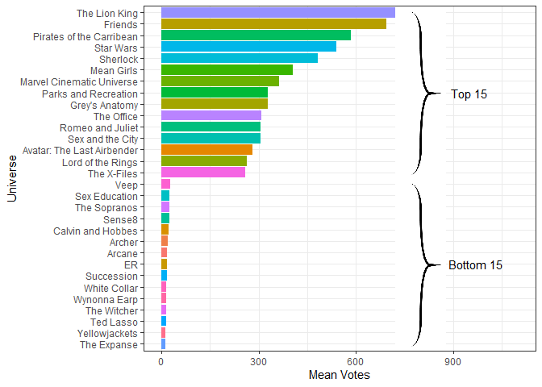
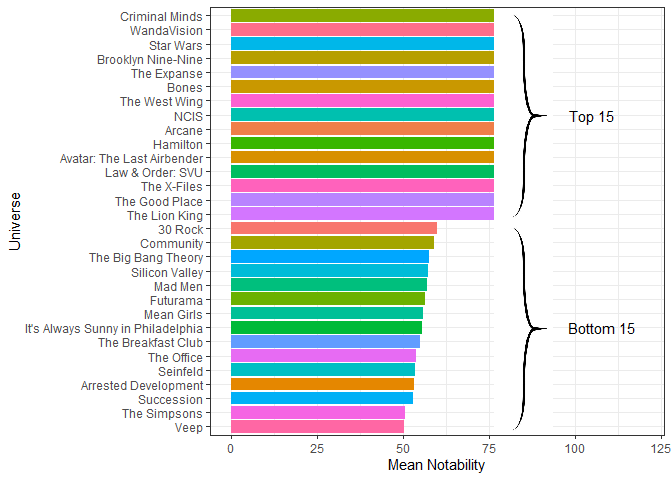

2022-12-06_open-psychometrics_HC
================
Hayley Caldwell
2022-11-29

The Open Psychometrics project involves a website which provides a
collection of interactive personality tests, one of which is the
Statistical “Which Character” Personality Quiz. This quiz takes your
subjective ratings from a selection of dichotomous traits, then
correlates them with the ratings given to various TV and film
characters, to then list which characters your personality scores
correlate with. The ratings of characters have been taken from ratings
given by members of the public on the website. 800 of these characters
from a randomly selected 100 universes are included in these data.

``` r
# view(characters)
# view(psych_stats) 
```

``` r
# unique(psych_stats$question) 
  # 400 questions, including 35 emoji questions

# get rid of emojis 
psych_stats1 <- psych_stats %>% 
  filter(grepl("[A-Za-z]", question))

characters1 <- characters %>% 
  rename("char_name" = name) %>% 
  rename("char_id" = id) %>% 
  select(-uni_name, -char_id, -uni_id) %>% 
  group_by(char_name) %>% 
  slice_max(notability) %>%  # multiple entries per char for different shows 
  ungroup()
```

``` r
# which characters and shows have been rated the most?

# combine charaters and psych_stats 
char_psych <- left_join(characters, psych_stats1)
```

    ## Joining, by = c("uni_id", "uni_name")

``` r
# rank shows by number of votes, then cut off first and last 15
show_ratings <- char_psych %>% 
  group_by(uni_name) %>% 
  mutate(mean_votes = mean(number_ratings)) %>% 
  select(uni_name, mean_votes) %>% 
  distinct() %>% 
  arrange(-mean_votes)

# top 15
shows_t15 <- show_ratings %>% 
  head(15)

# bottom 15
shows_b15 <- show_ratings %>% 
  tail(15)

shows_bt15 <- full_join(shows_b15, shows_t15)
```

    ## Joining, by = c("uni_name", "mean_votes")

``` r
# bar graph number of votes per show 
show_ratings_bt15.g <- ggplot(shows_bt15, aes(x = reorder(uni_name, mean_votes), y = mean_votes, fill = uni_name)) +
  geom_col() +
  coord_flip() +
  theme_bw() +
  theme(legend.position = "none") +
  xlab("Universe")+
  ylab("Mean Votes") +
  annotate("text", y = 950, x = 23, label = "Top 15") +
  annotate("text", y = 970, x = 8, label = "Bottom 15") +
  geom_image(mapping = aes(x = 23, y = 800, image = 'bracket.png'), size = 0.13) +
  geom_image(mapping = aes(x = 8, y = 800, image = 'bracket.png'), size = 0.13)  + 
  scale_y_continuous(limits=c(0,1100))
show_ratings_bt15.g
```

<!-- -->

``` r
# which show has most notable characters?

characters %>% 
  arrange(-notability) %>% 
  head(20)
```

    ## # A tibble: 20 × 7
    ##    id    name              uni_id uni_name                 notab…¹ link  image…²
    ##    <chr> <chr>             <chr>  <chr>                      <dbl> <chr> <chr>  
    ##  1 WC1   Neal Caffrey      WC     White Collar                96.9 http… https:…
    ##  2 TW12  Omar Little       TW     The Wire                    95.4 http… https:…
    ##  3 TWCH2 Ciri              TWCH   The Witcher                 95.4 http… https:…
    ##  4 BSG1  William Adama     BSG    Battlestar Galactica        95.1 http… https:…
    ##  5 HP3   Hermione Granger  HP     Harry Potter                95   http… https:…
    ##  6 KE1   Villanelle        KE     Killing Eve                 95   http… https:…
    ##  7 VK5   Ragnar Lothbrok   VK     Vikings                     94.9 http… https:…
    ##  8 TNG1  Jean-Luc Picard   TNG    Star Trek: The Next Gen…    94.7 http… https:…
    ##  9 SCDL1 Olivia Pope       SCDL   Scandal                     94.6 http… https:…
    ## 10 TWCH3 Yennefer          TWCH   The Witcher                 94.5 http… https:…
    ## 11 ALA1  Aang              ALA    Avatar: The Last Airben…    94   http… https:…
    ## 12 TIU1  Jack Pearson      TIU    This Is Us                  93.9 http… https:…
    ## 13 WW1   Josiah Bartlet    WW     The West Wing               93.8 http… https:…
    ## 14 LOTR6 Gandalf           LOTR   Lord of the Rings           93.7 http… https:…
    ## 15 YJ1   Shauna            YJ     Yellowjackets               93.7 http… https:…
    ## 16 BSG2  Laura Roslin      BSG    Battlestar Galactica        93.7 http… https:…
    ## 17 WSW1  Dolores Abernathy WSW    Westworld                   93.4 http… https:…
    ## 18 TP1   Dale Cooper       TP     Twin Peaks                  93.4 http… https:…
    ## 19 WD8   Daryl Dixon       WD     The Walking Dead            93.2 http… https:…
    ## 20 PKB1  Thomas Shelby     PKB    Peaky Blinders              93   http… https:…
    ## # … with abbreviated variable names ¹​notability, ²​image_link

``` r
notable_shows <- characters %>% 
  group_by(uni_name) %>% 
  mutate(mean_notability = mean(notability)) %>% 
  select (uni_name, mean_notability) %>% 
  distinct() %>% 
  arrange(-mean_notability)

# top 15
notable_shows_t15 <- notable_shows %>% 
  head(15)

# bottom 15
notable_shows_b15 <- notable_shows %>% 
  tail(15)

notable_shows_bt15 <- full_join(notable_shows_b15, notable_shows_t15)
```

    ## Joining, by = c("uni_name", "mean_notability")

``` r
# bar graph notability for top and bottom shows 
notable_shows_bt15.g <- ggplot(notable_shows_bt15, aes(x = reorder(uni_name, mean_notability), y = mean_notability, fill = uni_name)) +
  geom_col() +
  coord_flip() +
  theme_bw() +
  theme(legend.position = "none") +
  xlab("Universe") +
  ylab("Mean Notability") +
  annotate("text", y = 105, x = 23, label = "Top 15") +
  annotate("text", y = 108, x = 8, label = "Bottom 15") +
  geom_image(mapping = aes(x = 23, y = 85, image = 'bracket.png'), size = 0.13) +
  geom_image(mapping = aes(x = 8, y = 85, image = 'bracket.png'), size = 0.13) + 
  scale_y_continuous(limits=c(0,120))
notable_shows_bt15.g
```

<!-- -->

``` r
# notability and mean votes relationship?

notable_show_ratings <- left_join(notable_shows, show_ratings)
```

    ## Joining, by = "uni_name"

``` r
notable_show_ratings.g <- ggplot(notable_show_ratings, aes(x = mean_notability, y = mean_votes)) +
  geom_point(colour = "#EB941F") +
  geom_smooth(colour = "#10BE48") +
  theme_bw() +
  xlab("Notability") +
  ylab("Votes") +
  theme(legend.position = "none")
notable_show_ratings.g
```

    ## `geom_smooth()` using method = 'loess' and formula = 'y ~ x'

<!-- -->

``` r
# which character has the highest rating for ~30 OP traits

# choose ~30 fun traits 
# unique(psych_stats1$personality)

fun_stats <- c("neat", "messy", "practical", "imaginative", "dominant", "submissive", "beautiful", "ugly", "loud", "quiet", "psychopath", "empath", "high IQ", "low IQ", "nerd", "jock", "feminine", "masculine", "weird", "normal", "chaotic", "orderly", "optimistic", "pessimistic", "Coke", "Pepsi", "introvert", "extrovert", "stinky", "fresh", "'right-brained'", "'left-brained'", "German", "English")

fun_stats1 <- c("messy", "imaginative", "dominant", "beautiful", "loud", "empath", "high IQ", "jock", "feminine", "normal", "chaotic", "optimistic", "Coke", "extrovert", "fresh", "'left-brained'", "English")
fun_stats2 <- c("neat", "practical", "submissive", "ugly", "quiet", "psychopath", "low IQ", "nerd", "masculine", "weird", "orderly", "pessimistic", "Pepsi", "introvert", "stinky", "'right-brained'", "German")
```

``` r
# group by trait, slice max, plot photos and names on graph
psych_stats_34 <- psych_stats1 %>% 
  filter(personality %in% fun_stats) %>% 
  group_by(personality) %>% 
  slice_max(avg_rating) %>% 
  mutate(avg_rating_di = case_when(
    personality %in% fun_stats1 ~ (avg_rating *-1),
    personality %in% fun_stats2 ~ avg_rating),
    group = case_when(
    personality %in% fun_stats1 ~ "1",
    personality %in% fun_stats2 ~ "2"),
    avg_rating_label = case_when(
      avg_rating_di <0 ~ (avg_rating_di + 40),
      avg_rating_di >0 ~ (avg_rating_di - 40)
    )) %>% 
  filter(!char_name %in% c("Alexis Rose", "Sam Obisanya", "Ilana Wexler")) %>% # ties
  ungroup()

psych_char_34 <- left_join(psych_stats_34, characters1)
```

    ## Joining, by = "char_name"

``` r
# plot side by side 
psych_char_34.g <- ggplot(psych_char_34, aes(x = question, y = avg_rating_di, fill = group)) +
  geom_col() +
  theme_bw() +
  theme(legend.position = "none") +
  coord_flip() +
  xlab("Question") +
  ylab("Rating") +
  geom_hline(aes(yintercept=0)) +
  scale_fill_manual(values=c("#EB941F", "#10BE48")) +
  geom_image(mapping = aes(image = image_link)) +
  geom_text(aes(y = avg_rating_label, x = question, label = char_name))
psych_char_34.g
```

<!-- -->

``` r
# word clouds to compare very different TV shows on what psychometric traits define them

# pick 3 very different TV shows
# unique(characters$uni_name)

# hamilton
hamilton_ratings <- char_psych %>% 
  filter(uni_name %in% c("Hamilton")) %>% 
  group_by(personality) %>% 
  mutate(mean_rating = mean(avg_rating)) %>% 
  select(uni_name, mean_rating, personality) %>% 
  distinct()%>% 
  with(wordcloud(personality, mean_rating, random.order=FALSE, scale=c(2,0.1), colors=brewer.pal(100, "Dark2")))
```

<!-- -->

``` r
# harry potter 
hp_ratings <- char_psych %>% 
  filter(uni_name %in% c("Harry Potter")) %>% 
  group_by(personality) %>% 
  mutate(mean_rating = mean(avg_rating)) %>% 
  select(uni_name, mean_rating, personality) %>% 
  distinct() %>% 
  with(wordcloud(personality, mean_rating, random.order=FALSE, scale=c(2,0.1), colors=brewer.pal(100, "YlOrBr")))
```

<!-- -->

``` r
#star wars 
starwars_ratings <- char_psych %>% 
  filter(uni_name %in% c("Star Wars")) %>% 
  group_by(personality) %>% 
  mutate(mean_rating = mean(avg_rating)) %>% 
  select(uni_name, mean_rating, personality) %>% 
  distinct() %>% 
  with(wordcloud(personality, mean_rating, random.order=FALSE, scale=c(2,0.1), colors=brewer.pal(100, "Spectral")))
```

<!-- -->

``` r
# spider web graphs

# spongebob vs squidward

sb_stats_10 <- c("messy/neat", "imaginative/practical", "beautiful/ugly", "loud/quiet", "high IQ/low IQ", "optimistic/pessimistic", "extrovert/introvert", "fresh/stinky", "comedic/dramatic", "cruel/kind")

sb_stats <- psych_stats1 %>% 
  filter(question %in% sb_stats_10,
         char_name %in% c("SpongeBob SquarePants", "Squidward Tentacles")) %>%
  mutate(scaled_rating = case_when(
    personality %in% c("introvert", "neat", "practical", "ugly", "quiet", "low IQ", "pessimistic", "stinky", "dramatic", "kind") ~ (100 - avg_rating),
    personality %in% c("extrovert", "messy", "imaginative", "beautiful", "loud", "high IQ", "optimistic", "fresh", "comedic", "cruel") ~ avg_rating
  )) %>% 
  select(char_name, question, scaled_rating) %>% 
  pivot_wider(names_from = question, values_from = scaled_rating) %>% 
  select(!char_name)

# plot
rownames(sb_stats) <- c("SpongeBob", "Squidward") #Spongebob = orange, Squidward = green
```

    ## Warning: Setting row names on a tibble is deprecated.

``` r
sb_stats <- rbind(rep(100,25) , rep(0,25) , sb_stats)
```

    ## Warning in rbind(deparse.level, ...): number of columns of result, 10, is not a
    ## multiple of vector length 25 of arg 1

    ## Warning in rbind(deparse.level, ...): number of columns of result, 10, is not a
    ## multiple of vector length 25 of arg 2

``` r
coul <- c("#EB941F", "#10BE48")
colours_border <- coul
colours_in <- alpha(coul,0.3)

radarchart(sb_stats, axistype=1, plwd=4, plty=1, cglty=1, cglwd=0.8, vlcex=0.8,
    pcol=colours_border, pfcol=colours_in, 
    cglcol="grey", axislabcol="grey", caxislabels=seq(0, 100, 25))
```

<!-- -->

``` r
# legend(x=1, y=1, legend = rownames(sb_stats[-c(1,2),]), bty = "n", pch=20 , col=colours_in , text.col = "grey", cex=1.2, pt.cex=3)
```

``` r
# Darth Vader vs Luke Skywalker 

sw_stats <- psych_stats1 %>% 
  filter(question %in% sb_stats_10,
         char_name %in% c("Luke Skywalker", "Darth Vader")) %>%
  mutate(scaled_rating = case_when(
    personality %in% c("introvert", "neat", "practical", "ugly", "quiet", "low IQ", "pessimistic", "stinky", "dramatic", "kind") ~ (100 - avg_rating),
    personality %in% c("extrovert", "messy", "imaginative", "beautiful", "loud", "high IQ", "optimistic", "fresh", "comedic", "cruel") ~ avg_rating
  )) %>% 
  select(char_name, question, scaled_rating) %>% 
  pivot_wider(names_from = question, values_from = scaled_rating) %>% 
  select(!char_name)

# plot
rownames(sw_stats) <- c("Vader", "Luke") # vader = red, Luke = blue
```

    ## Warning: Setting row names on a tibble is deprecated.

``` r
sw_stats <- rbind(rep(100,25) , rep(-0,25) , sw_stats)
```

    ## Warning in rbind(deparse.level, ...): number of columns of result, 10, is not a
    ## multiple of vector length 25 of arg 1

    ## Warning in rbind(deparse.level, ...): number of columns of result, 10, is not a
    ## multiple of vector length 25 of arg 2

``` r
coul2 <- c("#FB4A33", "#3398FB")
colours_border2 <- coul2
colours_in2 <- alpha(coul2,0.3)

radarchart(sw_stats, axistype=1, plwd=4, plty=1, cglty=1, cglwd=0.8, vlcex=0.8,
    pcol=colours_border2, pfcol=colours_in2, 
    cglcol="grey", axislabcol="grey", caxislabels=seq(0, 100, 25))
```

<!-- -->

``` r
# legend(x=1, y=1, legend = rownames(sw_stats[-c(1,2),]), bty = "n", pch=20 , col=colours_in2 , text.col = "grey", cex=1.2, pt.cex=3)
```

There was also data about the same character’s in relation to their
Myers-Briggs scores. Myers Briggs is a common personality measurement
which provides takers with a 4 letter personality code based on 4
dichotomous trait pairs (Extrovert-Introvert, Sensing-Intuiting,
Thinking-Feeling, and Judging-Perceiving). The data includes the average
percentage match of test-takers in the open-psychometrics quiz, with
each Myers-Briggs personality type which test-takers self-identified
after the quiz.

``` r
# view(myers_briggs)
```

``` r
myers_briggs_top <- myers_briggs %>% 
  group_by(char_name) %>% 
  slice_max(avg_match_perc) %>%
  slice_max(number_users) %>% # multiple entries per char for different shows
  mutate(myers_briggs_total = myers_briggs) %>% 
  separate(myers_briggs, into = c("0", "Extrovert_Introvert", "Sensing_Intuiting", "Thinking_Feeling", "Judging_Perceiving"), sep = "") %>% 
  select(-"0") %>% 
  ungroup() %>% 
  distinct() 
```

``` r
# how many of each overall type 

myers_briggs_all <- myers_briggs_top %>% 
  group_by(myers_briggs_total) %>% 
  mutate(myers_briggs_total_count = n()) %>% 
  select(myers_briggs_total, myers_briggs_total_count) %>% 
  distinct()

myers_briggs_all.g <- ggplot(myers_briggs_all, aes(x = reorder(myers_briggs_total, myers_briggs_total_count) , y = myers_briggs_total_count, fill = myers_briggs_total)) +
  geom_col() +
  theme_bw() +
  theme(legend.position = "none") +
  coord_flip() +
  xlab("Myers Briggs Personality") +
  ylab("Frequency")
myers_briggs_all.g
```

<!-- -->

``` r
# how many characters of each trait are there

myers_briggs_count1 <- myers_briggs_top %>% 
  pivot_longer(cols = c(Extrovert_Introvert, Sensing_Intuiting, Thinking_Feeling, Judging_Perceiving), names_to = 'scale', values_to = "result") %>% 
  group_by(result) %>% 
  mutate(result_freq = n()) %>%
  ungroup() 

myers_briggs_count1$result_freq <- as.double(myers_briggs_count1$result_freq)

myers_briggs_count <- myers_briggs_count1 %>% 
  mutate(result_freq_scaled = case_when(
    result %in% c("E", "S", "T", "J") ~ (result_freq*-1),
    result %in% c("I", "N", "F", "P") ~ result_freq),
    group = case_when(
    result %in% c("E", "S", "T", "J") ~ 1,
    result %in% c("I", "N", "F", "P") ~ 2)  
    ) %>% 
  select(scale, result, result_freq_scaled, group) %>% 
  distinct()
  
myers_briggs_count.g <- ggplot(myers_briggs_count, aes(x = scale, y = result_freq_scaled, fill = group)) +
  geom_col() +
  theme_bw() +
  theme(legend.position = "none") +
  coord_flip() +
  xlab("Question") +
  ylab("Frequency") +
  geom_hline(aes(yintercept=0)) 
myers_briggs_count.g
```

<!-- -->

See mb_app.R for the Myers-Briggs Shiny app
