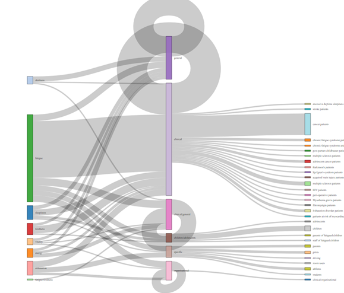
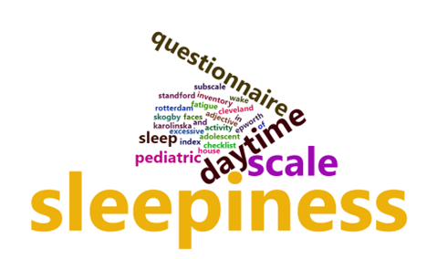
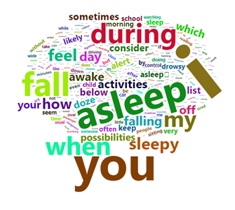
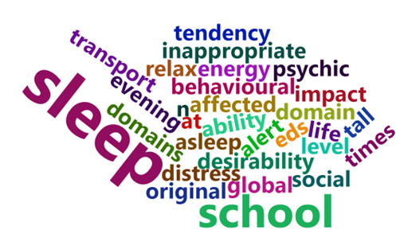

2023-03-21_fatigue-questionnaires_HC
================
Hayley Caldwell
2023-03-21

Last year I collected a data set of all the questionnaires measuring
constructs such as fatigue, sleepiness, exhaustion, alertness, etc, as a
research assistant working with Kurt Lushington, Jill Dorian, Johnathon
Crichton, and Alex on developing their idea of flipped validity. The
idea is basically that for constructs, such as fatigue, that are
difficult to define or heavily debated on their definitions in the
field, one can try to get closer towards a definition by reverse
engineering the questionnaires that are used to measure that construct.
My exploration today isn’t aiming to reach that goal, but rather to just
start exploring the data we currently have on the basic attributes of
the questions/questionnaires.

How many questionnaires are there, per construct?

``` r
questionnaire_count <- questionnaires %>% 
  select(questionnaire, construct) %>% 
  distinct() %>% 
  count(construct) %>% 
  mutate(fraction = n / sum(n), 
         ymax = cumsum(fraction), 
         ymin = c(0, head(ymax, n=-1)), 
         labelPosition = (ymax + ymin) / 2, 
         label = paste0(construct, "\n value: ", n)) 
 
q_count_graph <- ggplot(questionnaire_count, aes(ymax=ymax, ymin=ymin, xmax=4, xmin=3, fill=construct)) +
  geom_rect() +
  coord_polar(theta="y") + 
  xlim(c(2, 4)) + 
  theme_void() +
  geom_label(x=3.5, aes(y=labelPosition, label=label), size=4) +
  theme(legend.position = "none") 
q_count_graph
```

<!-- -->

How did the total number of questionnaires, per construct, grow over
time?

``` r
construct_per_year <- questionnaires %>% 
  select(questionnaire, year, construct) %>% 
  distinct() %>%  
  arrange(construct, year) %>% 
  group_by(year, construct) %>% 
  mutate(n = n()) %>% 
  ungroup() %>%  
  group_by(construct) %>%   
  mutate(q_existing = cumsum(n)) %>% 
  ungroup() %>% 
  na_replace(0)

perc_year_construct <- ggplot(construct_per_year, aes(year, q_existing, colour = construct)) +
  geom_line() + 
  scale_y_continuous(breaks = scales::pretty_breaks(n = 10)) + 
  scale_x_continuous(breaks = scales::pretty_breaks(n = 20)) +
  labs(y = "Existing Questionnaire Count", 
       x = "Year")
#ggplotly(perc_year_construct)
perc_year_construct
```

<!-- -->

What are the range of questionnaire lengths within each construct?

``` r
question_count <- questionnaires %>% 
  select(questionnaire, total_questions, construct) %>% 
  distinct()

questions_per_construct <- ggplot(question_count, aes(construct, total_questions, fill = construct, label =  questionnaire)) +
  geom_boxplot(outlier.shape = NA, aes(alpha = 0.3)) +
  theme(legend.position = "none") +
  scale_y_continuous(limits = c(0, 50)) +
  geom_jitter(aes(stroke = NA))

#ggplotly(questions_per_construct, tooltip = c("questionnaire", "total_questions"))
questions_per_construct
```

    ## Warning: Removed 3 rows containing non-finite values (`stat_boxplot()`).

    ## Warning: The following aesthetics were dropped during statistical transformation: label
    ## i This can happen when ggplot fails to infer the correct grouping structure in
    ##   the data.
    ## i Did you forget to specify a `group` aesthetic or to convert a numerical
    ##   variable into a factor?

    ## Warning: Removed 3 rows containing missing values (`geom_point()`).

<!-- -->

How far back are questionnaires of each construct asking people to
recall?

``` r
# function to find the mode 
Mode <- function(x) {
  ux <- unique(x)
  ux[which.max(tabulate(match(x, ux)))]
}

questionnaires_temp <- questionnaires %>% 
  group_by(questionnaire) %>% 
  mutate(temporality_mode = Mode(temporality)) %>% 
  ungroup() %>% 
  select(questionnaire, construct, temporality_mode) %>% 
  distinct() %>% 
  group_by(construct, temporality_mode) %>% 
  count()

temporality_questions <- ggplot(questionnaires_temp, aes(temporality_mode, n, fill = construct)) +
  geom_col() +
  facet_wrap(~construct) +
  coord_flip() +
  theme(legend.position = "none")
temporality_questions
```

<!-- -->

How many questionnaires, per construct, come from each country?

``` r
country_count <- questionnaires %>% 
  select(questionnaire, construct, country) %>% 
  distinct() 

construct_by_country <- ggplot(country_count, aes(country, fill = construct))+
  geom_bar() +
  coord_flip() +
  labs(y = "no. of questionnaires")
#ggplotly(construct_by_country)
construct_by_country
```

<!-- -->

How many questionnaires measure each aspect of a construct, per
construct?

``` r
aspect_count <- questionnaires %>% 
  select(questionnaire, construct, aspect) %>% 
  distinct() 

aspect_by_construct <- ggplot(aspect_count, aes(construct, fill = aspect))+
  geom_bar() +
  coord_flip() +
  labs(y = "no. of questionnaires")
aspect_by_construct
```

<!-- -->

How many questionnaires from each construct are created for broader and
more specific target audiences?

``` r
# layer 1->2
count_con_broad <- questionnaires %>% 
  select(questionnaire, construct, target_user_broad) %>% 
  distinct() %>% 
  select(-questionnaire) %>% 
  group_by(construct, target_user_broad) %>% 
  mutate(value = n()) %>% 
  ungroup() %>% 
  distinct() %>% 
  mutate(source = construct, 
        target = target_user_broad) %>% 
  select(-construct, -target_user_broad)

#layer 2->3
count_broad_spef <- questionnaires %>% 
  select(questionnaire, target_user_broad, target_user) %>% 
  distinct() %>% 
  select(-questionnaire) %>% 
  group_by(target_user_broad, target_user) %>% 
  mutate(value = n()) %>% 
  distinct() %>% 
  mutate(source = target_user_broad, 
        target = target_user) %>% 
  select(-target_user, -target_user_broad)
```

    ## Adding missing grouping variables: `target_user_broad`, `target_user`

``` r
#combine layers
questionnaire_sankey <- full_join(count_con_broad, count_broad_spef) 
```

    ## Joining, by = c("value", "source", "target")

``` r
#graph
nodes <- data.frame(
  name=c(as.character(questionnaire_sankey$source), 
  as.character(questionnaire_sankey$target)) %>% unique())

questionnaire_sankey$IDsource <- match(questionnaire_sankey$source, nodes$name)-1 
questionnaire_sankey$IDtarget <- match(questionnaire_sankey$target, nodes$name)-1

sankey_graph <- sankeyNetwork(Links = questionnaire_sankey, Nodes = nodes,
              Source = "IDsource", Target = "IDtarget",
              Value = "value", NodeID = "name", 
              sinksRight = FALSE)
```

    ## Links is a tbl_df. Converting to a plain data frame.

``` r
# sankey_graph
```



How many questionnaires divide their construct into different
dimensions, per construct?

``` r
dimension_count <- questionnaires %>% 
  select(questionnaire, construct, sub_construct, dimensionality) %>% 
  distinct() %>% 
  group_by(questionnaire) %>% 
  mutate(sub_construct_count = n()) %>% 
  ungroup() 

dimensions_by_construct <- ggplot(dimension_count, aes(sub_construct_count, fill = construct))+
  geom_bar() +
  scale_x_continuous(breaks = scales::pretty_breaks(n = 10)) +
  labs(y = "no. of questionnaires", 
       x = "no. of subconstructs per questionnaire") 
#ggplotly(dimensions_by_construct)
dimensions_by_construct
```

<!-- -->

How do the constructs split into questionnaires, then further into their
dimensions?

``` r
origin <- data.frame(
  from = c("origine", "origine", "origine", "origine"), 
  to = c("fatigue", "exhaustion", "sleepiness",  "vitality")
)

questionnaires_subcon <- questionnaires %>% 
  filter(!sub_construct == "N/A")

con_quest <- questionnaires_subcon %>% 
  select(construct, questionnaire) %>% 
  distinct() %>% 
  mutate(from = construct, 
        to = questionnaire) %>% 
  select(-construct, -questionnaire)

quest_subcon <- questionnaires_subcon %>% 
  select(questionnaire, sub_construct) %>% 
  distinct() %>% 
  mutate(from = questionnaire, 
        to = sub_construct) %>% 
  select(-sub_construct, -questionnaire)

quest_dendro1 <- full_join(con_quest, quest_subcon)
```

    ## Joining, by = c("from", "to")

``` r
quest_dendro <- full_join(origin, quest_dendro1)
```

    ## Joining, by = c("from", "to")

``` r
name <- unique(c(as.character(quest_dendro$from), as.character(quest_dendro$to)))
vertices <- data.frame(
  name=name)

mygraph <- graph_from_data_frame(quest_dendro, vertices = vertices)

dendro_plot <- ggraph(mygraph, layout = 'dendrogram', circular = FALSE) + 
  geom_edge_diagonal() +
  geom_node_text(aes(label=name) , angle=90 , hjust=1, nudge_y = -0.04) +
  geom_node_point(alpha=0.6) +
  ylim(-.5, NA)
```

    ## Multiple parents. Unfolding graph

``` r
dendro_plot
```

    ## Warning: Using the `size` aesthetic in this geom was deprecated in ggplot2 3.4.0.
    ## i Please use `linewidth` in the `default_aes` field and elsewhere instead.

<!-- -->

How can we make this look better?

``` r
dendro_plot_int <- collapsibleTree(questionnaires_subcon, c("construct", "questionnaire", "sub_construct"))

#dendro_plot_int

# I couldn't include this plot in the output, so check out this page for an example and imagine that it's a much better version of what is above
# https://r-graph-gallery.com/336-interactive-dendrogram-with-collapsibletree.html
```

What words are used in the titles for fatigue and sleepiness
questionnaires?

``` r
# fatigue
quest_titles_f <- questionnaires %>% 
  filter(construct == "fatigue") %>% 
  select(questionnaire) %>% 
  distinct() %>% 
  mutate(questionnaire = gsub("[[:punct:]]|[[:digit:]]"," ", as.character(questionnaire)))

title_words_count_f <- data.frame(table(unlist(strsplit(tolower(quest_titles_f$questionnaire), " ")))) 

title_words_count1_f <-title_words_count_f %>% 
  filter(!Var1 == "")

title_words_count1_f$Var1 <- as.character(title_words_count1_f$Var1)

#wordcloud2(title_words_count1_f)
```


``` r
# sleepiness
quest_titles_s <- questionnaires %>% 
  filter(construct == "sleepiness") %>% 
  select(questionnaire) %>% 
  distinct() %>% 
  mutate(questionnaire = gsub("[[:punct:]]|[[:digit:]]"," ", as.character(questionnaire)))

title_words_count_s <- data.frame(table(unlist(strsplit(tolower(quest_titles_s$questionnaire), " ")))) 

title_words_count1_s <- title_words_count_s %>% 
  filter(!Var1 == "")

title_words_count1_s$Var1 <- as.character(title_words_count1_s$Var1)

#wordcloud2(title_words_count1_s)
```



What words are used in the questions of fatigue and sleepiness
questionnaires?

``` r
# fatigue 
questions_f <- questionnaires %>% 
  filter(construct == "fatigue") %>% 
  select(item) %>% 
  mutate(item = gsub("[[:punct:]]|[[:digit:]]"," ", as.character(item)))

question_words_count_f <- data.frame(table(unlist(strsplit(tolower(questions_f$item), " ")))) 

question_words_count1_f <- question_words_count_f %>%
  filter(!Var1 %in% c("", " ", "of", "it", "and", "the", "was", "a", "is", "there", "have", "to", "am","in", "with", "has", "do", "had", "or", "for", "at", "on", "than","that", "are", "get"))

question_words_count1_f$Var1 <- as.character(question_words_count1_f$Var1)

#wordcloud2(question_words_count1_f)
```


``` r
# sleepiness
questions_s <- questionnaires %>% 
  filter(construct == "sleepiness") %>% 
  select(item) %>% 
  mutate(item = gsub("[[:punct:]]|[[:digit:]]"," ", as.character(item)))

question_words_count_s <- data.frame(table(unlist(strsplit(tolower(questions_s$item), " ")))) 

question_words_count1_s <- question_words_count_s %>%
  filter(!Var1 %in% c("", " ", "of", "it", "and", "the", "was", "a", "is", "there", "have", "to", "am","in", "with", "has", "do", "had", "or", "for", "at", "on", "than","that", "are", "get"))

question_words_count1_s$Var1 <- as.character(question_words_count1_s$Var1)

#wordcloud2(question_words_count1_s)
```



What words are used in the subconstructs of fatigue and sleepiness
questionnaires?

``` r
# fatigue
subcon_f <- questionnaires %>% 
  filter(construct == "fatigue") %>% 
  select(sub_construct) %>% 
  distinct() %>% 
  mutate(sub_construct = gsub("[[:punct:]]|[[:digit:]]"," ", as.character(sub_construct)))

subcon_words_count_f <- data.frame(table(unlist(strsplit(tolower(subcon_f$sub_construct), " ")))) 
subcon_words_count1_f <- subcon_words_count_f %>% 
  filter(!Var1 %in% c("", "of", "and", "to"))

subcon_words_count1_f$Var1 <- as.character(subcon_words_count1_f$Var1)

#wordcloud2(subcon_words_count1_f)
```


``` r
# sleepiness
subcon_s <- questionnaires %>% 
  filter(construct == "sleepiness") %>% 
  select(sub_construct) %>% 
  distinct() %>% 
  mutate(sub_construct = gsub("[[:punct:]]|[[:digit:]]"," ", as.character(sub_construct)))

subcon_words_count_s <- data.frame(table(unlist(strsplit(tolower(subcon_s$sub_construct), " ")))) 
subcon_words_count1_s <- subcon_words_count_s %>% 
  filter(!Var1 %in% c("", "of", "and", "to", "in", "a"))

subcon_words_count1_s$Var1 <- as.character(subcon_words_count1_s$Var1)

#wordcloud2(subcon_words_count1_s)
```


