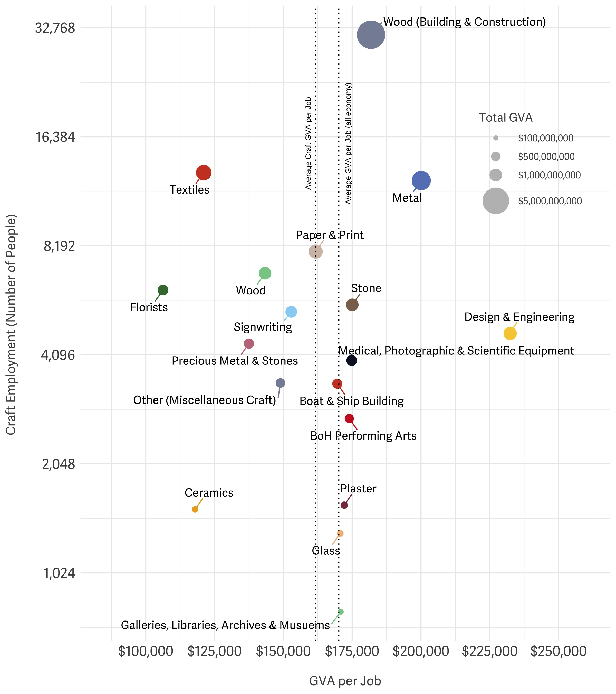
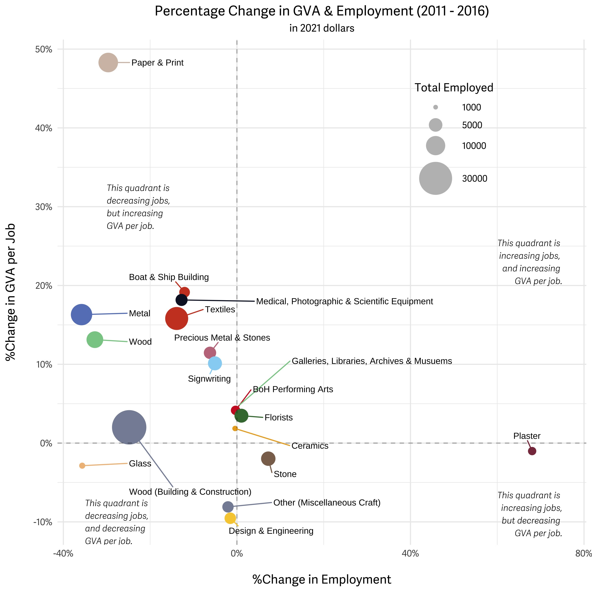

Additional GGplot Parameters
================

Please find below a summary of the tidytuesday session (run by Chloe) on
13th of June. Here, we looked at additional gpglot parameters that can
help to specify or change very small components of a ggplot to create
tidy and professional figures.

**Figure 1.** Summary of employment, GVA per job and total GVA by craft
segment at a national level for 2016 and 2021 data.



**Here, notable functions include:**

-   geom_text_repel() which creates labels for the data, segment.colour
    relates to the colour of the adjoining lines, box.padding denotes
    space around the labels.
-   scale_size() creates range of size of data points,
    labels=scales::dollarformat() to change numeric values to include
    dollar sign, with breaks specified to only include numbers that are
    important within the data.
-   scale_y\_continuous() to transform y asix data (here, by log2), with
    labels=scales::comma_format() to add commas into the numeric data.
-   geom_vline() to create vertical lines (can also be hline)
-   annotate() creates a small text annotation on the graph, in this
    case, at x and y coordinates and rotated at a 90 degree angle.
-   guides() specifies more detailed information about your legends
-   theme() can specify more detailed information about any aspect of
    your graph (specifically in relation to text sixes, colours, fonts).
-   ggarrange() can put multiple graphs side by side.

Please find the code for the Figure 1 below.

``` r
  fig1 %>%
  filter(year == 2021) %>%
ggplot(aes(y = employed, x = GVA.perjob, size = GVA.total, colour = segment)) +
  geom_point() +
  geom_text_repel(aes(label = segment), segment.color = colours18, colour = "black", family = "adelle-sans", size = 3.75, vjust = 0.5, hjust = 0.5, box.padding = 0.75, max.overlaps = 15, xlim = c(75000, 260000)) +
  scale_size(range = c(0, 12), labels=scales::dollar_format(), limits = c(0, 6000000000), breaks=c(100000000, 500000000, 1000000000, 5000000000)) +
  scale_y_continuous(trans = 'log2', labels = scales::comma_format(), n.breaks = 11) +
  geom_vline(xintercept=161727, linetype='dotted', col = 'black') +
  annotate("text", x = 159000, y = 15700, label = "Average Craft GVA per Job", size = 2.5, angle = 90) +
  geom_vline(xintercept=170160, linetype='dotted') +
  annotate("text", x = 173500, y = 15700, label = "Average GVA per Job (all economy)", size = 2.5, angle = 90) +
  labs(x = "\nGVA per Job", y = "Craft Employment (Number of People) \n", size = "Total GVA") +
  scale_x_continuous(labels=scales::dollar_format(), limits = c(85000, 260000), n.breaks = 8) +
  theme_minimal() +
  guides(color = "none", size = guide_legend(override.aes = list(colour = "grey"))) +
  scale_colour_manual(values = colours18) +
  theme(text=element_text(family="adelle-sans"),
  strip.text = element_text(size = "14"),
  axis.title = element_text(size = "12", colour = "grey31"),
  axis.text = element_text(size = "13"),
  legend.title = element_text(colour = "grey31"),
  legend.text = element_text(colour = "grey31"),
  legend.position = c(.85, .75))

#to put two plots side by side (make sure to first make them into objects)
library(ggpubr)
ggarrange(a, b)
```

**Figure 2.** Percentage change in craft skills employment (x-axis) and
GVA per job (y-axis) by segment for 2016 and 2021 data.



Here, code includes information about using a new font from outside R,
as well as demonstrating the use of “” to create breaks in chunks of
writing. This can also be used to create more space between axis labels
and the axes.

Please find the code for the Figure 2 below.

``` r
fig1 %>%
  filter(year == 2016) %>%
  ggplot(aes(y = GVA.change, x = employ.change, size = employed, colour = segment)) +
  geom_point() +
  geom_vline(xintercept = 0, linetype = "dashed", alpha = 0.3) +
  geom_hline(yintercept = 0, linetype = "dashed", alpha = 0.3) +
  geom_text_repel(aes(label = segment), segment.colour = colours18, colour = "black", size = 3, box.padding = 0.75, hjust = 0.8, xlim = c(-0.3, 0.7)) +
  labs(x = "\n%Change in Employment", y = "%Change in GVA per Job\n", colour = "Craft Segment", size = "Total Employed", title = "Percentage Change in GVA & Employment (2011 - 2016)", subtitle = "in 2021 dollars") +
  scale_x_continuous(labels=scales::percent_format()) +
  scale_y_continuous(labels=scales::percent_format()) +
  theme_minimal() +
  theme(text=element_text(family="adelle-sans"),
        strip.text = element_text(size = "14"),
        axis.title = element_text(size = "12"),
        legend.position = c(.75, .80),
        plot.title = element_text(hjust = 0.5),
        plot.subtitle = element_text(hjust = 0.5, size = 10)) +
  scale_colour_manual(values = colours18) +
  scale_size(range = c(0, 15), breaks = c(1000, 5000, 10000, 30000)) +
  guides(color = "none", size = guide_legend(override.aes = list(colour = "grey"))) +
  annotate("text", x = -0.35, y = 0.3, label = "This quadrant is \ndecreasing jobs, \nbut increasing\nGVA per job.", size = 3, family = "adelle-sans", fontface = 'italic', hjust = 0) +
    annotate("text", x = -0.35, y = -0.1, label = "This quadrant is \ndecreasing jobs,\nand decreasing \nGVA per job.", size = 3, family = "adelle-sans", fontface = 'italic', hjust = 0) +
      annotate("text", x = 0.75, y = -0.09, label = "This quadrant is \nincreasing jobs,\nbut decreasing \nGVA per job.", size = 3, family = "adelle-sans", fontface = 'italic', hjust = 1) +
      annotate("text", x = 0.75, y = 0.23, label = "This quadrant is \nincreasing jobs, \nand increasing \nGVA per job.", size = 3, family = "adelle-sans", fontface = 'italic', hjust = 1) 
  
#to also include a new font from somewhere else: download the otf file of the desired font
library(showtext)
font_add(family = "adelle-sans", regular = "adelle-sans/17016.otf", italic = "adelle-sans/17015.otf")
showtext_auto(enable = TRUE)

#then use 
family = "adelle-sans" #in the sections of code where you desire the new font
```
