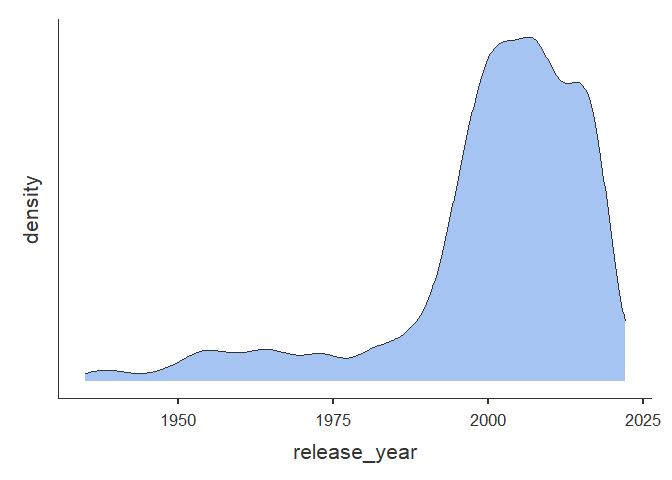
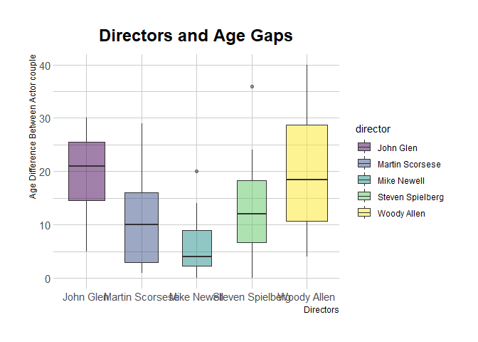
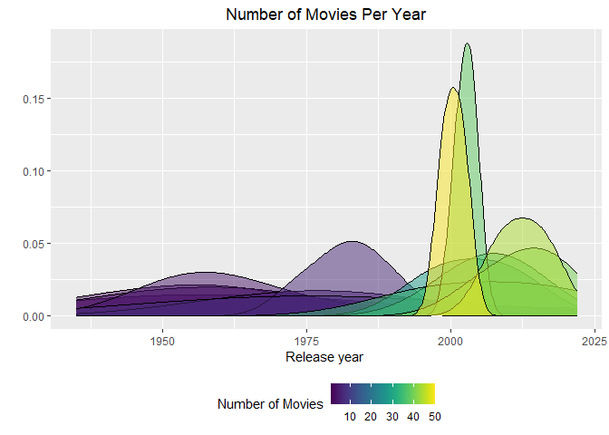
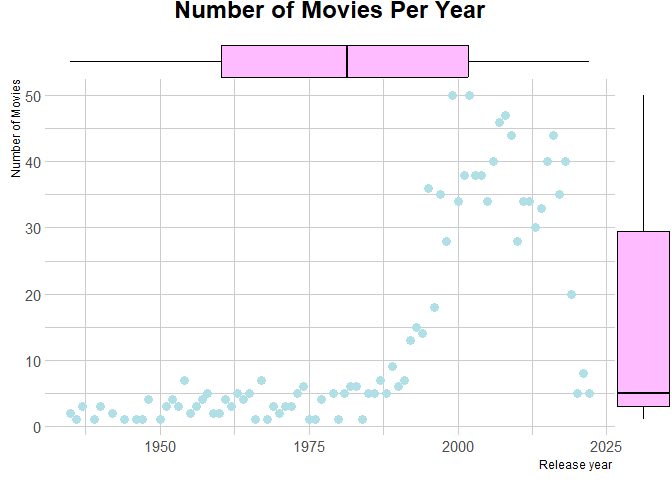
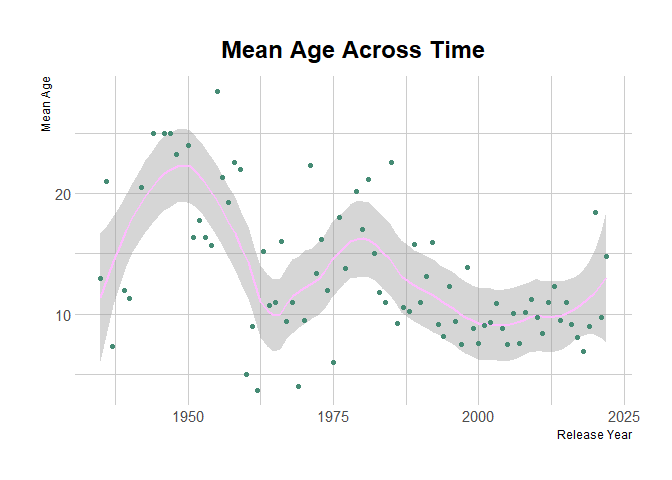
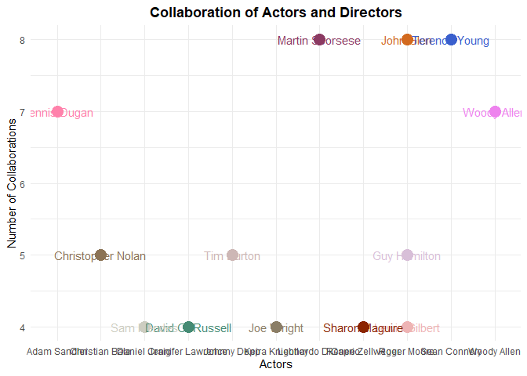
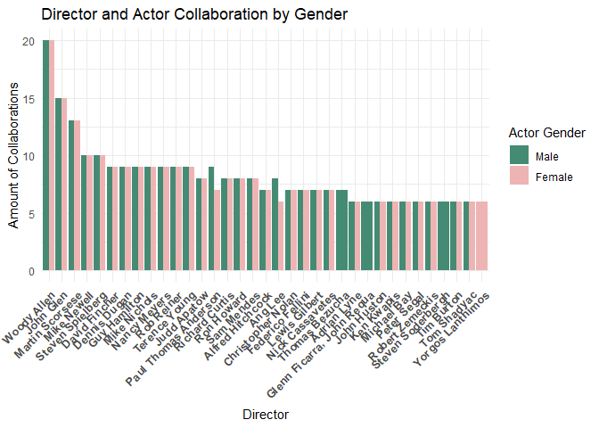
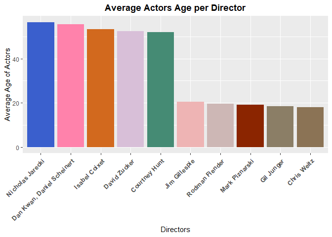

Age_groups
================
Maya alsafadi
2023-06-28

# install packages

``` r
library(tidyverse)
```

    ## ── Attaching core tidyverse packages ──────────────────────── tidyverse 2.0.0 ──
    ## ✔ dplyr     1.1.2     ✔ readr     2.1.4
    ## ✔ forcats   1.0.0     ✔ stringr   1.5.0
    ## ✔ ggplot2   3.4.2     ✔ tibble    3.2.1
    ## ✔ lubridate 1.9.2     ✔ tidyr     1.3.0
    ## ✔ purrr     1.0.1     
    ## ── Conflicts ────────────────────────────────────────── tidyverse_conflicts() ──
    ## ✖ dplyr::filter() masks stats::filter()
    ## ✖ dplyr::lag()    masks stats::lag()
    ## ℹ Use the conflicted package (<http://conflicted.r-lib.org/>) to force all conflicts to become errors

``` r
library(tidyr)
library(tidyselect)
library(dtplyr)
library(ggplot2)
library(janitor)
```

    ## Warning: package 'janitor' was built under R version 4.3.1

    ## 
    ## Attaching package: 'janitor'
    ## 
    ## The following objects are masked from 'package:stats':
    ## 
    ##     chisq.test, fisher.test

``` r
library(here)
```

    ## Warning: package 'here' was built under R version 4.3.1

    ## here() starts at E:/Tidy_Tuesday/Archive/2023-07-11

``` r
library(hrbrthemes)
```

    ## NOTE: Either Arial Narrow or Roboto Condensed fonts are required to use these themes.
    ##       Please use hrbrthemes::import_roboto_condensed() to install Roboto Condensed and
    ##       if Arial Narrow is not on your system, please see https://bit.ly/arialnarrow

``` r
library(MASS)
```

    ## 
    ## Attaching package: 'MASS'
    ## 
    ## The following object is masked from 'package:dplyr':
    ## 
    ##     select

``` r
library(tidytuesdayR)
```

    ## Warning: package 'tidytuesdayR' was built under R version 4.3.1

``` r
library(dplyr)
library(viridis)
```

    ## Warning: package 'viridis' was built under R version 4.3.1

    ## Loading required package: viridisLite

``` r
library(plotly)
```

    ## Warning: package 'plotly' was built under R version 4.3.1

    ## 
    ## Attaching package: 'plotly'
    ## 
    ## The following object is masked from 'package:MASS':
    ## 
    ##     select
    ## 
    ## The following object is masked from 'package:ggplot2':
    ## 
    ##     last_plot
    ## 
    ## The following object is masked from 'package:stats':
    ## 
    ##     filter
    ## 
    ## The following object is masked from 'package:graphics':
    ## 
    ##     layout

``` r
library(ggplot2)
library(ggExtra)
```

    ## Warning: package 'ggExtra' was built under R version 4.3.1

``` r
library(igraph)
```

    ## Warning: package 'igraph' was built under R version 4.3.1

    ## 
    ## Attaching package: 'igraph'
    ## 
    ## The following object is masked from 'package:plotly':
    ## 
    ##     groups
    ## 
    ## The following objects are masked from 'package:lubridate':
    ## 
    ##     %--%, union
    ## 
    ## The following objects are masked from 'package:dplyr':
    ## 
    ##     as_data_frame, groups, union
    ## 
    ## The following objects are masked from 'package:purrr':
    ## 
    ##     compose, simplify
    ## 
    ## The following object is masked from 'package:tidyr':
    ## 
    ##     crossing
    ## 
    ## The following object is masked from 'package:tibble':
    ## 
    ##     as_data_frame
    ## 
    ## The following objects are masked from 'package:stats':
    ## 
    ##     decompose, spectrum
    ## 
    ## The following object is masked from 'package:base':
    ## 
    ##     union

``` r
library(patchwork)
```

    ## 
    ## Attaching package: 'patchwork'
    ## 
    ## The following object is masked from 'package:MASS':
    ## 
    ##     area

``` r
library(stats)
library(jmv)
```

    ## Warning: package 'jmv' was built under R version 4.3.1

## Read the data manually

``` r
age_gaps <- readr::read_csv('https://raw.githubusercontent.com/rfordatascience/tidytuesday/master/data/2023/2023-02-14/age_gaps.csv')
```

    ## Rows: 1155 Columns: 13
    ## ── Column specification ────────────────────────────────────────────────────────
    ## Delimiter: ","
    ## chr  (6): movie_name, director, actor_1_name, actor_2_name, character_1_gend...
    ## dbl  (5): release_year, age_difference, couple_number, actor_1_age, actor_2_age
    ## date (2): actor_1_birthdate, actor_2_birthdate
    ## 
    ## ℹ Use `spec()` to retrieve the full column specification for this data.
    ## ℹ Specify the column types or set `show_col_types = FALSE` to quiet this message.

## Lets first look at some descriptives

``` r
descriptives(data = age_gaps, vars = c("age_difference", "actor_1_age", "actor_2_age", "actor_1_birthdate", "actor_2_birthdate", "release_year"))
```

    ## 
    ##  DESCRIPTIVES
    ## 
    ##  Descriptives                                                                                                                     
    ##  ──────────────────────────────────────────────────────────────────────────────────────────────────────────────────────────────── 
    ##                          age_difference    actor_1_age    actor_2_age    actor_1_birthdate    actor_2_birthdate    release_year   
    ##  ──────────────────────────────────────────────────────────────────────────────────────────────────────────────────────────────── 
    ##    N                               1155           1155           1155                 1155                 1155            1155   
    ##    Missing                            0              0              0                    0                    0               0   
    ##    Mean                        10.42424       40.63550       30.21126                                                  2000.799   
    ##    Median                      8.000000       39.00000       29.00000                                                  2004.000   
    ##    Standard deviation          8.511086       10.42417       7.495952                                                  16.36582   
    ##    Minimum                     0.000000       18.00000       17.00000                                                  1935.000   
    ##    Maximum                     52.00000       81.00000       68.00000                                                  2022.000   
    ##  ────────────────────────────────────────────────────────────────────────────────────────────────────────────────────────────────

## just playing around with this jamovi type pakcage.

``` r
descriptives(data = age_gaps, vars = c("release_year"), dens  = TRUE)
```

    ## 
    ##  DESCRIPTIVES
    ## 
    ##  Descriptives                           
    ##  ────────────────────────────────────── 
    ##                          release_year   
    ##  ────────────────────────────────────── 
    ##    N                             1155   
    ##    Missing                          0   
    ##    Mean                      2000.799   
    ##    Median                    2004.000   
    ##    Standard deviation        16.36582   
    ##    Minimum                   1935.000   
    ##    Maximum                   2022.000   
    ##  ──────────────────────────────────────

<!-- -->

# I first wanted to check if there are any directors that prefer to deal with artists who have larger age gaps.

## To investigate this, I wanted to first count how many times each director appears in this data set and then choose the top fiveinvestigation. The code below counts the number of times each director’s name is repeated.

\###here we can see that the top 5 directors are: 1) Woody Allen 2) John
Glen 3) Martin Scorsese 4) Mike Newell 5) Steven Spielberg

``` r
directors_age_dataset <- age_gaps %>% group_by(director) %>% count()
```

## In this case, I created a dataset that only included the actors’ ages difference and the directors. Then I narrowed it down to the top five directors. There is most likely another way to filter the top 5 without giving their names, such as by simply stating that the top 5 most repeated actors should be kept.

``` r
top5_directors <- age_gaps %>% 
  select(director, age_difference) %>% 
  filter(director %in% c("Woody Allen", "John Glen", "Martin Scorsese", "Mike Newell", "Steven Spielberg")) 
```

## Lets plot. I decided on a boxplot since it will clearly show me the following data:

1)  The age difference range of the actors with whom each director
    works. For example, who is the filmmaker with the greatest diversity
    in age gaps?

2)  It will display the minimum and maximum age gap per director.

3)  It will show me the average age gap per director.

## Observations

### Woody Allen appears to work with actors with the greatest age difference (40 years). He also appears to be a director who works with the widest range of age gaps.

### Mike Newell and Steven Spielberg both have a minimum age gap of 0 and have the lowest maximum age gap.

``` r
top5_directors %>% 
  ggplot(aes(x= director, y= age_difference, fill= director))+
  geom_boxplot(varwidth = TRUE, alpha=0.5)+
  scale_fill_viridis(discrete = TRUE)+
  labs(y = "Age Difference Between Actor couple", x= "Directors", title= "Directors and Age Gaps")+
  theme_ipsum()+
  theme(plot.title = element_text(hjust = 0.5))
```

    ## Warning in grid.Call(C_stringMetric, as.graphicsAnnot(x$label)): font family
    ## not found in Windows font database

    ## Warning in grid.Call(C_stringMetric, as.graphicsAnnot(x$label)): font family
    ## not found in Windows font database

    ## Warning in grid.Call(C_textBounds, as.graphicsAnnot(x$label), x$x, x$y, : font
    ## family not found in Windows font database

    ## Warning in grid.Call(C_stringMetric, as.graphicsAnnot(x$label)): font family
    ## not found in Windows font database

    ## Warning in grid.Call(C_stringMetric, as.graphicsAnnot(x$label)): font family
    ## not found in Windows font database

    ## Warning in grid.Call(C_textBounds, as.graphicsAnnot(x$label), x$x, x$y, : font
    ## family not found in Windows font database

    ## Warning in grid.Call(C_textBounds, as.graphicsAnnot(x$label), x$x, x$y, : font
    ## family not found in Windows font database

    ## Warning in grid.Call(C_textBounds, as.graphicsAnnot(x$label), x$x, x$y, : font
    ## family not found in Windows font database

    ## Warning in grid.Call(C_textBounds, as.graphicsAnnot(x$label), x$x, x$y, : font
    ## family not found in Windows font database

    ## Warning in grid.Call(C_textBounds, as.graphicsAnnot(x$label), x$x, x$y, : font
    ## family not found in Windows font database

    ## Warning in grid.Call(C_textBounds, as.graphicsAnnot(x$label), x$x, x$y, : font
    ## family not found in Windows font database

    ## Warning in grid.Call(C_textBounds, as.graphicsAnnot(x$label), x$x, x$y, : font
    ## family not found in Windows font database

    ## Warning in grid.Call(C_textBounds, as.graphicsAnnot(x$label), x$x, x$y, : font
    ## family not found in Windows font database

    ## Warning in grid.Call(C_textBounds, as.graphicsAnnot(x$label), x$x, x$y, : font
    ## family not found in Windows font database

    ## Warning in grid.Call(C_textBounds, as.graphicsAnnot(x$label), x$x, x$y, : font
    ## family not found in Windows font database

    ## Warning in grid.Call.graphics(C_text, as.graphicsAnnot(x$label), x$x, x$y, :
    ## font family not found in Windows font database

    ## Warning in grid.Call(C_textBounds, as.graphicsAnnot(x$label), x$x, x$y, : font
    ## family not found in Windows font database

    ## Warning in grid.Call(C_textBounds, as.graphicsAnnot(x$label), x$x, x$y, : font
    ## family not found in Windows font database

    ## Warning in grid.Call(C_textBounds, as.graphicsAnnot(x$label), x$x, x$y, : font
    ## family not found in Windows font database

<!-- -->

# I now want to explore the variation of amount of movies released over time. And the age gaps over across time.

## Fist, just like I did above, I grouped by release year in order to count how many movies are released per year.

``` r
movies_years <- age_gaps %>% group_by(release_year) %>% count()
```

## For the age gaps across time I decided to get an average age gap per year so I created a column to illustrate this and grouped it by release year.

``` r
mean_age_diff <- age_gaps %>% 
  group_by(release_year) %>% 
  summarise(mean_age_py = mean(age_difference))
```

## Release year was a character column so I changed it to ineger to avoid future errors.

``` r
movies_years <- movies_years %>% mutate(release_year = as.integer(release_year))
```

## left jointed amount of movies per year with age gapes across time

``` r
joint_age_years <- left_join(mean_age_diff, movies_years, by = "release_year")
```

## First I wanted to plot the amount of movies across time. I chose a density plot to show the distribution of movies across the years and because I thought it looked cool.

## the colours reflect the number of movies

## lets discuss observations because I am not sure why there is layers I thought I would keep this plot to discuss what it is really showing

``` r
joint_age_years %>% 
  ggplot(aes(x = release_year, fill=n, group=n))+
  geom_density(alpha=0.5, adjust= 2)+
scale_fill_viridis(name= "Number of Movies") +
  labs(x= "Release year ", y= "", title = "Number of Movies Per Year")+
  theme(legend.position = "bottom",
          legend.box = "vertical")+
  theme(plot.title = element_text(hjust = 0.5))
```

    ## Warning: Groups with fewer than two data points have been dropped.
    ## Groups with fewer than two data points have been dropped.
    ## Groups with fewer than two data points have been dropped.
    ## Groups with fewer than two data points have been dropped.
    ## Groups with fewer than two data points have been dropped.
    ## Groups with fewer than two data points have been dropped.
    ## Groups with fewer than two data points have been dropped.
    ## Groups with fewer than two data points have been dropped.
    ## Groups with fewer than two data points have been dropped.
    ## Groups with fewer than two data points have been dropped.
    ## Groups with fewer than two data points have been dropped.
    ## Groups with fewer than two data points have been dropped.

    ## Warning in max(ids, na.rm = TRUE): no non-missing arguments to max; returning
    ## -Inf

    ## Warning in max(ids, na.rm = TRUE): no non-missing arguments to max; returning
    ## -Inf

    ## Warning in max(ids, na.rm = TRUE): no non-missing arguments to max; returning
    ## -Inf

    ## Warning in max(ids, na.rm = TRUE): no non-missing arguments to max; returning
    ## -Inf

    ## Warning in max(ids, na.rm = TRUE): no non-missing arguments to max; returning
    ## -Inf

    ## Warning in max(ids, na.rm = TRUE): no non-missing arguments to max; returning
    ## -Inf

    ## Warning in max(ids, na.rm = TRUE): no non-missing arguments to max; returning
    ## -Inf

    ## Warning in max(ids, na.rm = TRUE): no non-missing arguments to max; returning
    ## -Inf

    ## Warning in max(ids, na.rm = TRUE): no non-missing arguments to max; returning
    ## -Inf

    ## Warning in max(ids, na.rm = TRUE): no non-missing arguments to max; returning
    ## -Inf

    ## Warning in max(ids, na.rm = TRUE): no non-missing arguments to max; returning
    ## -Inf

    ## Warning in max(ids, na.rm = TRUE): no non-missing arguments to max; returning
    ## -Inf

<!-- -->

## I wanted to check and see if the infomation that the previous code is giving were correct so i wanted to test it using a different visualisation.

## Observations

there were more movies released from 1990 to 2019 and then went down.
this could possibly be due to COVID.

we can see a similar pattern of where the points are on the plot to the
previous plot.

``` r
 P <-  ggplot(joint_age_years, aes(x = release_year, y= n))+
  geom_point(size= 3, colour= "powderblue")+
scale_fill_viridis(name= "Number of Movies")+
  
  scale_fill_viridis(name= "Number of Movies") +
  labs(x= "Release year ", y= "Number of Movies", title = "Number of Movies Per Year")+
  theme_ipsum()+
  theme(legend.position = "bottom",
          legend.box = "vertical")+
  theme(plot.title = element_text(hjust = 0.5))
```

    ## Scale for fill is already present.
    ## Adding another scale for fill, which will replace the existing scale.

## add histogram margins to geom_point

``` r
ggMarginal(P, type = "boxplot", size = 10, fill= "plum1")
```

    ## Warning: Continuous x aesthetic
    ## ℹ did you forget `aes(group = ...)`?
    ## Continuous x aesthetic
    ## ℹ did you forget `aes(group = ...)`?

    ## Warning in grid.Call(C_textBounds, as.graphicsAnnot(x$label), x$x, x$y, : font
    ## family not found in Windows font database

    ## Warning in grid.Call(C_textBounds, as.graphicsAnnot(x$label), x$x, x$y, : font
    ## family not found in Windows font database

    ## Warning in grid.Call(C_textBounds, as.graphicsAnnot(x$label), x$x, x$y, : font
    ## family not found in Windows font database

    ## Warning in grid.Call(C_textBounds, as.graphicsAnnot(x$label), x$x, x$y, : font
    ## family not found in Windows font database

    ## Warning in grid.Call(C_textBounds, as.graphicsAnnot(x$label), x$x, x$y, : font
    ## family not found in Windows font database

    ## Warning in grid.Call(C_textBounds, as.graphicsAnnot(x$label), x$x, x$y, : font
    ## family not found in Windows font database

    ## Warning in grid.Call(C_textBounds, as.graphicsAnnot(x$label), x$x, x$y, : font
    ## family not found in Windows font database

    ## Warning in grid.Call(C_textBounds, as.graphicsAnnot(x$label), x$x, x$y, : font
    ## family not found in Windows font database

    ## Warning in grid.Call(C_textBounds, as.graphicsAnnot(x$label), x$x, x$y, : font
    ## family not found in Windows font database

    ## Warning in grid.Call(C_textBounds, as.graphicsAnnot(x$label), x$x, x$y, : font
    ## family not found in Windows font database

    ## Warning in grid.Call.graphics(C_text, as.graphicsAnnot(x$label), x$x, x$y, :
    ## font family not found in Windows font database

    ## Warning in grid.Call(C_textBounds, as.graphicsAnnot(x$label), x$x, x$y, : font
    ## family not found in Windows font database

<!-- -->

# I now want to explore the mean age difference across time. I chose a geom smooth to illustrate the trend/patterns of age gape across years.

## Observation

it is clear that over the the age gaps have reduced.

``` r
ggplot(mean_age_diff, aes(x = release_year, y = mean_age_py)) +
  geom_smooth(span = 0.3, color= "plum1") +
  geom_point(color= "aquamarine4")+
  theme_ipsum()+
  labs(x = "Release Year", y = "Mean Age") +
  ggtitle("Mean Age Across Time")+
  theme(plot.title = element_text(hjust = 0.5))
```

    ## `geom_smooth()` using method = 'loess' and formula = 'y ~ x'

    ## Warning in grid.Call(C_textBounds, as.graphicsAnnot(x$label), x$x, x$y, : font
    ## family not found in Windows font database

    ## Warning in grid.Call(C_textBounds, as.graphicsAnnot(x$label), x$x, x$y, : font
    ## family not found in Windows font database

    ## Warning in grid.Call(C_textBounds, as.graphicsAnnot(x$label), x$x, x$y, : font
    ## family not found in Windows font database

    ## Warning in grid.Call(C_textBounds, as.graphicsAnnot(x$label), x$x, x$y, : font
    ## family not found in Windows font database

    ## Warning in grid.Call(C_textBounds, as.graphicsAnnot(x$label), x$x, x$y, : font
    ## family not found in Windows font database

    ## Warning in grid.Call(C_textBounds, as.graphicsAnnot(x$label), x$x, x$y, : font
    ## family not found in Windows font database

    ## Warning in grid.Call(C_textBounds, as.graphicsAnnot(x$label), x$x, x$y, : font
    ## family not found in Windows font database

    ## Warning in grid.Call(C_textBounds, as.graphicsAnnot(x$label), x$x, x$y, : font
    ## family not found in Windows font database

    ## Warning in grid.Call(C_textBounds, as.graphicsAnnot(x$label), x$x, x$y, : font
    ## family not found in Windows font database

    ## Warning in grid.Call(C_textBounds, as.graphicsAnnot(x$label), x$x, x$y, : font
    ## family not found in Windows font database

    ## Warning in grid.Call.graphics(C_text, as.graphicsAnnot(x$label), x$x, x$y, :
    ## font family not found in Windows font database

    ## Warning in grid.Call(C_textBounds, as.graphicsAnnot(x$label), x$x, x$y, : font
    ## family not found in Windows font database

<!-- -->

# I wanted to discover the relationships of collaborations between actors and directors for example:

1)  which actor collaborated most with which director
2)  do certain directors tend to collaborate more with men or women
3)  do certain directors tend to collaborate more with a certain age
    band

``` r
actors_name <-  age_gaps %>% 
  select(actor_1_name, actor_2_name, director) %>% 
  gather(key = "actor_num", value = "actor_name", actor_1_name, actor_2_name) %>%
  select(-actor_num)
```

``` r
actor_director_pairs <- actors_name %>%
  count(director, actor_name, name = "pair_count") %>%
  arrange(desc(pair_count))
```

``` r
actor_director_top <- actor_director_pairs %>% 
  filter(pair_count >3)
```

``` r
chosen_colours <- c("burlywood4", "aquamarine4", "palevioletred1", "thistle", "wheat4", "chocolate", "rosybrown2", "hotpink4", "ivory3", "orangered4", "royalblue3", "mistyrose3", "violet")


 ggplot(actor_director_top, aes(x = actor_name, y = pair_count, colour = director)) +
  geom_point(stat = "identity", size= 5)+
   geom_text(aes(label = director), point.padding = 5 )+
  labs(x = "Actors", y = "Number of Collaborations", title = "Collaboration of Actors and Directors") +
  scale_colour_manual(values =chosen_colours)+
   theme_minimal()+
  theme(legend.position = "none", plot.title = element_text(face = "bold", hjust = 0.5))
```

    ## Warning in geom_text(aes(label = director), point.padding = 5): Ignoring
    ## unknown parameters: `point.padding`

<!-- -->

# I want to first look if there are certain directors that collborated more with males or females.

## I first combined the actor_1_gender column with the actor_2_gender column in order to have one column that reflects gender. So now I have a dataset with directors and genders columns.

``` r
actors_gender<-  age_gaps %>% 
  select(character_1_gender, character_2_gender, director) %>% 
  gather(key = "actor_num", value = "actor_gender", character_1_gender, character_2_gender) %>%
  select(-actor_num)
```

## I wanted then to count how many times each director worked with a male or a female so I grouped by director and actor gender and I used count. Hiwever, these was repetitive rows and I wanted to get two values per director so I used distinct to get rid of repetitive rows and used .keep_all in order to get the two values.

``` r
summary_data <- actors_gender %>%
  group_by(director, actor_gender) %>%
  summarise(count = n())
```

    ## `summarise()` has grouped output by 'director'. You can override using the
    ## `.groups` argument.

``` r
clean_director_gender <- distinct(summary_data, .keep_all = TRUE)
```

## Now lets plot that. I decided to use a clustered bar plot to illustrate.

## Observations

We can see that most directors work equally with men and women and only
Paul Anderson and Ang Lee worked with more males than females.

We have Thomas Bezucha, Glenn Ficarra and Steve Soderberg who only
worked with males.

we have Yorgos Lanthimos who only works with females.

``` r
clean_director_gender %>% 
   filter(count>5) %>% 
ggplot( aes(x = reorder(director, -count), y = count, fill = actor_gender)) +
  geom_bar(stat = "identity", position = "dodge") +
  labs(x = "Director", y = "Amount of Collaborations", title = "Director and Actor Collaboration by Gender") +
  scale_fill_manual(values = c("aquamarine4", "rosybrown2"), labels = c("Male", "Female"), name= "Actor Gender") +
  theme_minimal()+
  theme(axis.text.x  = element_text(size = 10, hjust = 1, angle = 45, face = "bold"))
```

<!-- -->

# Now I want to see if there are certain directors that work with a spesific age band.

## I created a dataset with directors and combined actors age.

``` r
actors_age_band<-  age_gaps %>% 
  select(actor_1_age, actor_2_age, director) %>% 
  gather(key = "actor_num", value = "actors_age", actor_1_age, actor_2_age) %>%
  select(-actor_num)
```

## I wanted mean age per director

``` r
average_age <- actors_age_band %>%
  group_by(director) %>%
  summarize(average_age = mean(actors_age, na.rm = TRUE))
```

## because there are 510 directors in this dataset. plotting that would be difficult i decided to focus on the lowest and highest 5 ages because thats more interesting than whatever is in between.

i created a low data set, a high data set and a merged one in order to
plot.

``` r
lowest_ages <- average_age %>%
  arrange(average_age) %>%
  head(5)

highest_ages <- average_age %>%
  arrange(desc(average_age)) %>%
  head(5)


low_high_ages <- rbind(lowest_ages, highest_ages)
```

# lets plot. I thought a bar col plot is appropriate and will illustrate the data clearly.

``` r
low_high_ages %>% 
  ggplot(aes(x = reorder(director, -average_age), y= average_age, fill= director))+
  geom_col()+
  scale_fill_manual(values = c("burlywood4", "aquamarine4", "palevioletred1", "thistle", "wheat4", "chocolate", "rosybrown2",  "orangered4", "royalblue3", "mistyrose3" ))+
  theme_set(theme_ipsum())+
  theme(axis.text.x  = element_text(size = 10, hjust = 1, angle = 45, face = "bold"), legend.position = "none", plot.title = element_text(face = "bold", hjust = 0.5))+
  labs(x= "Directors", y= "Average Age of Actors", title = "Average Actors Age per Director")
```

<!-- -->
